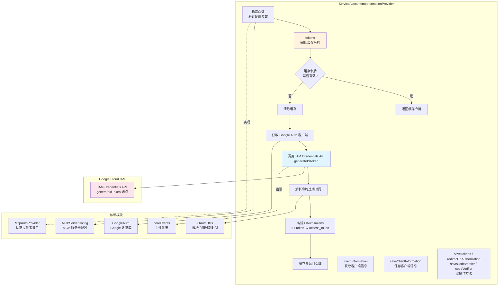

# sa-impersonation-provider.ts

## 概述

`sa-impersonation-provider.ts` 实现了基于 **Google Cloud 服务账号模拟 (Service Account Impersonation)** 的 MCP 认证提供者。该文件定义了 `ServiceAccountImpersonationProvider` 类，它实现了 `McpAuthProvider` 接口，通过调用 Google Cloud IAM Credentials API 的 `generateIdToken` 端点，以当前身份模拟指定的服务账号来获取 OIDC ID Token，并将其用作 MCP 服务器的 Bearer 令牌进行认证。

该方案适用于需要通过服务账号身份访问受 OAuth 保护的 MCP 服务器的场景，无需交互式浏览器授权流程。

## 架构图（Mermaid）



## 核心组件

### 1. `createIamApiUrl` 辅助函数

文件级私有函数，用于构建 Google Cloud IAM Credentials API 的请求 URL。

```typescript
function createIamApiUrl(targetSA: string): string {
  return `https://iamcredentials.googleapis.com/v1/projects/-/serviceAccounts/${encodeURIComponent(
    targetSA,
  )}:generateIdToken`;
}
```

- 使用 `encodeURIComponent` 对服务账号邮箱进行 URL 编码
- 项目 ID 使用 `-` 通配符，由 API 自动解析

### 2. ServiceAccountImpersonationProvider 类

实现 `McpAuthProvider` 接口的完整认证提供者。

#### 私有属性

| 属性 | 类型 | 说明 |
|------|------|------|
| `targetServiceAccount` | `string` | 要模拟的目标服务账号邮箱 |
| `targetAudience` | `string` | OAuth Client ID，作为 ID Token 的 audience |
| `auth` | `GoogleAuth` | Google 认证库实例 |
| `cachedToken` | `OAuthTokens \| undefined` | 缓存的令牌 |
| `tokenExpiryTime` | `number \| undefined` | 令牌过期时间（毫秒） |
| `_clientInformation` | `OAuthClientInformationFull \| undefined` | 客户端注册信息 |

#### 只读属性（McpAuthProvider 接口要求）

| 属性 | 值 | 说明 |
|------|-----|------|
| `redirectUrl` | `''` | 空字符串，无需重定向 |
| `clientMetadata` | 固定对象 | 客户端元数据，客户端名称为 "Gemini CLI (Service Account Impersonation)" |

#### 构造函数

接受 `MCPServerConfig` 配置对象，执行以下校验：
1. 必须提供 `httpUrl` 或 `url`（至少一个）
2. 必须提供 `targetAudience`（OAuth Client ID）
3. 必须提供 `targetServiceAccount`（目标服务账号）

校验通过后初始化 `GoogleAuth` 实例。

#### `tokens()` 方法 -- 核心方法

异步获取 OAuth 令牌，实现了带缓存的令牌获取逻辑：

**步骤 1 - 缓存检查**：检查是否有有效的、未过期的缓存令牌（提前 5 分钟缓冲）

**步骤 2 - 清除缓存**：如果缓存无效/过期，清除缓存

**步骤 3 - 获取新令牌**：
- 通过 `GoogleAuth` 获取认证客户端
- 调用 IAM Credentials API 的 `generateIdToken` 端点
- 请求参数包含 `audience`（目标受众）和 `includeEmail: true`
- 解析返回的 ID Token 过期时间
- 将 OIDC ID Token 放入 `access_token` 字段（因为 CLI 使用此字段构建 `Authorization: Bearer` 头）

#### 空操作方法

以下方法为 `McpAuthProvider` 接口的合规实现，但在服务账号模拟场景中无需执行任何操作：

| 方法 | 说明 |
|------|------|
| `saveTokens(_tokens)` | 空操作，令牌由内部缓存管理 |
| `redirectToAuthorization(_authorizationUrl)` | 空操作，无需浏览器授权 |
| `saveCodeVerifier(_codeVerifier)` | 空操作，无 PKCE 流程 |
| `codeVerifier()` | 返回空字符串 |

## 依赖关系

### 内部依赖

| 模块 | 导入内容 | 用途 |
|------|----------|------|
| `./oauth-utils.js` | `OAuthUtils`, `FIVE_MIN_BUFFER_MS` | 解析 JWT 令牌过期时间；5 分钟缓冲常量 |
| `../config/config.js` | `MCPServerConfig` 类型 | MCP 服务器配置类型定义 |
| `./auth-provider.js` | `McpAuthProvider` 类型 | 认证提供者接口定义 |
| `../utils/events.js` | `coreEvents` | 核心事件系统，用于发送错误反馈 |

### 外部依赖

| 依赖 | 导入内容 | 用途 |
|------|----------|------|
| `@modelcontextprotocol/sdk/shared/auth.js` | `OAuthClientInformation`, `OAuthClientInformationFull`, `OAuthClientMetadata`, `OAuthTokens` | MCP SDK 的 OAuth 类型定义 |
| `google-auth-library` | `GoogleAuth` | Google Cloud 认证库，用于获取认证客户端 |

## 关键实现细节

### 1. ID Token 作为 Access Token 的设计选择

该实现有一个关键的设计决策：将 OIDC ID Token 放入 `OAuthTokens.access_token` 字段。注释解释了原因：

```typescript
// Note: We are placing the OIDC ID Token into the `access_token` field.
// This is because the CLI uses this field to construct the
// `Authorization: Bearer <token>` header, which is the correct way to
// present an ID token.
```

这是因为 MCP SDK 框架使用 `access_token` 字段来构建 `Authorization: Bearer <token>` 头，而 ID Token 同样应以 Bearer 方式呈现。

### 2. 令牌缓存与过期管理

- 使用 `FIVE_MIN_BUFFER_MS`（5 分钟）作为提前刷新缓冲区
- 判断逻辑：`Date.now() < this.tokenExpiryTime - FIVE_MIN_BUFFER_MS`
- 过期时间由 `OAuthUtils.parseTokenExpiry` 从 JWT 的 `exp` 声明中提取
- 如果无法解析过期时间，不进行缓存（每次请求都会获取新令牌）

### 3. 错误处理

- 构造时的配置校验失败直接抛出 `Error`
- API 调用失败通过 `coreEvents.emitFeedback('error', ...)` 发送错误反馈，返回 `undefined`
- 空令牌或零长度令牌也被视为失败

### 4. 服务账号模拟的工作原理

1. 当前运行环境中的默认凭据（ADC）作为"调用者身份"
2. 调用者需要对目标服务账号拥有 `roles/iam.serviceAccountTokenCreator` 角色
3. 通过 IAM Credentials API 生成以目标服务账号身份签发的 ID Token
4. 生成的 ID Token 的 `aud` 声明设置为配置中的 `targetAudience`

### 5. 接口合规性

虽然 `McpAuthProvider` 接口要求实现完整的 OAuth 流程方法（重定向、PKCE 验证器等），但服务账号模拟是非交互式的机器对机器认证，因此这些方法被实现为空操作 (no-op)。`clientMetadata` 提供了最小化的必要信息。
