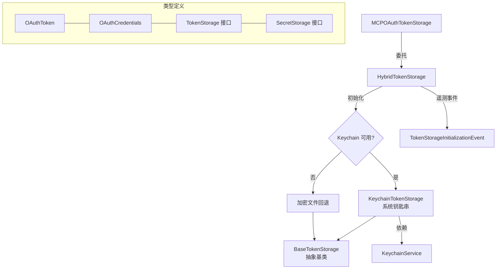

# token-storage (令牌存储子模块)

## 概述

`token-storage/` 子目录实现了多层 OAuth 令牌安全存储策略。它提供系统钥匙串（Keychain）作为首选存储方案，在不可用时自动回退到加密文件存储，并通过混合存储层统一对外暴露接口。

## 目录结构

```
token-storage/
├── index.ts                      # 模块导出入口，定义常量
├── types.ts                      # 类型定义（OAuthToken, OAuthCredentials, TokenStorage, SecretStorage）
├── base-token-storage.ts         # 抽象基类，提供通用验证和工具方法
├── hybrid-token-storage.ts       # 混合存储策略（自动选择 Keychain 或加密文件）
├── keychain-token-storage.ts     # 系统钥匙串存储实现
└── *.test.ts                     # 对应的单元测试文件
```

## 架构图



## 核心组件

### types.ts
- **OAuthToken**: OAuth 令牌数据结构（accessToken, refreshToken, expiresAt, tokenType, scope）
- **OAuthCredentials**: 完整凭据数据（serverName, token, clientId, tokenUrl, mcpServerUrl, updatedAt）
- **TokenStorage 接口**: 定义令牌 CRUD 操作（getCredentials, setCredentials, deleteCredentials, listServers, getAllCredentials, clearAll）
- **SecretStorage 接口**: 定义密钥存取操作（setSecret, getSecret, deleteSecret, listSecrets）
- **TokenStorageType 枚举**: KEYCHAIN / ENCRYPTED_FILE

### BaseTokenStorage (base-token-storage.ts)
- **职责**: 抽象基类，提供凭据验证、过期检查、服务器名称清理等通用能力
- **关键方法**:
  - `validateCredentials()` - 校验必填字段
  - `isTokenExpired()` - 带 5 分钟缓冲的过期检查
  - `sanitizeServerName()` - 清理服务器名称中的特殊字符

### HybridTokenStorage (hybrid-token-storage.ts)
- **职责**: 自动检测 Keychain 可用性，选择最佳存储方案
- **特性**: 使用单例初始化 Promise 避免竞态条件
- **遥测**: 初始化时发出 `TokenStorageInitializationEvent` 遥测事件

### KeychainTokenStorage (keychain-token-storage.ts)
- **职责**: 通过系统钥匙串（macOS Keychain / Windows Credential Manager / Linux Secret Service）安全存储令牌
- **特性**: 同时实现 `TokenStorage` 和 `SecretStorage` 接口
- **过滤**: 自动排除测试前缀和密钥前缀的条目

## 依赖关系

### 内部依赖
- `services/keychainService.ts` - 跨平台钥匙串访问服务
- `services/keychainTypes.ts` - 钥匙串类型常量
- `utils/events.ts` - 核心事件总线
- `telemetry/types.ts` - 遥测事件类型

### 外部依赖
- 无直接外部 npm 依赖

## 数据流

1. `HybridTokenStorage` 在首次调用时延迟初始化
2. 通过 `KeychainService` 检测系统钥匙串是否可用
3. 如果可用，使用 `KeychainTokenStorage` 存储令牌到系统钥匙串
4. 如果不可用，回退到加密文件存储方案
5. 所有后续的令牌操作统一通过已选择的存储实现进行
