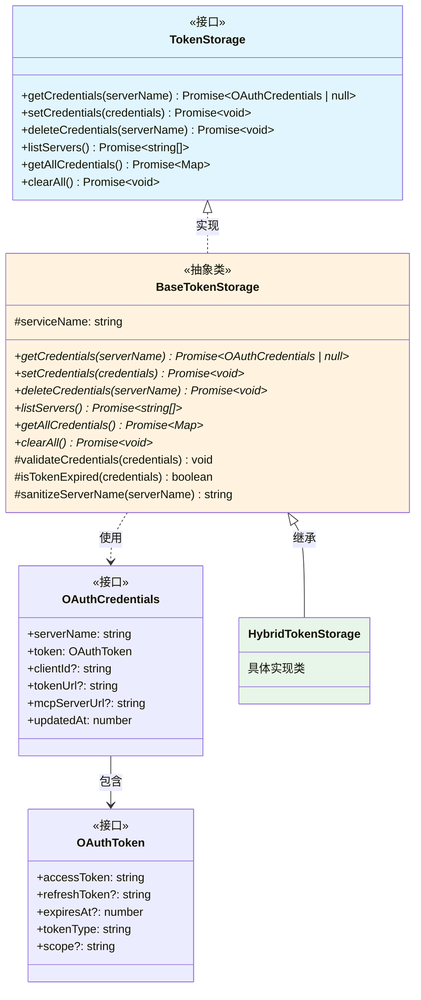
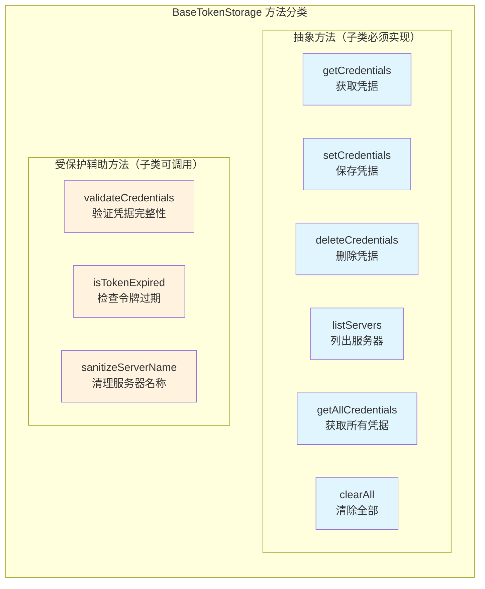

# base-token-storage.ts

## 概述

`base-token-storage.ts` 定义了 `BaseTokenStorage` 抽象类，它是 MCP 令牌存储系统的基础抽象层。该类实现了 `TokenStorage` 接口，定义了所有令牌存储实现必须遵循的契约（抽象方法），同时提供了通用的辅助方法（凭据验证、令牌过期检查、服务器名称清理）。

所有具体的令牌存储实现（如 `HybridTokenStorage`）都应继承此抽象类。

## 架构图（Mermaid）





## 核心组件

### 1. BaseTokenStorage 抽象类

#### 受保护属性

| 属性 | 类型 | 说明 |
|------|------|------|
| `serviceName` | `string` (readonly) | 服务名称标识，用于在存储后端中区分不同服务的令牌 |

#### 构造函数

```typescript
constructor(serviceName: string)
```

接受一个 `serviceName` 参数，存储为只读受保护属性，供子类使用。

#### 抽象方法（必须由子类实现）

| 方法 | 签名 | 说明 |
|------|------|------|
| `getCredentials` | `(serverName: string) => Promise<OAuthCredentials \| null>` | 根据服务器名称获取存储的 OAuth 凭据 |
| `setCredentials` | `(credentials: OAuthCredentials) => Promise<void>` | 保存 OAuth 凭据 |
| `deleteCredentials` | `(serverName: string) => Promise<void>` | 删除指定服务器的凭据 |
| `listServers` | `() => Promise<string[]>` | 列出所有已存储凭据的服务器名称 |
| `getAllCredentials` | `() => Promise<Map<string, OAuthCredentials>>` | 获取所有凭据的映射 |
| `clearAll` | `() => Promise<void>` | 清除所有存储的凭据 |

#### 受保护辅助方法

##### `validateCredentials(credentials: OAuthCredentials): void`

对凭据对象进行完整性校验，按顺序检查以下必填字段：

1. `credentials.serverName` -- 服务器名称不能为空
2. `credentials.token` -- 令牌对象不能为空
3. `credentials.token.accessToken` -- 访问令牌不能为空
4. `credentials.token.tokenType` -- 令牌类型不能为空

任一校验失败即抛出 `Error`。

##### `isTokenExpired(credentials: OAuthCredentials): boolean`

检查凭据中的令牌是否已过期：

- 如果没有 `expiresAt` 字段，视为**未过期**（返回 `false`）
- 使用 5 分钟（`5 * 60 * 1000 = 300000ms`）作为缓冲时间
- 判断逻辑：`Date.now() > credentials.token.expiresAt - bufferMs`
- 即在实际过期前 5 分钟就视为已过期

##### `sanitizeServerName(serverName: string): string`

清理服务器名称中的特殊字符：

- 使用正则表达式 `/[^a-zA-Z0-9-_.]/g` 匹配不安全字符
- 将匹配到的字符替换为下划线 `_`
- 只保留：字母、数字、连字符、点号、下划线

这对于将服务器名称用作文件名或存储键时确保安全至关重要。

## 依赖关系

### 内部依赖

| 模块 | 导入内容 | 用途 |
|------|----------|------|
| `./types.js` | `TokenStorage` 接口 | 令牌存储的接口定义，本类实现此接口 |
| `./types.js` | `OAuthCredentials` 类型 | OAuth 凭据的数据结构定义 |

### 外部依赖

无外部依赖。该抽象类完全自包含，不依赖任何第三方库或 Node.js 特定 API。

## 关键实现细节

### 1. 抽象类模式 (Template Method Pattern)

`BaseTokenStorage` 采用了模板方法模式的变体：
- 定义了完整的接口契约（6 个抽象方法）
- 提供了可复用的辅助方法（3 个受保护方法）
- 子类只需关注存储的具体实现，可直接调用辅助方法进行通用逻辑处理

### 2. 5 分钟过期缓冲

`isTokenExpired` 中的 5 分钟缓冲与 `oauth-utils.ts` 中的 `FIVE_MIN_BUFFER_MS` 常量值一致（均为 `5 * 60 * 1000`），但此处是独立硬编码而非引用常量。这种提前刷新策略可以避免在令牌即将过期时发送请求，减少因令牌过期导致的请求失败。

### 3. 服务器名称清理的安全考虑

`sanitizeServerName` 的白名单策略确保：
- 输出可安全用作文件路径组件（避免路径遍历攻击）
- 输出可安全用作 Keychain/系统存储的键名
- 不同的非法字符输入会映射到下划线，可能导致冲突（设计上的权衡）

### 4. 凭据验证的防御式编程

`validateCredentials` 采用逐字段校验并抛出明确错误信息的方式，方便定位问题。校验是顺序执行的，发现第一个问题即中止。

### 5. 所有存储操作均为异步

所有抽象方法都返回 `Promise`，这是考虑到实际的存储后端（Keychain、加密文件系统、网络存储等）本质上都是异步操作。
