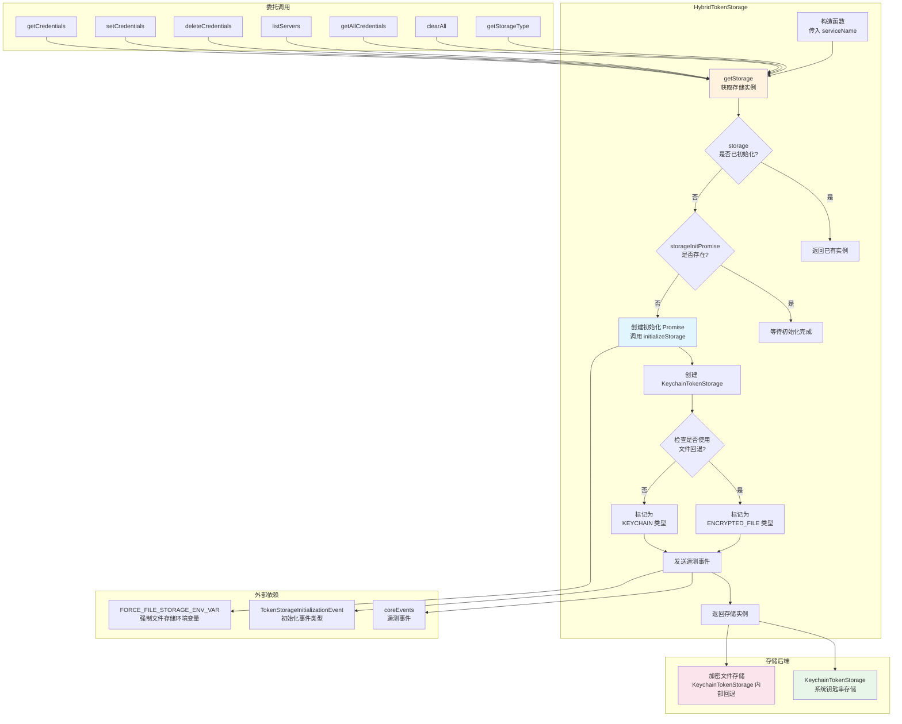

# hybrid-token-storage.ts

## 概述

`hybrid-token-storage.ts` 定义了 `HybridTokenStorage` 类，它是令牌存储系统的**混合策略实现**。该类继承自 `BaseTokenStorage` 抽象类，核心设计理念是**延迟初始化 + 自动降级**：优先尝试使用系统 Keychain（钥匙串）存储令牌，如果 Keychain 不可用则自动降级为加密文件存储。

这种混合策略使得应用在不同环境中（带桌面环境的系统 vs. 无头服务器/CI 环境）都能正确工作，同时尽可能使用最安全的存储方式。

## 架构图（Mermaid）



## 核心组件

### HybridTokenStorage 类

继承自 `BaseTokenStorage`，实现了延迟初始化和委托模式的令牌存储。

#### 私有属性

| 属性 | 类型 | 初始值 | 说明 |
|------|------|--------|------|
| `storage` | `TokenStorage \| null` | `null` | 实际的存储后端实例 |
| `storageType` | `TokenStorageType \| null` | `null` | 当前存储类型（KEYCHAIN 或 ENCRYPTED_FILE） |
| `storageInitPromise` | `Promise<TokenStorage> \| null` | `null` | 初始化 Promise，用于防止并发初始化 |

#### 构造函数

```typescript
constructor(serviceName: string) {
    super(serviceName);
}
```

仅将 `serviceName` 传递给父类，**不执行任何初始化操作**。存储的实际初始化延迟到第一次使用时。

#### `initializeStorage()` -- 私有初始化方法

存储后端的实际初始化逻辑：

1. **检查环境变量**：读取 `FORCE_FILE_STORAGE_ENV_VAR` 环境变量（虽然读取了但在当前代码中未直接用于选择存储方式，仅传递给遥测事件）
2. **创建 KeychainTokenStorage**：始终创建 `KeychainTokenStorage` 实例
3. **检测回退状态**：调用 `keychainStorage.isUsingFileFallback()` 判断是否回退到了文件存储
4. **确定存储类型**：基于回退检测结果设置 `storageType`
5. **发送遥测事件**：通过 `coreEvents.emitTelemetryTokenStorageType` 发送 `TokenStorageInitializationEvent`，记录实际使用的存储类型和是否强制使用文件存储

#### `getStorage()` -- 私有获取存储方法

带并发安全的延迟初始化：

```typescript
private async getStorage(): Promise<TokenStorage> {
    if (this.storage !== null) {
        return this.storage;  // 已初始化，直接返回
    }
    if (!this.storageInitPromise) {
        this.storageInitPromise = this.initializeStorage();  // 首次，创建 Promise
    }
    return this.storageInitPromise;  // 等待初始化完成
}
```

使用单一 Promise 模式避免竞态条件：多个并发调用只会触发一次初始化。

#### 委托方法

所有 `TokenStorage` 接口方法的实现都遵循相同的**委托模式**：

1. 调用 `await this.getStorage()` 获取初始化后的存储实例
2. 将操作委托给实际的存储后端

| 方法 | 委托行为 |
|------|----------|
| `getCredentials(serverName)` | `storage.getCredentials(serverName)` |
| `setCredentials(credentials)` | `storage.setCredentials(credentials)` |
| `deleteCredentials(serverName)` | `storage.deleteCredentials(serverName)` |
| `listServers()` | `storage.listServers()` |
| `getAllCredentials()` | `storage.getAllCredentials()` |
| `clearAll()` | `storage.clearAll()` |

#### `getStorageType()` -- 额外公开方法

```typescript
async getStorageType(): Promise<TokenStorageType> {
    await this.getStorage();
    return this.storageType!;
}
```

等待存储初始化完成后返回当前使用的存储类型。使用 `!` 非空断言，因为在 `getStorage()` 完成后 `storageType` 一定已被赋值。

## 依赖关系

### 内部依赖

| 模块 | 导入内容 | 用途 |
|------|----------|------|
| `./base-token-storage.js` | `BaseTokenStorage` | 抽象基类，本类继承于此 |
| `./keychain-token-storage.js` | `KeychainTokenStorage` | Keychain 令牌存储实现，作为实际存储后端 |
| `./types.js` | `TokenStorageType`, `TokenStorage`, `OAuthCredentials` | 类型枚举和接口定义 |
| `../../utils/events.js` | `coreEvents` | 核心事件系统，用于发送遥测事件 |
| `../../telemetry/types.js` | `TokenStorageInitializationEvent` | 令牌存储初始化的遥测事件类型 |
| `../../services/keychainService.js` | `FORCE_FILE_STORAGE_ENV_VAR` | 强制使用文件存储的环境变量名常量 |

### 外部依赖

无直接的外部依赖。间接通过 `KeychainTokenStorage` 依赖系统 Keychain 和加密文件存储。

## 关键实现细节

### 1. 延迟初始化模式 (Lazy Initialization)

存储后端不在构造函数中初始化，而是延迟到首次调用任一存储方法时。这样做的好处：
- 减少应用启动时间
- 避免在不需要令牌存储时的无谓初始化
- 允许 Keychain 可用性检测在实际需要时才执行

### 2. 单一 Promise 并发安全

```typescript
if (!this.storageInitPromise) {
    this.storageInitPromise = this.initializeStorage();
}
return this.storageInitPromise;
```

如果多个异步操作同时调用 `getStorage()`，只有第一个调用会创建初始化 Promise，后续调用都会等待同一个 Promise。这避免了：
- 多次创建 `KeychainTokenStorage` 实例
- 多次检测 Keychain 可用性
- 多次发送遥测事件

### 3. 委托模式 (Delegation Pattern)

`HybridTokenStorage` 本身不包含任何存储逻辑，所有操作完全委托给内部的 `KeychainTokenStorage`。`KeychainTokenStorage` 自身已内置了 Keychain -> 加密文件的降级逻辑。

### 4. 遥测集成

初始化时自动发送遥测事件，记录：
- 实际使用的存储类型（`keychain` 或 `encrypted_file`）
- 是否通过环境变量强制使用文件存储

这些数据对于了解用户环境分布和排查存储相关问题非常有价值。

### 5. 存储类型检测

`FORCE_FILE_STORAGE_ENV_VAR` 环境变量被读取并传递给遥测事件，但存储类型的实际决定是由 `KeychainTokenStorage.isUsingFileFallback()` 方法完成的。这意味着即使环境变量设置为强制文件存储，真正的回退逻辑也封装在 `KeychainTokenStorage` 内部。

### 6. 非空断言的使用

`getStorageType()` 方法中的 `this.storageType!` 使用了 TypeScript 非空断言。这是安全的，因为 `getStorage()` 内部的 `initializeStorage()` 一定会设置 `storageType` 的值。但如果 `initializeStorage()` 抛出异常，此断言可能不成立。
