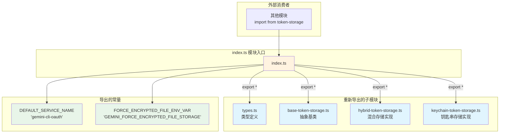
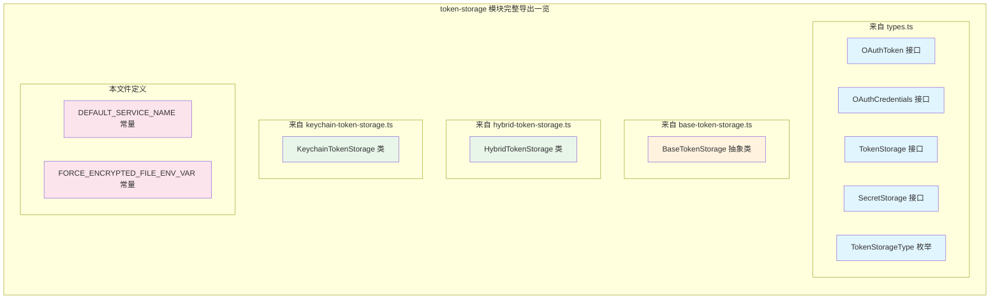

# index.ts (token-storage 模块入口)

## 概述

`index.ts` 是 `token-storage` 模块的入口文件（barrel file），负责统一导出该模块的所有公共 API。它聚合了类型定义、抽象基类、具体实现类以及模块级常量，使外部消费者只需通过一个导入路径即可访问 token-storage 子系统的全部功能。

该文件还定义了两个模块级常量：默认服务名称和强制加密文件存储的环境变量名。

## 架构图（Mermaid）





## 核心组件

### 1. 模块重新导出

使用 `export * from` 语法将 4 个子模块的所有公共导出聚合到入口文件：

| 导出来源 | 主要导出内容 | 说明 |
|----------|-------------|------|
| `./types.js` | `OAuthToken`, `OAuthCredentials`, `TokenStorage`, `SecretStorage`, `TokenStorageType` | 所有类型定义和接口 |
| `./base-token-storage.js` | `BaseTokenStorage` | 令牌存储的抽象基类 |
| `./hybrid-token-storage.js` | `HybridTokenStorage` | 混合策略令牌存储（自动选择 Keychain 或加密文件） |
| `./keychain-token-storage.js` | `KeychainTokenStorage` | 基于系统钥匙串的令牌存储实现 |

### 2. 模块级常量

#### `DEFAULT_SERVICE_NAME`

```typescript
export const DEFAULT_SERVICE_NAME = 'gemini-cli-oauth';
```

| 属性 | 值 |
|------|-----|
| 名称 | `DEFAULT_SERVICE_NAME` |
| 值 | `'gemini-cli-oauth'` |
| 用途 | 令牌存储系统的默认服务名称标识符。用于在系统 Keychain 或加密文件存储中区分 Gemini CLI 的 OAuth 凭据与其他应用的凭据 |

#### `FORCE_ENCRYPTED_FILE_ENV_VAR`

```typescript
export const FORCE_ENCRYPTED_FILE_ENV_VAR = 'GEMINI_FORCE_ENCRYPTED_FILE_STORAGE';
```

| 属性 | 值 |
|------|-----|
| 名称 | `FORCE_ENCRYPTED_FILE_ENV_VAR` |
| 值 | `'GEMINI_FORCE_ENCRYPTED_FILE_STORAGE'` |
| 用途 | 环境变量名，当设置为 `'true'` 时，强制令牌存储使用加密文件方式而非系统 Keychain。适用于无 Keychain 环境或需要明确控制存储行为的场景 |

## 依赖关系

### 内部依赖

| 模块 | 导入方式 | 说明 |
|------|----------|------|
| `./types.js` | `export *` | 类型和接口定义 |
| `./base-token-storage.js` | `export *` | 抽象基类 |
| `./hybrid-token-storage.js` | `export *` | 混合存储实现 |
| `./keychain-token-storage.js` | `export *` | Keychain 存储实现 |

### 外部依赖

无。入口文件仅做导出聚合，不引入任何外部依赖。

## 关键实现细节

### 1. Barrel File 模式

该文件采用 TypeScript/JavaScript 项目中常见的 **Barrel File（桶文件）** 模式：
- 将分散在多个文件中的导出集中到单一入口点
- 外部模块只需 `import { xxx } from './token-storage/index.js'` 或 `import { xxx } from './token-storage'`
- 简化了导入路径，降低了模块间的耦合

### 2. `export *` 的注意事项

使用 `export *` 意味着子模块中所有通过 `export` 导出的成员都会被重新导出。如果多个子模块导出了同名的标识符，TypeScript 会报错（命名冲突）。当前的 4 个子模块没有命名冲突。

### 3. 常量与 keychainService 中的常量的关系

本文件定义的 `FORCE_ENCRYPTED_FILE_ENV_VAR`（值为 `'GEMINI_FORCE_ENCRYPTED_FILE_STORAGE'`）与 `hybrid-token-storage.ts` 中从 `../../services/keychainService.js` 导入的 `FORCE_FILE_STORAGE_ENV_VAR` 可能指向不同的环境变量（取决于 keychainService 中的实际定义）。这两个常量在不同层面控制存储行为：
- `FORCE_ENCRYPTED_FILE_ENV_VAR`：模块级公开常量，供外部使用
- `FORCE_FILE_STORAGE_ENV_VAR`：keychainService 内部使用的常量

### 4. 模块的整体层次结构

```
token-storage/
├── index.ts              ← 入口文件（本文件）
├── types.ts              ← 接口和类型定义
├── base-token-storage.ts ← 抽象基类
├── hybrid-token-storage.ts ← 混合策略实现（推荐使用）
└── keychain-token-storage.ts ← Keychain 具体实现
```

推荐的使用方式是通过 `HybridTokenStorage` 结合 `DEFAULT_SERVICE_NAME` 来创建存储实例：

```typescript
import { HybridTokenStorage, DEFAULT_SERVICE_NAME } from './token-storage';

const storage = new HybridTokenStorage(DEFAULT_SERVICE_NAME);
```

这样可以自动获得 Keychain 优先、加密文件回退的存储策略。
