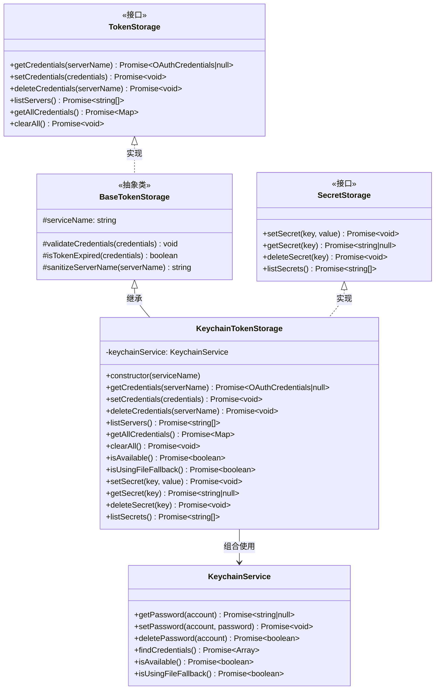
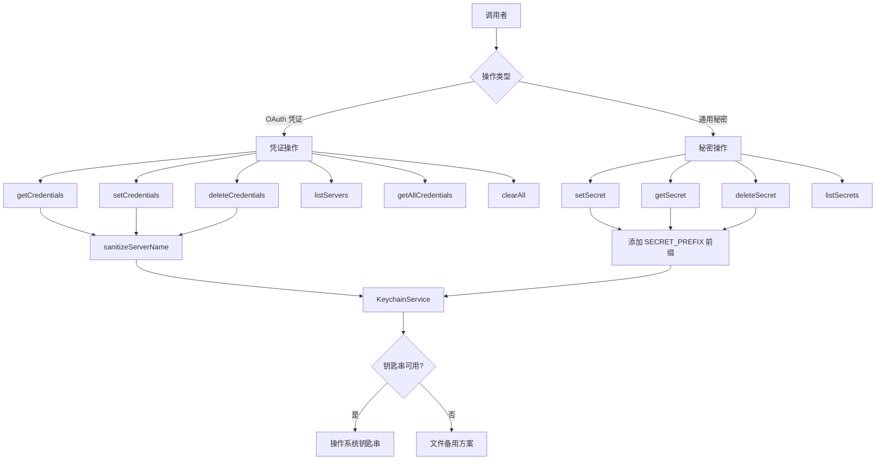

# keychain-token-storage.ts

## 概述

`KeychainTokenStorage` 是一个基于操作系统钥匙串（Keychain）的 OAuth 凭证和秘密信息存储实现类。它继承自 `BaseTokenStorage` 抽象基类，并同时实现了 `SecretStorage` 接口，提供了两套完整的存储能力：

1. **OAuth 凭证存储**：管理 MCP（Model Context Protocol）服务器的 OAuth 认证凭证的增删改查。
2. **通用秘密存储**：管理带有 `SECRET_PREFIX` 前缀的通用密钥-值对秘密信息。

该类通过 `KeychainService` 与底层操作系统的钥匙串服务交互，实现了安全的凭证持久化存储。当钥匙串不可用时，`KeychainService` 内部可能会退回到基于文件的备用方案。

## 架构图（Mermaid）





## 核心组件

### 1. 构造函数 `constructor(serviceName: string)`

- 调用父类 `BaseTokenStorage` 的构造函数，传入 `serviceName`。
- 使用相同的 `serviceName` 初始化 `KeychainService` 实例。
- `serviceName` 用于在钥匙串中隔离不同服务的凭证（相当于钥匙串的"服务名"命名空间）。

### 2. OAuth 凭证管理方法

#### `getCredentials(serverName: string): Promise<OAuthCredentials | null>`

获取指定 MCP 服务器的 OAuth 凭证。

- 对 `serverName` 进行名称净化（`sanitizeServerName`）。
- 通过 `KeychainService.getPassword()` 从钥匙串读取 JSON 字符串。
- 将 JSON 解析为 `OAuthCredentials` 对象。
- 调用 `isTokenExpired()` 检查 Token 是否过期（含 5 分钟缓冲期），过期则返回 `null`。
- JSON 解析失败时抛出有意义的错误信息。

#### `setCredentials(credentials: OAuthCredentials): Promise<void>`

存储或更新 OAuth 凭证。

- 调用 `validateCredentials()` 验证凭证完整性（必须有 `serverName`、`token`、`accessToken`、`tokenType`）。
- 对 `serverName` 进行名称净化。
- 添加 `updatedAt` 时间戳（`Date.now()`）。
- 将凭证序列化为 JSON 后存入钥匙串。

#### `deleteCredentials(serverName: string): Promise<void>`

删除指定服务器的凭证。

- 对 `serverName` 进行名称净化。
- 调用 `KeychainService.deletePassword()` 删除。
- 如果凭证不存在（返回 `false`），抛出错误。

#### `listServers(): Promise<string[]>`

列出所有已存储凭证的服务器名称。

- 通过 `KeychainService.findCredentials()` 获取所有凭证条目。
- **过滤掉**以 `KEYCHAIN_TEST_PREFIX` 开头的测试条目。
- **过滤掉**以 `SECRET_PREFIX` 开头的通用秘密条目。
- 返回剩余条目的 `account` 名称数组。
- 出错时通过 `coreEvents.emitFeedback` 发送错误反馈并返回空数组。

#### `getAllCredentials(): Promise<Map<string, OAuthCredentials>>`

获取所有未过期的凭证。

- 获取全部凭证条目，过滤掉测试条目和秘密条目。
- 对每个条目尝试 JSON 解析。
- 跳过已过期的 Token。
- 将有效凭证放入 `Map<string, OAuthCredentials>` 返回。
- 单条解析失败不影响其他条目的处理。

#### `clearAll(): Promise<void>`

清除所有存储的凭证。

- 获取全部凭证条目。
- 逐个调用 `deleteCredentials()` 删除。
- 收集所有删除失败的错误，最终合并抛出。
- 外层也有 try-catch，通过事件系统报告错误后重新抛出。

### 3. 可用性检测方法

#### `isAvailable(): Promise<boolean>`

检测钥匙串服务是否可用，直接委托给 `KeychainService.isAvailable()`。

#### `isUsingFileFallback(): Promise<boolean>`

检测当前是否在使用文件备用方案而非真正的钥匙串，直接委托给 `KeychainService.isUsingFileFallback()`。

### 4. 通用秘密存储方法（SecretStorage 接口实现）

这些方法使用 `SECRET_PREFIX` 前缀来与 OAuth 凭证区分存储空间：

#### `setSecret(key: string, value: string): Promise<void>`

存储一个通用秘密。Key 自动添加 `SECRET_PREFIX` 前缀后作为钥匙串账户名，`value` 作为密码存储。

#### `getSecret(key: string): Promise<string | null>`

获取一个通用秘密。返回对应 key 的值，不存在则返回 `null`。

#### `deleteSecret(key: string): Promise<void>`

删除一个通用秘密。如果不存在，抛出错误。

#### `listSecrets(): Promise<string[]>`

列出所有通用秘密的 key（去掉 `SECRET_PREFIX` 前缀后返回）。出错时通过事件系统报告并返回空数组。

## 依赖关系

### 内部依赖

| 模块 | 导入内容 | 用途 |
|------|---------|------|
| `./base-token-storage.js` | `BaseTokenStorage` | 抽象基类，提供 `validateCredentials`、`isTokenExpired`、`sanitizeServerName` 等通用方法 |
| `./types.js` | `OAuthCredentials`, `SecretStorage` | 类型定义和秘密存储接口 |
| `../../utils/events.js` | `coreEvents` | 核心事件系统，用于在非致命错误时发送 `error` 级别反馈 |
| `../../services/keychainService.js` | `KeychainService` | 钥匙串服务封装，提供底层的密码增删改查能力 |
| `../../services/keychainTypes.js` | `KEYCHAIN_TEST_PREFIX`, `SECRET_PREFIX` | 钥匙串账户名前缀常量，用于区分测试数据、通用秘密和 OAuth 凭证 |

### 外部依赖

无直接外部第三方依赖。底层的 `KeychainService` 可能依赖于操作系统特定的钥匙串 API（如 macOS 的 `security` 命令或 `keytar` 等 Node.js 原生模块）。

## 关键实现细节

### 1. 命名空间隔离策略

钥匙串中的条目通过**前缀**机制实现三种数据的隔离：
- **无前缀**：OAuth 凭证（正常的 MCP 服务器认证数据）
- **`SECRET_PREFIX` 前缀**：通用秘密（键值对形式的秘密数据）
- **`KEYCHAIN_TEST_PREFIX` 前缀**：测试数据（在 `listServers` 和 `getAllCredentials` 中被过滤）

### 2. Token 过期检测机制

继承自 `BaseTokenStorage` 的 `isTokenExpired()` 方法使用了 **5 分钟缓冲期**：

```typescript
const bufferMs = 5 * 60 * 1000; // 5 分钟
return Date.now() > credentials.token.expiresAt - bufferMs;
```

这意味着 Token 在实际过期前 5 分钟就会被视为"已过期"，从而避免在即将过期时使用可能失效的 Token。

### 3. 服务器名净化

`sanitizeServerName()` 将名称中除 `a-zA-Z0-9-_.` 以外的字符全部替换为下划线 `_`，确保名称可安全用作钥匙串账户标识符。

### 4. 错误处理策略

该类采用了**差异化的错误处理策略**：

| 方法 | 错误处理方式 |
|------|------------|
| `getCredentials` | JSON 解析错误抛出自定义错误，其他错误直接抛出 |
| `setCredentials` | 验证失败直接抛出错误 |
| `deleteCredentials` | 不存在时抛出错误 |
| `listServers` | 通过事件系统报告错误，返回空数组（降级处理） |
| `getAllCredentials` | 单条解析错误通过事件报告（不影响其他条目），整体错误也降级处理 |
| `clearAll` | 收集部分失败的错误并合并抛出，外层也报告并重新抛出 |
| `listSecrets` | 通过事件系统报告错误，返回空数组（降级处理） |
| `deleteSecret` | 不存在时抛出错误 |

这种策略确保了**读操作尽量降级**（返回空值/空数组），而**写/删操作严格报错**，避免数据不一致。

### 5. 凭证更新时间戳

`setCredentials` 在存储前会自动添加 `updatedAt: Date.now()` 时间戳，用于追踪凭证的最后更新时间，方便后续审计或清理过期数据。

### 6. 双重身份

该类同时扮演两个角色（通过继承 + 接口实现）：
- **TokenStorage**（通过继承 `BaseTokenStorage`）：管理结构化的 `OAuthCredentials`
- **SecretStorage**（通过实现 `SecretStorage` 接口）：管理简单的字符串键值对

两者共享同一个 `KeychainService` 实例和同一个钥匙串服务名命名空间，通过前缀区分。
