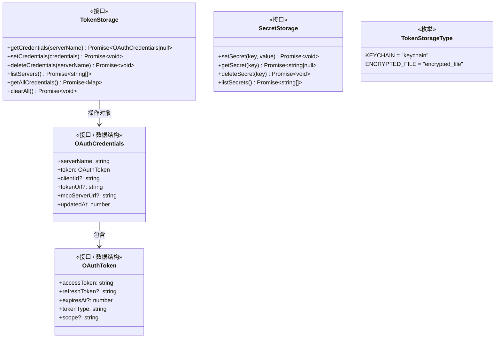
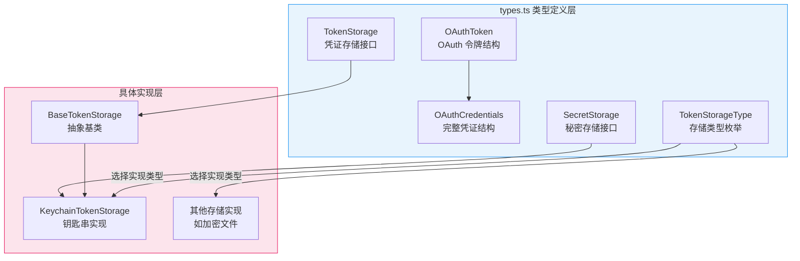

# types.ts

## 概述

`types.ts` 是 MCP（Model Context Protocol）Token 存储子系统的核心类型定义文件。它定义了整个 Token 存储模块的数据结构、接口契约和存储类型枚举。所有与 OAuth 凭证持久化相关的组件都依赖于此文件中的类型定义。

该文件包含以下关键类型：
- **`OAuthToken`**：OAuth 令牌的数据结构
- **`OAuthCredentials`**：包含服务器信息的完整 OAuth 凭证
- **`TokenStorage`**：Token 存储的标准接口（CRUD + 批量操作）
- **`SecretStorage`**：通用秘密存储的标准接口
- **`TokenStorageType`**：存储后端类型枚举

## 架构图（Mermaid）





## 核心组件

### 1. `OAuthToken` 接口

OAuth 令牌的基础数据结构，符合 OAuth 2.0 标准令牌响应格式。

| 字段 | 类型 | 必填 | 说明 |
|------|------|------|------|
| `accessToken` | `string` | 是 | 访问令牌，用于授权 API 请求 |
| `refreshToken` | `string` | 否 | 刷新令牌，用于在访问令牌过期后获取新令牌 |
| `expiresAt` | `number` | 否 | 令牌过期时间戳（毫秒）。若不提供，表示令牌不会过期 |
| `tokenType` | `string` | 是 | 令牌类型，通常为 `"Bearer"` |
| `scope` | `string` | 否 | 令牌授权范围，空格分隔的 scope 字符串 |

### 2. `OAuthCredentials` 接口

包含完整上下文信息的 OAuth 凭证，是存储系统的核心数据单元。

| 字段 | 类型 | 必填 | 说明 |
|------|------|------|------|
| `serverName` | `string` | 是 | MCP 服务器名称，作为凭证的唯一标识键 |
| `token` | `OAuthToken` | 是 | 嵌套的 OAuth 令牌对象 |
| `clientId` | `string` | 否 | OAuth 客户端 ID，用于令牌刷新等操作 |
| `tokenUrl` | `string` | 否 | OAuth 令牌端点 URL，用于令牌刷新时发送请求 |
| `mcpServerUrl` | `string` | 否 | MCP 服务器的实际 URL 地址 |
| `updatedAt` | `number` | 是 | 凭证最后更新时间戳（毫秒），由 `setCredentials` 自动设置 |

### 3. `TokenStorage` 接口

Token 存储的标准契约接口，定义了凭证管理所需的全部操作。所有存储后端实现都必须遵循此接口。

| 方法 | 签名 | 说明 |
|------|------|------|
| `getCredentials` | `(serverName: string) => Promise<OAuthCredentials \| null>` | 根据服务器名获取凭证，不存在或过期返回 `null` |
| `setCredentials` | `(credentials: OAuthCredentials) => Promise<void>` | 存储或更新凭证 |
| `deleteCredentials` | `(serverName: string) => Promise<void>` | 删除指定服务器的凭证 |
| `listServers` | `() => Promise<string[]>` | 列出所有已存储凭证的服务器名 |
| `getAllCredentials` | `() => Promise<Map<string, OAuthCredentials>>` | 获取所有凭证的映射表 |
| `clearAll` | `() => Promise<void>` | 清除所有已存储的凭证 |

**设计特点**：
- 所有方法均为异步（`Promise`），适配不同存储后端（钥匙串、文件系统、网络存储等）。
- `getAllCredentials` 返回 `Map` 而非普通对象，支持更灵活的键值操作。
- 接口遵循 CRUD 模式加批量操作（`listServers`、`getAllCredentials`、`clearAll`）。

### 4. `SecretStorage` 接口

通用秘密（键值对字符串）存储接口，与 `TokenStorage` 相互独立。适用于不需要 OAuth 凭证结构的简单秘密存储场景。

| 方法 | 签名 | 说明 |
|------|------|------|
| `setSecret` | `(key: string, value: string) => Promise<void>` | 存储一个秘密 |
| `getSecret` | `(key: string) => Promise<string \| null>` | 获取一个秘密，不存在返回 `null` |
| `deleteSecret` | `(key: string) => Promise<void>` | 删除一个秘密 |
| `listSecrets` | `() => Promise<string[]>` | 列出所有秘密的 key |

**与 TokenStorage 的区别**：
- `TokenStorage` 管理的是结构化的 `OAuthCredentials` 对象。
- `SecretStorage` 管理的是简单的 `string` 键值对。
- 在 `KeychainTokenStorage` 中，两个接口由同一个类同时实现，通过前缀区分存储空间。

### 5. `TokenStorageType` 枚举

定义存储后端的类型，用于在运行时选择/配置使用哪种存储实现。

| 枚举值 | 字符串值 | 说明 |
|--------|---------|------|
| `KEYCHAIN` | `"keychain"` | 使用操作系统钥匙串存储（如 macOS Keychain、Windows Credential Manager） |
| `ENCRYPTED_FILE` | `"encrypted_file"` | 使用加密文件存储，适用于钥匙串不可用的环境 |

## 依赖关系

### 内部依赖

无。此文件为纯类型定义文件，不导入任何其他内部模块。它处于依赖链的最底层，被其他模块依赖。

**被依赖方**（引用此文件的模块）：
- `base-token-storage.ts`：导入 `TokenStorage`, `OAuthCredentials`
- `keychain-token-storage.ts`：导入 `OAuthCredentials`, `SecretStorage`
- 其他存储实现文件

### 外部依赖

无。此文件为纯 TypeScript 类型定义，不依赖任何外部包。

## 关键实现细节

### 1. 数据模型层次结构

类型定义采用**嵌套组合**模式：

```
OAuthCredentials（凭证容器）
├── serverName（服务器标识）
├── token: OAuthToken（令牌数据）
│   ├── accessToken
│   ├── refreshToken?
│   ├── expiresAt?
│   ├── tokenType
│   └── scope?
├── clientId?（OAuth 客户端信息）
├── tokenUrl?（OAuth 端点信息）
├── mcpServerUrl?（MCP 服务器地址）
└── updatedAt（元数据）
```

`OAuthToken` 聚焦于令牌本身的属性，而 `OAuthCredentials` 包含了使用该令牌所需的全部上下文信息（服务器名、客户端 ID、端点 URL 等）。

### 2. 可选字段的设计考量

- `refreshToken`：并非所有 OAuth 流程都会颁发刷新令牌（如 Client Credentials 授权模式）。
- `expiresAt`：某些令牌可能没有过期时间。在 `BaseTokenStorage.isTokenExpired()` 中，当 `expiresAt` 为 `undefined` 时，Token 被视为永不过期。
- `clientId` 和 `tokenUrl`：存储这些信息是为了在需要刷新令牌时不必重新查询配置。
- `mcpServerUrl`：可选存储，便于后续直接使用而不必再次解析配置。

### 3. 接口分离原则

`TokenStorage` 和 `SecretStorage` 被定义为两个独立接口，遵循接口隔离原则（ISP）：
- 需要存储 OAuth 凭证的组件只需依赖 `TokenStorage`。
- 需要存储通用秘密的组件只需依赖 `SecretStorage`。
- `KeychainTokenStorage` 同时实现两者，但调用方可以按需只使用其中一个接口。

### 4. 异步接口设计

所有接口方法都返回 `Promise`，这是因为实际的存储操作可能涉及：
- 操作系统钥匙串 API 调用（I/O 操作）
- 文件系统读写（I/O 操作）
- 加密/解密处理（可能是异步的 CPU 操作）

统一使用 `Promise` 确保了所有存储后端实现的一致性，无论底层是同步还是异步操作。

### 5. 枚举的字符串值

`TokenStorageType` 使用字符串枚举值（`'keychain'`、`'encrypted_file'`），这使得：
- 枚举值可直接序列化/反序列化到配置文件。
- 日志输出时可读性好。
- 与 JSON 配置兼容。
