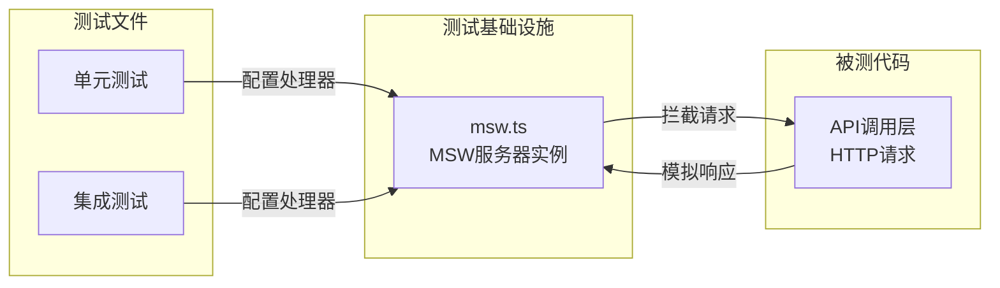

# mocks

## 概述

`mocks` 目录提供了用于测试的 MSW (Mock Service Worker) 服务器实例。它为项目的集成测试和单元测试提供统一的 HTTP 请求模拟基础设施，使测试能够在不依赖真实网络服务的情况下运行。

## 目录结构

```
mocks/
└── msw.ts    # MSW 服务器实例（测试用 HTTP 模拟服务器）
```

## 架构图



## 核心组件

### `server` (msw.ts)
- **职责**: 导出一个通过 `setupServer()` 创建的 MSW Node 服务器实例
- **用法**: 测试文件导入此实例后，通过 `server.use()` 注册请求处理器来模拟 HTTP 响应
- **代码**:
  ```typescript
  import { setupServer } from 'msw/node';
  export const server = setupServer();
  ```

## 依赖关系

### 内部依赖
无内部模块依赖。

### 外部依赖
- `msw/node` - Mock Service Worker 的 Node.js 集成

## 数据流

### 测试中的 HTTP 模拟流程
1. 测试文件导入 `server` 实例
2. 在 `beforeAll` 中调用 `server.listen()` 启动拦截
3. 在具体测试中通过 `server.use(http.get(...))` 注册请求处理器
4. 被测代码发起 HTTP 请求时，MSW 拦截并返回模拟响应
5. 在 `afterAll` 中调用 `server.close()` 停止拦截
