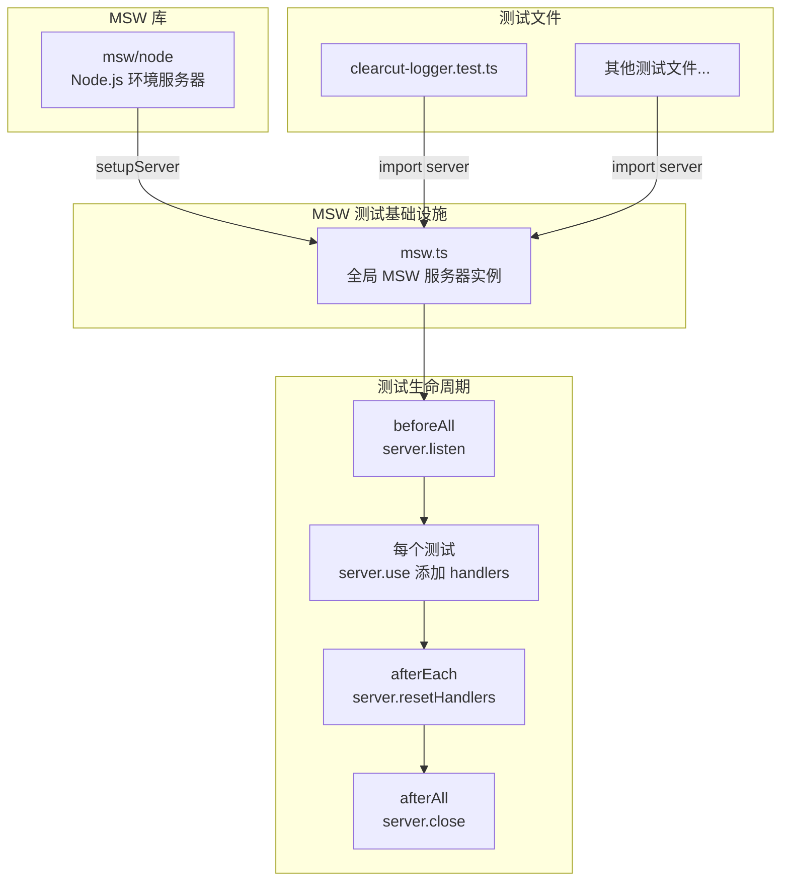
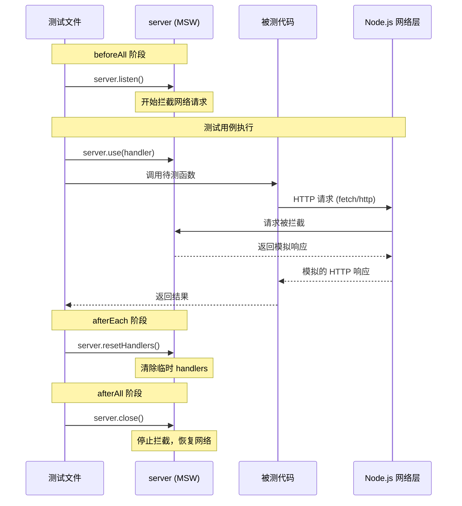

# msw.ts

## 概述

`msw.ts` 是 Gemini CLI 核心模块的测试 Mock 基础设施文件，负责创建和导出一个全局共享的 MSW（Mock Service Worker）服务器实例。MSW 是一个 API 模拟库，通过拦截网络请求实现无侵入式的 HTTP 请求模拟，广泛应用于单元测试和集成测试中。

本文件极为简洁，仅包含两行有效代码：导入 MSW 的 `setupServer` 函数，然后创建并导出一个空的（无预设请求处理器的）服务器实例。测试文件通过导入这个共享实例，在各自的测试用例中动态添加请求处理器（handlers），实现对 HTTP API 调用的模拟。

**文件路径：** `packages/core/src/mocks/msw.ts`

**代码内容：**

```typescript
import { setupServer } from 'msw/node';

export const server = setupServer();
```

## 架构图（Mermaid）





## 核心组件

### 1. `server` 常量（导出）

通过 `setupServer()` 创建的 MSW 服务器实例。

**类型：** `SetupServer`（来自 `msw/node`）

**特征：**
- 以**空配置**创建，即不预设任何请求处理器（handlers）。
- 作为全局单例导出，所有测试文件共享同一实例。
- 工作在 Node.js 环境（通过 `msw/node` 模块），通过拦截 Node.js 的网络层（`http`/`https`/`fetch`）实现请求模拟。

**主要 API（来自 MSW）：**

| 方法 | 用途 |
|------|------|
| `server.listen()` | 启动服务器，开始拦截网络请求（通常在 `beforeAll` 中调用） |
| `server.close()` | 关闭服务器，停止拦截并恢复原始网络行为（通常在 `afterAll` 中调用） |
| `server.use(...handlers)` | 在运行时动态添加请求处理器（通常在单个测试用例中调用） |
| `server.resetHandlers()` | 重置所有通过 `use()` 添加的运行时处理器（通常在 `afterEach` 中调用） |
| `server.restoreHandlers()` | 恢复所有被标记为 `once` 的已使用处理器 |

### 2. 使用模式

在项目中的典型使用方式（以 `clearcut-logger.test.ts` 为例）：

```typescript
import { server } from '../../mocks/msw.js';
import { http, HttpResponse } from 'msw';

beforeAll(() => server.listen());
afterEach(() => server.resetHandlers());
afterAll(() => server.close());

it('should handle API response', async () => {
  server.use(
    http.post('/api/endpoint', () => {
      return HttpResponse.json({ success: true });
    }),
  );

  // 调用被测代码，其内部的 HTTP 请求将被 MSW 拦截
  const result = await someFunction();
  expect(result).toBe(expected);
});
```

## 依赖关系

### 内部依赖

无内部依赖。本文件是独立的测试基础设施模块。

### 外部依赖

| 模块 | 导入项 | 用途 |
|------|--------|------|
| `msw/node` | `setupServer` | MSW 的 Node.js 服务器工厂函数，创建用于测试的请求拦截服务器 |

**MSW（Mock Service Worker）简介：**
- 官方地址：https://mswjs.io/
- 一个 API 模拟库，通过在网络层拦截请求实现无侵入式的 HTTP mock。
- 支持 REST API 和 GraphQL。
- `msw/node` 模块专门用于 Node.js 环境（测试），而 `msw/browser` 用于浏览器环境。

## 关键实现细节

1. **全局单例模式**：整个 `packages/core` 模块共享同一个 MSW 服务器实例。这种设计避免了多个测试文件各自创建服务器实例导致的冲突（MSW 拦截的是全局网络层，多个实例会互相干扰）。

2. **空初始化**：`setupServer()` 不传入任何 handler，这是有意为之的设计。每个测试文件根据自身需要通过 `server.use()` 动态添加 handler，实现按需模拟。配合 `afterEach` 中的 `server.resetHandlers()`，确保测试之间互不影响。

3. **网络层拦截原理**：在 Node.js 环境中，MSW 通过 monkey-patching `http.request`、`https.request` 和全局 `fetch`（Node.js 18+）来拦截出站请求。这意味着任何使用标准 HTTP 客户端（如 `fetch`、`axios`、`node-fetch`）的代码都会被自动拦截，无需修改被测代码。

4. **测试隔离保障**：MSW 的 `resetHandlers()` 只移除通过 `server.use()` 添加的运行时处理器，不影响 `setupServer()` 初始配置的处理器。由于本文件初始化时未配置任何处理器，`resetHandlers()` 实际上会清除所有处理器，确保每个测试用例从干净状态开始。

5. **已知使用者**：目前在项目中，`packages/core/src/telemetry/clearcut-logger/clearcut-logger.test.ts` 是已知的使用者，用于模拟遥测（telemetry）相关的 HTTP API 调用。随着项目发展，其他需要模拟 HTTP 请求的测试文件也可以导入并使用此共享实例。
