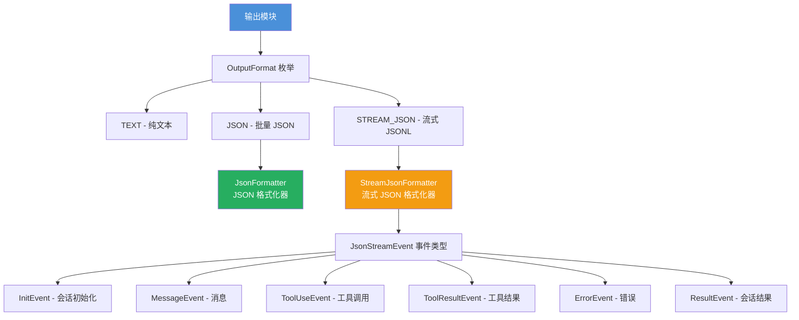
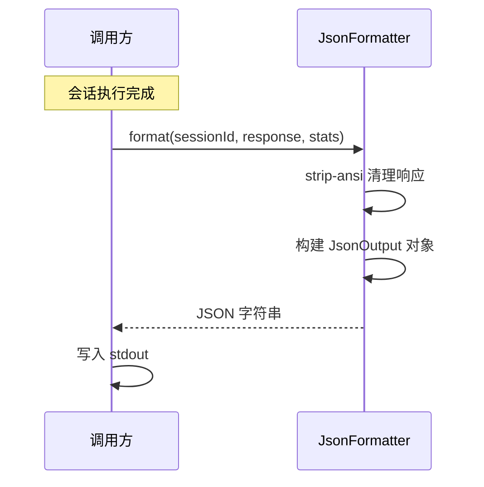
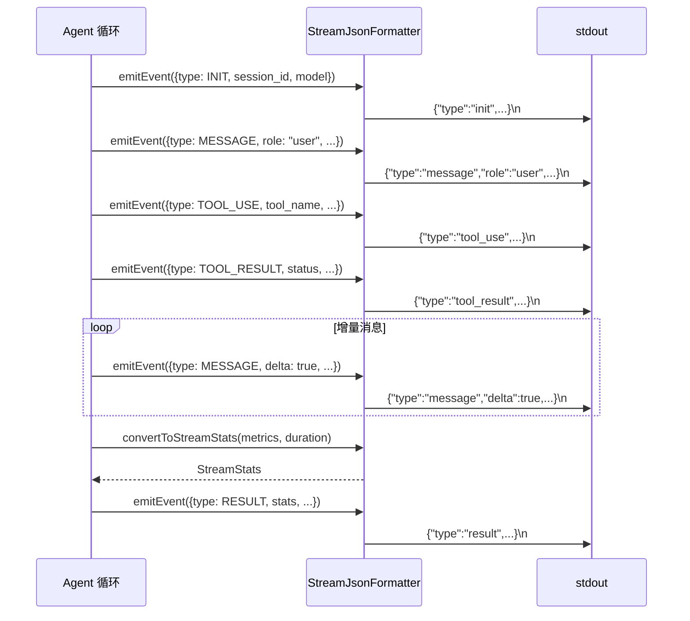

# output

## 概述

`output` 模块负责 Gemini CLI 的**输出格式化**。它支持三种输出模式：纯文本 (TEXT)、JSON 和流式 JSON (STREAM_JSON/JSONL)。JSON 模式用于非交互式场景（如脚本调用），提供结构化的会话结果；流式 JSON 模式通过逐行输出 JSONL 事件，实现实时的进度反馈，适用于 IDE 集成和自动化管道。

## 目录结构

```
output/
├── types.ts                      # 输出格式和事件类型定义
├── json-formatter.ts             # JSON 格式化器（批量输出）
├── json-formatter.test.ts
├── stream-json-formatter.ts      # 流式 JSON 格式化器（JSONL 实时输出）
└── stream-json-formatter.test.ts
```

## 架构图



## 核心组件

### types.ts（类型定义）

**输出格式枚举 `OutputFormat`：**

| 值 | 说明 |
|----|------|
| `TEXT` | 纯文本输出（默认，交互式终端） |
| `JSON` | 批量 JSON 输出（会话结束后一次性输出） |
| `STREAM_JSON` | 流式 JSONL 输出（逐行实时输出事件） |

**批量 JSON 类型：**

| 类型 | 说明 |
|------|------|
| `JsonOutput` | 批量输出结构：`session_id`、`response`、`stats`、`error` |
| `JsonError` | 错误结构：`type`、`message`、`code` |

**流式事件类型 `JsonStreamEventType`：**

| 事件 | 说明 | 关键字段 |
|------|------|----------|
| `INIT` | 会话初始化 | `session_id`、`model` |
| `MESSAGE` | 用户/助手消息 | `role`、`content`、`delta`（增量标志） |
| `TOOL_USE` | 工具调用 | `tool_name`、`tool_id`、`parameters` |
| `TOOL_RESULT` | 工具执行结果 | `tool_id`、`status`、`output`、`error` |
| `ERROR` | 错误/警告 | `severity`、`message` |
| `RESULT` | 会话结束 | `status`、`error`、`stats` |

**统计信息类型：**

| 类型 | 说明 |
|------|------|
| `StreamStats` | 流式统计：总 token 数、输入/输出 token、缓存 token、持续时间、工具调用次数、按模型分解 |
| `ModelStreamStats` | 单模型统计：总 token、输入 token、输出 token、缓存 token |

### JsonFormatter（JSON 格式化器）

用于 `JSON` 输出模式，在会话结束后一次性输出结果。

| 方法 | 说明 |
|------|------|
| `format(sessionId, response, stats, error)` | 格式化完整输出（自动去除 ANSI 颜色代码） |
| `formatError(error, code, sessionId)` | 格式化错误输出 |

**特性：**
- 使用 `strip-ansi` 清理响应中的终端颜色代码
- 输出格式化为缩进 2 空格的 JSON

### StreamJsonFormatter（流式 JSON 格式化器）

用于 `STREAM_JSON` 输出模式，实时输出 JSONL 格式的事件流。

| 方法 | 说明 |
|------|------|
| `formatEvent(event)` | 将事件格式化为 JSON 字符串 + 换行符 |
| `emitEvent(event)` | 直接向 stdout 写入格式化的事件 |
| `convertToStreamStats(metrics, durationMs)` | 将 `SessionMetrics` 转换为 `StreamStats` |

**`convertToStreamStats` 逻辑：**
- 遍历所有模型的指标数据
- 为每个模型创建 `ModelStreamStats`
- 聚合所有模型的 token 总数
- 附加持续时间和工具调用次数

## 依赖关系

### 内部依赖

| 模块 | 用途 |
|------|------|
| `telemetry/uiTelemetry` | `SessionMetrics` 类型（会话统计数据） |

### 外部依赖

| 包 | 用途 |
|---|------|
| `strip-ansi` | 去除 ANSI 终端颜色/样式代码 |

## 数据流

### JSON 批量输出流程



### 流式 JSONL 输出流程


