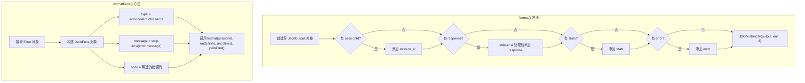

# json-formatter.ts

## 概述

`json-formatter.ts` 是 Gemini CLI 核心模块中的 **JSON 输出格式化器**。当 CLI 以非交互模式（`--output json`）运行时，该格式化器负责将模型响应、会话统计信息和错误信息组装为结构化的 JSON 字符串输出。

该文件导出的 `JsonFormatter` 类提供了两个核心方法：
- `format()`：通用格式化方法，将各种可选参数组装为格式化的 JSON 字符串
- `formatError()`：专门用于将 Error 对象格式化为标准化的 JSON 错误输出

关键特性是会自动 **剥离 ANSI 转义码**（如终端颜色代码），确保 JSON 输出是纯文本，便于程序化处理。

## 架构图（Mermaid）

```mermaid
classDiagram
    class JsonFormatter {
        +format(sessionId?, response?, stats?, error?): string
        +formatError(error, code?, sessionId?): string
    }

    class JsonOutput {
        <<interface>>
        +session_id?: string
        +response?: string
        +stats?: SessionMetrics
        +error?: JsonError
    }

    class JsonError {
        <<interface>>
        +type: string
        +message: string
        +code?: string | number
    }

    class SessionMetrics {
        <<interface>>
        来自 telemetry 模块
    }

    JsonFormatter --> JsonOutput : 构建
    JsonOutput --> JsonError : 包含
    JsonOutput --> SessionMetrics : 包含
    JsonFormatter ..> "strip-ansi" : 使用
```



## 核心组件

### `JsonFormatter` 类

#### `format()` 方法

```typescript
format(
  sessionId?: string,
  response?: string,
  stats?: SessionMetrics,
  error?: JsonError,
): string
```

通用的 JSON 格式化方法。所有参数均为可选，只有传入的参数才会出现在最终的 JSON 输出中。

**参数说明**：

| 参数 | 类型 | 说明 |
|------|------|------|
| `sessionId` | `string \| undefined` | 会话 ID，用于标识本次对话 |
| `response` | `string \| undefined` | 模型的响应文本，会被 `stripAnsi()` 处理 |
| `stats` | `SessionMetrics \| undefined` | 会话统计信息（Token 用量等） |
| `error` | `JsonError \| undefined` | 结构化的错误信息 |

**返回值**：格式化的 JSON 字符串（2 空格缩进）。

**输出示例**（成功响应）：
```json
{
  "session_id": "abc123",
  "response": "Hello, how can I help you?",
  "stats": { ... }
}
```

**输出示例**（错误响应）：
```json
{
  "session_id": "abc123",
  "error": {
    "type": "AuthenticationError",
    "message": "Invalid API key",
    "code": 401
  }
}
```

**关键细节**：
- `response` 使用 `!== undefined` 而非 truthy 检查，这意味着空字符串 `""` 也会被保留在输出中
- `sessionId` 使用 truthy 检查，空字符串会被忽略
- 使用 `JSON.stringify(output, null, 2)` 产生人类可读的缩进格式

#### `formatError()` 方法

```typescript
formatError(
  error: Error,
  code?: string | number,
  sessionId?: string,
): string
```

将 JavaScript `Error` 对象转换为标准化的 JSON 错误输出。

**参数说明**：

| 参数 | 类型 | 说明 |
|------|------|------|
| `error` | `Error` | JavaScript 错误对象 |
| `code` | `string \| number \| undefined` | 可选的错误码（如 HTTP 状态码） |
| `sessionId` | `string \| undefined` | 可选的会话 ID |

**处理逻辑**：
1. 从 `error.constructor.name` 提取错误类型名（如 `TypeError`、`AuthenticationError`）
2. 对 `error.message` 应用 `stripAnsi()` 去除终端颜色码
3. 如果提供了 `code`，使用扩展运算符 `...(code && { code })` 有条件地添加到错误对象
4. 调用 `format()` 方法输出最终 JSON

## 依赖关系

### 内部依赖

| 模块 | 导入内容 | 用途 |
|------|----------|------|
| `../telemetry/uiTelemetry.js` | `SessionMetrics`（type-only） | 会话统计信息类型定义 |
| `./types.js` | `JsonError`、`JsonOutput`（type-only） | JSON 输出和错误的类型定义 |

#### 相关类型详解

**`JsonOutput` 接口**（来自 `./types.ts`）：
```typescript
interface JsonOutput {
  session_id?: string;
  response?: string;
  stats?: SessionMetrics;
  error?: JsonError;
}
```

**`JsonError` 接口**（来自 `./types.ts`）：
```typescript
interface JsonError {
  type: string;
  message: string;
  code?: string | number;
}
```

### 外部依赖

| 模块 | 导入内容 | 用途 |
|------|----------|------|
| `strip-ansi` | `stripAnsi`（默认导入） | 从字符串中剥离 ANSI 转义码（终端颜色、样式等） |

## 关键实现细节

1. **ANSI 转义码剥离**：使用 `strip-ansi` 库处理 `response` 和 `error.message`。这是因为模型响应可能经过终端渲染器处理后包含颜色代码（如 `\u001b[31m` 表示红色），JSON 输出作为机器可读格式不应包含这些控制字符。

2. **条件字段添加**：`format()` 方法只添加有值的字段到输出对象，不会输出 `null` 或 `undefined` 的字段。这使得输出的 JSON 更加干净，下游消费者只需检查字段是否存在即可。

3. **`error.constructor.name` 的使用**：`formatError()` 通过 `error.constructor.name` 获取错误类型名，这对自定义错误类（如 `class AuthenticationError extends Error`）特别有用，能够保留具体的错误类型信息。注意：在某些打包/压缩场景下，类名可能被混淆。

4. **`code` 的条件展开**：`...(code && { code })` 利用了短路求值和对象展开：当 `code` 为 falsy（`undefined`、`0`、`""`）时，`code && { code }` 的结果为 falsy，展开操作不会添加任何字段。但需注意，这意味着 `code = 0` 也不会被包含。

5. **输出格式**：使用 `JSON.stringify(output, null, 2)` 的 2 空格缩进，使 JSON 输出便于人类阅读和调试，同时仍然是合法的 JSON 格式。

6. **无状态设计**：`JsonFormatter` 类没有任何实例状态，所有方法都是纯函数（给定相同输入，输出相同结果）。理论上可以改为静态方法，但使用实例化的类有利于后续的依赖注入和测试模拟。
