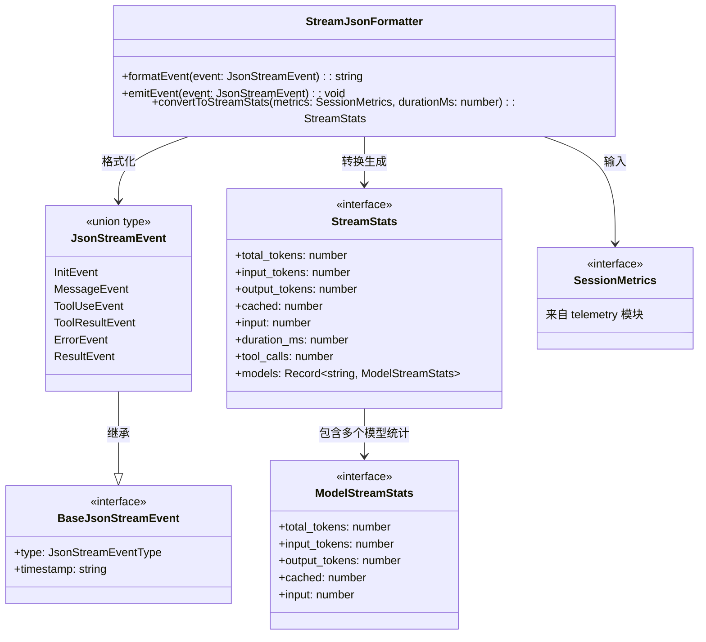
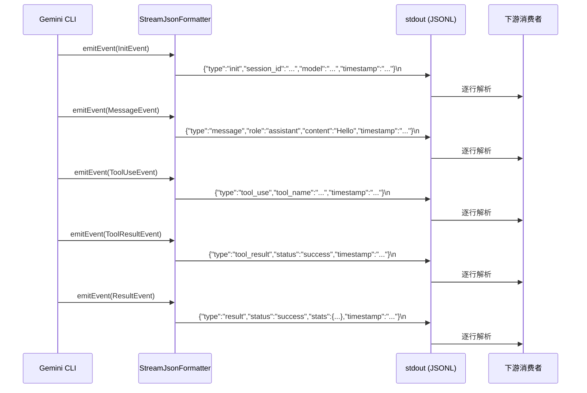
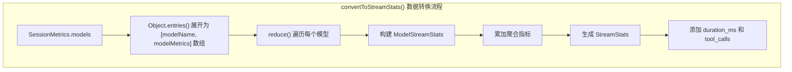

# stream-json-formatter.ts

## 概述

`stream-json-formatter.ts` 是 Gemini CLI 核心模块中的 **流式 JSON 输出格式化器**。当 CLI 以流式 JSON 模式（`--output stream-json`）运行时，该格式化器负责将各种事件实时地以 **JSONL（JSON Lines / Newline-Delimited JSON）** 格式输出到 stdout。

与 `JsonFormatter`（一次性输出整个 JSON）不同，`StreamJsonFormatter` 设计用于实时流式场景：每个事件作为独立的一行 JSON 输出，使下游消费者可以逐行解析并实时处理模型响应、工具调用、错误等事件。

该文件导出的 `StreamJsonFormatter` 类提供三个核心方法：
- `formatEvent()`：将事件格式化为 JSONL 行
- `emitEvent()`：将事件直接写入 stdout
- `convertToStreamStats()`：将遥测指标转换为流式统计格式

## 架构图（Mermaid）







## 核心组件

### `StreamJsonFormatter` 类

#### `formatEvent()` 方法

```typescript
formatEvent(event: JsonStreamEvent): string
```

将单个流式事件格式化为 JSONL 行（JSON 字符串 + 换行符）。

**参数**：

| 参数 | 类型 | 说明 |
|------|------|------|
| `event` | `JsonStreamEvent` | 流式 JSON 事件对象（联合类型，包含 6 种事件） |

**返回值**：`JSON.stringify(event) + '\n'` -- 紧凑的单行 JSON 字符串，末尾带换行符。

**注意**：与 `JsonFormatter.format()` 使用 2 空格缩进不同，此方法使用 `JSON.stringify(event)` 无缩进，确保每个事件恰好占一行，符合 JSONL 格式规范。

#### `emitEvent()` 方法

```typescript
emitEvent(event: JsonStreamEvent): void
```

将事件直接写入 `process.stdout`。使用 `process.stdout.write()` 而非 `console.log()`，避免额外的换行和格式化处理。

**参数**：同 `formatEvent()`。

#### `convertToStreamStats()` 方法

```typescript
convertToStreamStats(metrics: SessionMetrics, durationMs: number): StreamStats
```

将内部遥测模块的 `SessionMetrics` 转换为面向流式输出的 `StreamStats` 格式。

**参数**：

| 参数 | 类型 | 说明 |
|------|------|------|
| `metrics` | `SessionMetrics` | 来自遥测模块的会话指标 |
| `durationMs` | `number` | 会话持续时长（毫秒） |

**返回值**：`StreamStats` 对象。

**转换逻辑详解**：

1. 通过 `Object.entries(metrics.models)` 将模型指标展开为键值对数组
2. 使用 `reduce()` 遍历每个模型，执行两个操作：
   - **逐模型转换**：将内部字段名映射为输出字段名：
     - `tokens.total` → `total_tokens`
     - `tokens.prompt` → `input_tokens`
     - `tokens.candidates` → `output_tokens`
     - `tokens.cached` → `cached`
     - `tokens.input` → `input`
   - **聚合累加**：将所有模型的 Token 使用量累加到全局指标
3. 最终组装 `StreamStats`，添加 `duration_ms`（来自参数）和 `tool_calls`（来自 `metrics.tools.totalCalls`）

### 支持的事件类型（来自 `types.ts`）

以下是 `JsonStreamEvent` 联合类型包含的 6 种事件类型：

| 事件类型 | 枚举值 | 说明 | 关键字段 |
|----------|--------|------|----------|
| `InitEvent` | `init` | 会话初始化 | `session_id`、`model` |
| `MessageEvent` | `message` | 消息（用户或助手） | `role`、`content`、`delta?` |
| `ToolUseEvent` | `tool_use` | 工具调用 | `tool_name`、`tool_id`、`parameters` |
| `ToolResultEvent` | `tool_result` | 工具执行结果 | `tool_id`、`status`、`output?`、`error?` |
| `ErrorEvent` | `error` | 错误 | `severity`、`message` |
| `ResultEvent` | `result` | 最终结果 | `status`、`error?`、`stats?` |

所有事件都继承 `BaseJsonStreamEvent`，包含 `type` 和 `timestamp` 两个公共字段。

### JSONL 输出示例

完整的流式 JSON 输出可能如下：

```jsonl
{"type":"init","timestamp":"2025-01-15T10:30:00Z","session_id":"sess_abc123","model":"gemini-2.5-pro"}
{"type":"message","timestamp":"2025-01-15T10:30:01Z","role":"user","content":"Hello"}
{"type":"message","timestamp":"2025-01-15T10:30:02Z","role":"assistant","content":"Hi there!","delta":true}
{"type":"tool_use","timestamp":"2025-01-15T10:30:03Z","tool_name":"read_file","tool_id":"tool_1","parameters":{"path":"/tmp/test.txt"}}
{"type":"tool_result","timestamp":"2025-01-15T10:30:04Z","tool_id":"tool_1","status":"success","output":"file contents here"}
{"type":"result","timestamp":"2025-01-15T10:30:05Z","status":"success","stats":{"total_tokens":150,"input_tokens":100,"output_tokens":50,"cached":20,"input":80,"duration_ms":5000,"tool_calls":1,"models":{"gemini-2.5-pro":{"total_tokens":150,"input_tokens":100,"output_tokens":50,"cached":20,"input":80}}}}
```

## 依赖关系

### 内部依赖

| 模块 | 导入内容 | 用途 |
|------|----------|------|
| `./types.js` | `JsonStreamEvent`、`ModelStreamStats`、`StreamStats`（type-only） | 流式事件和统计信息的类型定义 |
| `../telemetry/uiTelemetry.js` | `SessionMetrics`（type-only） | 会话遥测指标的类型定义 |

### 外部依赖

无外部第三方依赖。该文件仅使用 Node.js 内置的 `process.stdout.write()` 和 `JSON.stringify()`。

## 关键实现细节

1. **JSONL 格式选择**：使用 JSONL（JSON Lines）而非标准 JSON 数组格式。JSONL 的优势在于：
   - 每行是独立的合法 JSON，消费者可以逐行解析，无需等待整个输出完成
   - 天然支持流式处理，适合管道操作（如 `gemini-cli | jq -c 'select(.type == "message")'`）
   - 即使某一行解析失败，不影响其他行的处理

2. **`process.stdout.write()` vs `console.log()`**：`emitEvent()` 使用底层的 `process.stdout.write()` 而非 `console.log()`。原因是：
   - `console.log()` 会自动追加换行符，而 `formatEvent()` 已经在末尾添加了 `\n`
   - `process.stdout.write()` 不会添加额外格式，确保输出精确可控
   - `process.stdout.write()` 是同步写入流的标准方式

3. **字段名映射（内部 → 外部）**：`convertToStreamStats()` 执行了关键的字段名重映射：
   - 内部使用驼峰命名：`tokens.prompt`、`tokens.candidates`
   - 外部输出使用下划线命名：`input_tokens`、`output_tokens`
   - 这种转换保持了内部代码的 TypeScript 风格，同时对外提供更通用的命名约定

4. **多模型支持**：`convertToStreamStats()` 通过遍历 `metrics.models` 对象支持多模型场景。每个模型有独立的 Token 统计，全局统计是所有模型的聚合。`models` 字段的键为模型名称（如 `"gemini-2.5-pro"`），值为该模型的详细统计。

5. **`reduce()` 聚合模式**：使用 `reduce()` 在单次遍历中同时完成两件事——构建逐模型的 `ModelStreamStats` 和累加全局统计。初始值使用类型断言 `as Record<string, ModelStreamStats>` 初始化空的 `models` 对象。

6. **与 `JsonFormatter` 的对比**：
   - `JsonFormatter`：输出完整的 JSON 对象，使用 2 空格缩进，包含 ANSI 剥离，适合一次性输出
   - `StreamJsonFormatter`：输出 JSONL 流，无缩进，无 ANSI 剥离（假设事件数据已经是纯文本），适合实时流式输出

7. **无状态设计**：与 `JsonFormatter` 一样，`StreamJsonFormatter` 也没有实例状态，所有方法都是纯函数或仅依赖 `process.stdout`。这使得它可以安全地在多个地方共享使用。
