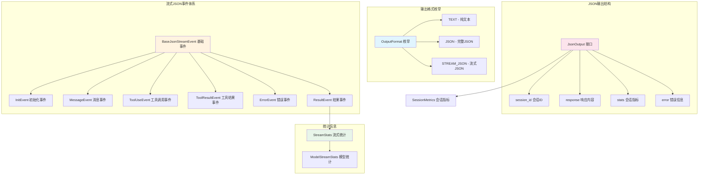

# types.ts

## 概述

`types.ts` 是 Gemini CLI 核心包中输出模块的类型定义文件。该文件定义了 CLI 工具与外部消费者之间通信的所有输出格式、事件类型和数据结构。它支持三种输出模式：纯文本、JSON 和流式 JSON，为 CLI 的非交互式/程序化使用提供了结构化的输出协议。

## 架构图（Mermaid）



## 核心组件

### 1. OutputFormat 枚举

定义 CLI 支持的三种输出格式：

| 枚举值 | 字符串值 | 说明 |
|--------|---------|------|
| `TEXT` | `'text'` | 纯文本输出，适合人类阅读的终端输出 |
| `JSON` | `'json'` | 完整 JSON 输出，等待执行完成后一次性返回 |
| `STREAM_JSON` | `'stream-json'` | 流式 JSON 输出，逐事件发送，适合实时处理 |

### 2. JsonError 接口

表示 JSON 输出中的错误信息：

```typescript
export interface JsonError {
  type: string;        // 错误类型标识
  message: string;     // 错误描述信息
  code?: string | number; // 可选的错误代码
}
```

### 3. JsonOutput 接口

非流式 JSON 模式下的完整输出结构：

```typescript
export interface JsonOutput {
  session_id?: string;      // 会话唯一标识
  response?: string;        // AI 的响应文本
  stats?: SessionMetrics;   // 会话统计指标
  error?: JsonError;        // 错误信息（如有）
}
```

### 4. JsonStreamEventType 枚举

定义流式 JSON 模式下的六种事件类型：

| 枚举值 | 字符串值 | 说明 |
|--------|---------|------|
| `INIT` | `'init'` | 会话初始化事件 |
| `MESSAGE` | `'message'` | 用户或助手的消息 |
| `TOOL_USE` | `'tool_use'` | 工具调用请求 |
| `TOOL_RESULT` | `'tool_result'` | 工具执行结果 |
| `ERROR` | `'error'` | 错误事件 |
| `RESULT` | `'result'` | 最终结果事件 |

### 5. BaseJsonStreamEvent 接口

所有流式事件的基类接口：

```typescript
export interface BaseJsonStreamEvent {
  type: JsonStreamEventType;  // 事件类型
  timestamp: string;          // 事件时间戳
}
```

### 6. InitEvent 接口

会话初始化事件，在流开始时发送：

```typescript
export interface InitEvent extends BaseJsonStreamEvent {
  type: JsonStreamEventType.INIT;
  session_id: string;  // 会话唯一标识
  model: string;       // 使用的模型名称
}
```

### 7. MessageEvent 接口

消息事件，包含用户或助手的对话内容：

```typescript
export interface MessageEvent extends BaseJsonStreamEvent {
  type: JsonStreamEventType.MESSAGE;
  role: 'user' | 'assistant';  // 消息角色
  content: string;              // 消息内容
  delta?: boolean;              // 是否为增量内容（流式片段）
}
```

`delta` 字段标识该消息是否为增量片段，`true` 表示只是完整消息的一部分，用于实现流式输出效果。

### 8. ToolUseEvent 接口

工具调用事件，当 AI 决定调用某个工具时触发：

```typescript
export interface ToolUseEvent extends BaseJsonStreamEvent {
  type: JsonStreamEventType.TOOL_USE;
  tool_name: string;                     // 工具名称
  tool_id: string;                       // 工具调用唯一ID
  parameters: Record<string, unknown>;   // 工具参数（键值对）
}
```

### 9. ToolResultEvent 接口

工具执行结果事件：

```typescript
export interface ToolResultEvent extends BaseJsonStreamEvent {
  type: JsonStreamEventType.TOOL_RESULT;
  tool_id: string;                // 对应的工具调用ID
  status: 'success' | 'error';   // 执行状态
  output?: string;                // 成功时的输出
  error?: {                       // 失败时的错误信息
    type: string;
    message: string;
  };
}
```

### 10. ErrorEvent 接口

错误/警告事件：

```typescript
export interface ErrorEvent extends BaseJsonStreamEvent {
  type: JsonStreamEventType.ERROR;
  severity: 'warning' | 'error';  // 严重程度
  message: string;                 // 错误信息
}
```

### 11. ModelStreamStats 接口

单个模型的 Token 使用统计：

```typescript
export interface ModelStreamStats {
  total_tokens: number;   // 总 Token 数
  input_tokens: number;   // 输入 Token 数
  output_tokens: number;  // 输出 Token 数
  cached: number;         // 缓存命中的 Token 数
  input: number;          // 实际输入的 Token 数
}
```

### 12. StreamStats 接口

整个流式会话的综合统计信息：

```typescript
export interface StreamStats {
  total_tokens: number;                    // 总 Token 数
  input_tokens: number;                    // 输入 Token 数
  output_tokens: number;                   // 输出 Token 数
  cached: number;                          // 缓存命中数（input_tokens的细分）
  input: number;                           // 实际输入数（input_tokens的细分）
  duration_ms: number;                     // 总耗时（毫秒）
  tool_calls: number;                      // 工具调用次数
  models: Record<string, ModelStreamStats>; // 按模型名分组的统计
}
```

### 13. JsonStreamEvent 联合类型

所有流式事件的联合类型，使用 TypeScript 可辨识联合（Discriminated Union）模式：

```typescript
export type JsonStreamEvent =
  | InitEvent
  | MessageEvent
  | ToolUseEvent
  | ToolResultEvent
  | ErrorEvent
  | ResultEvent;
```

## 依赖关系

### 内部依赖

| 依赖模块 | 导入内容 | 用途 |
|----------|---------|------|
| `../telemetry/uiTelemetry.js` | `SessionMetrics` | 用于 `JsonOutput` 中的会话统计指标类型 |

### 外部依赖

无外部第三方依赖。该文件是纯类型定义文件，不依赖任何外部库。

## 关键实现细节

1. **可辨识联合模式（Discriminated Union）**：所有流式事件通过 `type` 字段进行区分，TypeScript 编译器能够根据 `type` 的具体值自动推断出事件的完整类型，实现类型安全的事件处理。

2. **增量消息支持**：`MessageEvent` 的 `delta` 字段支持流式增量输出，消费者可以根据该字段判断是否需要拼接内容。

3. **Token 统计的双层结构**：`StreamStats` 提供全局统计，同时通过 `models` 字段支持按模型维度的细粒度统计，`input_tokens` 被进一步分解为 `cached`（缓存命中）和 `input`（实际新输入）。

4. **工具调用的请求-响应匹配**：`ToolUseEvent` 和 `ToolResultEvent` 通过 `tool_id` 字段进行关联，保证工具调用和结果能够正确配对。

5. **纯类型文件**：该文件不包含任何运行时代码，仅导出 TypeScript 类型和枚举，确保在编译后不会增加额外的运行时开销（枚举除外，枚举会编译为 JavaScript 对象）。

6. **流式事件生命周期**：典型的事件流顺序为 `INIT` -> 多个 `MESSAGE`/`TOOL_USE`/`TOOL_RESULT`/`ERROR` -> `RESULT`，形成完整的会话生命周期。
