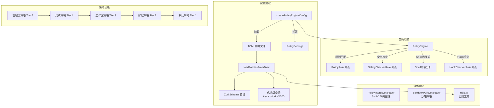

# policy (策略引擎模块)

## 概述

`policy/` 目录实现了 Gemini CLI 的工具调用权限控制系统。它基于多层级策略规则（默认 -> 扩展 -> 工作区 -> 用户 -> 管理员）对每一次工具调用进行决策（允许 / 拒绝 / 询问用户），同时集成了安全检查器、Shell 命令启发式分析、沙箱策略管理，以及策略文件完整性验证。

## 目录结构

```
policy/
├── index.ts                    # 模块导出入口
├── types.ts                    # 核心类型定义（PolicyDecision, PolicyRule, ApprovalMode 等）
├── policy-engine.ts            # 策略引擎核心（规则匹配与决策）
├── config.ts                   # 策略配置加载与构建
├── toml-loader.ts              # TOML 策略文件解析与验证
├── utils.ts                    # 正则工具（转义、ReDoS 检测、参数模式构建）
├── integrity.ts                # 策略文件完整性管理（SHA-256 哈希）
├── stable-stringify.ts         # 稳定 JSON 序列化（排序键）
├── sandboxPolicyManager.ts     # 沙箱策略管理器
└── *.test.ts                   # 对应的单元测试文件
```

## 架构图



## 核心组件

### PolicyEngine (policy-engine.ts)
- **职责**: 策略引擎核心，负责对工具调用进行权限决策
- **关键方法**:
  - `check()` - 对工具调用执行策略检查，返回 `{decision, rule}`
  - `addRule()` / `removeRulesForTool()` - 动态管理规则
  - `getExcludedTools()` - 获取被静态排除的工具集合
  - `setApprovalMode()` - 切换审批模式
- **决策逻辑**: 按优先级遍历规则，支持通配符（`*`、`mcp_server_*`）、MCP 工具名匹配、参数模式匹配、注解匹配
- **Shell 特殊处理**: 自动拆分复合命令，逐段检查；检测命令重定向并降级为 ASK_USER

### 类型定义 (types.ts)
- **PolicyDecision**: `ALLOW` / `DENY` / `ASK_USER`
- **ApprovalMode**: `DEFAULT` / `AUTO_EDIT` / `YOLO` / `PLAN`
- **PolicyRule**: 策略规则（toolName, argsPattern, decision, priority, modes, mcpName, subagent 等）
- **SafetyCheckerRule / HookCheckerRule**: 安全检查器规则
- **PolicyEngineConfig**: 引擎配置
- **PolicySettings**: 用户设置（MCP 排除/允许、工具排除/允许、策略路径等）

### 策略配置 (config.ts)
- **职责**: 从多个来源构建 PolicyEngineConfig
- **层级优先级**: Admin (Tier 5) > User (Tier 4) > Workspace (Tier 3) > Extension (Tier 2) > Default (Tier 1)
- **动态规则**: 处理 MCP 排除/允许、工具排除/允许、受信 MCP 服务器、"始终允许"等设置
- **策略更新器**: `createPolicyUpdater()` 监听消息总线，动态添加规则并持久化到 TOML 文件

### TOML 加载器 (toml-loader.ts)
- **职责**: 解析和验证 TOML 格式的策略文件
- **Zod Schema 验证**: 确保规则结构正确，优先级在 0-999 范围内
- **工具名验证**: 基于 Levenshtein 距离检测拼写错误并给出建议
- **Shell 便捷语法**: 支持 `commandPrefix` 和 `commandRegex` 字段

### 完整性管理 (integrity.ts)
- **职责**: 通过 SHA-256 哈希检测策略文件变更
- **状态**: MATCH（匹配）/ MISMATCH（不匹配）/ NEW（新文件）

### 沙箱策略 (sandboxPolicyManager.ts)
- **职责**: 管理沙箱模式下的文件系统和网络访问权限
- **模式**: plan（只读）/ default（只读，允许覆盖）/ accepting_edits（读写，批准工具列表）
- **权限**: 支持会话级和持久化权限审批

## 依赖关系

### 内部依赖
- `config/storage.ts` - 策略文件路径管理
- `utils/shell-utils.ts` - Shell 命令解析
- `utils/debugLogger.ts` - 调试日志
- `utils/errors.ts` - 错误处理
- `utils/events.ts` - 核心事件总线
- `utils/security.ts` - 目录安全检查
- `tools/tool-names.ts` - 工具名称常量与别名
- `tools/mcp-tool.ts` - MCP 工具名称处理
- `safety/checker-runner.ts` - 安全检查器运行器
- `safety/protocol.ts` - 安全检查协议
- `confirmation-bus/` - 确认消息总线
- `services/sandboxManager.ts` - 沙箱管理器

### 外部依赖
- `@iarna/toml` - TOML 解析与序列化
- `zod` - Schema 验证
- `fast-levenshtein` - 编辑距离计算
- `shell-quote` - Shell 命令解析

## 数据流

### 工具调用权限检查
1. `PolicyEngine.check()` 接收工具调用请求
2. 从工具注解或 FQN 名称中提取 MCP 服务器名
3. 按优先级遍历策略规则，检查匹配条件（工具名、参数模式、审批模式、MCP 名等）
4. 对 Shell 命令执行特殊处理（拆分子命令、重定向检测、危险命令检测）
5. 如果匹配到规则，应用对应的决策
6. 如果未匹配且处于 YOLO 模式，返回 ALLOW
7. 执行安全检查器（如果配置了 CheckerRunner）
8. 返回最终决策和匹配的规则
