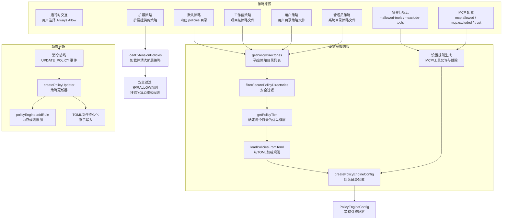

# config.ts

## 概述

`config.ts` 是策略引擎的**配置与管理模块**，负责策略规则的加载、层级化优先级计算、安全过滤、扩展策略清洗以及运行时策略动态更新与持久化。该模块是整个策略系统的"配置中枢"，将来自不同来源（默认策略、扩展策略、工作区策略、用户策略、管理员策略、命令行标志、MCP 配置、运行时交互）的规则整合到一个统一的 `PolicyEngineConfig` 对象中，供策略引擎消费。

**核心职责**：
1. **策略目录管理**：确定并排序策略文件的搜索目录。
2. **层级优先级系统**：实现 5 级策略优先级层（Default < Extension < Workspace < User < Admin），以及层内子优先级。
3. **安全过滤**：过滤不安全的系统策略目录，清洗扩展策略中的危险规则。
4. **配置创建**：从 TOML 文件和运行时设置组装完整的策略引擎配置。
5. **动态策略更新**：监听消息总线的策略更新事件，实时添加规则并异步持久化到 TOML 文件。

## 架构图（Mermaid）



```mermaid
flowchart LR
    subgraph 优先级层级（从低到高）
        direction LR
        T1["层1: 默认策略<br/>DEFAULT_POLICY_TIER = 1<br/>范围: 1.000 ~ 1.999"]
        T2["层2: 扩展策略<br/>EXTENSION_POLICY_TIER = 2<br/>范围: 2.000 ~ 2.999"]
        T3["层3: 工作区策略<br/>WORKSPACE_POLICY_TIER = 3<br/>范围: 3.000 ~ 3.999"]
        T4["层4: 用户策略<br/>USER_POLICY_TIER = 4<br/>范围: 4.000 ~ 4.999"]
        T5["层5: 管理员策略<br/>ADMIN_POLICY_TIER = 5<br/>范围: 5.000 ~ 5.999"]
        T1 --> T2 --> T3 --> T4 --> T5
    end
```

## 核心组件

### 1. 策略层级常量

| 常量 | 值 | 说明 |
|------|-----|------|
| `DEFAULT_POLICY_TIER` | `1` | 默认/内建策略层 |
| `EXTENSION_POLICY_TIER` | `2` | 扩展贡献的策略层 |
| `WORKSPACE_POLICY_TIER` | `3` | 工作区/项目级策略层 |
| `USER_POLICY_TIER` | `4` | 用户个人策略层 |
| `ADMIN_POLICY_TIER` | `5` | 管理员/系统级策略层 |

### 2. 设置级优先级常量

这些常量位于用户策略层（`USER_POLICY_TIER = 4`）内部，用于区分不同来源的设置规则：

| 常量 | 值 | 说明 |
|------|-----|------|
| `MCP_EXCLUDED_PRIORITY` | `4.9` | MCP 服务器排除列表（最高安全优先级） |
| `EXCLUDE_TOOLS_FLAG_PRIORITY` | `4.4` | `--exclude-tools` 命令行标志 |
| `ALLOWED_TOOLS_FLAG_PRIORITY` | `4.3` | `--allowed-tools` 命令行标志 |
| `TRUSTED_MCP_SERVER_PRIORITY` | `4.2` | 标记为 `trust=true` 的 MCP 服务器 |
| `ALLOWED_MCP_SERVER_PRIORITY` | `4.1` | `mcp.allowed` 中允许的 MCP 服务器 |
| `ALWAYS_ALLOW_PRIORITY` | `3 + offset` | 用户在 UI 中选择的"始终允许"规则（工作区层） |

### 3. `getPolicyDirectories(defaultPoliciesDir?, policyPaths?, workspacePoliciesDir?, adminPolicyPaths?)`

确定策略文件的搜索目录列表，按**优先级从高到低**排列返回。

**返回数组结构**：
1. 系统策略目录 + 管理员补充路径（Admin 层）
2. 用户指定路径或默认用户策略目录（User 层）
3. 工作区策略目录（Workspace 层）
4. 默认策略目录或内建核心策略目录（Default 层）

当 `policyPaths`（来自 `--policy` 标志）存在时，会**替换**默认用户策略目录。

### 4. `getPolicyTier(dir, context)`

根据目录路径确定其对应的策略层级（1-5）。通过路径规范化后与上下文中的已知目录进行匹配：

- 匹配系统策略目录或管理员路径集合 -> `ADMIN_POLICY_TIER (5)`
- 匹配用户策略目录 -> `USER_POLICY_TIER (4)`
- 匹配工作区策略目录 -> `WORKSPACE_POLICY_TIER (3)`
- 匹配默认策略目录 -> `DEFAULT_POLICY_TIER (1)`
- 未匹配到任何已知目录 -> 降级为 `DEFAULT_POLICY_TIER (1)`

### 5. `filterSecurePolicyDirectories(dirs, systemPoliciesDir)` (私有)

异步过滤不安全的策略目录。目前仅对**系统策略目录**执行安全检查（通过 `isDirectorySecure`），如果目录权限不安全则跳过并发出警告。补充的管理员策略路径不受此检查限制（因为它们由用户/管理员显式提供）。

### 6. `loadExtensionPolicies(extensionName, policyDir)`

加载扩展贡献的策略，并进行**安全清洗**：

- **移除 ALLOW 规则**：扩展不允许自动批准工具调用（防止恶意扩展绕过审批）。
- **移除 YOLO 模式规则**：扩展不允许贡献 YOLO（全自动批准）模式下的规则。
- **来源标记**：将规则来源从 `"Extension: file.toml"` 重写为 `"Extension (name): file.toml"`，避免不同扩展之间的来源冲突。

### 7. `createPolicyEngineConfig(settings, approvalMode, defaultPoliciesDir?, interactive?)`

核心配置创建函数，执行以下步骤：

1. **管理员策略冲突检测**：如果系统策略目录已有 `.toml` 文件，忽略 `--admin-policy` 标志。
2. **目录收集**：调用 `getPolicyDirectories` 获取搜索目录。
3. **安全过滤**：调用 `filterSecurePolicyDirectories` 移除不安全目录。
4. **TOML 加载**：调用 `loadPoliciesFromToml` 从文件加载规则和安全检查器。
5. **设置规则生成**：根据 `settings` 中的 MCP 配置、工具允许/排除列表生成动态规则。
6. **错误报告**：将 TOML 加载错误通过 `coreEvents` 反馈到 UI。
7. **返回配置**：组装 `PolicyEngineConfig` 对象，包含所有规则、检查器、默认决策和审批模式。

**默认决策逻辑**：
- 交互模式（`interactive = true`）：默认 `ASK_USER`（提示用户决定）。
- 非交互模式（`interactive = false`）：默认 `DENY`（拒绝）。

### 8. `createPolicyUpdater(policyEngine, messageBus, storage)`

创建策略动态更新器，监听 `MessageBusType.UPDATE_POLICY` 事件，处理用户在交互 UI 中的"始终允许"操作：

**内存规则添加**：
- 根据 `persistScope`（`'user'` 或 `'workspace'`）确定层级。
- 对于带 `commandPrefix` 的规则（Shell 工具），转换为正则模式。
- 对于需要缩小范围的敏感工具（`TOOLS_REQUIRING_NARROWING`），必须提供 `commandPrefix` 或 `argsPattern`。
- 验证 `argsPattern` 的正则表达式安全性（防 ReDoS 攻击）。

**持久化机制**：
- 使用**顺序队列**（`persistenceQueue`）避免并发写入导致的更新丢失。
- 读取现有 TOML 文件 -> 追加新规则 -> 序列化 -> **原子写入**（先写临时文件再 `rename`）。
- 临时文件使用随机后缀（`crypto.randomBytes`）避免并发进程间的文件冲突。
- 使用 `'wx'` 模式（独占创建）打开临时文件，增加安全性。

### 9. 辅助函数

| 函数 | 说明 |
|------|------|
| `formatPolicyError(error)` | 格式化策略文件加载错误为可读字符串 |
| `emitWarningOnce(message)` | 去重发出警告反馈（同进程中相同消息只发一次） |
| `clearEmittedPolicyWarnings()` | 清除已发出警告的缓存（主要用于测试） |
| `getAlwaysAllowPriorityFraction()` | 获取"始终允许"优先级的小数部分（缩放到 1000） |

## 依赖关系

### 内部依赖

| 模块路径 | 导入内容 | 用途 |
|----------|----------|------|
| `../config/storage.js` | `Storage` | 获取系统策略目录、用户策略目录、工作区策略路径等存储路径 |
| `./types.js` | `ApprovalMode`, `PolicyEngineConfig`, `PolicyDecision`, `PolicyRule`, `PolicySettings`, `SafetyCheckerRule`, `ALWAYS_ALLOW_PRIORITY_OFFSET` | 策略系统的核心类型和常量 |
| `./policy-engine.js` | `PolicyEngine`（类型） | 策略引擎类型，用于 `createPolicyUpdater` 参数 |
| `./toml-loader.js` | `loadPoliciesFromToml`, `PolicyFileError` | 从 TOML 文件加载策略规则 |
| `./utils.js` | `buildArgsPatterns`, `isSafeRegExp` | 构建参数匹配模式，验证正则表达式安全性 |
| `../confirmation-bus/types.js` | `MessageBusType`, `UpdatePolicy` | 消息总线事件类型 |
| `../confirmation-bus/message-bus.js` | `MessageBus`（类型） | 消息总线类型 |
| `../utils/events.js` | `coreEvents` | 核心事件发射器，用于反馈警告和错误 |
| `../utils/debugLogger.js` | `debugLogger` | 调试日志记录器 |
| `../utils/shell-utils.js` | `SHELL_TOOL_NAMES` | Shell 工具名称列表，用于别名规范化 |
| `../tools/tool-names.js` | `SHELL_TOOL_NAME`, `TOOLS_REQUIRING_NARROWING` | 标准 Shell 工具名称，需要参数缩小的敏感工具集 |
| `../utils/errors.js` | `isNodeError` | Node.js 错误类型判断 |
| `../tools/mcp-tool.js` | `MCP_TOOL_PREFIX` | MCP 工具名称前缀 |
| `../utils/security.js` | `isDirectorySecure` | 目录安全性检查 |

### 外部依赖

| 包名 | 导入内容 | 用途 |
|------|----------|------|
| `node:fs/promises` | `fs` | 异步文件操作（读取、写入、重命名、创建目录） |
| `node:path` | `path` | 路径拼接与规范化 |
| `node:crypto` | `crypto` | 生成随机字节（用于临时文件后缀） |
| `node:url` | `fileURLToPath` | 将 `import.meta.url` 转换为文件路径 |
| `@iarna/toml` | `toml` | TOML 文件解析与序列化 |

## 关键实现细节

1. **五级优先级层系统**：策略规则的优先级采用"整数层 + 小数子优先级"的编码方式。例如，默认层优先级 100 的规则实际优先级为 `1.100`（`1 + 100/1000`），用户层相同优先级的规则为 `4.100`。这确保了**高层策略始终覆盖低层策略**，同时层内规则仍可按子优先级排序。

2. **管理员策略冲突保护**：当系统策略目录（如 `/etc/gemini/policies/`）中已包含 `.toml` 文件时，`--admin-policy` 命令行标志会被忽略。这防止了通过标志注入来绕过已建立的集中式系统策略。

3. **扩展策略安全沙箱**：扩展贡献的策略经过严格清洗，不允许包含 `ALLOW` 决策和 `YOLO` 模式规则。这是一个关键的安全边界——扩展只能**建议**用户审批（`ASK_USER`）或拒绝（`DENY`）工具调用，不能自动批准。

4. **Shell 工具别名规范化**：系统中可能存在多个 Shell 工具名称别名（如 `run_command`、`shell` 等），配置模块会将所有别名统一规范化为标准的 `SHELL_TOOL_NAME`，避免规则匹配失败。

5. **正则表达式安全验证**：用户提供的 `argsPattern` 在创建 `RegExp` 对象之前会通过 `isSafeRegExp` 验证，防止**正则表达式拒绝服务攻击（ReDoS）**。从 `buildArgsPatterns`（基于 `escapeRegex`）生成的模式则被认为是安全的，跳过验证。

6. **原子文件写入**：策略持久化使用"写临时文件 + rename"的原子写入模式，避免在写入中途断电或崩溃时损坏策略文件。临时文件使用 `crypto.randomBytes(8)` 生成的 16 位十六进制后缀，并以 `'wx'`（独占创建）模式打开，防止并发进程间的文件覆盖。

7. **顺序持久化队列**：`createPolicyUpdater` 使用 `Promise` 链式队列（`persistenceQueue`）确保持久化操作按序执行。即使多个 `UPDATE_POLICY` 事件快速到来，每个持久化操作都会等待前一个完成后再开始，避免"先读后写"的并发竞态条件导致更新丢失。

8. **敏感工具缩小范围保护**：属于 `TOOLS_REQUIRING_NARROWING` 集合的工具（如 Shell 命令工具）不允许创建不带参数模式的"始终允许"规则。这强制要求用户必须指定具体的命令前缀或参数模式，而非盲目允许所有 Shell 命令。

9. **去重警告机制**：`emitWarningOnce` 使用 `Set` 缓存已发出的警告消息，确保同一进程中相同内容的警告只发出一次，避免在策略重新加载时产生重复的用户提示。
