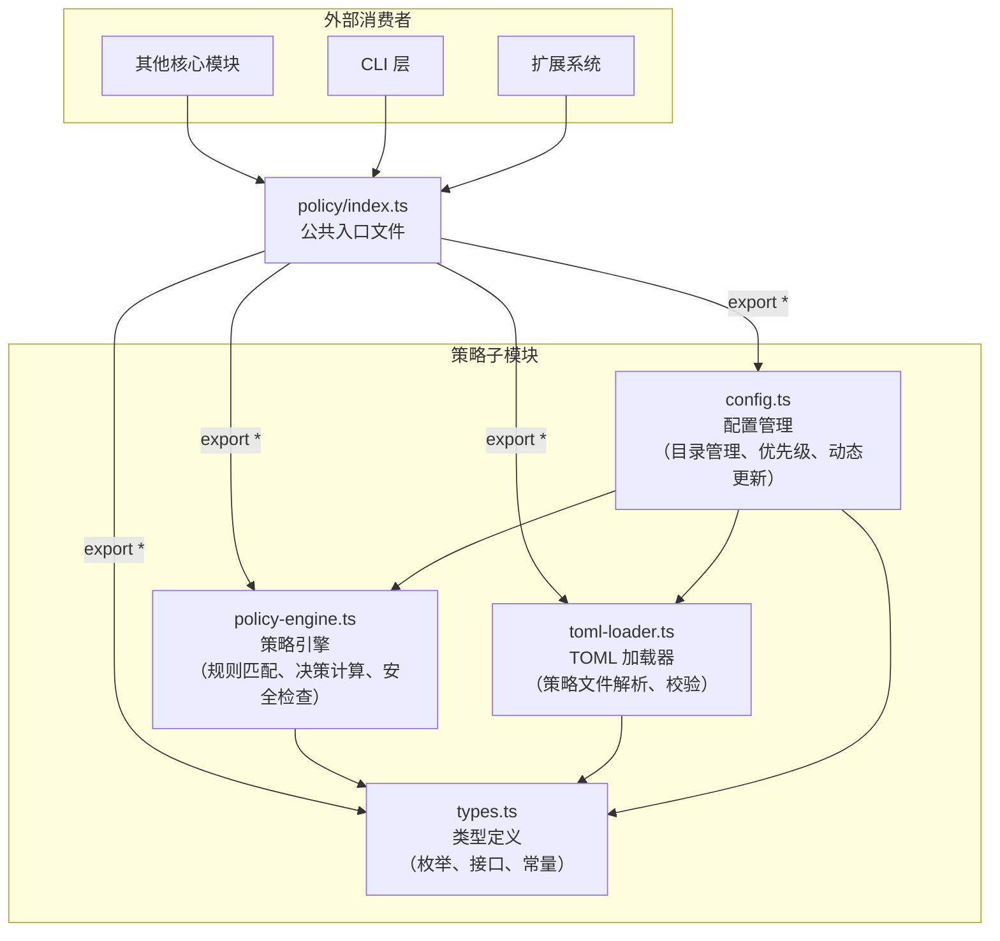
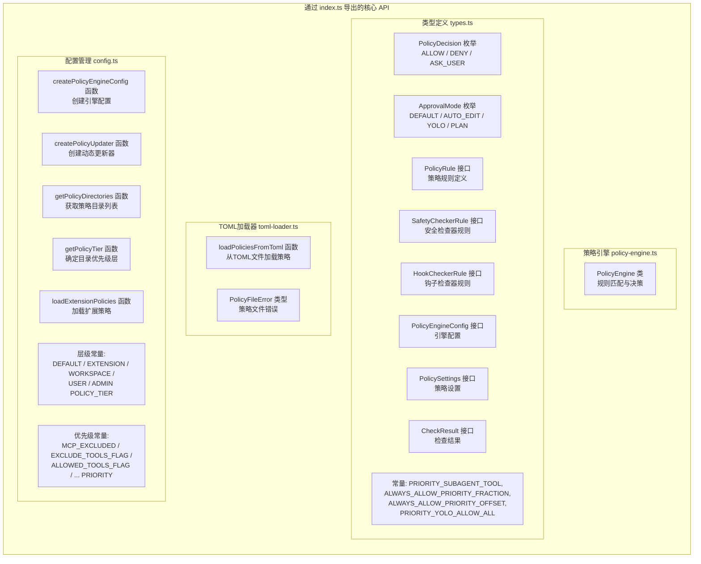

# index.ts

## 概述

`index.ts` 是策略（Policy）模块的**公共入口文件**（barrel file），通过 `export *` 语法将策略子系统的所有公共 API 重新导出为一个统一的模块接口。外部消费者只需从 `policy` 目录导入，即可访问策略引擎、类型定义、TOML 加载器和配置管理的全部导出内容，无需了解内部文件结构。

该文件聚合了 4 个子模块的导出：
- **`policy-engine.js`**：策略引擎核心实现，负责规则匹配、决策计算和安全检查执行。
- **`types.js`**：策略系统的全部类型定义、枚举和常量。
- **`toml-loader.js`**：TOML 策略文件的解析和加载。
- **`config.js`**：策略引擎配置的创建、目录管理和动态更新。

## 架构图（Mermaid）

## 核心组件

### 重新导出的子模块

#### 1. `policy-engine.js` -- 策略引擎

策略系统的核心运行时组件，包含 `PolicyEngine` 类。主要职责：

| 导出内容 | 类型 | 说明 |
|----------|------|------|
| `PolicyEngine` | 类 | 策略引擎主类，负责根据配置的规则列表对工具调用进行匹配和决策。支持通配符匹配、参数模式匹配、MCP 服务器匹配、审批模式过滤、安全检查器执行等 |

核心功能包括：
- **规则匹配**：按优先级从高到低遍历规则，找到第一个匹配的规则并返回决策。
- **Shell 命令解析**：对 Shell 工具调用进行命令解析、重定向检测。
- **安全检查器执行**：在规则匹配后运行配置的外部或进程内安全检查器。
- **动态规则管理**：支持运行时添加规则（`addRule`）。

#### 2. `types.js` -- 类型定义

策略系统的全部类型契约，是所有其他策略模块的基础。

| 导出内容 | 类型 | 说明 |
|----------|------|------|
| `PolicyDecision` | 枚举 | 策略决策：`ALLOW`（允许）、`DENY`（拒绝）、`ASK_USER`（询问用户） |
| `ApprovalMode` | 枚举 | 审批模式：`DEFAULT`（默认）、`AUTO_EDIT`（自动编辑）、`YOLO`（全自动）、`PLAN`（计划模式） |
| `PolicyRule` | 接口 | 策略规则定义，包含工具名、参数模式、决策、优先级、模式过滤等 |
| `SafetyCheckerRule` | 接口 | 安全检查器规则，指定对特定工具调用执行的安全检查 |
| `HookCheckerRule` | 接口 | 钩子检查器规则，指定对钩子执行的安全检查 |
| `PolicyEngineConfig` | 接口 | 策略引擎的完整配置对象 |
| `PolicySettings` | 接口 | 策略设置输入，来自用户配置和命令行参数 |
| `CheckResult` | 接口 | 策略检查结果，包含决策和匹配的规则 |
| `HookSource` | 类型 | 钩子来源：`'project'`、`'user'`、`'system'`、`'extension'` |
| `SafetyCheckerConfig` | 联合类型 | 安全检查器配置（外部或进程内） |
| `AllowedPathConfig` | 接口 | 路径检查器配置 |
| `InProcessCheckerType` | 枚举 | 进程内检查器类型 |
| `HookExecutionContext` | 接口 | 钩子执行上下文 |
| `getHookSource` | 函数 | 安全提取和验证钩子来源 |
| `PRIORITY_SUBAGENT_TOOL` | 常量 | 子代理工具优先级（`1.05`） |
| `ALWAYS_ALLOW_PRIORITY_FRACTION` | 常量 | "始终允许"优先级分数（`950`） |
| `ALWAYS_ALLOW_PRIORITY_OFFSET` | 常量 | "始终允许"优先级偏移量（`0.95`） |
| `PRIORITY_YOLO_ALLOW_ALL` | 常量 | YOLO 模式全允许优先级（`998`） |

#### 3. `toml-loader.js` -- TOML 加载器

负责从文件系统读取 TOML 格式的策略文件并解析为内存中的规则对象。

| 导出内容 | 类型 | 说明 |
|----------|------|------|
| `loadPoliciesFromToml` | 函数 | 从指定目录列表中加载所有 `.toml` 策略文件，解析为 `PolicyRule[]` 和 `SafetyCheckerRule[]` |
| `PolicyFileError` | 类型 | 策略文件加载错误信息，包含文件名、错误消息、严重级别、层级等 |

核心功能包括：
- **Zod Schema 校验**：使用 Zod 对 TOML 解析结果进行结构校验。
- **工具名拼写检查**：基于 Levenshtein 距离检测工具名可能的拼写错误并发出警告。
- **命令前缀/正则转换**：将 `commandPrefix` 和 `commandRegex` 转换为 `argsPattern` 正则表达式。
- **优先级层级转换**：将 TOML 中的原始优先级（0-999）转换为带层级的实际优先级（如 `tier + priority/1000`）。

#### 4. `config.js` -- 配置管理

策略引擎的配置创建和动态更新逻辑。

| 导出内容 | 类型 | 说明 |
|----------|------|------|
| `createPolicyEngineConfig` | 函数 | 从设置和策略文件创建完整的 `PolicyEngineConfig` |
| `createPolicyUpdater` | 函数 | 创建消息总线监听器，处理运行时策略更新和持久化 |
| `getPolicyDirectories` | 函数 | 确定策略文件搜索目录（按优先级排序） |
| `getPolicyTier` | 函数 | 根据目录路径确定其策略层级（1-5） |
| `loadExtensionPolicies` | 函数 | 加载并安全清洗扩展贡献的策略 |
| `formatPolicyError` | 函数 | 格式化策略文件错误为可读字符串 |
| `clearEmittedPolicyWarnings` | 函数 | 清除警告去重缓存（测试用） |
| `getAlwaysAllowPriorityFraction` | 函数 | 获取"始终允许"优先级分数值 |
| `DEFAULT_CORE_POLICIES_DIR` | 常量 | 默认内建策略目录路径 |
| `DEFAULT_POLICY_TIER` | 常量 | 默认策略层（`1`） |
| `EXTENSION_POLICY_TIER` | 常量 | 扩展策略层（`2`） |
| `WORKSPACE_POLICY_TIER` | 常量 | 工作区策略层（`3`） |
| `USER_POLICY_TIER` | 常量 | 用户策略层（`4`） |
| `ADMIN_POLICY_TIER` | 常量 | 管理员策略层（`5`） |
| 各优先级常量 | 常量 | `MCP_EXCLUDED_PRIORITY`、`EXCLUDE_TOOLS_FLAG_PRIORITY` 等 |

## 依赖关系

### 内部依赖

`index.ts` 本身仅依赖于其聚合的 4 个子模块：

| 模块路径 | 导出方式 | 说明 |
|----------|----------|------|
| `./policy-engine.js` | `export *` | 策略引擎类及相关工具函数 |
| `./types.js` | `export *` | 全部类型定义、枚举和常量 |
| `./toml-loader.js` | `export *` | TOML 策略文件加载器 |
| `./config.js` | `export *` | 策略配置创建和管理 |

### 外部依赖

`index.ts` 本身无直接外部依赖。通过聚合的子模块间接依赖以下外部包：

| 包名 | 被哪个子模块使用 | 用途 |
|------|-------------------|------|
| `@google/genai` | `policy-engine.ts` | `FunctionCall` 类型，用于工具调用解析 |
| `@iarna/toml` | `toml-loader.ts`, `config.ts` | TOML 文件解析与序列化 |
| `zod` | `toml-loader.ts` | TOML 结构校验（Schema 验证） |
| `fast-levenshtein` | `toml-loader.ts` | 工具名拼写检查（编辑距离计算） |
| `shell-quote` | `policy-engine.ts` | Shell 命令字符串解析 |
| `node:fs/promises` | `toml-loader.ts`, `config.ts` | 异步文件读写 |
| `node:path` | `toml-loader.ts`, `config.ts` | 路径操作 |
| `node:crypto` | `config.ts` | 随机字节生成（原子写入） |

## 关键实现细节

1. **Barrel 导出模式**：`index.ts` 采用 TypeScript/JavaScript 中常见的"barrel"（桶）模式，使用 `export * from` 语法将多个子模块的导出聚合到一个入口点。这为消费者提供了简洁的导入路径（`import { PolicyEngine, PolicyDecision } from './policy'`），而不需要深入子模块（`import { PolicyEngine } from './policy/policy-engine'`）。

2. **命名冲突风险**：由于使用了 `export *`（非选择性导出），如果两个子模块导出了同名的标识符，TypeScript 会在编译时产生错误。目前 4 个子模块的导出命名空间是互不重叠的，但新增导出时需注意避免命名冲突。

3. **策略系统整体架构**：通过此入口文件可以看出策略系统的清晰分层：
   - **类型层**（`types.ts`）：定义契约，不包含逻辑。
   - **加载层**（`toml-loader.ts`）：负责数据的输入，将 TOML 文件转换为内存对象。
   - **配置层**（`config.ts`）：负责组装，将多来源的规则整合为统一配置。
   - **引擎层**（`policy-engine.ts`）：负责执行，根据配置对工具调用做出决策。

4. **模块加载顺序**：`export *` 语句的排列顺序不影响功能（JavaScript 模块系统会处理循环依赖），但当前的排列顺序（engine -> types -> toml-loader -> config）大致反映了依赖的层次关系。

5. **树摇（Tree Shaking）兼容性**：由于使用了 `export *`，打包工具（如 esbuild、webpack）能够对未使用的导出进行树摇优化。消费者只引用 `PolicyEngine` 类时，`toml-loader.ts` 和 `config.ts` 中未被引用的代码可以被排除。不过实际效果取决于打包工具的实现和模块间的副作用标记。
