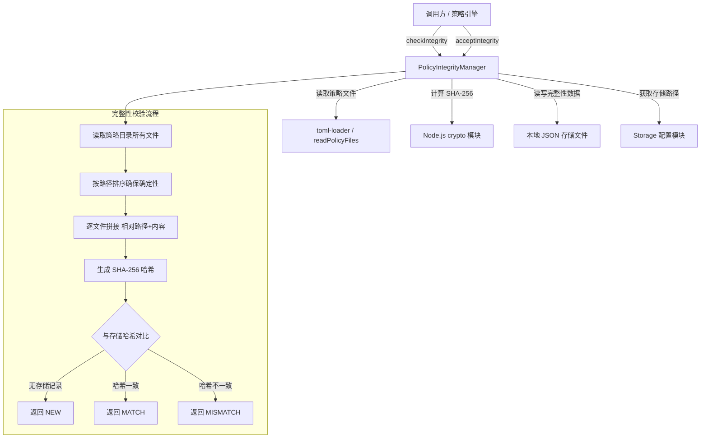

# integrity.ts

## 概述

`integrity.ts` 是策略（Policy）完整性管理模块，负责对策略文件目录进行 **SHA-256 哈希计算**、**存储**和**校验**，确保策略文件在两次会话之间未被篡改或意外修改。它是 Gemini CLI 安全模型的核心防线之一——当策略文件发生变更时，系统能够及时感知并要求用户重新确认。

该文件导出了一个枚举 `IntegrityStatus`、一个接口 `IntegrityResult`，以及核心类 `PolicyIntegrityManager`。

## 架构图（Mermaid）



## 核心组件

### 1. 枚举 `IntegrityStatus`

定义了三种完整性状态：

| 枚举值 | 含义 |
|--------|------|
| `MATCH` | 当前策略文件的哈希与已存储的哈希一致，策略未被修改 |
| `MISMATCH` | 当前策略文件的哈希与已存储的哈希不一致，策略已发生变更 |
| `NEW` | 没有找到该策略作用域的存储记录，属于首次检查 |

### 2. 接口 `IntegrityResult`

```typescript
export interface IntegrityResult {
  status: IntegrityStatus; // 完整性状态
  hash: string;            // 当前计算出的 SHA-256 哈希值（十六进制）
  fileCount: number;       // 参与哈希计算的策略文件数量
}
```

### 3. 内部接口 `StoredIntegrityData`

```typescript
interface StoredIntegrityData {
  [key: string]: string; // key = "scope:identifier", value = SHA-256 哈希
}
```

以 JSON 对象形式持久化到本地文件，键为 `scope:identifier` 格式的复合键，值为对应的哈希字符串。

### 4. 类 `PolicyIntegrityManager`

这是本模块的核心类，提供以下方法：

#### `checkIntegrity(scope, identifier, policyDir): Promise<IntegrityResult>`

**公开方法**。检查指定策略目录的完整性：

1. 调用 `calculateIntegrityHash` 计算当前策略目录的哈希和文件数。
2. 从本地存储加载已保存的完整性数据。
3. 根据 `scope:identifier` 复合键查找已存储的哈希。
4. 对比结果返回 `NEW`、`MATCH` 或 `MISMATCH`。

参数说明：
- `scope`：策略作用域，如 `'project'`、`'user'`。
- `identifier`：作用域内的唯一标识符，如项目路径。
- `policyDir`：策略文件所在的目录路径。

#### `acceptIntegrity(scope, identifier, hash): Promise<void>`

**公开方法**。接受（信任）当前策略的哈希值并持久化：

1. 加载已有完整性数据。
2. 以 `scope:identifier` 为键写入新哈希。
3. 保存到本地存储。

典型场景：用户审核策略变更后，调用此方法将新哈希标记为"已接受"。

#### `calculateIntegrityHash(policyDir): Promise<{hash, fileCount}>` (私有静态方法)

核心哈希计算逻辑：

1. 调用 `readPolicyFiles(policyDir)` 读取目录下所有策略文件。
2. 按文件路径字典序排序（确保不同环境下哈希结果一致）。
3. 创建 SHA-256 哈希实例。
4. 逐文件将 **相对路径** + `\0` 分隔符 + **文件内容** + `\0` 分隔符 更新到哈希中。
5. 返回十六进制摘要和文件数。

设计要点：
- 包含相对路径可检测文件重命名。
- 使用 `\0` 作为分隔符防止路径/内容拼接歧义。
- 排序保证确定性，避免文件系统遍历顺序差异导致哈希不同。

#### `getIntegrityKey(scope, identifier): string` (私有方法)

简单地将 scope 和 identifier 用冒号拼接为复合键：`"scope:identifier"`。

#### `loadIntegrityData(): Promise<StoredIntegrityData>` (私有方法)

从本地文件加载完整性数据：

1. 通过 `Storage.getPolicyIntegrityStoragePath()` 获取存储文件路径。
2. 读取并 JSON 解析文件内容。
3. 进行类型校验：必须是对象且所有值都是字符串。
4. 如果文件不存在（`ENOENT`），返回空对象。
5. 如果格式无效或其他错误，记录警告/错误日志后返回空对象。

#### `saveIntegrityData(data): Promise<void>` (私有方法)

将完整性数据保存到本地文件：

1. 确保目标目录存在（`mkdir -p` 语义）。
2. 以格式化 JSON（2 空格缩进）写入文件。
3. 失败时记录错误并向上抛出异常。

## 依赖关系

### 内部依赖

| 模块 | 导入内容 | 用途 |
|------|---------|------|
| `../config/storage.js` | `Storage` | 获取策略完整性数据的本地存储文件路径 |
| `./toml-loader.js` | `readPolicyFiles` | 读取策略目录下的所有策略文件（路径+内容） |
| `../utils/debugLogger.js` | `debugLogger` | 输出调试级别的错误/警告日志 |
| `../utils/errors.js` | `isNodeError` | 判断错误对象是否为 Node.js 原生错误（用于检测 ENOENT） |

### 外部依赖

| 模块 | 用途 |
|------|------|
| `node:crypto` | SHA-256 哈希计算 |
| `node:fs/promises` | 异步文件读写操作 |
| `node:path` | 路径处理（relative、dirname） |

## 关键实现细节

1. **确定性哈希**：文件按路径排序后再计算哈希，确保相同内容在不同操作系统和文件系统上产生相同的哈希值。

2. **路径纳入哈希**：不仅哈希文件内容，还将相对路径纳入计算。这意味着即使文件内容不变，仅重命名文件也会被检测到。

3. **分隔符防碰撞**：使用 `\0`（空字符）作为路径和内容之间的分隔符。因为 `\0` 在正常的文件路径和 TOML 内容中不会出现，可以有效防止不同文件的路径/内容拼接后产生相同的哈希。

4. **优雅降级**：`loadIntegrityData` 在文件不存在或格式无效时返回空对象而非抛出异常，避免首次运行或数据损坏时崩溃。但 `saveIntegrityData` 和 `calculateIntegrityHash` 在失败时会抛出异常，因为这些操作的失败意味着安全保障无法建立。

5. **存储格式**：完整性数据以 JSON 文件存储，键为 `scope:identifier` 的复合字符串，值为 SHA-256 十六进制哈希。这种扁平结构简单高效，且支持多作用域（如项目级、用户级）共存。

6. **类型安全**：`loadIntegrityData` 对 JSON 解析结果进行运行时类型校验（`typeof parsed === 'object'` 且所有值为 `string`），防止被注入非预期的数据类型。
