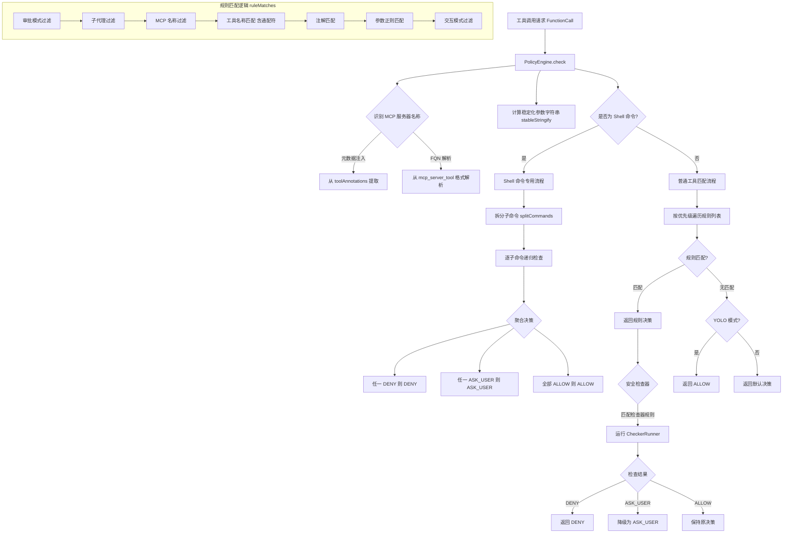

# policy-engine.ts

## 概述

`policy-engine.ts` 是 Gemini CLI 的**策略决策引擎**，是整个权限控制系统的核心。它接收工具调用（`FunctionCall`），依据配置的策略规则（`PolicyRule`）、安全检查器（`SafetyCheckerRule`）和钩子检查器（`HookCheckerRule`），做出 **允许（ALLOW）**、**拒绝（DENY）** 或 **询问用户（ASK_USER）** 的决策。

该引擎还包含对 Shell 命令的特殊处理逻辑，包括命令拆分、重定向检测、危险命令识别等，是安全沙箱策略的执行层。

## 架构图（Mermaid）



## 核心组件

### 1. 辅助函数

#### `isWildcardPattern(name: string): boolean`

判断工具名是否包含通配符 `*`。

#### `matchesWildcard(pattern, toolName, serverName): boolean`

通配符匹配逻辑，支持以下模式：
- `*`：匹配所有工具
- `mcp_*`：匹配所有 MCP 工具（需有 serverName）
- `mcp_serverName_*`：匹配指定 MCP 服务器的所有工具

#### `ruleMatches(rule, toolCall, stringifiedArgs, serverName, currentApprovalMode, nonInteractive, toolAnnotations?, subagent?): boolean`

核心规则匹配函数。依次检查以下条件（全部通过才返回 `true`）：

| 序号 | 检查项 | 说明 |
|------|--------|------|
| 1 | `modes` | 规则是否适用于当前审批模式 |
| 2 | `subagent` | 是否匹配指定子代理 |
| 3 | `mcpName` | MCP 服务器名称是否匹配（支持 `*` 通配符） |
| 4 | `toolName` | 工具名称匹配（支持通配符、MCP 短名/全限定名互转） |
| 5 | `toolAnnotations` | 工具注解键值是否全部匹配 |
| 6 | `argsPattern` | 参数的稳定化 JSON 字符串是否匹配正则表达式 |
| 7 | `interactive` | 交互/非交互模式是否匹配 |

### 2. 类 `PolicyEngine`

#### 构造函数

```typescript
constructor(config: PolicyEngineConfig = {}, checkerRunner?: CheckerRunner)
```

- 接收 `PolicyEngineConfig` 配置对象和可选的 `CheckerRunner`。
- 将 `rules`、`checkers`、`hookCheckers` 按 `priority` **降序排列**（高优先级在前）。
- 校验规则合法性：`toolName` 必填（可用 `*`）、`mcpName` 不能为空字符串、`subagent` 不能为空字符串。
- 设置默认决策：交互模式下默认 `ASK_USER`，非交互模式下默认 `DENY`。
- 初始化沙箱管理器（无配置时使用 `NoopSandboxManager`）。

#### 核心方法 `check(toolCall, serverName, toolAnnotations?, subagent?): Promise<CheckResult>`

**主决策入口**，执行以下流程：

1. **MCP 服务器名称解析**：
   - 优先从 `toolAnnotations._serverName` 元数据注入获取
   - 回退到从 `mcp_{server}_{tool}` 全限定名解析

2. **参数稳定化**：仅当存在带 `argsPattern` 的规则时，调用 `stableStringify` 一次性计算

3. **Shell 命令识别**：检查工具名是否在 `SHELL_TOOL_NAMES` 列表中

4. **规则遍历**：按优先级降序遍历规则列表
   - 支持工具别名（`getToolAliases`）
   - 匹配到规则后，若为 Shell 命令则走专用流程
   - 非 Shell 命令直接返回规则决策

5. **默认决策**：无规则匹配时
   - YOLO 模式返回 `ALLOW`
   - 其他模式返回默认决策（Shell 命令还会经过启发式检查）

6. **安全检查器**：若决策非 `DENY` 且存在 `CheckerRunner`
   - 遍历匹配的安全检查器规则
   - 运行检查器，`DENY` 结果直接拒绝，`ASK_USER` 降级决策
   - 检查器抛异常也视为 `DENY`

#### Shell 命令处理方法

##### `applyShellHeuristics(command, decision): Promise<PolicyDecision>`

对 Shell 命令应用启发式安全检查：
- 危险命令 → 强制 `ASK_USER`
- 已知安全命令 + 当前为 `ASK_USER` → 升级为 `ALLOW`

##### `shouldDowngradeForRedirection(command, allowRedirection?): boolean`

判断是否因命令包含重定向而需降级决策：
- 如果规则明确允许重定向则不降级
- 如果沙箱已启用且处于 `AUTO_EDIT` 或 `YOLO` 模式则不降级
- 其他情况，含重定向的命令需要降级

##### `checkShellCommand(toolName, command, ruleDecision, ...): Promise<CheckResult>`

Shell 命令的完整检查流程：
1. 使用 `splitCommands` 拆分复合命令（管道、链式等）
2. 解析失败且非 DENY/YOLO 时返回默认决策
3. 逐子命令**递归调用** `check` 方法
4. 聚合子命令决策：任一 DENY 则全部 DENY，任一 ASK_USER 则全部 ASK_USER
5. 检查子命令中的重定向，必要时降级

#### 规则管理方法

| 方法 | 功能 |
|------|------|
| `addRule(rule)` | 添加规则并重新排序 |
| `addChecker(checker)` | 添加安全检查器并重新排序 |
| `removeRulesByTier(tier)` | 按优先级层级移除规则 |
| `removeRulesBySource(source)` | 按来源移除规则 |
| `removeCheckersByTier(tier)` | 按层级移除检查器 |
| `removeCheckersBySource(source)` | 按来源移除检查器 |
| `removeRulesForTool(toolName, source?)` | 移除特定工具的规则 |
| `getRules()` | 获取所有规则（只读） |
| `hasRuleForTool(toolName, ignoreDynamic?)` | 检查是否已有工具的规则 |
| `getCheckers()` | 获取所有安全检查器（只读） |
| `addHookChecker(checker)` | 添加钩子检查器 |
| `getHookCheckers()` | 获取所有钩子检查器 |

#### 审批模式管理

- `setApprovalMode(mode)` / `getApprovalMode()`：动态切换和查询审批模式

#### `getExcludedTools(toolMetadata?, allToolNames?): Set<string>`

**静态排除分析**：在不知道运行时参数的前提下，分析哪些工具会被无条件拒绝。

逻辑：
1. 遍历所有工具名
2. 对每个工具，按优先级遍历规则
3. 忽略带 `argsPattern` 的 DENY 规则（它们是条件性的，不能无条件排除）
4. 带 `argsPattern` 的非 DENY 规则意味着可能被允许，直接中断并标记为不排除
5. 无条件规则直接取其决策
6. 无匹配规则时使用默认决策

#### `isAlwaysAllowRule(rule): boolean`（私有）

通过检查优先级的小数部分是否等于 `ALWAYS_ALLOW_PRIORITY_FRACTION`（0.001 * 1000 = 1），判断规则是否为"始终允许"类型。在 `disableAlwaysAllow` 开启时跳过此类规则。

## 依赖关系

### 内部依赖

| 模块 | 导入内容 | 用途 |
|------|---------|------|
| `../utils/shell-utils.js` | `SHELL_TOOL_NAMES`, `initializeShellParsers`, `splitCommands`, `hasRedirection`, `extractStringFromParseEntry` | Shell 命令解析与安全检查 |
| `./types.js` | `PolicyDecision`, `PolicyEngineConfig`, `PolicyRule`, `SafetyCheckerRule`, `HookCheckerRule`, `ApprovalMode`, `CheckResult`, `ALWAYS_ALLOW_PRIORITY_FRACTION` | 策略类型定义 |
| `./stable-stringify.js` | `stableStringify` | 参数对象的确定性 JSON 序列化 |
| `../utils/debugLogger.js` | `debugLogger` | 调试日志 |
| `../safety/checker-runner.js` | `CheckerRunner` (类型) | 安全检查器运行时 |
| `../safety/protocol.js` | `SafetyCheckDecision` | 安全检查决策枚举 |
| `../tools/tool-names.js` | `getToolAliases` | 获取工具的别名列表 |
| `../tools/mcp-tool.js` | `MCP_TOOL_PREFIX`, `isMcpToolAnnotation`, `parseMcpToolName`, `formatMcpToolName`, `isMcpToolName` | MCP 工具名称解析与格式化 |
| `../services/sandboxManager.js` | `SandboxManager`, `NoopSandboxManager` | 沙箱管理器接口 |

### 外部依赖

| 模块 | 用途 |
|------|------|
| `@google/genai` | `FunctionCall` 类型定义 |
| `shell-quote` | Shell 命令解析（`parse` 函数） |

## 关键实现细节

1. **优先级排序**：规则在构造时按 `priority` 降序排列，匹配时取第一个匹配的规则。这意味着高优先级规则可以覆盖低优先级规则的决策。

2. **Shell 命令递归拆分**：复合 Shell 命令（如 `cmd1 && cmd2 | cmd3`）会被拆分成子命令，每个子命令递归经过完整的 `check` 流程。聚合策略为"最严格胜出"：任一子命令 DENY 则整体 DENY。

3. **重定向安全降级**：含重定向（`>`, `>>`, `<` 等）的命令默认会从 ALLOW 降级到 ASK_USER，除非规则明确 `allowRedirection: true`，或沙箱已启用且处于自动模式。

4. **MCP 工具双重识别**：先尝试从运行时注入的元数据获取服务器名，再回退到从全限定名格式解析。支持短名（`toolName` + `mcpName`）和全限定名（`mcp_server_tool`）的互转匹配。

5. **工具别名兼容**：通过 `getToolAliases` 获取工具的历史别名，确保策略规则在工具重命名后仍然有效。

6. **Always-Allow 规则识别**：通过优先级小数部分的特殊编码（`ALWAYS_ALLOW_PRIORITY_FRACTION`）标识"始终允许"规则，可通过配置统一禁用。

7. **安全检查器后置执行**：安全检查器在策略规则匹配之后运行，可以进一步收紧决策（从 ALLOW 降到 ASK_USER 或 DENY），但不能放宽决策。检查器异常被保守地视为 DENY。

8. **静态排除分析**：`getExcludedTools` 方法在工具注册时即可排除永远不会被允许的工具，避免 LLM 生成无效的工具调用，优化交互效率。
