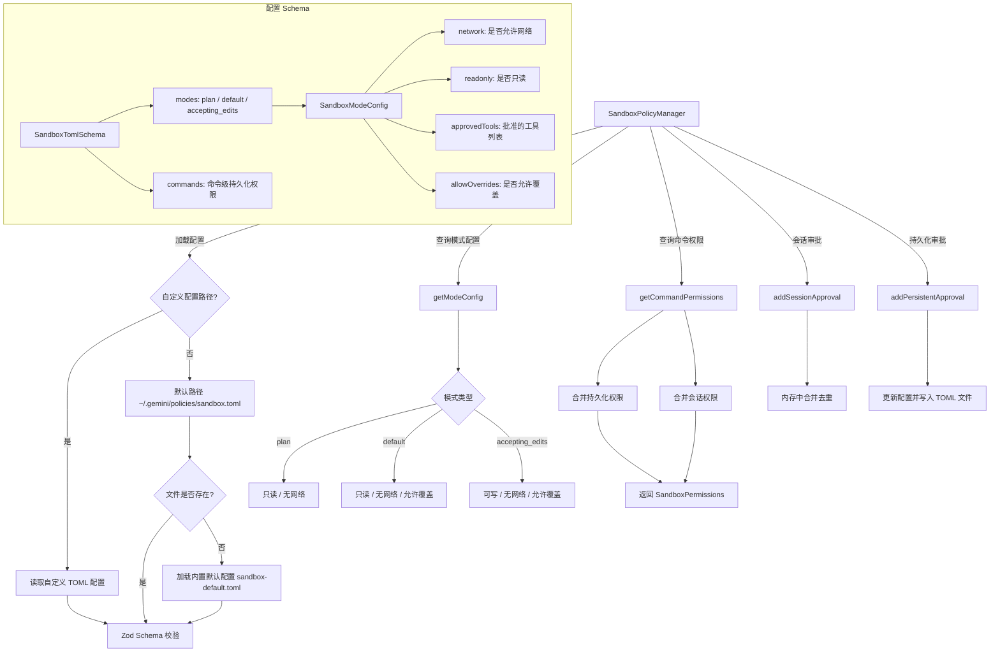

# sandboxPolicyManager.ts

## 概述

`sandboxPolicyManager.ts` 是 Gemini CLI 沙箱策略管理模块，负责管理 Shell 命令在沙箱环境中的权限配置。它从 TOML 格式的配置文件中加载沙箱策略，支持三种运行模式（`plan`、`default`、`accepting_edits`）下的差异化权限控制，并提供**会话级**和**持久化**两种权限审批机制。

该模块是安全沙箱体系的策略层，与 `SandboxManager`（执行层）配合工作，控制命令的文件系统访问和网络访问权限。

## 架构图（Mermaid）



## 核心组件

### 1. Zod Schema 定义

#### `SandboxModeConfigSchema`

定义单个运行模式的沙箱配置结构：

```typescript
{
  network: boolean,        // 是否允许网络访问
  readonly: boolean,       // 是否为只读模式（禁止文件写入）
  approvedTools: string[], // 预批准的工具/命令列表
  allowOverrides?: boolean // 是否允许用户覆盖此配置
}
```

#### `PersistentCommandConfigSchema`

定义单个命令的持久化权限配置：

```typescript
{
  allowed_paths?: string[], // 允许访问的文件路径列表
  allow_network?: boolean   // 是否允许网络访问
}
```

#### `SandboxTomlSchema`

顶层 TOML 配置的完整 Schema：

```typescript
{
  modes: {
    plan: SandboxModeConfig,            // 计划模式配置
    default: SandboxModeConfig,         // 默认模式配置
    accepting_edits: SandboxModeConfig, // 接受编辑模式配置
  },
  commands: Record<string, PersistentCommandConfig> // 命令级持久化权限映射
}
```

### 2. 类 `SandboxPolicyManager`

#### 静态属性 `DEFAULT_CONFIG`（延迟加载）

内置默认配置的懒加载 getter：

1. 首次访问时从 `policies/sandbox-default.toml` 文件加载。
2. 使用 `fileURLToPath` + `import.meta.url` 定位模块自身目录。
3. 如果文件读取失败（如内容不是字符串），使用硬编码的默认值：
   - `plan` 模式：只读、无网络、不允许覆盖
   - `default` 模式：只读、无网络、允许覆盖
   - `accepting_edits` 模式：可写、无网络、允许覆盖，预批准 `sed`/`grep`/`awk`/`perl`/`cat`/`echo`
4. 解析后经 Zod Schema 校验。

#### 构造函数

```typescript
constructor(customConfigPath?: string)
```

- 接受可选的自定义配置文件路径，默认为 `~/.gemini/policies/sandbox.toml`。
- 调用 `loadConfig()` 加载配置。

#### `loadConfig(): SandboxTomlSchemaType`（私有）

配置加载逻辑：
1. 若配置文件不存在 → 返回 `DEFAULT_CONFIG`
2. 若文件存在但解析失败 → 记录错误日志并返回 `DEFAULT_CONFIG`
3. 若文件存在且解析成功 → 经 Zod 校验后返回

#### `saveConfig(): void`（私有）

将当前配置写回 TOML 文件：
1. 确保目标目录存在（递归创建）
2. 使用 `toml.stringify` 序列化配置
3. 同步写入文件
4. 失败时仅记录错误日志，不抛出异常

#### `getModeConfig(mode): SandboxModeConfig`

根据模式名获取对应的沙箱配置：

| 传入模式 | 返回配置 |
|----------|---------|
| `'plan'` | `config.modes.plan` |
| `'accepting_edits'` 或 `'autoEdit'` | `config.modes.accepting_edits` |
| `'default'` | `config.modes.default` |
| 其他 | `config.modes.default`（回退至 `plan`） |

注意：`'autoEdit'` 映射到 `accepting_edits`，这是运行时模式名到配置名的适配。

#### `getCommandPermissions(commandName): SandboxPermissions`

获取特定命令的合并权限：

1. 从 `config.commands` 中获取**持久化权限**（TOML 文件中的 `[commands.xxx]`）
2. 从 `sessionApprovals` 中获取**会话权限**（内存中的临时审批）
3. 合并两者：
   - 文件系统读写路径：两者的并集
   - 网络权限：任一允许则允许（逻辑或）
4. 注意：持久化权限的 `allowed_paths` 同时授权读和写

#### `addSessionApproval(commandName, permissions): void`

添加**会话级**权限审批（仅在当前会话有效，程序退出后丢失）：

1. 获取已有的会话审批（如无则初始化空结构）
2. 将新权限与已有权限合并
3. 使用 `Set` 去重，避免路径重复
4. 网络权限取逻辑或

#### `addPersistentApproval(commandName, permissions): void`

添加**持久化**权限审批（写入 TOML 配置文件，跨会话保留）：

1. 获取已有的持久化配置（如无则初始化空结构）
2. 合并所有路径（已有 + 新读路径 + 新写路径）
3. 使用 `sanitizePaths` 清理路径后去重
4. 网络权限取逻辑或
5. 更新内存中的 config
6. 调用 `saveConfig()` 写入文件

## 依赖关系

### 内部依赖

| 模块 | 导入内容 | 用途 |
|------|---------|------|
| `../utils/debugLogger.js` | `debugLogger` | 记录错误和调试日志 |
| `../services/sandboxManager.js` | `SandboxPermissions` (类型), `sanitizePaths` | 沙箱权限类型定义与路径清理 |

### 外部依赖

| 模块 | 用途 |
|------|------|
| `node:fs` | 同步文件系统操作（readFileSync, writeFileSync, existsSync, mkdirSync） |
| `node:path` | 路径拼接与解析 |
| `node:os` | 获取用户主目录（homedir） |
| `node:url` | `fileURLToPath` 用于将 ESM 的 `import.meta.url` 转为文件路径 |
| `@iarna/toml` | TOML 格式的解析（parse）和序列化（stringify） |
| `zod` | 运行时 Schema 校验 |

## 关键实现细节

1. **双层权限模型**：
   - **会话权限**（`sessionApprovals`）：存储在内存中，仅当前会话有效。适用于用户临时批准某个命令访问特定路径的场景。
   - **持久化权限**（`config.commands`）：存储在 TOML 文件中，跨会话保留。适用于用户明确信任某个命令的场景。
   查询时两层权限自动合并，持久化权限同时覆盖读和写。

2. **三模式差异化控制**：
   - `plan`（计划模式）：最严格，只读、无网络、不允许用户覆盖。
   - `default`（默认模式）：只读、无网络，但允许用户覆盖。
   - `accepting_edits`（接受编辑模式）：可写、无网络，预批准常见文本处理工具，允许覆盖。

3. **配置文件优雅降级**：配置文件不存在或解析失败时回退到内置默认配置，不会因配置问题导致程序崩溃。但默认配置文件（`sandbox-default.toml`）解析失败时会抛出异常，因为这意味着程序自身的安装可能有问题。

4. **同步 I/O**：该模块使用同步文件系统操作（`readFileSync`、`writeFileSync`、`existsSync`），这与 `integrity.ts` 的异步方式不同。这是因为沙箱策略在命令执行前需要同步地确定权限，避免异步竞态。

5. **路径清理**：`addPersistentApproval` 在写入前调用 `sanitizePaths` 对路径进行规范化处理，防止路径遍历攻击或不规范路径导致的权限泄漏。

6. **Zod 运行时校验**：所有从 TOML 文件加载的配置都经过 Zod Schema 严格校验，确保配置结构符合预期。这在面对用户手动编辑配置文件的场景下尤为重要。

7. **ESM 模块路径解析**：由于项目使用 ESM 模块系统，`__dirname` 不可用，需要通过 `fileURLToPath(import.meta.url)` + `path.dirname` 的方式获取当前模块所在目录，用于定位内置默认配置文件。
