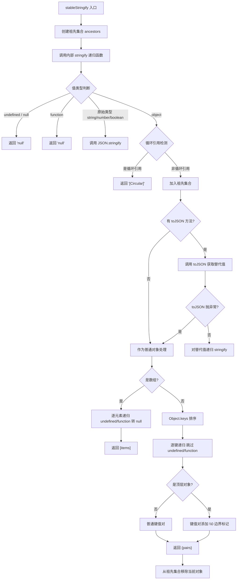

# stable-stringify.ts

## 概述

`stable-stringify.ts` 提供了一个**确定性 JSON 序列化**函数 `stableStringify`，是策略引擎参数匹配的基础设施。在 JavaScript 中，`JSON.stringify` 的对象属性输出顺序依赖于属性的插入顺序，不同的 JS 引擎或运行时条件可能产生不同结果。`stableStringify` 通过对对象键进行字典序排序，确保相同的对象无论属性插入顺序如何，始终产生相同的 JSON 字符串，从而使策略引擎的 `argsPattern` 正则匹配可靠地工作。

此外，该函数还内置了循环引用保护、`toJSON` 方法支持和 JSON 规范兼容性处理。

## 架构图（Mermaid）



## 核心组件

### 函数 `stableStringify(obj: unknown): string`

唯一的导出函数，接收任意值并返回确定性 JSON 字符串。

#### 内部递归函数 `stringify(currentObj, ancestors, isTopLevel)`

参数说明：
- `currentObj`：当前正在序列化的值
- `ancestors`：`Set<unknown>` 类型的祖先链，用于循环引用检测
- `isTopLevel`：是否为顶层对象（影响 `\0` 边界标记的添加）

#### 处理逻辑详解

##### 1. 原始类型处理

| 类型 | 处理方式 |
|------|---------|
| `undefined` | 返回 `'null'`（JSON 规范：数组中的 undefined 转为 null） |
| `null` | 返回 `'null'` |
| `function` | 返回 `'null'`（JSON 规范：数组中的函数转为 null） |
| `string`, `number`, `boolean` | 委托给 `JSON.stringify` |

##### 2. 循环引用检测

使用 `Set<unknown>` 维护当前递归路径上的所有祖先对象：
- 进入对象时 `ancestors.add(currentObj)`
- 退出对象时 `ancestors.delete(currentObj)`（在 `finally` 中确保执行）
- 检测到 `ancestors.has(currentObj)` 时返回 `'"[Circular]"'`

**关键设计**：使用祖先链（而非已访问集合）进行检测。这意味着同一个对象在不同的非嵌套位置被引用时不会被误判为循环引用，只有真正的祖先-后代循环才会被标记。

##### 3. toJSON 方法支持

符合 JSON.stringify 规范：
- 如果对象有 `toJSON` 方法，调用它获取替代值
- 替代值递归进入 `stringify` 处理
- 如果 `toJSON` 抛异常，静默捕获，将对象作为普通对象处理
- `toJSON` 返回 `null` 时直接返回 `'null'`

##### 4. 数组处理

- 逐元素递归调用 `stringify`
- `undefined` 和 `function` 元素转为 `'null'`
- 返回 `[item1,item2,...]` 格式

##### 5. 对象处理（核心）

- 使用 `Object.keys(currentObj).sort()` 获取排序后的键列表
- 逐键递归处理值
- 跳过值为 `undefined` 或 `function` 的属性（JSON 规范）
- **顶层对象特殊处理**：每个键值对被 `\0`（空字符）包裹，形成 `\0"key":value\0` 格式
- 返回 `{pair1,pair2,...}` 格式

## 依赖关系

### 内部依赖

无。本模块是纯函数，不依赖任何内部模块。

### 外部依赖

| 模块 | 用途 |
|------|------|
| 无 | 仅使用 JavaScript 内置的 `JSON.stringify`、`Object.keys`、`Array.isArray`、`Set` 等标准 API |

## 关键实现细节

1. **键排序保证确定性**：`Object.keys().sort()` 确保同一对象无论属性插入顺序如何，总是产生相同的键序列。这是整个函数存在的核心理由——策略引擎的 `argsPattern` 正则需要在稳定的字符串上匹配。

2. **`\0` 边界标记**：顶层对象的每个键值对被 `\0` 包裹。这个设计用于在正则匹配时提供精确的字段边界。因为 `JSON.stringify` 会将数据中的字面 `\0` 转义为 `\u0000`，所以 `\0` 在输出中只可能出现在边界标记位置，不会与用户数据冲突。这使得策略规则可以用类似 `\0"command":"rm\0` 的模式精确匹配特定字段。

3. **祖先链 vs 已访问集合**：循环引用检测使用祖先链（ancestor chain），不是简单的已访问对象集合。区别在于：
   ```javascript
   const shared = {x: 1};
   const obj = {a: shared, b: shared};
   // 祖先链：a 和 b 引用同一对象但不是循环，正确处理
   // 已访问集合：b 引用 shared 时会误判为循环
   ```
   `finally` 中的 `ancestors.delete(currentObj)` 确保回溯时正确清理。

4. **toJSON 容错**：`toJSON` 方法可能被恶意对象用来抛出异常或返回意外值。本函数通过 try-catch 容错，保证即使 `toJSON` 失败也能正常序列化。

5. **JSON 规范一致性**：严格遵循 JSON.stringify 的边界行为——对象中的 `undefined`/`function` 属性被省略，数组中的对应元素转为 `null`。这确保了与标准 JSON 的互操作性。

6. **无紧凑空格**：输出不包含任何空格或缩进，生成最紧凑的 JSON 字符串，便于正则匹配且避免空白差异导致匹配失败。

7. **安全防护**：
   - 循环引用不会导致栈溢出（替换为 `"[Circular]"`）
   - 键排序防止通过属性顺序绕过策略规则
   - `toJSON` 异常被捕获，防止 DoS 攻击
