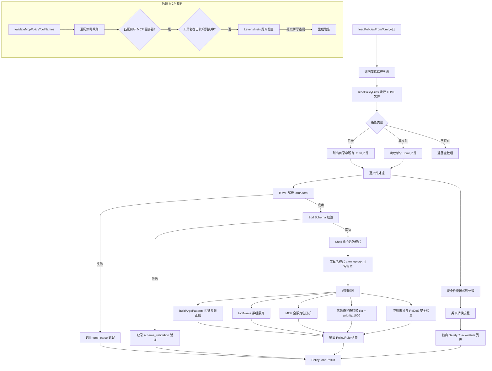

# toml-loader.ts

## 概述

`toml-loader.ts` 是策略系统的 **TOML 配置文件加载与解析模块**，负责从磁盘读取 `.toml` 格式的策略文件，经过 TOML 解析、Zod Schema 校验、语法验证、工具名校验、正则安全检查等多层处理后，输出标准化的 `PolicyRule[]` 和 `SafetyCheckerRule[]` 供策略引擎使用。

该模块是策略配置与策略引擎之间的桥梁，承担了大量的输入验证和转换工作，包括 Shell 命令便捷语法（`commandPrefix`/`commandRegex`）的展开、工具名数组的扁平化、MCP 全限定名的拼接、优先级的层级转换等。它还提供了详细的错误报告机制，帮助用户定位配置问题。

## 架构图（Mermaid）



## 核心组件

### 1. Zod Schema 定义

#### `PolicyRuleSchema`

单条策略规则的 TOML 结构校验：

| 字段 | 类型 | 必填 | 说明 |
|------|------|------|------|
| `toolName` | `string \| string[]` | 是 | 工具名，支持数组（一条规则匹配多个工具） |
| `subagent` | `string` | 否 | 子代理名称过滤 |
| `mcpName` | `string` | 否 | MCP 服务器名称 |
| `argsPattern` | `string` | 否 | 参数匹配正则（字符串形式） |
| `commandPrefix` | `string \| string[]` | 否 | Shell 命令前缀匹配（便捷语法） |
| `commandRegex` | `string` | 否 | Shell 命令正则匹配（便捷语法） |
| `decision` | `PolicyDecision` 枚举 | 是 | 决策：ALLOW / DENY / ASK_USER |
| `priority` | `integer [0, 999]` | 是 | 优先级（整数，防止层级溢出） |
| `modes` | `ApprovalMode[]` | 否 | 适用的审批模式列表 |
| `interactive` | `boolean` | 否 | 是否仅在交互/非交互模式下生效 |
| `toolAnnotations` | `Record<string, any>` | 否 | 工具注解匹配条件 |
| `allowRedirection` | `boolean` | 否 | 是否允许 Shell 重定向 |
| `allow_redirection` | `boolean` | 否 | 已废弃的蛇形命名兼容字段 |
| `denyMessage` | `string` | 否 | 拒绝时的自定义消息 |
| `deny_message` | `string` | 否 | 已废弃的蛇形命名兼容字段 |

**优先级限制**：必须为 0-999 的整数。因为层级转换公式为 `tier + priority/1000`，超过 999 会溢出到上一层级。

#### `SafetyCheckerRuleSchema`

安全检查器规则的 Schema，结构与 `PolicyRuleSchema` 类似，但 `decision` 字段被替换为 `checker` 字段：

```typescript
checker: {
  type: 'in-process' | 'external',  // 检查器类型
  name: string,                      // 检查器名称（in-process 为枚举）
  required_context?: string[],       // 所需上下文
  config?: Record<string, unknown>   // 检查器配置
}
```

使用 Zod 的 `discriminatedUnion` 根据 `type` 字段区分内部检查器和外部检查器。

#### `PolicyFileSchema`

整个 TOML 文件的顶层 Schema：

```typescript
{
  rule?: PolicyRuleToml[],           // 策略规则数组
  safety_checker?: SafetyCheckerRuleToml[] // 安全检查器数组
}
```

### 2. 类型与接口

#### `PolicyFileErrorType`

错误类型枚举：`'file_read'` | `'toml_parse'` | `'schema_validation'` | `'rule_validation'` | `'regex_compilation'` | `'tool_name_warning'`

#### `PolicyFileError`

详细的错误信息结构体：

```typescript
{
  filePath: string,     // 完整文件路径
  fileName: string,     // 文件名
  tier: string,         // 层级名称
  ruleIndex?: number,   // 出错的规则索引
  errorType: PolicyFileErrorType,
  message: string,      // 简要消息
  details?: string,     // 详细信息
  suggestion?: string,  // 修复建议
  severity?: 'error' | 'warning'
}
```

#### `PolicyLoadResult`

加载结果：

```typescript
{
  rules: PolicyRule[],           // 成功解析的策略规则
  checkers: SafetyCheckerRule[], // 成功解析的安全检查器规则
  errors: PolicyFileError[]      // 所有遇到的错误和警告
}
```

#### `PolicyFile`

策略文件的路径和内容：

```typescript
{
  path: string,    // 文件绝对路径
  content: string  // 文件内容
}
```

### 3. 导出函数

#### `readPolicyFiles(policyPath): Promise<PolicyFile[]>`

读取策略文件：
- 传入目录：列出所有 `.toml` 后缀的文件
- 传入单文件：读取该文件（必须以 `.toml` 结尾）
- 路径不存在（`ENOENT`）：返回空数组
- 其他错误：向上抛出

#### `loadPoliciesFromToml(policyPaths, getPolicyTier): Promise<PolicyLoadResult>`

**核心加载函数**，完整处理流程：

1. **遍历路径列表**：每个路径调用 `readPolicyFiles` 获取文件列表
2. **TOML 解析**：使用 `@iarna/toml` 解析文件内容
3. **Schema 校验**：使用 Zod `PolicyFileSchema` 校验结构
4. **Shell 命令语法校验**（`validateShellCommandSyntax`）：
   - `commandPrefix`/`commandRegex` 仅允许与 `toolName = "run_shell_command"` 配合
   - 不能与 `argsPattern` 同时使用
   - `commandPrefix` 和 `commandRegex` 互斥
5. **工具名校验**（`validateToolName`）：
   - 检查 `__` 语法（已废弃）
   - 使用 Levenshtein 距离检测拼写错误（阈值 3）
   - 仅对接近内置工具名的未识别名称发出警告
6. **规则转换**：
   - `buildArgsPatterns`：将 `argsPattern`/`commandPrefix`/`commandRegex` 转换为正则字符串数组
   - `toolName` 数组展开：一条 TOML 规则可生成多条 `PolicyRule`
   - MCP 全限定名拼接：`mcpName` + `toolName` → `mcp_{server}_{tool}`
   - 优先级转换：`tier + priority / 1000`
   - 正则编译与 ReDoS 安全检查（`isSafeRegExp`）
   - 蛇形命名兼容：`allow_redirection` → `allowRedirection`，`deny_message` → `denyMessage`
   - 来源标记：`source = "Tier: filename.toml"`
7. **安全检查器转换**：与规则转换类似，但输出 `SafetyCheckerRule`
8. **错误收集**：所有阶段的错误都被收集到 `errors` 数组中，不会因单个错误中断整个加载过程

#### `validateMcpPolicyToolNames(serverName, discoveredToolNames, policyRules): string[]`

**后置 MCP 工具名校验**（在 MCP 服务器连接后调用）：

1. 遍历所有策略规则
2. 筛选出引用目标 MCP 服务器的规则
3. 提取工具名部分（去除 `mcp_{server}_` 前缀）
4. 跳过通配符 `*`
5. 检查工具名是否存在于已发现工具列表中
6. 不存在时使用 Levenshtein 距离检查是否为拼写错误
7. 疑似拼写错误时生成警告消息

### 4. 内部辅助函数

#### `getTierName(tier): string`

将层级数字转为可读名称：

| 数字 | 名称 |
|------|------|
| 1 | `'default'` |
| 2 | `'extension'` |
| 3 | `'workspace'` |
| 4 | `'user'` |
| 5 | `'admin'` |

#### `formatSchemaError(error, ruleIndex): string`

将 Zod 校验错误格式化为可读的多行字符串，包含每个问题的字段路径和错误消息。

#### `validateShellCommandSyntax(rule, ruleIndex): string | null`

校验 Shell 命令便捷语法的合法性，返回错误消息或 `null`（合法）。

#### `validateToolName(name, ruleIndex): string | null`

校验工具名合法性：
1. 检测已废弃的 `__` 语法
2. 调用 `isValidToolName` 检查（允许通配符）
3. 对未识别名称用 Levenshtein 距离检测拼写错误（`MAX_TYPO_DISTANCE = 3`）
4. 仅对接近内置工具名的名称发出警告（距离过大的假定为合法的动态工具名）

#### `transformPriority(priority, tier): number`

优先级层级转换公式：`tier + priority / 1000`

示例：
- 层级 1（default），priority 500 → `1.500`
- 层级 4（user），priority 100 → `4.100`
- 层级 5（admin），priority 999 → `5.999`

## 依赖关系

### 内部依赖

| 模块 | 导入内容 | 用途 |
|------|---------|------|
| `./types.js` | `PolicyRule`, `PolicyDecision`, `ApprovalMode`, `SafetyCheckerConfig`, `SafetyCheckerRule`, `InProcessCheckerType` | 策略类型定义 |
| `./utils.js` | `buildArgsPatterns`, `isSafeRegExp` | 参数正则构建与 ReDoS 安全检查 |
| `../tools/tool-names.js` | `isValidToolName`, `ALL_BUILTIN_TOOL_NAMES` | 工具名合法性校验与内置工具名列表 |
| `../utils/tool-utils.js` | `getToolSuggestion` | 根据近似匹配生成工具名建议 |
| `../utils/errors.js` | `isNodeError` | Node.js 错误类型判断 |
| `../tools/mcp-tool.js` | `MCP_TOOL_PREFIX`, `formatMcpToolName` | MCP 工具名前缀与全限定名格式化 |

### 外部依赖

| 模块 | 用途 |
|------|------|
| `node:fs/promises` | 异步文件系统操作（stat, readdir, readFile） |
| `node:path` | 路径处理 |
| `@iarna/toml` | TOML 文件解析 |
| `zod` | 运行时 Schema 校验（`z`, `ZodError`） |
| `fast-levenshtein` | 字符串编辑距离计算（拼写检查） |

## 关键实现细节

1. **多层级优先级体系**：通过 `tier + priority / 1000` 公式，将策略的来源层级和用户定义的优先级合并为单一数值。层级号占整数部分，用户优先级占小数部分。这保证了高层级（如 admin）的规则始终优先于低层级（如 default），同时层级内部可通过 priority 微调顺序。priority 被限制在 0-999 以防止溢出到上一层级。

2. **工具名数组展开**：TOML 中 `toolName = ["tool_a", "tool_b"]` 会被展开为两条独立的 `PolicyRule`。与 `argsPattern` 的多模式（由 `commandPrefix` 数组产生）组合后，一条 TOML 规则可能展开为 N x M 条 `PolicyRule`（N 个工具名 x M 个参数模式）。

3. **Shell 命令便捷语法**：`commandPrefix` 和 `commandRegex` 是面向用户的简化语法糖。`commandPrefix = "git"` 在内部被 `buildArgsPatterns` 转换为匹配 `{"command": "git ..."}` 的正则表达式，避免用户直接编写复杂的 JSON 正则。

4. **MCP 全限定名拼接**：当规则同时指定 `mcpName` 和 `toolName` 时，会拼接为 `mcp_{server}_{tool}` 的全限定名。代码中有 TODO 注释指出这种方式在服务器别名含下划线时会有歧义，未来计划通过元数据匹配解决。

5. **拼写检查容错**：使用 Levenshtein 编辑距离（阈值 3）检测可能的工具名拼写错误。距离过大的未识别名称被视为合法的动态工具或代理工具，不发出警告。这避免了对用户自定义工具的误报。

6. **ReDoS 防护**：正则表达式在编译前经过 `isSafeRegExp` 检查，防止用户配置的正则含有嵌套量词等可导致正则表达式拒绝服务攻击（ReDoS）的模式。不安全的正则被拒绝并记录错误。

7. **错误不中断加载**：单个文件或单条规则的错误不会中断整个加载过程。所有错误被收集到 `errors` 数组中返回，调用方可选择性处理。这使得系统在部分配置损坏时仍能加载其余有效规则。

8. **蛇形命名兼容**：`allow_redirection` 和 `deny_message` 是已废弃的蛇形命名字段，仍然被接受但在转换时优先使用驼峰命名版本（`allowRedirection`、`denyMessage`）。这保证了旧配置文件的向后兼容性。

9. **后置 MCP 校验**：`validateMcpPolicyToolNames` 设计为在 MCP 服务器连接后延迟调用。因为 MCP 工具在策略加载时尚未发现，只有服务器连接后才知道实际存在哪些工具。这种延迟校验模式既保证了及时的拼写反馈，又不阻塞启动流程。
