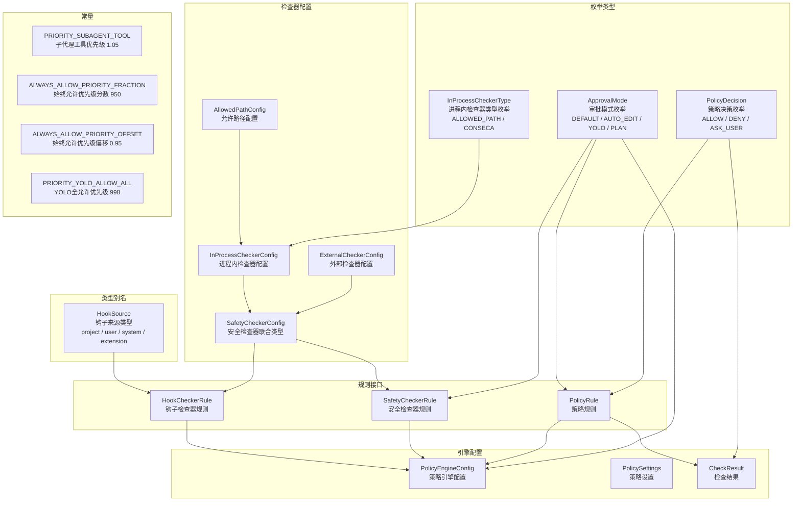

# types.ts

## 概述

`types.ts` 是 Gemini CLI 策略引擎的**核心类型定义文件**，位于 `packages/core/src/policy/` 目录下。该文件定义了策略决策系统所需的全部枚举、接口、类型别名和常量，是整个策略子系统的类型基础。

策略引擎的核心职责是：当 AI 模型请求执行工具调用（tool call）或钩子（hook）时，根据预配置的规则决定**允许（ALLOW）**、**拒绝（DENY）**还是**询问用户（ASK_USER）**。本文件定义了这一决策流程中涉及的所有数据结构。

## 架构图（Mermaid）



## 核心组件

### 1. PolicyDecision 枚举

策略决策的三种结果：

| 值 | 含义 |
|---|---|
| `ALLOW` | 允许执行工具调用 |
| `DENY` | 拒绝执行工具调用 |
| `ASK_USER` | 需要用户确认后才能执行 |

```typescript
export enum PolicyDecision {
  ALLOW = 'allow',
  DENY = 'deny',
  ASK_USER = 'ask_user',
}
```

### 2. HookSource 类型与 getHookSource 函数

`HookSource` 定义了钩子执行的四种来源：

| 来源 | 说明 |
|---|---|
| `project` | 项目级别钩子 |
| `user` | 用户级别钩子 |
| `system` | 系统级别钩子 |
| `extension` | 扩展级别钩子 |

`getHookSource()` 是一个安全提取函数，从输入记录中提取并验证 `hook_source` 字段。如果字段缺失或无效，默认返回 `'project'`。

```typescript
export function getHookSource(input: Record<string, unknown>): HookSource {
  const source = input['hook_source'];
  if (
    typeof source === 'string' &&
    VALID_HOOK_SOURCES.includes(source as HookSource)
  ) {
    return source as HookSource;
  }
  return 'project';
}
```

### 3. ApprovalMode 枚举

定义了四种审批模式，控制工具调用时的审批行为：

| 模式 | 含义 |
|---|---|
| `DEFAULT` | 默认模式，标准审批流程 |
| `AUTO_EDIT` | 自动编辑模式，自动批准文件编辑 |
| `YOLO` | 全自动模式，自动批准所有操作 |
| `PLAN` | 计划模式 |

### 4. 安全检查器配置体系

安全检查器分为两类，通过判别联合类型 `SafetyCheckerConfig` 统一管理：

#### AllowedPathConfig（允许路径配置）

为内置的 `allowed-path` 检查器提供参数配置：
- `included_args`：需要作为路径检查的参数键名列表
- `excluded_args`：排除在路径检查之外的参数键名列表

#### ExternalCheckerConfig（外部检查器配置）

- `type`: 固定为 `'external'`
- `name`: 检查器名称
- `config`: 任意配置数据
- `required_context`: 需要的安全检查上下文字段

#### InProcessCheckerConfig（进程内检查器配置）

- `type`: 固定为 `'in-process'`
- `name`: 必须为 `InProcessCheckerType` 枚举值（`allowed-path` 或 `conseca`）
- `config`: 可选的 `AllowedPathConfig`
- `required_context`: 需要的安全检查上下文字段

#### InProcessCheckerType 枚举

| 类型 | 值 | 说明 |
|---|---|---|
| `ALLOWED_PATH` | `'allowed-path'` | 路径允许列表检查器 |
| `CONSECA` | `'conseca'` | Conseca 安全检查器 |

### 5. PolicyRule 接口

策略规则是策略引擎的核心配置单元，每条规则定义了一个匹配条件和对应的决策：

| 字段 | 类型 | 必填 | 说明 |
|---|---|---|---|
| `name` | `string` | 否 | 规则唯一名称，用于标识和调试 |
| `toolName` | `string` | 是 | 适用的工具名称，`'*'` 匹配所有工具 |
| `subagent` | `string` | 否 | 适用的子代理名称 |
| `mcpName` | `string` | 否 | 适用的 MCP 服务器名称 |
| `argsPattern` | `RegExp` | 否 | 工具参数匹配模式 |
| `toolAnnotations` | `Record<string, unknown>` | 否 | 工具元数据注解匹配（如 readOnlyHint） |
| `decision` | `PolicyDecision` | 是 | 匹配后的决策 |
| `priority` | `number` | 否 | 优先级，数字越大优先级越高，默认 0 |
| `modes` | `ApprovalMode[]` | 否 | 适用的审批模式，为空则适用于所有模式 |
| `interactive` | `boolean` | 否 | `true` 仅交互环境，`false` 仅非交互环境，`undefined` 两者都适用 |
| `allowRedirection` | `boolean` | 否 | 是否允许命令重定向，仅当 decision 为 ALLOW 时有效 |
| `source` | `string` | 否 | 规则来源描述 |
| `denyMessage` | `string` | 否 | DENY 决策时显示给模型/用户的消息 |

### 6. SafetyCheckerRule 接口

安全检查器规则将安全检查器绑定到特定的工具调用匹配条件：

| 字段 | 类型 | 必填 | 说明 |
|---|---|---|---|
| `toolName` | `string` | 是 | 适用的工具名称，`'*'` 匹配所有工具 |
| `mcpName` | `string` | 否 | MCP 服务器名称 |
| `argsPattern` | `RegExp` | 否 | 参数匹配模式 |
| `toolAnnotations` | `Record<string, unknown>` | 否 | 工具注解匹配 |
| `priority` | `number` | 否 | 优先级，越大越先执行 |
| `checker` | `SafetyCheckerConfig` | 是 | 安全检查器配置 |
| `modes` | `ApprovalMode[]` | 否 | 适用的审批模式 |
| `source` | `string` | 否 | 规则来源 |

### 7. HookCheckerRule 接口

钩子检查器规则，类似于 `SafetyCheckerRule`，但针对钩子执行的匹配条件：

| 字段 | 类型 | 必填 | 说明 |
|---|---|---|---|
| `eventName` | `string` | 否 | 钩子事件名，`undefined` 匹配所有事件 |
| `hookSource` | `HookSource` | 否 | 钩子来源，`undefined` 匹配所有来源 |
| `priority` | `number` | 否 | 优先级 |
| `checker` | `SafetyCheckerConfig` | 是 | 安全检查器配置 |

### 8. HookExecutionContext 接口

钩子执行上下文，包含钩子执行时的元数据：

| 字段 | 类型 | 必填 | 说明 |
|---|---|---|---|
| `eventName` | `string` | 是 | 事件名称 |
| `hookSource` | `HookSource` | 否 | 钩子来源 |
| `trustedFolder` | `boolean` | 否 | 是否为受信任的文件夹 |

### 9. PolicyEngineConfig 接口

策略引擎的完整配置接口：

| 字段 | 类型 | 必填 | 说明 |
|---|---|---|---|
| `rules` | `PolicyRule[]` | 否 | 策略规则列表 |
| `checkers` | `SafetyCheckerRule[]` | 否 | 工具调用安全检查器列表 |
| `hookCheckers` | `HookCheckerRule[]` | 否 | 钩子执行安全检查器列表 |
| `defaultDecision` | `PolicyDecision` | 否 | 无规则匹配时的默认决策，默认 ASK_USER |
| `nonInteractive` | `boolean` | 否 | 非交互模式时 ASK_USER 变为 DENY |
| `disableAlwaysAllow` | `boolean` | 否 | 是否禁用"始终允许"规则 |
| `allowHooks` | `boolean` | 否 | 是否允许钩子执行，默认 true |
| `approvalMode` | `ApprovalMode` | 否 | 当前审批模式 |
| `sandboxManager` | `SandboxManager` | 否 | 沙箱管理器实例 |

### 10. PolicySettings 接口

用户级别的策略设置：

| 字段 | 类型 | 说明 |
|---|---|---|
| `mcp.excluded` | `string[]` | 排除的 MCP 列表 |
| `mcp.allowed` | `string[]` | 允许的 MCP 列表 |
| `tools.exclude` | `string[]` | 排除的工具列表 |
| `tools.allowed` | `string[]` | 允许的工具列表 |
| `mcpServers` | `Record<string, { trust?: boolean }>` | MCP 服务器信任配置 |
| `policyPaths` | `string[]` | 用户自定义策略文件路径，替换 `~/.gemini/policies` |
| `adminPolicyPaths` | `string[]` | 管理员策略文件路径，补充管理员级别策略 |
| `workspacePoliciesDir` | `string` | 工作区策略目录 |
| `disableAlwaysAllow` | `boolean` | 是否禁用"始终允许" |

### 11. CheckResult 接口

策略检查结果：

```typescript
export interface CheckResult {
  decision: PolicyDecision;  // 决策结果
  rule?: PolicyRule;         // 匹配到的规则（可选）
}
```

### 12. 优先级常量

| 常量 | 值 | 说明 |
|---|---|---|
| `PRIORITY_SUBAGENT_TOOL` | `1.05` | 子代理工具优先级，等效于 Tier 1 默认只读工具 |
| `ALWAYS_ALLOW_PRIORITY_FRACTION` | `950` | "始终允许"规则的分数优先级（950/1000） |
| `ALWAYS_ALLOW_PRIORITY_OFFSET` | `0.95` | "始终允许"规则的偏移优先级（由 950/1000 计算得出） |
| `PRIORITY_YOLO_ALLOW_ALL` | `998` | YOLO 模式"全部允许"规则的原始优先级，对应 yolo.toml |

## 依赖关系

### 内部依赖

| 依赖模块 | 导入内容 | 用途 |
|---|---|---|
| `../safety/protocol.js` | `SafetyCheckInput` 类型 | 为 `required_context` 字段提供类型约束 |
| `../services/sandboxManager.js` | `SandboxManager` 类型 | 策略引擎配置中的沙箱管理器实例类型 |

### 外部依赖

无外部第三方依赖。本文件仅使用 TypeScript 原生类型系统。

## 关键实现细节

1. **判别联合类型模式**：`SafetyCheckerConfig` 使用 `type` 字段（`'external'` 或 `'in-process'`）作为判别符，使 TypeScript 能在运行时安全地区分两种检查器配置，实现类型缩窄（type narrowing）。

2. **优先级系统设计**：优先级使用浮点数而非整数，允许更细粒度的优先级排序。例如 `PRIORITY_SUBAGENT_TOOL = 1.05` 可以精确插入到整数优先级之间。`ALWAYS_ALLOW_PRIORITY_OFFSET` 通过 `950/1000 = 0.95` 计算，确保内存中的规则和持久化规则的优先级一致。

3. **安全的钩子来源提取**：`getHookSource()` 函数使用运行时验证（而非仅类型断言），将输入从 `Record<string, unknown>` 安全地收窄为 `HookSource` 类型。当值无效时默认返回 `'project'`，保证系统不会因非法输入而崩溃。

4. **通配符匹配**：`toolName` 和 `eventName` 等字段支持 `'*'` 通配符，使单条规则可以匹配所有目标，简化配置。

5. **多层策略来源**：`PolicySettings` 支持 `policyPaths`（用户级）和 `adminPolicyPaths`（管理员级）以及 `workspacePoliciesDir`（工作区级），实现了策略配置的层级覆盖机制。

6. **交互/非交互模式分离**：`PolicyRule.interactive` 和 `PolicyEngineConfig.nonInteractive` 字段协同工作，允许在 CI/CD 等非交互环境中自动将 `ASK_USER` 降级为 `DENY`，防止流程阻塞。
