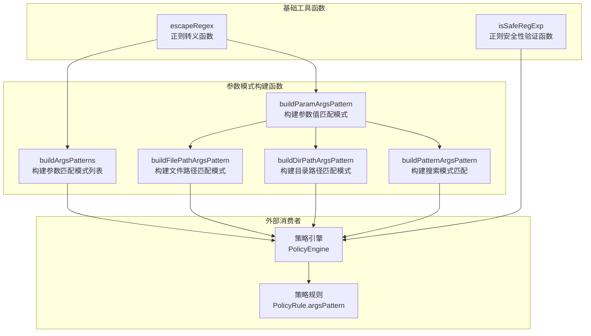

# utils.ts

## 概述

`utils.ts` 是 Gemini CLI 策略引擎的**工具函数集合文件**，位于 `packages/core/src/policy/` 目录下。该文件提供了一组用于构建和验证正则表达式模式的实用函数，主要服务于策略规则中的参数匹配（`argsPattern`）功能。

这些函数的核心目标是：将用户配置的命令前缀、命令正则、文件路径等高层语义条件，安全地转换为可用于 JSON 字符串匹配的正则表达式，从而实现策略引擎对工具调用参数的精细化控制。

## 架构图（Mermaid）



## 核心组件

### 1. escapeRegex(text: string): string

**正则表达式转义函数**，将字符串中所有正则表达式特殊字符进行转义，使其作为字面量匹配。

```typescript
export function escapeRegex(text: string): string {
  return text.replace(/[-[\]{}()*+?.,\\^$|#\s"]/g, '\\$&');
}
```

**转义的字符集**：`- [ ] { } ( ) * + ? . , \ ^ $ | # 空白字符 "`

这是一个基础工具函数，被 `buildArgsPatterns` 和 `buildParamArgsPattern` 等上层函数调用，确保用户输入的文本不会被错误地解释为正则语法。

### 2. isSafeRegExp(pattern: string): boolean

**正则表达式安全性验证函数**，用于防范 ReDoS（正则表达式拒绝服务）攻击。该函数执行三层检查：

| 检查层级 | 内容 | 判定条件 |
|---|---|---|
| 第一层 | 语法合法性 | 尝试 `new RegExp(pattern)`，失败则返回 `false` |
| 第二层 | 长度限制 | 超过 2048 字符则返回 `false` |
| 第三层 | 嵌套量词检测 | 匹配 `(含量词的组)+` 等 ReDoS 模式则返回 `false` |

**嵌套量词检测正则**：
```typescript
const nestedQuantifierPattern = /\([^)]*[*+?{].*\)[*+?{]/;
```

此正则匹配形如 `(a+)+`、`(a|b)*`、`(.*)*`、`([a-z]+)+` 等包含嵌套量词的危险模式。这是一种启发式检查，不能替代完整的 ReDoS 扫描器，但能拦截最常见的 ReDoS 攻击向量。

### 3. buildArgsPatterns(argsPattern?, commandPrefix?, commandRegex?): Array<string | undefined>

**参数匹配模式列表构建函数**，这是最复杂的核心函数，负责将三种不同来源的匹配条件转换为策略引擎可用的正则模式数组。

**参数优先级**（互斥，按优先级顺序）：

1. **commandPrefix**（命令前缀匹配，最高优先级）
2. **commandRegex**（命令正则匹配）
3. **argsPattern**（原始参数模式，透传）

#### commandPrefix 处理流程


详细步骤：
1. 将 `commandPrefix` 规范化为数组（支持单个字符串或字符串数组）
2. 对每个前缀执行 `JSON.stringify()` 编码，处理特殊字符
3. 移除 JSON 字符串末尾的引号 `"`，形成"开放前缀"（即匹配以该前缀开头的任意命令）
4. 使用 `escapeRegex` 转义前缀，构造 `"command":<openQuotePrefix>` 的匹配段
5. 追加后缀 `(?:[\s"]|\\\\")` 允许在前缀后跟随空白字符、双引号或转义双引号

**安全设计**：后缀模式不允许通用的 `\\`（反斜杠），这防止了 `git\status` 被错误匹配为 `gitstatus` 的情况。

#### commandRegex 处理

直接将正则嵌入 `"command":"<regex>` 模板中。

#### argsPattern 处理

直接透传用户提供的原始正则字符串。

### 4. buildParamArgsPattern(paramName: string, value: unknown): string

**参数值匹配模式构建函数**，为特定的参数名和值生成精确的 JSON 属性匹配正则。

```typescript
export function buildParamArgsPattern(paramName: string, value: unknown): string {
  const encodedValue = JSON.stringify(value);
  return `\\\\0${escapeRegex(`"${paramName}":${encodedValue}`)}\\\\0`;
}
```

**关键安全设计**：使用 `\\0`（空字符）作为分隔符包裹匹配表达式。这一设计与 `stableStringify` 生成的格式配合，确保只匹配 JSON 顶层属性，**防止参数注入绕过攻击**。例如，防止攻击者通过在嵌套字段中伪造 `"file_path":"..."` 来绕过路径限制。

### 5. buildFilePathArgsPattern(filePath: string): string

文件路径匹配模式的便捷函数，内部调用 `buildParamArgsPattern('file_path', filePath)`。用于限制编辑工具只能操作特定文件。

```typescript
export function buildFilePathArgsPattern(filePath: string): string {
  return buildParamArgsPattern('file_path', filePath);
}
```

### 6. buildDirPathArgsPattern(dirPath: string): string

目录路径匹配模式的便捷函数，内部调用 `buildParamArgsPattern('dir_path', dirPath)`。用于限制 `list_directory` 工具只能访问特定目录。

```typescript
export function buildDirPathArgsPattern(dirPath: string): string {
  return buildParamArgsPattern('dir_path', dirPath);
}
```

### 7. buildPatternArgsPattern(pattern: string): string

搜索模式匹配的便捷函数，内部调用 `buildParamArgsPattern('pattern', pattern)`。用于限制 glob/grep 等搜索工具只能使用特定的搜索模式。

```typescript
export function buildPatternArgsPattern(pattern: string): string {
  return buildParamArgsPattern('pattern', pattern);
}
```

## 依赖关系

### 内部依赖

无。本文件是纯工具函数集合，不依赖项目中的其他模块。

### 外部依赖

无外部第三方依赖。仅使用 JavaScript/TypeScript 内置的 `RegExp`、`JSON.stringify`、`String.prototype.replace` 和 `Array.isArray` 等原生 API。

## 关键实现细节

1. **ReDoS 防护**：`isSafeRegExp` 通过长度限制（2048 字符）和嵌套量词检测来防止正则表达式拒绝服务攻击。这在处理用户提供的正则表达式配置时至关重要，因为恶意或不当的正则可能导致 CPU 密集型的回溯，阻塞整个进程。

2. **JSON 字符串匹配策略**：策略引擎的参数匹配是针对工具调用参数的 JSON 序列化字符串进行正则匹配（而非解析 JSON 后匹配字段值）。这一设计使得匹配可以在序列化阶段高效完成，但也要求模式构建函数精确考虑 JSON 编码格式。

3. **空字符分隔防注入**：`buildParamArgsPattern` 使用 `\\0`（空字符）作为分隔符，配合 `stableStringify` 的输出格式，确保只匹配顶层 JSON 属性。这是一种重要的安全措施，防止攻击者通过构造嵌套 JSON 结构来绕过参数路径限制。

4. **命令前缀的开放匹配**：`buildArgsPatterns` 在处理 `commandPrefix` 时，移除了 JSON 字符串末尾的引号，形成"开放前缀"匹配。这意味着 `git ` 前缀可以匹配 `git status`、`git commit` 等所有以 `git ` 开头的命令，而不仅仅精确匹配 `git`。

5. **函数分层设计**：文件采用清晰的分层架构——底层基础函数（`escapeRegex`、`isSafeRegExp`）、中间层通用构建函数（`buildArgsPatterns`、`buildParamArgsPattern`）、上层领域特定便捷函数（`buildFilePathArgsPattern`、`buildDirPathArgsPattern`、`buildPatternArgsPattern`）。上层函数全部委托给 `buildParamArgsPattern`，只是固定了参数名。
