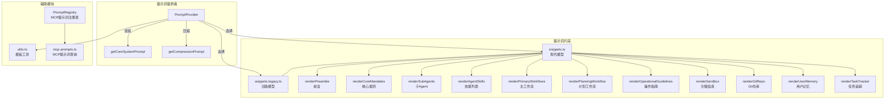

# prompts (提示词管理模块)

## 概述

`prompts/` 目录负责 Gemini CLI 的系统提示词（System Prompt）组装与管理。它实现了模块化的提示词构建系统，通过多个可配置的子段落（snippet）组合出完整的系统提示词，同时支持 MCP Prompt 注册、用户记忆注入、模板变量替换，以及针对不同模型版本的提示词适配。

## 目录结构

```
prompts/
├── promptProvider.ts                 # 提示词提供者（核心编排器）
├── prompt-registry.ts                # MCP Prompt 注册表
├── mcp-prompts.ts                    # MCP 服务器提示词查询工具
├── snippets.ts                       # 现代模型提示词片段（Gemini 3+）
├── snippets.legacy.ts                # 旧版模型提示词片段
├── utils.ts                          # 工具函数（路径解析、模板替换、段落开关）
├── snippets-memory-manager.test.ts   # 记忆管理器测试
└── *.test.ts                         # 对应的单元测试文件
```

## 架构图



## 核心组件

### PromptProvider (promptProvider.ts)
- **职责**: 系统提示词的核心编排器，收集上下文信息并组装最终提示词
- **关键方法**:
  - `getCoreSystemPrompt(context, userMemory, interactiveOverride)` - 生成核心系统提示词
  - `getCompressionPrompt(context)` - 生成历史压缩提示词
- **模型适配**: 根据模型版本自动选择现代（snippets.ts）或旧版（snippets.legacy.ts）提示词片段
- **自定义支持**: 通过 `GEMINI_SYSTEM_MD` 环境变量支持自定义系统提示词模板
- **段落控制**: 通过 `GEMINI_PROMPT_<SECTION>` 环境变量控制各段落的启用/禁用

### snippets.ts (现代模型提示词)
- **职责**: 为 Gemini 3+ 模型提供优化的系统提示词片段
- **核心段落**:
  - **Preamble**: 角色定义（交互式 / 自主式）
  - **Core Mandates**: 安全规范、上下文效率、工程标准、专业能力
  - **Primary Workflows**: 研究 -> 策略 -> 执行的开发生命周期
  - **Planning Workflow**: 计划模式专用工作流
  - **Operational Guidelines**: 语气风格、安全规则、工具使用、交互细节
  - **Sandbox**: 沙箱环境说明
  - **Git Repository**: Git 操作规范
  - **User Memory**: 分层记忆注入（全局 / 扩展 / 项目）
- **特性**: 支持 Topic Model 叙述模式、任务追踪协议

### snippets.legacy.ts (旧版模型提示词)
- **职责**: 为旧版模型提供兼容的系统提示词片段
- **差异**: 保留 Final Reminder 段落、Shell 效率指南、简化的叙述要求

### PromptRegistry (prompt-registry.ts)
- **职责**: 管理从 MCP 服务器发现的提示词定义
- **关键方法**:
  - `registerPrompt(prompt)` - 注册提示词，同名时自动添加服务器前缀
  - `getAllPrompts()` - 获取所有注册的提示词（按名称排序）
  - `getPromptsByServer(serverName)` - 按服务器过滤提示词
  - `removePromptsByServer(serverName)` - 移除指定服务器的提示词

### utils.ts
- **职责**: 提供提示词构建的工具函数
- **关键函数**:
  - `resolvePathFromEnv(envVar)` - 解析环境变量中的路径或开关值
  - `applySubstitutions(prompt, context, skillsPrompt)` - 应用模板变量替换（`${AgentSkills}`, `${SubAgents}`, `${AvailableTools}` 等）
  - `isSectionEnabled(key)` - 检查提示词段落是否通过环境变量启用

## 依赖关系

### 内部依赖
- `config/memory.ts` - 分层记忆类型
- `config/config.ts` - Config 配置接口
- `config/models.ts` - 模型解析与特性检测
- `config/agent-loop-context.ts` - Agent 循环上下文
- `policy/types.ts` - ApprovalMode 枚举
- `tools/tool-names.ts` - 工具名称常量
- `tools/mcp-tool.ts` - MCP 工具类型
- `tools/mcp-client.ts` - DiscoveredMCPPrompt 类型
- `tools/memoryTool.ts` - 记忆工具（GEMINI.md 文件名）
- `agents/codebase-investigator.ts` - 代码库调查 Agent
- `utils/gitUtils.ts` - Git 仓库检测
- `utils/paths.ts` - 路径常量
- `utils/debugLogger.ts` - 调试日志

### 外部依赖
- 无直接外部 npm 依赖

## 数据流

### 系统提示词生成流程
1. `PromptProvider.getCoreSystemPrompt()` 被 Agent 循环调用
2. 检查 `GEMINI_SYSTEM_MD` 环境变量，如有自定义模板则使用模板
3. 根据模型版本选择现代或旧版提示词片段集合
4. 收集上下文信息：审批模式、技能列表、工具列表、交互模式等
5. 通过 `withSection()` 方法控制各段落的条件渲染
6. 调用 `getCoreSystemPrompt(options)` 组装基础提示词
7. 通过 `renderFinalShell()` 注入用户记忆（分层结构）
8. 清理多余空行，可选地写出到文件
9. 返回最终的系统提示词字符串
