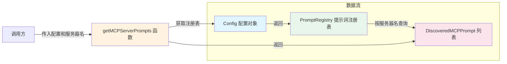

# mcp-prompts.ts

## 概述

`mcp-prompts.ts` 是 Gemini CLI 核心包中提示词（prompts）模块的一个辅助文件。该文件提供了一个简洁的工具函数 `getMCPServerPrompts`，用于从配置对象中获取特定 MCP（Model Context Protocol）服务器注册的提示词列表。它作为配置层（Config）与 MCP 提示词注册表（PromptRegistry）之间的桥梁函数，简化了获取 MCP 服务器提示词的调用链路。

## 架构图（Mermaid）



## 核心组件

### getMCPServerPrompts 函数

```typescript
export function getMCPServerPrompts(
  config: Config,
  serverName: string,
): DiscoveredMCPPrompt[]
```

**功能**：根据服务器名称，从全局配置中获取该 MCP 服务器提供的所有提示词。

**参数**：

| 参数名 | 类型 | 说明 |
|--------|------|------|
| `config` | `Config` | 全局配置对象，包含提示词注册表等核心服务 |
| `serverName` | `string` | MCP 服务器的名称标识 |

**返回值**：`DiscoveredMCPPrompt[]` — 该服务器注册的提示词数组，若注册表不存在则返回空数组。

**执行逻辑**：

1. 通过 `config.getPromptRegistry()` 获取提示词注册表实例
2. 若注册表不存在（返回 `null`/`undefined`），直接返回空数组 `[]`
3. 若注册表存在，调用 `promptRegistry.getPromptsByServer(serverName)` 获取该服务器的所有提示词
4. 返回查询结果

## 依赖关系

### 内部依赖

| 依赖模块 | 导入内容 | 用途 |
|----------|---------|------|
| `../config/config.js` | `Config` (类型) | 全局配置接口，提供 `getPromptRegistry()` 方法用于获取提示词注册表 |
| `../tools/mcp-client.js` | `DiscoveredMCPPrompt` (类型) | MCP 提示词的数据结构类型，表示从 MCP 服务器发现的提示词 |

### 外部依赖

无外部第三方依赖。

## 关键实现细节

1. **防御性编程**：函数在获取 `promptRegistry` 后进行了空值检查。如果配置中没有初始化提示词注册表（例如 MCP 功能未启用或配置未就绪），函数会安全地返回空数组而非抛出异常。

2. **纯类型导入**：使用 `import type` 语法导入 `Config` 和 `DiscoveredMCPPrompt`，确保这些导入仅用于类型检查，不会在编译后的 JavaScript 中产生实际的运行时导入，有利于 Tree Shaking 优化。

3. **职责单一**：该文件仅包含一个函数，职责非常明确——充当获取 MCP 服务器提示词的便捷入口。它将 Config -> PromptRegistry -> Prompts 的调用链封装为一步操作，降低了调用方的耦合度。

4. **与 MCP 协议的关联**：MCP（Model Context Protocol）是一种标准化的模型上下文协议，允许外部服务器向 CLI 工具提供工具和提示词。该函数是 MCP 提示词集成的关键环节，负责在需要时检索特定服务器贡献的提示词内容。

5. **间接依赖 PromptRegistry**：虽然文件没有直接导入 `PromptRegistry` 类，但通过 `Config.getPromptRegistry()` 间接使用了它，体现了依赖倒置的设计原则——依赖抽象（Config 接口）而非具体实现。
