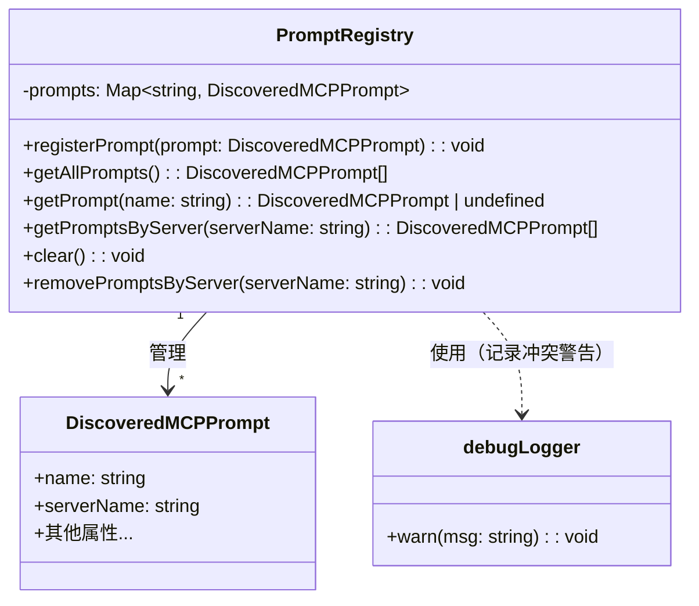
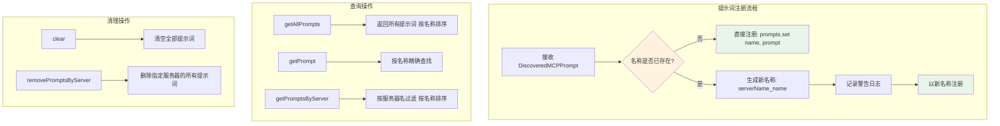

# prompt-registry.ts

## 概述

`prompt-registry.ts` 是 Gemini CLI 核心包中提示词模块的注册表实现文件。该文件定义了 `PromptRegistry` 类，作为所有 MCP（Model Context Protocol）服务器提供的提示词（Prompt）的中央注册与管理中心。它采用 Map 数据结构以提示词名称为键进行存储，支持注册、查询、按服务器过滤以及清理等操作，并内置了名称冲突自动处理机制。

## 架构图（Mermaid）





## 核心组件

### PromptRegistry 类

提示词的中央注册管理器。使用 `Map<string, DiscoveredMCPPrompt>` 作为内部存储。

#### 私有属性

| 属性名 | 类型 | 说明 |
|--------|------|------|
| `prompts` | `Map<string, DiscoveredMCPPrompt>` | 以提示词名称为键的存储映射表 |

#### 公有方法

##### `registerPrompt(prompt: DiscoveredMCPPrompt): void`

注册一个新的 MCP 提示词到注册表。

**核心逻辑**：
- 检查是否已存在同名提示词
- 如果存在名称冲突，自动将新提示词重命名为 `{serverName}_{name}` 格式，并通过 `debugLogger.warn` 记录警告
- 重命名时使用扩展运算符 `{ ...prompt, name: newName }` 创建新对象，避免修改原始对象
- 如果名称不冲突，直接以原名注册

```typescript
registerPrompt(prompt: DiscoveredMCPPrompt): void {
    if (this.prompts.has(prompt.name)) {
      const newName = `${prompt.serverName}_${prompt.name}`;
      debugLogger.warn(`Prompt with name "${prompt.name}" is already registered. Renaming to "${newName}".`);
      this.prompts.set(newName, { ...prompt, name: newName });
    } else {
      this.prompts.set(prompt.name, prompt);
    }
}
```

##### `getAllPrompts(): DiscoveredMCPPrompt[]`

返回注册表中所有提示词的数组，按名称字母序升序排列。

##### `getPrompt(name: string): DiscoveredMCPPrompt | undefined`

根据名称精确查找并返回对应的提示词。如果不存在返回 `undefined`。

##### `getPromptsByServer(serverName: string): DiscoveredMCPPrompt[]`

返回指定 MCP 服务器注册的所有提示词，结果按名称字母序升序排列。通过遍历所有提示词并过滤 `serverName` 匹配的条目实现。

##### `clear(): void`

清空注册表中的所有提示词。直接调用 `Map.clear()` 实现。

##### `removePromptsByServer(serverName: string): void`

删除指定 MCP 服务器注册的所有提示词。遍历 Map 的 entries，逐一删除 `serverName` 匹配的条目。

## 依赖关系

### 内部依赖

| 依赖模块 | 导入内容 | 用途 |
|----------|---------|------|
| `../tools/mcp-client.js` | `DiscoveredMCPPrompt` (类型) | MCP 提示词的数据结构类型，作为注册表存储的核心数据类型 |
| `../utils/debugLogger.js` | `debugLogger` (实例) | 调试日志工具，用于在提示词名称冲突时记录警告信息 |

### 外部依赖

无外部第三方依赖。

## 关键实现细节

1. **名称冲突自动解决**：当两个不同 MCP 服务器注册了同名提示词时，后注册的提示词会被自动重命名为 `{serverName}_{originalName}` 格式。这确保了注册表中不会出现名称覆盖的情况，同时通过日志记录方便调试。

2. **不可变注册**：在处理名称冲突时，使用 `{ ...prompt, name: newName }` 创建新对象而非直接修改原始 prompt 对象，遵循不可变数据原则，避免对调用方持有的引用产生副作用。

3. **排序一致性**：`getAllPrompts()` 和 `getPromptsByServer()` 返回的结果都按名称字母序排序（使用 `localeCompare`），保证在 UI 展示和程序化访问时结果的顺序是稳定和可预测的。

4. **遍历中删除的安全性**：`removePromptsByServer()` 方法在遍历 Map 的 entries 时进行删除操作。在 JavaScript 中，`Map` 的 `for...of` 遍历在删除当前条目时是安全的（与 `Array` 不同），这是 ES6 Map 规范保证的行为。

5. **单例模式的暗示**：虽然 `PromptRegistry` 本身不是单例，但从 `mcp-prompts.ts` 中 `config.getPromptRegistry()` 的使用方式可以推断，它通常以单实例形式挂载在 Config 对象上，作为全局提示词管理的唯一注册中心。

6. **二次冲突风险**：当前的冲突解决策略存在一个边界情况——如果重命名后的 `{serverName}_{name}` 恰好与另一个已注册的提示词同名，该实现不会进行二次冲突检测，新条目会静默覆盖已有条目。不过在实际使用中，这种情况极为罕见。
