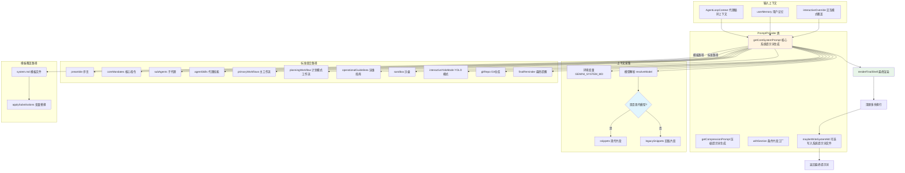

# promptProvider.ts

## 概述

`promptProvider.ts` 是 Gemini CLI 核心包中提示词生成的主编排器（Orchestrator）。该文件定义了 `PromptProvider` 类，负责收集各种上下文信息（配置、工具注册表、用户记忆、审批模式、模型能力等），并将其组合成发送给 LLM 的系统提示词（System Prompt）。它是整个提示词构建流程的核心枢纽，决定了 AI 助手在每次对话中接收到的指令和行为约束。

该文件支持两种提示词构建路径：
1. **模板文件覆盖**：从 `system.md` 文件加载自定义模板并进行变量替换
2. **标准组合**：通过代码逻辑动态组装各个提示词片段（snippets）

## 架构图（Mermaid）



## 核心组件

### PromptProvider 类

提示词生成的主类，不持有状态，职责是编排各种上下文信息并调用对应的 snippets 渲染器生成最终提示词。

#### 公有方法

##### `getCoreSystemPrompt(context, userMemory?, interactiveOverride?): string`

**核心方法**。生成发送给 LLM 的完整系统提示词。

**参数**：

| 参数名 | 类型 | 说明 |
|--------|------|------|
| `context` | `AgentLoopContext` | 代理循环上下文，包含配置、工具注册表等 |
| `userMemory` | `string \| HierarchicalMemory` | 可选，用户记忆内容（纯字符串或分层记忆对象） |
| `interactiveOverride` | `boolean` | 可选，覆盖交互模式的判断 |

**执行流程**：

1. **环境变量解析**：通过 `resolvePathFromEnv` 解析 `GEMINI_SYSTEM_MD` 环境变量
2. **模式判断**：确定交互模式（interactive）、审批模式（plan/yolo/default）
3. **模型能力检测**：通过 `resolveModel` 和 `supportsModernFeatures` 判断当前模型是否支持现代特性，以决定使用 `snippets` 还是 `legacySnippets`
4. **提示词构建**（两条路径二选一）：
   - **模板覆盖路径**：如果配置了 `GEMINI_SYSTEM_MD`，从文件加载模板并执行变量替换
   - **标准组合路径**：通过 `withSection` 条件工厂组装各个提示词段落
5. **最终渲染**：调用 `renderFinalShell` 包装用户记忆
6. **清理**：使用正则 `/\n{3,}/g` 将三个以上连续换行压缩为两个
7. **可选写入**：如果设置了 `GEMINI_WRITE_SYSTEM_MD` 环境变量，将生成的提示词写入文件
8. **返回最终提示词字符串**

##### `getCompressionPrompt(context): string`

生成上下文压缩提示词，用于在对话历史过长时指导 LLM 如何压缩上下文。

**参数**：

| 参数名 | 类型 | 说明 |
|--------|------|------|
| `context` | `AgentLoopContext` | 代理循环上下文 |

**逻辑**：同样根据模型能力选择 `snippets` 或 `legacySnippets` 的压缩提示词，传入已批准的计划路径。

#### 私有方法

##### `withSection<T>(key, factory, guard?): T | undefined`

条件性提示词片段工厂方法。

```typescript
private withSection<T>(
  key: string,
  factory: () => T,
  guard: boolean = true,
): T | undefined
```

**参数**：

| 参数名 | 类型 | 说明 |
|--------|------|------|
| `key` | `string` | 片段的配置键名 |
| `factory` | `() => T` | 工厂函数，返回片段所需的选项对象 |
| `guard` | `boolean` | 额外的启用条件守卫，默认 `true` |

**逻辑**：当 `guard` 为 `true` 且 `isSectionEnabled(key)` 返回 `true` 时，调用 `factory()` 返回选项对象；否则返回 `undefined`，表示该片段不参与最终提示词组合。

##### `maybeWriteSystemMd(basePrompt, resolution, defaultPath): void`

根据环境变量 `GEMINI_WRITE_SYSTEM_MD` 的配置，可选地将生成的系统提示词写入文件。

**逻辑**：
- 解析 `GEMINI_WRITE_SYSTEM_MD` 环境变量
- 如果值存在且未禁用，确定写入路径（开关模式使用默认路径，否则使用自定义路径）
- 递归创建目录并写入文件

### getSandboxMode 函数（模块内部）

根据 `SANDBOX` 环境变量返回沙盒模式：

| 环境变量值 | 返回值 | 说明 |
|-----------|--------|------|
| `'sandbox-exec'` | `'macos-seatbelt'` | macOS 沙盒执行模式 |
| 其他非空值 | `'generic'` | 通用沙盒模式 |
| 未设置 | `'outside'` | 无沙盒（外部执行） |

## 标准组合路径的提示词片段

`getCoreSystemPrompt` 在标准组合路径中组装以下提示词片段（通过 `SystemPromptOptions` 接口传递）：

| 片段键名 | 功能 | 条件 |
|----------|------|------|
| `preamble` | 序言，声明交互模式 | 始终启用 |
| `coreMandates` | 核心指令，包含技能、记忆、上下文文件名等 | 始终启用 |
| `subAgents` | 子代理列表及其描述 | 始终启用 |
| `agentSkills` | 代理技能列表 | 存在技能时启用 |
| `taskTracker` | 任务追踪器 | 配置启用时 |
| `hookContext` | 钩子上下文 | 配置启用时 |
| `primaryWorkflows` | 主工作流指南（非计划模式） | 非 planMode 时启用 |
| `planningWorkflow` | 计划模式工作流 | planMode 时启用 |
| `operationalGuidelines` | 运维指南（Shell 效率、记忆管理等） | 始终启用 |
| `sandbox` | 沙盒配置说明 | 始终启用 |
| `interactiveYoloMode` | YOLO 模式（自动审批） | YOLO 模式且交互模式时 |
| `gitRepo` | Git 仓库相关指令 | 当前目录是 Git 仓库时 |
| `finalReminder` | 最终提醒（旧模型专用） | 非现代模型时 |

## 依赖关系

### 内部依赖

| 依赖模块 | 导入内容 | 用途 |
|----------|---------|------|
| `../config/memory.js` | `HierarchicalMemory` (类型) | 分层记忆结构类型（全局/扩展/项目级别） |
| `../utils/paths.js` | `GEMINI_DIR` | Gemini 配置目录常量 |
| `../policy/types.js` | `ApprovalMode` | 审批模式枚举（DEFAULT/PLAN/YOLO） |
| `./snippets.js` | `snippets` (整体导入) | 现代模型的提示词片段渲染器 |
| `./snippets.legacy.js` | `legacySnippets` (整体导入) | 旧版模型的提示词片段渲染器 |
| `./utils.js` | `resolvePathFromEnv`, `applySubstitutions`, `isSectionEnabled`, `ResolvedPath` | 提示词工具函数 |
| `../agents/codebase-investigator.js` | `CodebaseInvestigatorAgent` | 代码库调查代理，用于检测该工具是否已注册 |
| `../utils/gitUtils.js` | `isGitRepository` | 检测当前目录是否为 Git 仓库 |
| `../tools/tool-names.js` | `WRITE_TODOS_TOOL_NAME`, `READ_FILE_TOOL_NAME`, `ENTER_PLAN_MODE_TOOL_NAME`, `GLOB_TOOL_NAME`, `GREP_TOOL_NAME` | 工具名称常量 |
| `../config/models.js` | `resolveModel`, `supportsModernFeatures` | 模型解析和能力检测 |
| `../tools/mcp-tool.js` | `DiscoveredMCPTool` | MCP 工具类，用于识别 MCP 工具以生成带服务器名的工具列表 |
| `../tools/memoryTool.js` | `getAllGeminiMdFilenames` | 获取所有 Gemini 上下文 MD 文件名 |
| `../config/agent-loop-context.js` | `AgentLoopContext` (类型) | 代理循环上下文类型 |

### 外部依赖

| 依赖包 | 导入内容 | 用途 |
|--------|---------|------|
| `node:fs` | `fs` | 文件系统操作（读写 system.md） |
| `node:path` | `path` | 路径处理（resolve、join、dirname） |
| `node:process` | `process` | 访问环境变量和当前工作目录 |

## 关键实现细节

1. **双路径提示词构建策略**：系统支持两种提示词构建方式。当设置了 `GEMINI_SYSTEM_MD` 环境变量时，走模板覆盖路径，从文件加载提示词模板并通过 `applySubstitutions` 进行变量替换；否则走标准组合路径，通过代码逻辑动态组装各个 snippet 片段。这种设计兼顾了灵活性（用户自定义）和开箱即用（内置逻辑）。

2. **现代模型 vs 旧版模型的提示词差异**：通过 `supportsModernFeatures(desiredModel)` 判断模型能力，选择不同的 snippets 模块。现代模型使用 `snippets.js`，旧版模型使用 `snippets.legacy.js`。旧版模型额外包含 `finalReminder` 片段，现代模型不需要。

3. **条件性片段组装（withSection）**：`withSection` 是一个精巧的条件工厂方法，结合了两层判断：`guard` 参数（代码逻辑条件）和 `isSectionEnabled(key)`（配置级开关）。只有两者同时满足时，才调用工厂函数生成片段选项。返回 `undefined` 表示跳过该片段，避免了复杂的 if-else 嵌套。

4. **审批模式对提示词的影响**：
   - **DEFAULT 模式**：包含 `primaryWorkflows` 片段，不包含 `planningWorkflow`
   - **PLAN 模式**：包含 `planningWorkflow` 片段（含完整工具列表），不包含 `primaryWorkflows`
   - **YOLO 模式**：与 DEFAULT 类似，但额外包含 `interactiveYoloMode` 片段（仅在交互模式下）

5. **环境变量驱动的配置**：
   - `GEMINI_SYSTEM_MD`：指定自定义系统提示词模板路径
   - `GEMINI_WRITE_SYSTEM_MD`：指定将生成的系统提示词写入文件的路径（调试用途）
   - `SANDBOX`：控制沙盒执行模式

6. **提示词清理**：最终提示词会经过正则清理 `/\n{3,}/g`，将三个或更多连续换行压缩为两个换行，确保输出格式整洁。

7. **计划模式的工具列表**：在 PLAN 模式下，系统会收集所有注册工具的信息，对 MCP 工具额外标注服务器名称，生成格式化的工具列表嵌入提示词中，以便 LLM 了解可用工具。

8. **分层记忆检测**：对 `userMemory` 参数进行类型检查，支持纯字符串和分层记忆对象（`HierarchicalMemory`）两种格式。分层记忆包含 `global`（全局）、`extension`（扩展）和 `project`（项目）三个层级。

9. **Git 仓库检测**：通过 `isGitRepository(process.cwd())` 检测当前工作目录是否为 Git 仓库，决定是否在提示词中包含 Git 相关指令。
