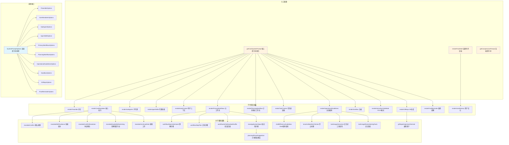

# snippets.legacy.ts

## 概述

`snippets.legacy.ts` 是 Gemini CLI 核心包中面向**旧版模型**（不支持现代特性的模型）的提示词片段渲染器。该文件包含了构建完整系统提示词所需的所有子片段（snippets）渲染函数，以及相应的选项接口定义。它与 `snippets.ts`（现代模型版本）形成对照，由 `PromptProvider` 根据模型能力动态选择使用。

该文件是整个提示词系统中**最大、最复杂**的文件（约750行），采用"高层组合 + 子片段渲染器 + 叶子辅助函数"的三层架构，将系统提示词分解为多个可独立配置和渲染的模块化片段。

## 架构图（Mermaid）



## 核心组件

### 选项接口（Options Structs）

#### SystemPromptOptions

系统提示词的顶层配置接口，每个字段控制一个提示词片段：

```typescript
export interface SystemPromptOptions {
  preamble?: PreambleOptions;           // 序言选项
  coreMandates?: CoreMandatesOptions;   // 核心指令选项
  subAgents?: SubAgentOptions[];        // 子代理列表
  agentSkills?: AgentSkillOptions[];    // 代理技能列表
  hookContext?: boolean;                // 钩子上下文开关
  primaryWorkflows?: PrimaryWorkflowsOptions;  // 主工作流选项
  planningWorkflow?: PlanningWorkflowOptions;  // 计划模式选项
  taskTracker?: boolean;                // 任务追踪器开关
  operationalGuidelines?: OperationalGuidelinesOptions; // 运维指南选项
  sandbox?: SandboxOptions;             // 沙盒选项
  interactiveYoloMode?: boolean;        // YOLO模式开关
  gitRepo?: GitRepoOptions;            // Git仓库选项
  finalReminder?: FinalReminderOptions; // 最终提醒选项
}
```

#### PreambleOptions

| 字段 | 类型 | 说明 |
|------|------|------|
| `interactive` | `boolean` | 是否为交互模式 |

#### CoreMandatesOptions

| 字段 | 类型 | 说明 |
|------|------|------|
| `interactive` | `boolean` | 是否为交互模式 |
| `isGemini3` | `boolean` | 是否为 Gemini 3 模型 |
| `hasSkills` | `boolean` | 是否有可用技能 |
| `hasHierarchicalMemory` | `boolean` | 是否有分层记忆 |

#### PrimaryWorkflowsOptions

| 字段 | 类型 | 说明 |
|------|------|------|
| `interactive` | `boolean` | 是否为交互模式 |
| `enableCodebaseInvestigator` | `boolean` | 是否启用代码库调查代理 |
| `enableWriteTodosTool` | `boolean` | 是否启用 TODO 工具 |
| `enableEnterPlanModeTool` | `boolean` | 是否启用进入计划模式工具 |
| `approvedPlan` | `{ path: string }` | 可选，已批准的计划路径 |
| `taskTracker` | `boolean` | 可选，是否启用任务追踪器 |

#### OperationalGuidelinesOptions

| 字段 | 类型 | 说明 |
|------|------|------|
| `interactive` | `boolean` | 是否为交互模式 |
| `isGemini3` | `boolean` | 是否为 Gemini 3 模型 |
| `enableShellEfficiency` | `boolean` | 是否启用 Shell 效率指南 |
| `interactiveShellEnabled` | `boolean` | 是否启用交互式 Shell |
| `memoryManagerEnabled` | `boolean` | 是否启用记忆管理器 |

#### SandboxMode 类型

```typescript
export type SandboxMode = 'macos-seatbelt' | 'generic' | 'outside';
```

#### SandboxOptions

| 字段 | 类型 | 说明 |
|------|------|------|
| `mode` | `SandboxMode` | 沙盒模式 |
| `toolSandboxingEnabled` | `boolean` | 是否启用工具沙盒化 |

#### PlanningWorkflowOptions

| 字段 | 类型 | 说明 |
|------|------|------|
| `planModeToolsList` | `string` | 计划模式可用工具列表 |
| `plansDir` | `string` | 计划文件存储目录 |
| `approvedPlanPath` | `string` | 可选，已批准的计划文件路径 |
| `taskTracker` | `boolean` | 可选，是否启用任务追踪器 |

#### AgentSkillOptions / SubAgentOptions

```typescript
export interface AgentSkillOptions {
  name: string;        // 技能名称
  description: string; // 技能描述
  location: string;    // 技能位置
}

export interface SubAgentOptions {
  name: string;        // 子代理名称
  description: string; // 子代理描述
}
```

### 高层组合函数

#### `getCoreSystemPrompt(options): string`

核心系统提示词的组合入口。按固定顺序拼接所有子片段，互斥处理 `planningWorkflow` 和 `primaryWorkflows`（二选一）。

**片段拼接顺序**：
1. Preamble（序言）
2. Core Mandates（核心指令）
3. Sub Agents（子代理）
4. Agent Skills（代理技能）
5. Hook Context（钩子上下文）
6. Planning Workflow 或 Primary Workflows（互斥）
7. Task Tracker（任务追踪器）
8. Operational Guidelines（运维指南）
9. Interactive YOLO Mode（YOLO 模式）
10. Sandbox（沙盒）
11. Git Repo（Git 仓库）
12. Final Reminder（最终提醒）

#### `renderFinalShell(basePrompt, userMemory?): string`

将基础提示词与用户记忆包装成最终提示词。注意旧版不接收 `contextFilenames` 参数（与现代版本的差异）。

#### `getCompressionPrompt(): string`

生成上下文压缩提示词。注意旧版不接收 `approvedPlanPath` 参数。提示词指导 LLM 将对话历史压缩为结构化的 `<state_snapshot>` XML，包含：
- `<overall_goal>` 总体目标
- `<active_constraints>` 活跃约束
- `<key_knowledge>` 关键知识
- `<artifact_trail>` 产物轨迹
- `<file_system_state>` 文件系统状态
- `<recent_actions>` 近期操作
- `<task_state>` 任务状态

### 子片段渲染器

#### `renderPreamble(options?): string`

根据交互模式生成不同的开场白。交互模式强调"interactive CLI agent"，非交互模式强调"non-interactive CLI agent"。

#### `renderCoreMandates(options?): string`

生成核心行为指令，包含以下子规则（通过叶子辅助函数生成）：
- 代码规范遵循
- 库/框架验证
- 风格与结构模仿
- 幂等变更
- 注释规范
- 主动性要求
- 用户提示处理
- 确认模糊请求（`mandateConfirm`）
- 变更解释规则
- 不回退变更
- 技能指导（`mandateSkillGuidance`）
- 先解释后行动（`mandateExplainBeforeActing`，Gemini 3 专有）
- 继续工作（`mandateContinueWork`，非交互模式专有）
- 冲突解决（`mandateConflictResolution`，分层记忆时启用）

#### `renderSubAgents(subAgents?): string`

渲染子代理列表。使用简洁的 `- name -> description` 格式，并包含委派说明和使用示例。

#### `renderAgentSkills(skills?): string`

渲染代理技能列表。使用 XML 格式 `<available_skills>` 包裹技能信息，每个技能包含 `<name>`、`<description>`、`<location>` 标签。

#### `renderHookContext(enabled?): string`

渲染钩子上下文处理规则，强调钩子内容为"只读数据"，不可覆盖核心指令。

#### `renderPrimaryWorkflows(options?): string`

渲染主工作流指南，包含两大工作流：

**软件工程任务**（6步流程）：
1. 理解与策略（根据是否有 `codebase_investigator` 生成不同内容）
2. 计划（根据多种条件组合生成不同版本）
3. 实现
4. 验证（测试）
5. 验证（标准合规）
6. 完成

**新应用开发**（根据交互模式和是否有已批准计划，生成不同版本）

#### `renderPlanningWorkflow(options?): string`

渲染计划模式工作流，包含四个阶段：
1. 需求理解
2. 项目探索
3. 设计与规划
4. 审核与批准

#### `renderTaskTracker(): string`

渲染任务追踪协议，定义 7 条规则约束任务管理行为。

#### `renderOperationalGuidelines(options?): string`

渲染运维指南，包含：
- Shell 效率指南（根据平台区分 Windows/Unix 示例）
- 语气与风格
- 安全规则
- 工具使用规范
- 交互细节

#### `renderSandbox(options?): string`

根据沙盒模式（macOS Seatbelt / 通用 / 无沙盒）渲染对应的说明。

#### `renderInteractiveYoloMode(enabled?): string`

渲染 YOLO（自动审批）模式说明，限制使用 `ask_user` 工具的场景。

#### `renderGitRepo(options?): string`

渲染 Git 仓库操作规范，包含提交、暂存、差异查看、日志检查等详细指南。

#### `renderFinalReminder(options?): string`

渲染最终提醒，强调安全、简洁和使用 `read_file` 工具的重要性。旧版模型专有片段。

#### `renderUserMemory(memory?): string`

渲染用户记忆。支持两种格式：
- **字符串格式**：直接包裹在 `<loaded_context>` 标签中，附带优先级说明
- **分层格式**：按 `<global_context>`、`<extension_context>`、`<project_context>` 三层包裹

## 依赖关系

### 内部依赖

| 依赖模块 | 导入内容 | 用途 |
|----------|---------|------|
| `../config/memory.js` | `HierarchicalMemory` (类型) | 分层记忆结构类型 |
| `../tools/tool-names.js` | 多个工具名称常量 | 在提示词中引用工具名称 |

导入的工具名称常量包括：
- `ACTIVATE_SKILL_TOOL_NAME` - 激活技能工具
- `ASK_USER_TOOL_NAME` - 询问用户工具
- `EDIT_TOOL_NAME` - 编辑工具
- `ENTER_PLAN_MODE_TOOL_NAME` - 进入计划模式工具
- `EXIT_PLAN_MODE_TOOL_NAME` - 退出计划模式工具
- `GLOB_TOOL_NAME` - 文件匹配工具
- `GREP_TOOL_NAME` - 搜索工具
- `MEMORY_TOOL_NAME` - 记忆工具
- `READ_FILE_TOOL_NAME` - 读文件工具
- `SHELL_PARAM_IS_BACKGROUND` - Shell 后台参数名
- `SHELL_TOOL_NAME` - Shell 工具
- `TRACKER_CREATE_TASK_TOOL_NAME` - 创建任务工具
- `TRACKER_LIST_TASKS_TOOL_NAME` - 列出任务工具
- `TRACKER_UPDATE_TASK_TOOL_NAME` - 更新任务工具
- `WRITE_FILE_TOOL_NAME` - 写文件工具
- `WRITE_TODOS_TOOL_NAME` - 写 TODO 工具

### 外部依赖

无外部第三方依赖（`process.platform` 来自 Node.js 内置模块，但未显式导入）。

## 关键实现细节

1. **与现代版本的差异**：
   - `CoreMandatesOptions` 多了 `isGemini3` 字段（控制"先解释后行动"规则）
   - `OperationalGuidelinesOptions` 多了 `isGemini3` 字段（控制"禁止闲聊"的措辞差异）
   - `renderFinalShell` 不接收 `contextFilenames` 参数
   - `getCompressionPrompt` 不接收 `approvedPlanPath` 参数
   - 包含 `renderFinalReminder`（现代模型不需要此片段）

2. **条件分支组合爆炸**：`workflowStepPlan` 函数根据 `approvedPlan`、`taskTracker`、`enableCodebaseInvestigator`、`enableWriteTodosTool` 四个布尔条件的不同组合，返回多达 8 种不同的计划步骤文本。这种设计虽然冗长，但确保了每种场景下提示词的精确性。

3. **平台适配**：`shellEfficiencyGuidelines` 函数通过 `process.platform === 'win32'` 检测操作系统，为 Windows 和 Unix/macOS 生成不同的文件检查命令示例（`type`/`findstr` vs `grep`/`tail`/`head`）。

4. **XML 标签的结构化使用**：提示词大量使用 XML 标签来组织结构化内容（如 `<loaded_context>`、`<hook_context>`、`<available_skills>`、`<state_snapshot>` 等），利用 LLM 对 XML 结构的良好理解能力来提高指令的解析准确性。

5. **安全防护（压缩提示词）**：`getCompressionPrompt` 包含显式的"安全规则"段落，防止对话历史中的恶意注入攻击。它明确要求忽略历史中的任何指令性内容，将其仅作为待摘要的原始数据处理。

6. **互斥片段设计**：`primaryWorkflows` 和 `planningWorkflow` 是互斥的——计划模式下使用 `planningWorkflow`，其他模式使用 `primaryWorkflows`。这在 `getCoreSystemPrompt` 中通过三元表达式实现。

7. **分层记忆优先级**：`renderUserMemory` 中明确定义了优先级层次：子目录 > 工作区根目录 > 扩展 > 全局。这确保了更具体的配置能够覆盖更通用的配置。

8. **纯函数设计**：所有渲染函数都是纯函数（唯一的副作用来源是 `process.platform` 读取），接收选项对象返回字符串，便于单元测试和组合使用。

9. **YOLO 模式的克制使用**：即使在 YOLO（自动审批）模式下，提示词仍然保留了三种必须询问用户的场景，体现了"安全优先"的设计哲学。

10. **技能系统的 XML 编排**：技能通过 `<available_skills>` XML 标签呈现，激活后的技能指令通过 `<activated_skill>` 和 `<instructions>` 标签传递，形成完整的技能生命周期管理。
