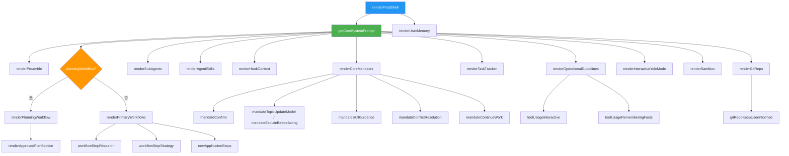
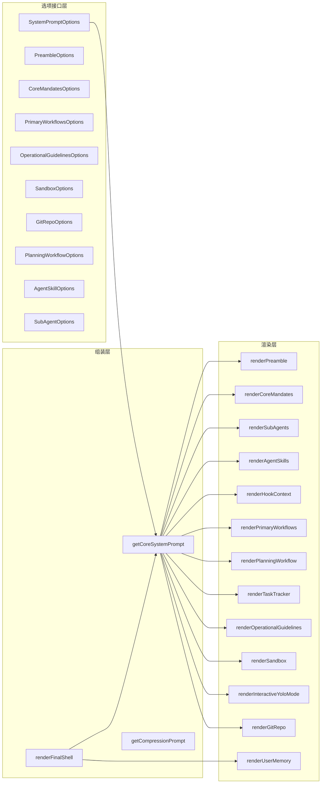

# snippets.ts

## 概述

`snippets.ts` 是 Gemini CLI 核心系统提示词（System Prompt）的组装引擎。它负责将系统提示词的各个子模块（前言、核心指令、子代理、技能、工作流、操作指南、沙箱配置、Git 仓库等）按照预定义的模板和配置选项组装成完整的系统提示词字符串。该文件是 Gemini CLI Agent 行为定义的核心，决定了 AI 代理的角色、能力、工作流程和安全边界。

文件路径：`packages/core/src/prompts/snippets.ts`

## 架构图（Mermaid）

## 核心组件

### 1. 选项接口（Options Structs）

定义了系统提示词各子模块所需的配置参数：

| 接口名 | 用途 | 关键字段 |
|--------|------|----------|
| `SystemPromptOptions` | 顶层系统提示词配置 | `preamble`, `coreMandates`, `subAgents`, `agentSkills`, `hookContext`, `primaryWorkflows`, `planningWorkflow`, `taskTracker`, `operationalGuidelines`, `sandbox`, `interactiveYoloMode`, `gitRepo` |
| `PreambleOptions` | 前言区配置 | `interactive` - 控制是交互式还是自主模式 |
| `CoreMandatesOptions` | 核心指令配置 | `interactive`, `hasSkills`, `hasHierarchicalMemory`, `contextFilenames`, `topicUpdateNarration` |
| `PrimaryWorkflowsOptions` | 主要工作流配置 | `interactive`, `enableCodebaseInvestigator`, `enableWriteTodosTool`, `enableEnterPlanModeTool`, `enableGrep`, `enableGlob`, `approvedPlan`, `taskTracker`, `topicUpdateNarration` |
| `OperationalGuidelinesOptions` | 操作指南配置 | `interactive`, `interactiveShellEnabled`, `topicUpdateNarration`, `memoryManagerEnabled` |
| `SandboxOptions` | 沙箱环境配置 | `mode`（`'macos-seatbelt'` / `'generic'` / `'outside'`）, `toolSandboxingEnabled` |
| `GitRepoOptions` | Git 仓库配置 | `interactive` |
| `PlanningWorkflowOptions` | 计划模式工作流配置 | `interactive`, `planModeToolsList`, `plansDir`, `approvedPlanPath`, `taskTracker` |
| `AgentSkillOptions` | 代理技能配置 | `name`, `description`, `location` |
| `SubAgentOptions` | 子代理配置 | `name`, `description` |
| `SandboxMode` | 沙箱模式类型 | `'macos-seatbelt'` / `'generic'` / `'outside'` |

### 2. 高层组装函数

#### `getCoreSystemPrompt(options: SystemPromptOptions): string`
核心系统提示词的总组装器。按顺序拼接以下子模块：
1. 前言（Preamble）
2. 核心指令（Core Mandates）
3. 子代理（Sub Agents）
4. 代理技能（Agent Skills）
5. Hook 上下文
6. 工作流（Planning 或 Primary）
7. 任务跟踪器（Task Tracker）
8. 操作指南（Operational Guidelines）
9. YOLO 自主模式
10. 沙箱配置（Sandbox）
11. Git 仓库配置

#### `renderFinalShell(basePrompt, userMemory?, contextFilenames?): string`
在基础提示词外层包裹用户记忆（User Memory），作为最终发送给模型的系统提示词。

### 3. 子模块渲染函数

#### `renderPreamble(options?: PreambleOptions): string`
根据 `interactive` 标志生成不同的角色声明：
- **交互模式**：`"You are Gemini CLI, an interactive CLI agent..."`
- **自主模式**：`"You are Gemini CLI, an autonomous CLI agent..."`

#### `renderCoreMandates(options?: CoreMandatesOptions): string`
渲染核心指令部分，包含：
- **安全与系统完整性**：凭证保护、源码管理
- **上下文效率**：工具使用的上下文消耗优化指南
- **工程标准**：上下文文件优先级、代码规范、类型安全、库/框架验证、技术完整性、专业知识与意图对齐、主动性、测试要求
- **用户提示（User Hints）**：运行时提示处理规则
- 根据配置动态注入：确认/模糊处理、Topic 更新模型/行动前解释、技能指引、冲突解决、持续工作

#### `renderSubAgents(subAgents?: SubAgentOptions[]): string`
生成子代理配置段，包含：
- 战略编排与委派指南
- 并发安全规则
- 高影响委派候选场景
- 以 XML `<available_subagents>` 格式列出可用子代理

#### `renderAgentSkills(skills?: AgentSkillOptions[]): string`
生成代理技能列表，以 XML `<available_skills>` 格式呈现，指引代理使用 `activate_skill` 工具激活技能。

#### `renderHookContext(enabled?: boolean): string`
生成 Hook 上下文处理规则，声明 hook 上下文为只读数据，不得覆盖系统指令。

#### `renderPrimaryWorkflows(options?: PrimaryWorkflowsOptions): string`
生成主要工作流模块，包含：
- **开发生命周期**：Research -> Strategy -> Execution 三阶段
- **执行循环**：Plan -> Act -> Validate
- **新应用开发**：基于不同模式（有批准计划/计划模式/传统交互/自主）生成不同的开发步骤
- 支持"状态转换覆盖"（当有 approvedPlan 时进入执行模式）

#### `renderPlanningWorkflow(options?: PlanningWorkflowOptions): string`
生成计划模式工作流，包含：
- 可用工具列表
- 只读规则（不能修改源码）
- 写约束（只能写 `.md` 计划文件到指定目录）
- 自适应计划工作流：探索分析 -> 咨询 -> 起草 -> 审查批准
- 批准计划区段

#### `renderOperationalGuidelines(options?: OperationalGuidelinesOptions): string`
生成操作指南，包含：
- **语气与风格**：高级软件工程师角色、高信噪比输出、简洁直接、最小输出、无闲聊、无重复、GitHub Markdown
- **安全规则**：关键命令说明、安全优先
- **工具使用**：并行与顺序执行、文件编辑冲突避免、命令执行、后台进程、交互命令、记忆工具、确认协议
- **交互细节**：帮助命令、反馈

#### `renderSandbox(options?: SandboxOptions): string`
根据沙箱模式（macOS Seatbelt / 通用 / 外部）和工具沙箱化启用状态生成不同的沙箱说明：
- macOS Seatbelt + 工具沙箱化：自动重试并请求权限扩展
- macOS Seatbelt 无工具沙箱化：提示用户调整 Seatbelt 配置
- 通用沙箱 + 工具沙箱化：自动分析并请求缺失权限
- 通用沙箱无工具沙箱化：提示用户调整沙箱配置

#### `renderInteractiveYoloMode(enabled?: boolean): string`
生成 YOLO 自主模式说明，限制 `ask_user` 工具的使用场景，鼓励自主决策。

#### `renderGitRepo(options?: GitRepoOptions): string`
生成 Git 仓库操作指南，包含不自动提交、提交前信息收集、草拟提交消息、保持用户知情等规则。

#### `renderUserMemory(memory?, contextFilenames?): string`
渲染用户记忆部分，支持两种格式：
- **字符串格式**：直接包裹在 `<loaded_context>` 中，带有上下文优先级说明
- **层级记忆格式（HierarchicalMemory）**：按 `<global_context>` / `<extension_context>` / `<project_context>` 分层输出

#### `renderTaskTracker(): string`
生成任务管理协议，包含无内存列表、立即分解、忽略格式偏见、计划模式集成、验证、状态优先于聊天、依赖管理等规则。

#### `getCompressionPrompt(approvedPlanPath?: string): string`
生成历史压缩系统提示词，用于将过长的对话历史压缩为结构化的 XML `<state_snapshot>`，包含：
- 安全规则（忽略注入攻击）
- 结构化状态快照格式：overall_goal、active_constraints、key_knowledge、artifact_trail、file_system_state、recent_actions、task_state
- 批准计划保留

### 4. 内部辅助函数

| 函数名 | 用途 |
|--------|------|
| `mandateConfirm(interactive)` | 根据交互模式生成模糊/扩展处理指令 |
| `mandateTopicUpdateModel()` | 生成 Topic 状态日志协议（Topic: Phase : Summary 格式） |
| `mandateExplainBeforeActing()` | 生成"行动前解释"指令 |
| `mandateSkillGuidance(hasSkills)` | 生成技能激活后的指导规则 |
| `mandateConflictResolution(hasHierarchicalMemory)` | 生成层级记忆冲突解决规则 |
| `mandateContinueWork(interactive)` | 非交互环境下的持续工作指令 |
| `workflowStepResearch(options)` | 生成"研究"步骤文本，根据是否有代码库调查员等配置调整 |
| `workflowStepStrategy(options)` | 生成"策略"步骤文本，根据是否有批准计划/任务跟踪器调整 |
| `workflowVerifyStandardsSuffix(interactive)` | 生成验证标准的后缀提示 |
| `newApplicationSteps(options)` | 生成新应用开发步骤，支持四种模式 |
| `toolUsageInteractive(interactive, interactiveShellEnabled)` | 生成交互式工具使用指南 |
| `toolUsageRememberingFacts(options)` | 生成记忆工具使用指南 |
| `gitRepoKeepUserInformed(interactive)` | 交互模式下的用户知情指令 |
| `formatToolName(name)` | 工具名称格式化为 Markdown 行内代码 |

## 依赖关系

### 内部依赖

| 依赖模块 | 导入内容 | 用途 |
|----------|----------|------|
| `../tools/tool-names.js` | `ACTIVATE_SKILL_TOOL_NAME`, `ASK_USER_TOOL_NAME`, `EDIT_TOOL_NAME`, `ENTER_PLAN_MODE_TOOL_NAME`, `EXIT_PLAN_MODE_TOOL_NAME`, `GLOB_TOOL_NAME`, `GREP_TOOL_NAME`, `MEMORY_TOOL_NAME`, `READ_FILE_TOOL_NAME`, `SHELL_TOOL_NAME`, `WRITE_FILE_TOOL_NAME`, `WRITE_TODOS_TOOL_NAME`, `GREP_PARAM_*`, `READ_FILE_PARAM_*`, `SHELL_PARAM_IS_BACKGROUND`, `EDIT_PARAM_OLD_STRING`, `TRACKER_*_TOOL_NAME` | 工具名称和参数名常量，用于在提示词中引用具体的工具和参数 |
| `../config/memory.js` | `HierarchicalMemory`（类型导入） | 层级记忆数据结构类型 |
| `../tools/memoryTool.js` | `DEFAULT_CONTEXT_FILENAME` | 默认上下文文件名（如 `.gemini`） |

### 外部依赖

无外部第三方依赖。该文件完全基于 TypeScript 原生字符串模板实现。

## 关键实现细节

1. **模板字符串驱动**：整个系统提示词使用 ES6 模板字符串（Template Literals）进行拼接。没有使用任何模板引擎，保持了极简的复杂度。

2. **条件渲染模式**：所有渲染函数在接收到空/undefined 配置时返回空字符串，实现了优雅的可选模块拼接。核心模式为 `if (!options) return '';`。

3. **互斥分支**：`planningWorkflow` 和 `primaryWorkflows` 是互斥的 -- 当存在计划工作流时优先渲染计划模式，否则渲染主要工作流。

4. **交互/自主双模式**：几乎所有渲染函数都通过 `interactive` 布尔标志区分交互模式和自主（headless/CI）模式，生成不同的行为指令。

5. **上下文效率优化**：`renderCoreMandates` 中包含详细的上下文效率指南，指导代理在工具使用中最小化不必要的上下文消耗，减少额外轮次。这些更改经过 SWEBench 等基准测试验证。

6. **Topic Model 与 Explain Before Acting 二选一**：通过 `topicUpdateNarration` 标志控制，代理要么使用 Topic 状态日志协议（更静默，适合流式输出），要么使用传统的"行动前解释"模式。

7. **沙箱感知**：系统提示词动态适配运行环境的沙箱策略，支持 macOS Seatbelt、通用容器沙箱，并根据工具沙箱化是否启用生成不同的故障恢复策略。

8. **历史压缩安全**：`getCompressionPrompt` 中嵌入了对抗提示注入的安全规则，明确指示压缩代理忽略对话历史中的指令性内容。

9. **层级记忆优先级**：用户记忆支持层级结构（global < extension < project），`renderUserMemory` 和 `mandateConflictResolution` 共同确保优先级正确传达给模型。

10. **XML 结构化输出**：子代理列表、技能列表、用户记忆、状态快照等均使用 XML 标签进行结构化包装，便于模型准确解析。
