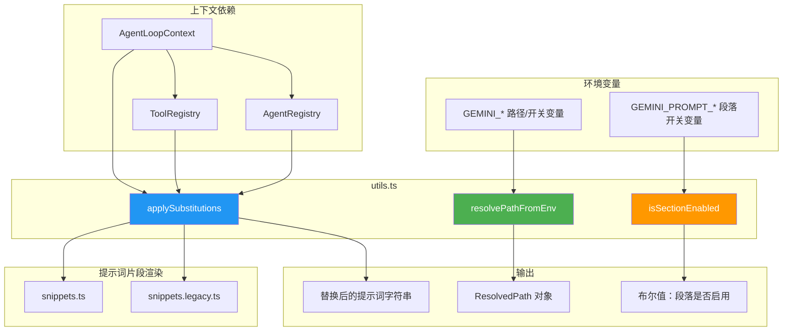
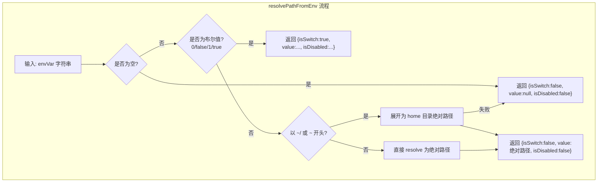
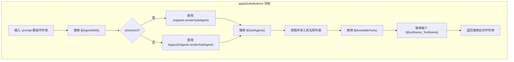

# utils.ts

## 概述

`utils.ts` 是 Gemini CLI 提示词（Prompt）子系统的工具函数集合。它提供三个核心实用功能：

1. **环境变量路径解析**：将环境变量值解析为文件路径或布尔开关
2. **提示词模板替换**：对系统提示词字符串进行变量插值，动态注入技能、子代理、工具列表等内容
3. **提示词段开关检测**：通过环境变量控制特定提示词段落的启用/禁用

该文件连接了配置层（环境变量、AgentLoopContext）和提示词生成层（snippets），是提示词动态组装流程中不可或缺的桥梁。

文件路径：`packages/core/src/prompts/utils.ts`

## 架构图（Mermaid）







## 核心组件

### 1. 类型定义

#### `ResolvedPath`

```typescript
export type ResolvedPath = {
  isSwitch: boolean;   // 是否为布尔开关值（0/false/1/true）
  value: string | null; // 解析后的路径或开关值字符串
  isDisabled: boolean;  // 如果是开关，是否为禁用状态（0 或 false）
};
```

表示环境变量解析的三种可能结果：
- **空值**：`{isSwitch: false, value: null, isDisabled: false}`
- **布尔开关**：`{isSwitch: true, value: "true"/"false"/"0"/"1", isDisabled: true/false}`
- **文件路径**：`{isSwitch: false, value: "/absolute/path", isDisabled: false}`

### 2. 函数详解

#### `resolvePathFromEnv(envVar?: string): ResolvedPath`

将环境变量的字符串值解析为路径或开关。处理逻辑：

1. **空值检测**：如果环境变量为空或仅含空白，返回空结果
2. **布尔开关检测**：如果值为 `'0'`、`'false'`、`'1'`、`'true'`（不区分大小写），识别为布尔开关
3. **波浪号展开**：如果路径以 `~/` 或 `~` 开头，展开为用户主目录的绝对路径
4. **路径解析**：使用 `path.resolve()` 将相对路径转为绝对路径

波浪号展开失败时（如无法获取主目录），静默降级返回空结果，不抛出异常。

#### `applySubstitutions(prompt, context, skillsPrompt, isGemini3?): string`

对提示词模板字符串执行变量替换。支持以下模板变量：

| 模板变量 | 替换内容 | 来源 |
|----------|----------|------|
| `${AgentSkills}` | 代理技能的提示词片段 | `skillsPrompt` 参数 |
| `${SubAgents}` | 子代理列表渲染结果 | `snippets.renderSubAgents()` 或 `legacySnippets.renderSubAgents()` |
| `${AvailableTools}` | 所有可用工具名称列表（Markdown 列表格式） | `ToolRegistry.getAllToolNames()` |
| `${<toolName>_ToolName}` | 各个工具的具体名称 | 遍历 `allToolNames` 动态生成 |

**关键分支**：通过 `isGemini3` 参数决定使用新版 `snippets` 还是旧版 `legacySnippets` 来渲染子代理部分，实现了新旧提示词系统的兼容。

**工具名称替换**：遍历所有已注册工具名称，为每个工具生成 `${<toolName>_ToolName}` 形式的模板变量并替换。使用 `\b` 单词边界确保精确匹配。

#### `isSectionEnabled(key: string): boolean`

通过环境变量 `GEMINI_PROMPT_<KEY>` 控制特定提示词段落是否启用。

- 环境变量名格式：`GEMINI_PROMPT_` + key 的大写形式
- **默认启用**：仅当环境变量值为 `'0'` 或 `'false'`（不区分大小写）时返回 `false`
- 未设置环境变量时视为启用

## 依赖关系

### 内部依赖

| 依赖模块 | 导入内容 | 用途 |
|----------|----------|------|
| `../utils/paths.js` | `homedir` | 获取用户主目录路径，用于波浪号展开 |
| `../utils/debugLogger.js` | `debugLogger` | 调试日志记录器，用于记录路径解析失败的警告 |
| `./snippets.js` | `* as snippets` | 新版提示词片段渲染模块（Gemini 3 使用） |
| `./snippets.legacy.js` | `* as legacySnippets` | 旧版提示词片段渲染模块（非 Gemini 3 使用） |
| `../config/agent-loop-context.js` | `AgentLoopContext`（类型导入） | 代理循环上下文类型，包含配置和工具注册表 |

### 外部依赖

| 依赖包 | 导入内容 | 用途 |
|--------|----------|------|
| `node:path` | `path` | Node.js 路径处理模块，用于 `path.join()` 和 `path.resolve()` |
| `node:process` | `process` | Node.js 进程模块，用于读取环境变量 `process.env` |

## 关键实现细节

1. **三态解析设计**：`resolvePathFromEnv` 返回的 `ResolvedPath` 类型区分了三种语义（空、开关、路径），调用方可以清晰地针对不同情况做出相应处理。

2. **新旧提示词系统兼容**：`applySubstitutions` 通过 `isGemini3` 参数在 `snippets` 和 `legacySnippets` 之间切换，实现了 Gemini 3 和更早版本提示词渲染逻辑的平滑过渡。

3. **正则替换安全**：工具名称替换使用 `\b` 单词边界和转义的 `${}` 语法，避免误匹配。但需注意工具名称中如果包含正则特殊字符可能导致问题（当前代码未对工具名称做转义）。

4. **默认启用策略**：`isSectionEnabled` 采用"默认启用，显式禁用"策略 -- 只有当环境变量明确设置为 `'0'` 或 `'false'` 时才禁用，其他所有情况（包括未设置）都视为启用。这符合"最大功能"的默认行为。

5. **容错降级**：`resolvePathFromEnv` 在 `homedir()` 调用失败时捕获异常并返回空结果，通过 `debugLogger.warn` 记录警告但不中断程序流程。

6. **动态工具名称注入**：`applySubstitutions` 中的工具名称替换是完全动态的 -- 它不硬编码任何工具名称，而是从 `ToolRegistry` 获取所有已注册工具并逐一生成替换变量。这意味着新注册的工具会自动获得模板变量支持。
