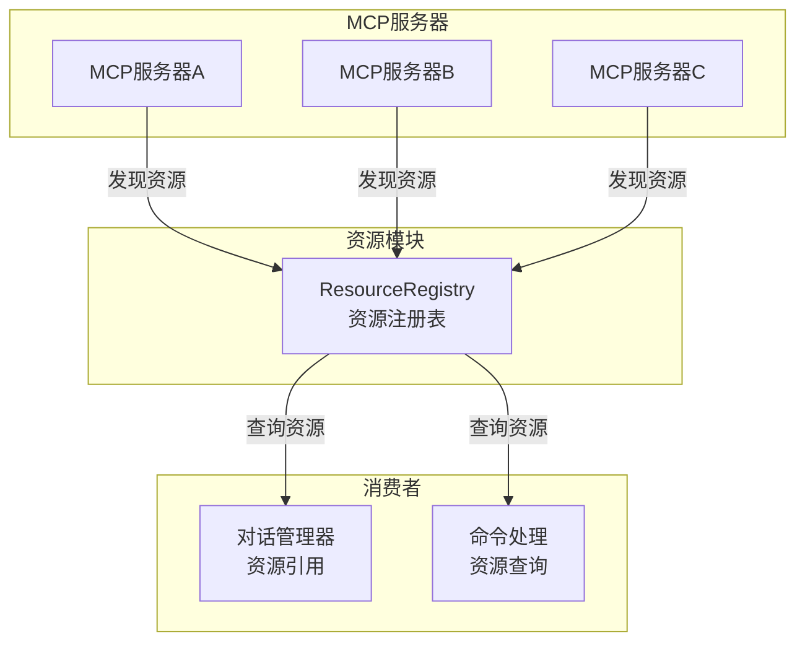

# resources

## 概述

`resources` 目录提供了 MCP (Model Context Protocol) 资源的注册和管理功能。它跟踪从各 MCP 服务器发现的资源（如文件、数据源等），使系统中的其他组件能够查询和引用这些资源。该模块作为 MCP 资源的统一注册表，支持按服务器名称和 URI 进行资源的增删改查。

## 目录结构

```
resources/
├── resource-registry.ts        # 资源注册表（MCP 资源的管理和查询）
└── resource-registry.test.ts   # resource-registry 的单元测试
```

## 架构图



## 核心组件

### `ResourceRegistry` (resource-registry.ts)
- **职责**: 管理从 MCP 服务器发现的资源的集中注册表
- **存储结构**: `Map<string, MCPResource>`，键格式为 `serverName::uri`
- **关键方法**:

| 方法 | 职责 |
|------|------|
| `setResourcesForServer(serverName, resources)` | 替换指定服务器的所有资源 |
| `getAllResources()` | 获取所有已注册资源 |
| `findResourceByUri(identifier)` | 按 `serverName:uri` 格式查找资源 |
| `getResourcesByServer(serverName)` | 获取指定服务器的所有资源 (按 URI 排序) |
| `removeResourcesByServer(serverName)` | 移除指定服务器的所有资源 |
| `clear()` | 清空所有资源 |

### `MCPResource` 接口
扩展 MCP SDK 的 `Resource` 接口，增加：
- `serverName: string` - 来源 MCP 服务器名称
- `discoveredAt: number` - 资源发现的时间戳

## 依赖关系

### 内部依赖
无内部模块依赖。

### 外部依赖
- `@modelcontextprotocol/sdk/types.js` - MCP SDK 的 `Resource` 类型

## 数据流

### 资源发现和注册流程
1. MCP 服务器连接建立后，触发资源发现
2. 获取到的资源列表通过 `setResourcesForServer()` 注册到注册表
3. 注册时自动清除该服务器之前的资源并记录发现时间戳
4. 其他组件通过 `findResourceByUri()` 或 `getResourcesByServer()` 查询资源
5. MCP 服务器断开时，通过 `removeResourcesByServer()` 清理资源
