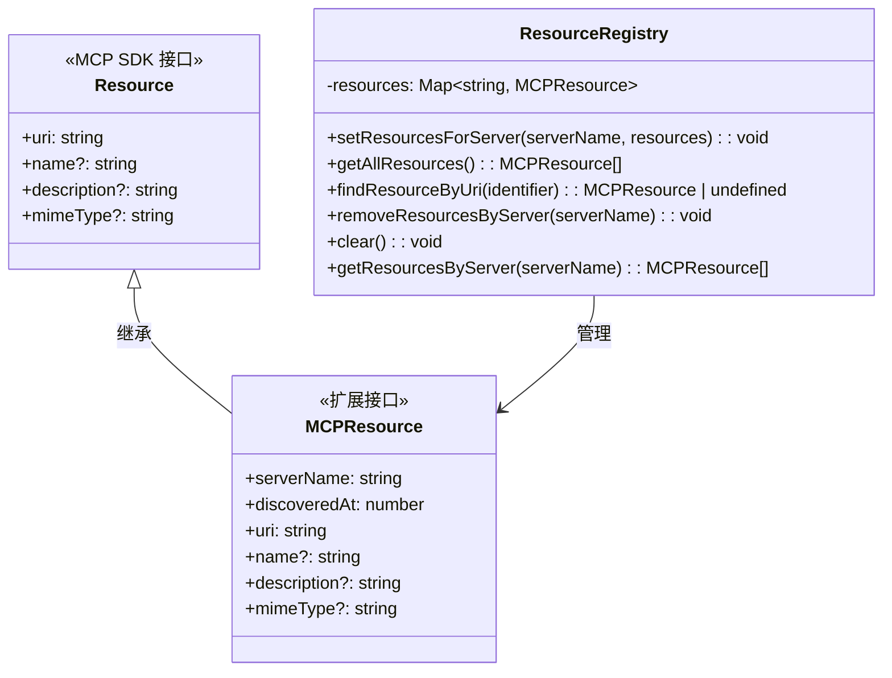
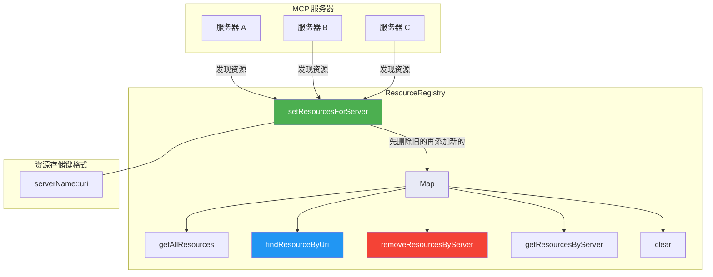
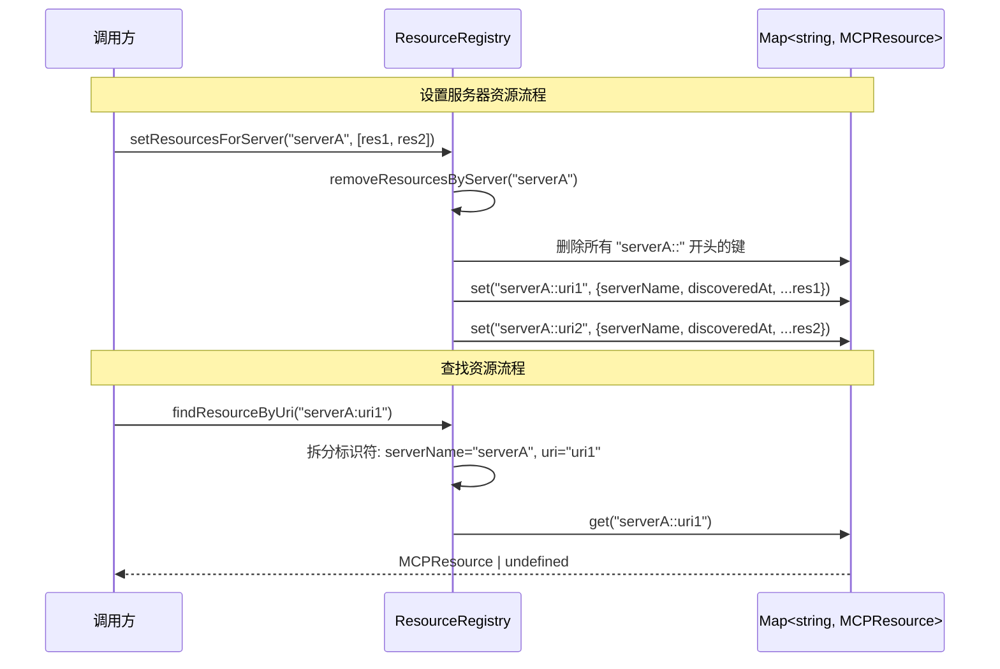

# resource-registry.ts

## 概述

`resource-registry.ts` 是 Gemini CLI 中用于管理 MCP（Model Context Protocol）服务器资源的注册表。它维护一个内存中的资源映射表，追踪从各个 MCP 服务器发现的资源（如文件、数据集等），使系统的其他组件能够查询这些资源并将其包含在对话上下文中。

该类采用经典的注册表模式（Registry Pattern），以 `serverName::uri` 为键构建唯一索引，支持按服务器批量更新、按标识符查找、按服务器过滤等操作。

文件路径：`packages/core/src/resources/resource-registry.ts`

## 架构图（Mermaid）







## 核心组件

### 1. 类型定义

#### `MCPResource` 接口

```typescript
export interface MCPResource extends Resource {
  serverName: string;     // 提供此资源的 MCP 服务器名称
  discoveredAt: number;   // 资源被发现的时间戳（毫秒，Date.now()）
}
```

扩展了 MCP SDK 的 `Resource` 接口，额外记录了资源的来源服务器和发现时间。继承了 `Resource` 的 `uri`、`name`、`description`、`mimeType` 等标准字段。

#### `DiscoveredMCPResource` 类型别名

```typescript
export type DiscoveredMCPResource = MCPResource;
```

`MCPResource` 的类型别名，语义上强调"已发现的"MCP 资源。可能用于与其他上下文中区分资源状态。

### 2. 辅助函数

#### `resourceKey(serverName, uri): string`

```typescript
const resourceKey = (serverName: string, uri: string): string =>
  `${serverName}::${uri}`;
```

生成 Map 的存储键，格式为 `serverName::uri`。使用双冒号 `::` 作为分隔符，区别于 `findResourceByUri` 中使用的单冒号 `:` 标识符格式。

### 3. `ResourceRegistry` 类

核心注册表类，使用 `Map<string, MCPResource>` 作为内部存储。

#### 方法详解

| 方法 | 签名 | 用途 |
|------|------|------|
| `setResourcesForServer` | `(serverName: string, resources: Resource[]): void` | 替换指定服务器的所有资源。先移除该服务器的旧资源，再添加新资源。跳过没有 `uri` 的资源。 |
| `getAllResources` | `(): MCPResource[]` | 返回所有已注册资源的数组。 |
| `findResourceByUri` | `(identifier: string): MCPResource \| undefined` | 通过 `serverName:uri` 格式的标识符查找资源。注意标识符使用单冒号 `:` 分隔。 |
| `removeResourcesByServer` | `(serverName: string): void` | 移除指定服务器的所有资源。遍历所有键，删除以 `serverName::` 开头的条目。 |
| `clear` | `(): void` | 清空所有已注册资源。 |
| `getResourcesByServer` | `(serverName: string): MCPResource[]` | 获取指定服务器的所有资源，按 URI 字母顺序排序返回。 |

#### `setResourcesForServer` 详细流程

1. 调用 `removeResourcesByServer` 移除该服务器的所有旧资源
2. 记录当前时间戳作为 `discoveredAt`
3. 遍历资源数组，跳过没有 `uri` 的资源
4. 使用 `resourceKey(serverName, uri)` 生成键，将扩展后的 `MCPResource` 存入 Map

#### `findResourceByUri` 详细流程

1. 查找标识符中第一个冒号 `:` 的位置
2. 如果冒号位置 <= 0（未找到或在开头），返回 `undefined`
3. 冒号前的部分作为 `serverName`，冒号后的部分作为 `uri`
4. 使用 `resourceKey` 生成内部键并从 Map 中查找

**注意**：标识符格式 `serverName:uri` 使用单冒号，而内部存储键 `serverName::uri` 使用双冒号。这意味着 `findResourceByUri("myserver:file:///data.txt")` 会被解析为 `serverName="myserver"`, `uri="file:///data.txt"`，正确处理了 URI 中可能包含的冒号。

## 依赖关系

### 内部依赖

无内部项目依赖。

### 外部依赖

| 依赖包 | 导入内容 | 用途 |
|--------|----------|------|
| `@modelcontextprotocol/sdk/types.js` | `Resource`（类型导入） | MCP SDK 标准资源接口，作为 `MCPResource` 的基础类型 |

## 关键实现细节

1. **双冒号分隔符设计**：内部存储键使用 `::` 双冒号分隔 `serverName` 和 `uri`，而对外暴露的 `findResourceByUri` 方法接受的标识符使用单冒号 `:` 分隔。这个设计是有意为之的 -- 因为 URI 本身可能包含冒号（如 `file:///path`），使用第一个冒号作为分隔点可以正确拆分，而内部键使用双冒号确保不会与 URI 中的单冒号冲突。

2. **替换语义（Replace Semantics）**：`setResourcesForServer` 采用"先删后加"的替换策略，而非增量更新。每次调用都会完全替换该服务器的所有资源。这简化了资源同步逻辑，确保注册表始终与 MCP 服务器的最新状态一致。

3. **批量时间戳**：同一批次设置的资源共享相同的 `discoveredAt` 时间戳，这是在循环外部计算的。这有利于按批次追踪资源发现的时间线。

4. **URI 校验**：`setResourcesForServer` 静默跳过没有 `uri` 的资源（`if (!resource.uri) continue`），不抛出异常。这使得注册表对不完整的资源数据具有容错性。

5. **排序保证**：`getResourcesByServer` 返回的结果按 URI 字母顺序排序（`localeCompare`），确保输出稳定性。而 `getAllResources` 不保证顺序，返回 Map 的插入顺序。

6. **键遍历安全**：`removeResourcesByServer` 在遍历删除键时，先通过 `Array.from(this.resources.keys())` 创建键的副本，避免在迭代 Map 时修改它导致的未定义行为。

7. **轻量级设计**：整个注册表仅依赖 MCP SDK 的类型定义，没有其他外部运行时依赖。类本身不包含事件发射、持久化或缓存逻辑，是一个纯粹的内存数据结构。
