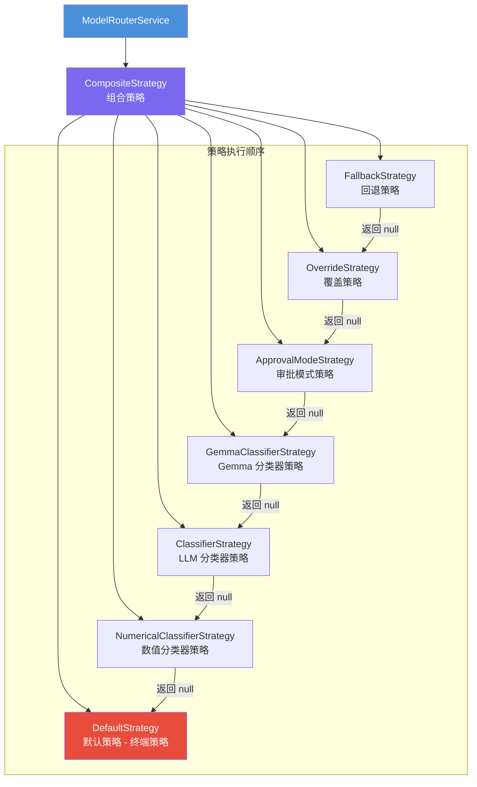
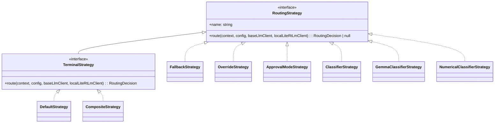
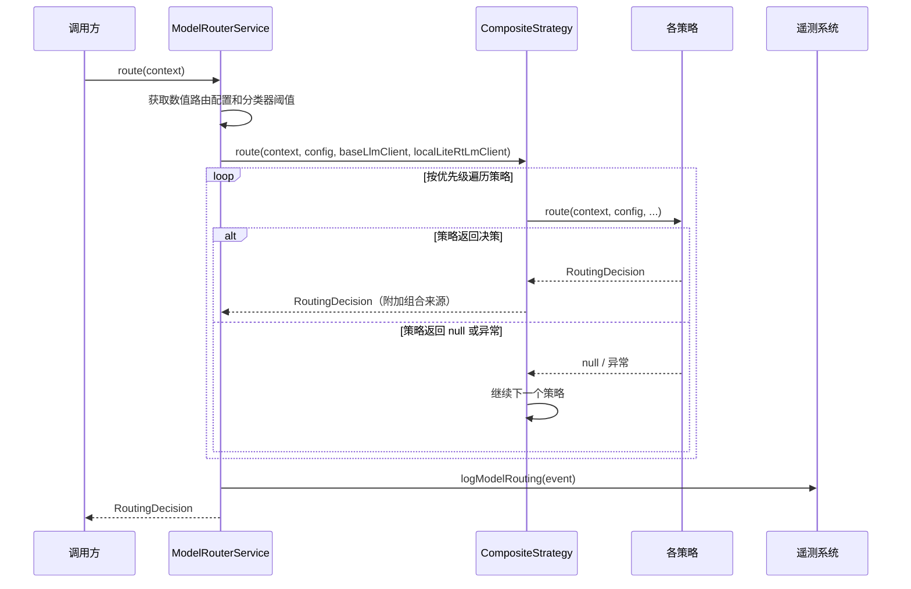

# routing

## 概述

`routing` 模块负责 Gemini CLI 的**模型路由决策**。它根据用户请求的复杂度、当前审批模式、模型可用性等因素，智能选择最合适的 LLM 模型（如 Gemini Pro 或 Gemini Flash）来处理请求。该模块采用**策略模式**和**责任链模式**，将路由逻辑解耦为多个独立的策略组件，通过组合策略按优先级依次尝试。

## 目录结构

```
routing/
├── modelRouterService.ts          # 模型路由服务（入口类）
├── modelRouterService.test.ts     # 路由服务单元测试
├── routingStrategy.ts             # 路由策略核心接口定义
└── strategies/                    # 各种路由策略实现
    ├── approvalModeStrategy.ts    # 审批模式策略
    ├── classifierStrategy.ts      # LLM 分类器策略
    ├── compositeStrategy.ts       # 组合策略（责任链）
    ├── defaultStrategy.ts         # 默认策略（兜底）
    ├── fallbackStrategy.ts        # 回退策略（模型不可用时）
    ├── gemmaClassifierStrategy.ts # Gemma 本地分类器策略
    ├── numericalClassifierStrategy.ts # 数值分类器策略
    ├── overrideStrategy.ts        # 覆盖策略（用户指定模型）
    └── *.test.ts                  # 各策略的单元测试
```

## 架构图





## 核心组件

### 接口定义 (`routingStrategy.ts`)

| 接口 | 说明 |
|------|------|
| `RoutingDecision` | 路由决策结果，包含选定的模型名称和元数据（来源、延迟、推理原因） |
| `RoutingContext` | 路由上下文，包含对话历史、当前请求、中断信号、请求的模型 |
| `RoutingStrategy` | 路由策略接口，`route()` 可返回 `null` 表示不适用 |
| `TerminalStrategy` | 终端策略接口，`route()` 保证返回决策，不会返回 `null` |

### ModelRouterService (`modelRouterService.ts`)

路由服务的入口类，职责包括：
- 初始化策略链：按优先级组装所有策略到 `CompositeStrategy`
- 提供 `route(context)` 方法执行路由决策
- 异常处理：路由失败时使用配置的默认模型
- 遥测日志：记录每次路由决策事件（模型、来源、延迟、是否失败）

### 策略链执行顺序

1. **FallbackStrategy** - 检查模型是否可用，不可用则选择备用模型
2. **OverrideStrategy** - 用户显式指定模型时直接使用
3. **ApprovalModeStrategy** - 根据审批模式（PLAN/实现）路由到不同模型
4. **GemmaClassifierStrategy** - 使用本地 Gemma 模型进行任务分类（可选）
5. **ClassifierStrategy** - 使用远程 LLM 进行任务复杂度分类
6. **NumericalClassifierStrategy** - 使用数值评分进行复杂度分类
7. **DefaultStrategy** - 兜底策略，返回配置的默认模型

## 依赖关系

### 内部依赖

| 模块 | 用途 |
|------|------|
| `config/config` | 获取模型配置、审批模式、分类器阈值等 |
| `config/models` | 模型名称解析和别名处理 |
| `core/baseLlmClient` | 远程 LLM 客户端（分类器策略使用） |
| `core/localLiteRtLmClient` | 本地 LiteRT 模型客户端（Gemma 策略使用） |
| `availability/policyHelpers` | 模型可用性检查 |
| `policy/types` | 审批模式枚举（`ApprovalMode`） |
| `telemetry/loggers` | 路由事件日志记录 |
| `utils/debugLogger` | 调试日志 |
| `utils/messageInspectors` | 过滤对话历史中的函数调用 |
| `utils/promptIdContext` | 获取 Prompt ID |

### 外部依赖

| 包 | 用途 |
|---|------|
| `@google/genai` | Google GenAI SDK（Content 类型、创建用户内容） |
| `zod` | 分类器响应的 schema 验证 |

## 数据流


