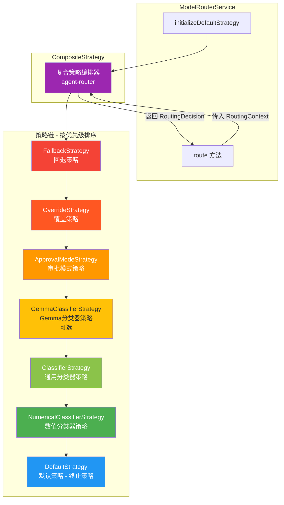
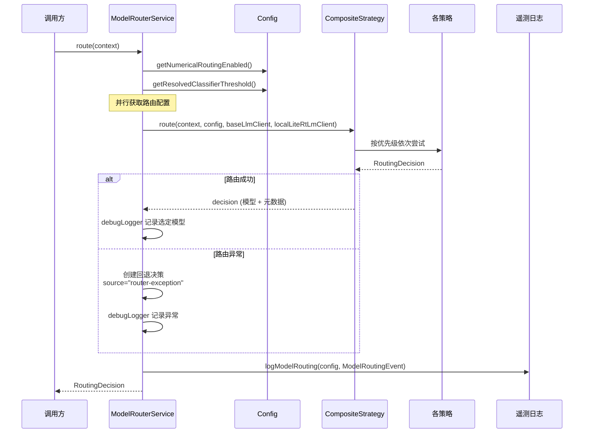
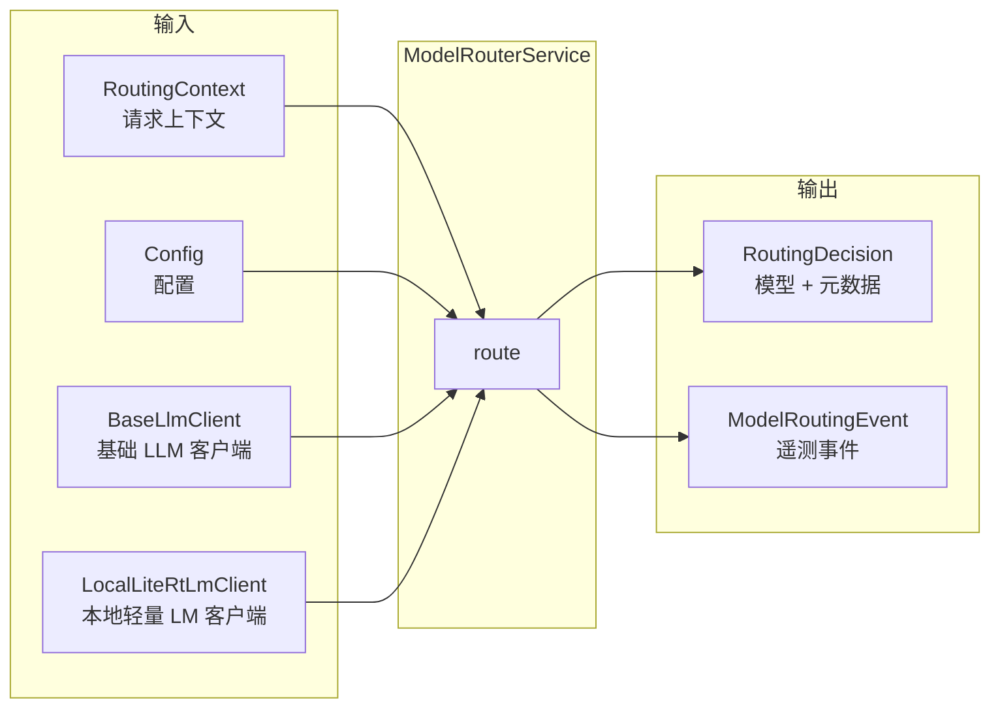

# modelRouterService.ts

## 概述

`modelRouterService.ts` 是 Gemini CLI 的模型路由服务，负责根据请求上下文动态决定将请求路由到哪个 AI 模型。它是整个模型路由子系统的入口点和协调器。

该服务在初始化时构建一个由多个路由策略组成的复合策略链（Composite Strategy Chain），在运行时对每个请求执行策略链以做出路由决策。决策过程包含完整的遥测日志记录和异常处理机制。

核心设计理念是**责任链模式**（Chain of Responsibility）：多个路由策略按优先级排列，依次尝试做出决策，直到某个策略给出明确结果或由默认策略兜底。

文件路径：`packages/core/src/routing/modelRouterService.ts`

## 架构图（Mermaid）







## 核心组件

### 1. `ModelRouterService` 类

模型路由的中央服务类，封装了策略初始化和路由执行逻辑。

#### 私有成员

| 成员 | 类型 | 用途 |
|------|------|------|
| `config` | `Config` | 全局配置对象，提供模型设置、路由开关、LLM 客户端等 |
| `strategy` | `TerminalStrategy` | 初始化后的终止策略（实际为 CompositeStrategy 实例） |

#### 构造函数

```typescript
constructor(config: Config)
```

接收全局配置对象，立即调用 `initializeDefaultStrategy()` 构建策略链。

### 2. `initializeDefaultStrategy(): TerminalStrategy`

构建路由策略链的核心方法。按以下优先级顺序组装策略：

| 优先级 | 策略 | 说明 |
|--------|------|------|
| 1（最高） | `FallbackStrategy` | 回退策略 -- 处理需要强制回退到特定模型的场景 |
| 2 | `OverrideStrategy` | 覆盖策略 -- 处理用户或配置显式指定模型的场景 |
| 3 | `ApprovalModeStrategy` | 审批模式策略 -- 在审批模式（如计划模式）下的路由逻辑 |
| 4（可选） | `GemmaClassifierStrategy` | Gemma 分类器策略 -- 使用 Gemma 模型进行任务分类路由，仅在配置启用时加入 |
| 5 | `ClassifierStrategy` | 通用分类器策略 -- 基于通用分类逻辑的路由 |
| 6 | `NumericalClassifierStrategy` | 数值分类器策略 -- 基于数值评分的分类路由 |
| 7（终止） | `DefaultStrategy` | 默认策略 -- 终止策略，作为兜底返回默认模型 |

所有策略被封装进一个 `CompositeStrategy` 实例中，命名为 `'agent-router'`。

**条件加载**：`GemmaClassifierStrategy` 仅在 `config.getGemmaModelRouterSettings()?.enabled` 为 `true` 时才加入策略链。

### 3. `route(context: RoutingContext): Promise<RoutingDecision>`

执行模型路由的核心异步方法。完整流程：

1. **记录开始时间**
2. **并行获取配置**：通过 `Promise.all` 同时获取数值路由开关和分类器阈值
3. **执行策略链**：调用 `this.strategy.route()` 传入上下文、配置、基础 LLM 客户端和本地轻量 LM 客户端
4. **成功处理**：记录选定模型、来源、延迟和推理原因
5. **异常处理**：创建回退决策，`source` 标记为 `'router-exception'`，使用默认模型
6. **遥测记录**（`finally` 块）：无论成功或失败，都构建 `ModelRoutingEvent` 并通过 `logModelRouting` 记录

**关键设计**：异常时不重新抛出异常，而是创建一个回退决策对象。注释明确表示"这不应该发生，所以应该大声失败以捕获问题" -- 但实际实现中异常被捕获并记录而非传播，可能是为了确保路由服务的可用性。

## 依赖关系

### 内部依赖

| 依赖模块 | 导入内容 | 用途 |
|----------|----------|------|
| `./strategies/gemmaClassifierStrategy.js` | `GemmaClassifierStrategy` | Gemma 模型分类器路由策略 |
| `../config/config.js` | `Config`（类型） | 全局配置接口 |
| `./routingStrategy.js` | `RoutingContext`, `RoutingDecision`, `RoutingStrategy`, `TerminalStrategy`（类型） | 路由策略核心类型定义 |
| `./strategies/defaultStrategy.js` | `DefaultStrategy` | 默认/兜底路由策略 |
| `./strategies/classifierStrategy.js` | `ClassifierStrategy` | 通用分类器路由策略 |
| `./strategies/numericalClassifierStrategy.js` | `NumericalClassifierStrategy` | 数值分类器路由策略 |
| `./strategies/compositeStrategy.js` | `CompositeStrategy` | 复合策略编排器 |
| `./strategies/fallbackStrategy.js` | `FallbackStrategy` | 回退路由策略 |
| `./strategies/overrideStrategy.js` | `OverrideStrategy` | 覆盖路由策略 |
| `./strategies/approvalModeStrategy.js` | `ApprovalModeStrategy` | 审批模式路由策略 |
| `../telemetry/loggers.js` | `logModelRouting` | 模型路由遥测日志记录函数 |
| `../telemetry/types.js` | `ModelRoutingEvent` | 模型路由遥测事件类型 |
| `../utils/debugLogger.js` | `debugLogger` | 调试日志记录器 |

### 外部依赖

无直接的外部第三方依赖。

## 关键实现细节

1. **策略优先级固定**：策略链的顺序在 `initializeDefaultStrategy` 中硬编码，不可动态调整。`FallbackStrategy` 和 `OverrideStrategy` 始终排在最前面，确保强制覆盖和回退逻辑优先于任何智能路由。

2. **并行配置获取**：`route` 方法使用 `Promise.all` 并行获取 `enableNumericalRouting` 和 `classifierThreshold`，减少等待时间。但这些值似乎主要用于遥测记录，而非直接影响路由决策（路由决策由策略链内部处理）。

3. **四参数路由调用**：策略链的 `route` 方法接收四个参数 -- `context`、`config`、`baseLlmClient` 和 `localLiteRtLmClient`。这使得策略可以访问远程 LLM（用于通用分类）和本地轻量模型（用于 Gemma 分类），实现混合路由。

4. **异常不传播**：`route` 方法捕获所有异常并创建回退决策，不向上传播错误。回退决策使用 `config.getModel()` 返回的默认模型。这保证了路由服务在任何情况下都能返回一个有效的决策。

5. **遥测完整性**：通过 `finally` 块确保遥测事件在所有路径（成功、失败）都被记录。`ModelRoutingEvent` 包含模型名、来源、延迟、推理原因、是否失败、错误消息、审批模式、数值路由状态和分类器阈值等丰富信息。

6. **调试日志格式化**：调试日志包含 `[Routing]` 前缀和结构化信息（模型名、来源、延迟、推理原因），便于在调试模式下追踪路由决策过程。

7. **Gemma 策略条件加载**：`GemmaClassifierStrategy` 是唯一有条件加载的策略，取决于配置中 Gemma 模型路由器的启用状态。这允许在没有本地 Gemma 模型的环境中跳过此策略，避免不必要的资源消耗。

8. **CompositeStrategy 命名**：策略链的 `CompositeStrategy` 被命名为 `'agent-router'`，此名称可能用于遥测和调试日志中标识路由来源。
