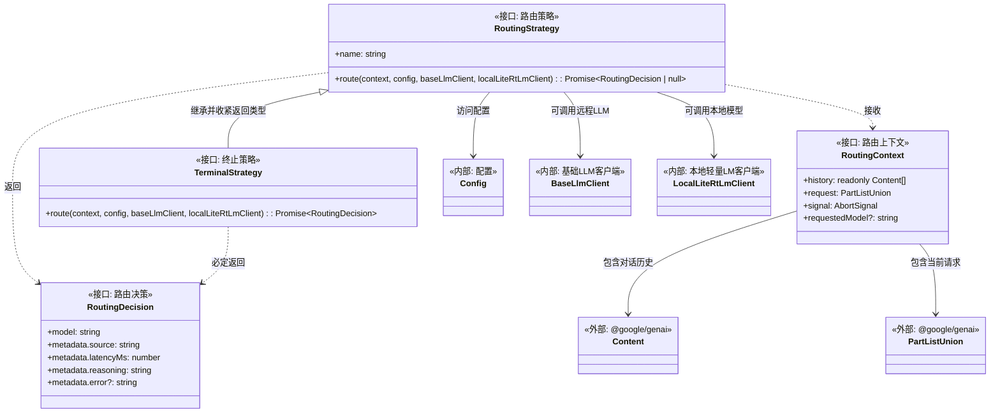
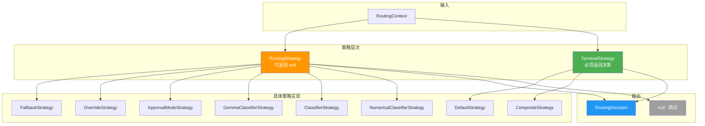
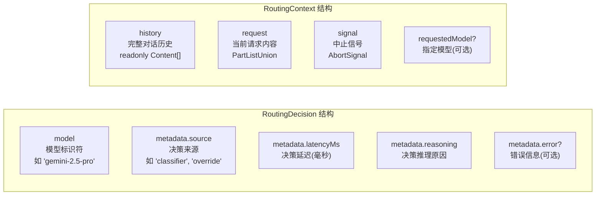

# routingStrategy.ts

## 概述

`routingStrategy.ts` 是 Gemini CLI 模型路由子系统的类型基础设施文件。它定义了路由决策、路由上下文和路由策略的核心接口，为整个路由策略体系提供了统一的契约。

该文件是纯类型定义文件，不包含任何运行时逻辑。它确立了两个关键的设计模式：
1. **策略模式（Strategy Pattern）**：`RoutingStrategy` 接口定义了所有路由策略的统一行为契约
2. **可空返回 vs 终止保证**：`RoutingStrategy` 允许返回 `null`（跳过），而 `TerminalStrategy` 保证返回决策（终止），确保策略链总能产生结果

文件路径：`packages/core/src/routing/routingStrategy.ts`

## 架构图（Mermaid）







## 核心组件

### 1. `RoutingDecision` 接口

路由决策的输出结构，描述路由结果和决策元数据。

```typescript
export interface RoutingDecision {
  model: string;
  metadata: {
    source: string;
    latencyMs: number;
    reasoning: string;
    error?: string;
  };
}
```

| 字段 | 类型 | 说明 |
|------|------|------|
| `model` | `string` | 选定的模型标识符（如 `'gemini-2.5-pro'`、`'gemini-2.5-flash'`） |
| `metadata.source` | `string` | 做出决策的策略来源名称（如 `'classifier'`、`'override'`、`'router-exception'`） |
| `metadata.latencyMs` | `number` | 路由决策的耗时（毫秒），用于性能监控 |
| `metadata.reasoning` | `string` | 路由决策的推理说明，用于调试和遥测 |
| `metadata.error` | `string?` | 可选的错误信息，当路由过程中发生异常时填充 |

### 2. `RoutingContext` 接口

路由决策的输入上下文，包含做出路由决策所需的全部信息。

```typescript
export interface RoutingContext {
  history: readonly Content[];
  request: PartListUnion;
  signal: AbortSignal;
  requestedModel?: string;
}
```

| 字段 | 类型 | 说明 |
|------|------|------|
| `history` | `readonly Content[]` | 完整的对话历史记录。使用 `readonly` 修饰，策略不应修改历史。`Content` 来自 `@google/genai` SDK。 |
| `request` | `PartListUnion` | 当前待处理的请求内容部分。`PartListUnion` 来自 `@google/genai` SDK，表示多模态内容的联合类型。 |
| `signal` | `AbortSignal` | 中止信号，允许在路由过程中取消正在进行的 LLM 调用（如分类器策略可能需要调用 LLM 进行分类）。 |
| `requestedModel` | `string?` | 可选的指定模型。当用户或上游组件显式指定了模型时填充，供 `OverrideStrategy` 等策略使用。 |

### 3. `RoutingStrategy` 接口

所有路由策略必须实现的核心接口。

```typescript
export interface RoutingStrategy {
  readonly name: string;
  route(
    context: RoutingContext,
    config: Config,
    baseLlmClient: BaseLlmClient,
    localLiteRtLmClient: LocalLiteRtLmClient,
  ): Promise<RoutingDecision | null>;
}
```

| 成员 | 说明 |
|------|------|
| `name` | 策略的唯一名称（`readonly`），用于日志和调试标识 |
| `route()` | 路由决策方法。返回 `RoutingDecision` 表示该策略给出了决策；返回 `null` 表示该策略不适用于当前请求，应由下一个策略处理 |

**方法参数**：
- `context`: 请求上下文
- `config`: 全局配置对象，提供模型列表、路由开关等
- `baseLlmClient`: 基础 LLM 客户端，允许策略调用远程 API（如通用分类器策略需要调用模型进行任务分类）
- `localLiteRtLmClient`: 本地轻量级 LiteRT LM 客户端，允许策略使用本地模型（如 Gemma 分类器策略使用本地 Gemma 模型）

### 4. `TerminalStrategy` 接口

```typescript
export interface TerminalStrategy extends RoutingStrategy {
  route(
    context: RoutingContext,
    config: Config,
    baseLlmClient: BaseLlmClient,
    localLiteRtLmClient: LocalLiteRtLmClient,
  ): Promise<RoutingDecision>;
}
```

继承 `RoutingStrategy` 但收紧了返回类型：**必须返回 `RoutingDecision`，不能返回 `null`**。

这个接口的存在是为了类型系统层面的保证：`CompositeStrategy` 作为终止策略，其内部最后一个策略必须是 `TerminalStrategy`（如 `DefaultStrategy`），确保策略链总能产生一个有效的路由决策，不会出现所有策略都跳过的情况。

## 依赖关系

### 内部依赖

| 依赖模块 | 导入内容 | 用途 |
|----------|----------|------|
| `../core/baseLlmClient.js` | `BaseLlmClient`（类型） | 基础 LLM 客户端接口，策略可通过它调用远程模型 API |
| `../config/config.js` | `Config`（类型） | 全局配置接口，提供模型和路由设置 |
| `../core/localLiteRtLmClient.js` | `LocalLiteRtLmClient`（类型） | 本地轻量级 LiteRT LM 客户端接口，策略可通过它调用本地模型 |

### 外部依赖

| 依赖包 | 导入内容 | 用途 |
|--------|----------|------|
| `@google/genai` | `Content`, `PartListUnion`（类型） | Google GenAI SDK 类型。`Content` 表示对话中的一条消息，`PartListUnion` 表示多模态内容的联合类型。 |

## 关键实现细节

1. **可空返回的策略模式**：`RoutingStrategy.route()` 返回 `Promise<RoutingDecision | null>` 而非 `Promise<RoutingDecision>`。返回 `null` 的语义是"此策略不适用于当前请求，请交给下一个策略处理"。这是责任链模式的经典实现，使得每个策略可以独立判断自己是否应该处理当前请求。

2. **终止保证的类型收紧**：`TerminalStrategy` 通过 TypeScript 的接口继承和方法签名覆盖，将返回类型从 `Promise<RoutingDecision | null>` 收紧为 `Promise<RoutingDecision>`。这在类型系统层面保证了策略链的终止性 -- `CompositeStrategy` 可以声明自己实现了 `TerminalStrategy`，从而向调用方保证总会返回决策。

3. **对话历史的不可变性**：`RoutingContext.history` 使用 `readonly Content[]` 类型，表达了策略不应修改对话历史的设计意图。这防止了路由策略在分析过程中意外篡改对话上下文。

4. **中止信号支持**：`RoutingContext.signal` 的存在意味着路由过程可以被外部取消。这对于分类器策略特别重要 -- 如果分类 LLM 调用耗时过长，可以通过 `AbortSignal` 中止，避免无限等待。

5. **双客户端设计**：`route` 方法同时接收 `baseLlmClient`（远程 LLM）和 `localLiteRtLmClient`（本地模型）。这种设计支持混合路由架构 -- 简单任务可以通过本地 Gemma 模型快速分类，复杂任务则通过远程 API 分类。两个客户端的分离使得策略可以选择最合适的推理后端。

6. **纯接口设计**：整个文件没有任何实现代码，完全由接口和类型定义组成。这确保了路由策略体系的高度可扩展性 -- 新增策略只需实现 `RoutingStrategy` 接口即可无缝接入。

7. **元数据驱动的可观测性**：`RoutingDecision.metadata` 的设计（包含 `source`、`latencyMs`、`reasoning`、`error`）为路由决策提供了完整的可观测性。这些元数据被 `ModelRouterService` 用于调试日志和遥测事件，使路由行为完全透明。

8. **requestedModel 的覆盖语义**：`RoutingContext.requestedModel` 是可选字段，当它存在时，通常意味着有来自上游的显式模型指定（如用户在 CLI 中通过 `--model` 参数指定）。`OverrideStrategy` 负责处理这种情况，优先级高于智能路由策略。
