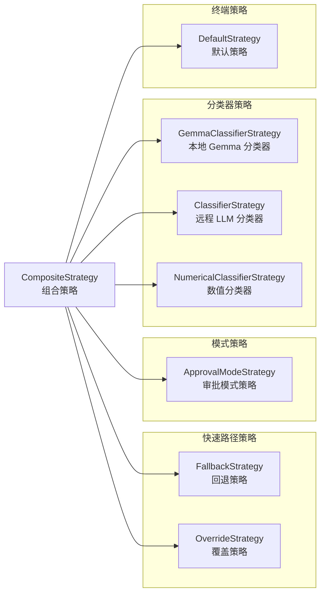
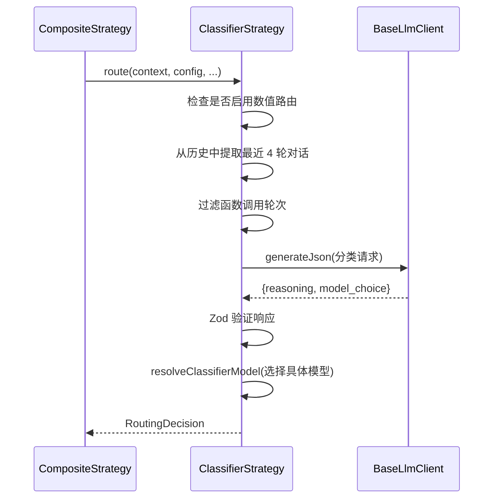

# strategies

## 概述

`strategies` 目录包含所有具体的路由策略实现。每个策略负责根据特定条件判断应使用哪个模型，它们遵循统一的 `RoutingStrategy` 接口，返回 `RoutingDecision`（选定模型）或 `null`（表示本策略不适用，交由下一策略处理）。这些策略通过 `CompositeStrategy` 组合为一条责任链。

## 目录结构

```
strategies/
├── approvalModeStrategy.ts              # 基于审批模式的路由策略
├── approvalModeStrategy.test.ts
├── classifierStrategy.ts                # 基于 LLM 的任务复杂度分类策略
├── classifierStrategy.test.ts
├── compositeStrategy.ts                 # 组合策略（责任链容器）
├── compositeStrategy.test.ts
├── defaultStrategy.ts                   # 默认兜底策略
├── defaultStrategy.test.ts
├── fallbackStrategy.ts                  # 模型不可用时的回退策略
├── fallbackStrategy.test.ts
├── gemmaClassifierStrategy.ts           # 基于本地 Gemma 模型的分类策略
├── gemmaClassifierStrategy.test.ts
├── numericalClassifierStrategy.ts       # 基于数值评分的分类策略
├── numericalClassifierStrategy.test.ts
├── overrideStrategy.ts                  # 用户指定模型的覆盖策略
└── overrideStrategy.test.ts
```

## 架构图



## 核心组件

### CompositeStrategy（组合策略）

采用**责任链模式**，按顺序依次调用子策略。若某策略返回 `null` 或抛出异常，则自动跳到下一策略。最后一个策略必须是 `TerminalStrategy`（保证返回结果）。实现了 `TerminalStrategy` 接口，自身也可被嵌套。

**关键特性：**
- 子策略异常不会中断链，会被捕获并记录
- 终端策略异常会向上抛出（致命错误）
- 决策元数据中的 `source` 会附加组合路径（如 `agent-router/Classifier`）

### FallbackStrategy（回退策略）

当请求的模型不可用时（通过 `ModelAvailabilityService` 检查），选择一个备用模型。如果模型可用则返回 `null`（不干预）。

### OverrideStrategy（覆盖策略）

当用户显式指定了非 `auto` 的模型名称时，直接使用该模型。用于绕过所有智能路由逻辑。

### ApprovalModeStrategy（审批模式策略）

根据审批模式决定路由：
- **PLAN 模式**：路由到 Pro 模型（高质量规划）
- **有已批准计划时**：路由到 Flash 模型（高效实现）
- 仅对 `auto` 模型生效，需开启 Plan 模式路由功能

### ClassifierStrategy（分类器策略）

使用远程 LLM（BaseLlmClient）对任务进行复杂度分类。通过系统提示词指导分类器将任务判定为 `flash`（简单）或 `pro`（复杂）。

**特性：**
- 提取最近 4 轮对话历史作为上下文
- 过滤掉函数调用/响应的对话轮次
- 使用 `generateJson` 获取结构化 JSON 响应
- 响应通过 Zod schema 验证

### GemmaClassifierStrategy（Gemma 分类器策略）

与 `ClassifierStrategy` 类似，但使用本地 Gemma 模型（通过 LiteRT 运行时）进行分类。将多轮对话扁平化为单条消息以适应本地模型的上下文限制。目前仅支持 `gemma3-1b-gpu-custom` 模型。

### NumericalClassifierStrategy（数值分类器策略）

使用远程 LLM 为任务分配 1-100 的**复杂度评分**，然后与配置的阈值比较来决定模型选择。评分规则：
- 1-20：简单/直接操作
- 21-50：标准/常规任务
- 51-80：高复杂度/分析性任务
- 81-100：极端/战略性任务

**特性：**
- 阈值可从远程配置获取
- 仅对 Gemini 3 系列模型生效
- 支持 8 轮对话历史上下文

### DefaultStrategy（默认策略）

终端策略，直接返回配置中的默认模型。延迟为 0（无额外计算）。

## 依赖关系

### 内部依赖

| 模块 | 使用者 | 用途 |
|------|--------|------|
| `config/config` | 全部策略 | 获取模型配置、功能开关等 |
| `config/models` | 全部策略 | 模型名称解析（`resolveModel`、`resolveClassifierModel`、`isAutoModel`） |
| `core/baseLlmClient` | ClassifierStrategy、NumericalClassifierStrategy | 远程 LLM JSON 生成 |
| `core/localLiteRtLmClient` | GemmaClassifierStrategy | 本地模型推理 |
| `availability/policyHelpers` | FallbackStrategy | 模型可用性检查和选择 |
| `policy/types` | ApprovalModeStrategy | `ApprovalMode` 枚举 |
| `utils/debugLogger` | 分类器策略 | 调试日志 |
| `utils/events` | CompositeStrategy | 错误事件发射 |
| `utils/messageInspectors` | 分类器策略 | 过滤函数调用 |
| `utils/promptIdContext` | 分类器策略 | Prompt ID 管理 |
| `telemetry/types` | 分类器策略 | `LlmRole` 定义 |

### 外部依赖

| 包 | 用途 |
|---|------|
| `@google/genai` | Google GenAI SDK（类型定义、createUserContent） |
| `zod` | 分类器响应 schema 验证 |

## 数据流

### 分类器策略执行流程


