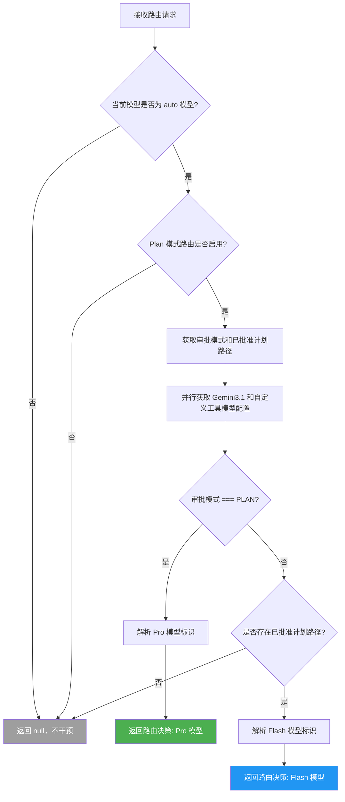

# approvalModeStrategy.ts

## 概述

`ApprovalModeStrategy` 是一个基于 **审批模式（ApprovalMode）** 和 **计划（Plan）状态** 进行模型路由的策略类。它实现了 `RoutingStrategy` 接口，核心逻辑是：

- 当处于 **PLAN（规划）模式** 时，将请求路由到 **Pro 模型**，以获得高质量的规划输出。
- 当不在 PLAN 模式但存在 **已批准的计划（approved plan）** 时，将请求路由到 **Flash 模型**，以高效地执行实现阶段的任务。
- 如果当前模型不是"auto"模型，或者未启用 Plan 模式路由，则策略不生效（返回 `null`），让后续策略接管。

该策略体现了"规划用重模型、执行用轻模型"的智能路由思想，是成本与质量之间的平衡设计。

## 架构图（Mermaid）



## 核心组件

### 类：`ApprovalModeStrategy`

| 属性/方法 | 类型 | 描述 |
|-----------|------|------|
| `name` | `readonly string` | 策略名称，固定为 `'approval-mode'` |
| `route(context, config, _baseLlmClient)` | `async method` | 核心路由方法，根据审批模式和计划状态决定模型选择 |

### 方法签名

```typescript
async route(
  context: RoutingContext,
  config: Config,
  _baseLlmClient: BaseLlmClient,
): Promise<RoutingDecision | null>
```

**参数说明：**

| 参数 | 类型 | 说明 |
|------|------|------|
| `context` | `RoutingContext` | 路由上下文，包含 `requestedModel` 等请求信息 |
| `config` | `Config` | 全局配置对象，提供模型、审批模式、计划路径等配置读取 |
| `_baseLlmClient` | `BaseLlmClient` | LLM 客户端（本策略未使用，以下划线前缀标记） |

**返回值：**
- `RoutingDecision`：包含 `model`（目标模型标识）和 `metadata`（路由来源、延迟、推理原因）
- `null`：该策略不适用，交由后续策略处理

### 路由决策结构（RoutingDecision）

返回的决策对象包含以下结构：

```typescript
{
  model: string,          // 解析后的模型标识（如 Pro 或 Flash）
  metadata: {
    source: string,       // 策略名称 'approval-mode'
    latencyMs: number,    // 路由决策耗时（毫秒）
    reasoning: string,    // 人类可读的路由原因说明
  }
}
```

## 依赖关系

### 内部依赖

| 模块路径 | 导入内容 | 用途 |
|----------|----------|------|
| `../../config/config.js` | `Config`（类型） | 全局配置对象，用于获取模型、审批模式、功能开关等 |
| `../../config/models.js` | `isAutoModel`, `resolveClassifierModel`, `GEMINI_MODEL_ALIAS_FLASH`, `GEMINI_MODEL_ALIAS_PRO` | 模型判断与解析工具函数和模型别名常量 |
| `../../core/baseLlmClient.js` | `BaseLlmClient`（类型） | LLM 客户端基类类型（本策略未实际使用） |
| `../../policy/types.js` | `ApprovalMode` | 审批模式枚举，包含 `PLAN` 等值 |
| `../routingStrategy.js` | `RoutingContext`, `RoutingDecision`, `RoutingStrategy`（类型） | 路由策略接口和相关类型定义 |

### 外部依赖

无直接外部第三方依赖。所有导入均为项目内部模块。

## 关键实现细节

### 1. Auto 模型前置检查

```typescript
if (!isAutoModel(model, config)) {
  return null;
}
```

策略仅对"auto"模型生效。如果用户或配置明确指定了具体模型（如直接指定 `gemini-pro`），则该策略跳过，尊重用户的显式选择。模型来源优先级为：`context.requestedModel` > `config.getModel()`。

### 2. Plan 模式路由开关

```typescript
if (!(await config.getPlanModeRoutingEnabled())) {
  return null;
}
```

通过 `getPlanModeRoutingEnabled()` 异步检查功能开关。这是一个服务端可控的特性开关（Feature Flag），允许在不修改代码的情况下动态启用/禁用该策略。

### 3. 并行配置获取

```typescript
const [useGemini3_1, useCustomToolModel] = await Promise.all([
  config.getGemini31Launched(),
  config.getUseCustomToolModel(),
]);
```

使用 `Promise.all` 并行获取两个异步配置，减少串行等待时间，优化路由决策延迟：
- `useGemini3_1`：是否已启用 Gemini 3.1 版本
- `useCustomToolModel`：是否使用自定义工具模型

### 4. 两阶段路由逻辑

**规划阶段（Planning Phase）：**
- 条件：`approvalMode === ApprovalMode.PLAN`
- 行为：通过 `resolveClassifierModel` 将 auto 模型解析为 Pro 模型
- 原因：规划阶段需要更强的推理能力，Pro 模型质量更高

**执行阶段（Implementation Phase）：**
- 条件：`approvalMode !== PLAN` 且 `approvedPlanPath` 存在
- 行为：通过 `resolveClassifierModel` 将 auto 模型解析为 Flash 模型
- 原因：已有批准的计划，执行阶段更注重效率和速度，Flash 模型更经济高效

### 5. 延迟追踪

```typescript
const startTime = Date.now();
// ... 路由逻辑 ...
latencyMs: Date.now() - startTime,
```

每次路由决策都记录耗时，通过 `metadata.latencyMs` 暴露，便于性能监控和调优。

### 6. 模型解析机制

`resolveClassifierModel(model, alias, useGemini3_1, useCustomToolModel)` 函数负责将抽象的模型别名（`GEMINI_MODEL_ALIAS_PRO` / `GEMINI_MODEL_ALIAS_FLASH`）解析为实际可用的模型标识符，同时考虑 Gemini 3.1 版本和自定义工具模型的配置。
