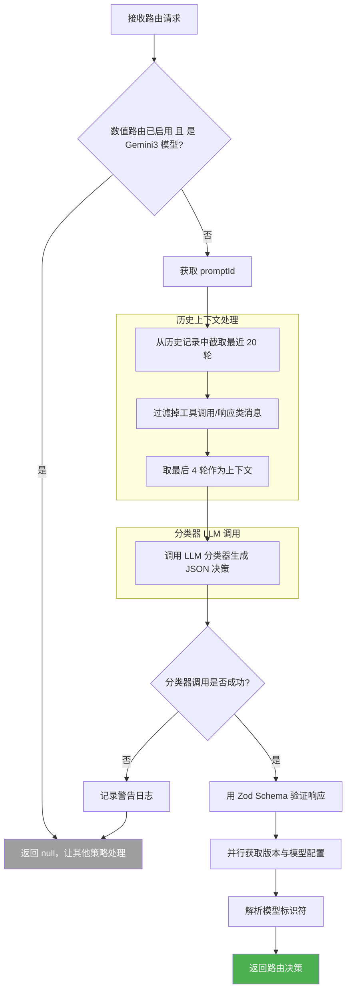
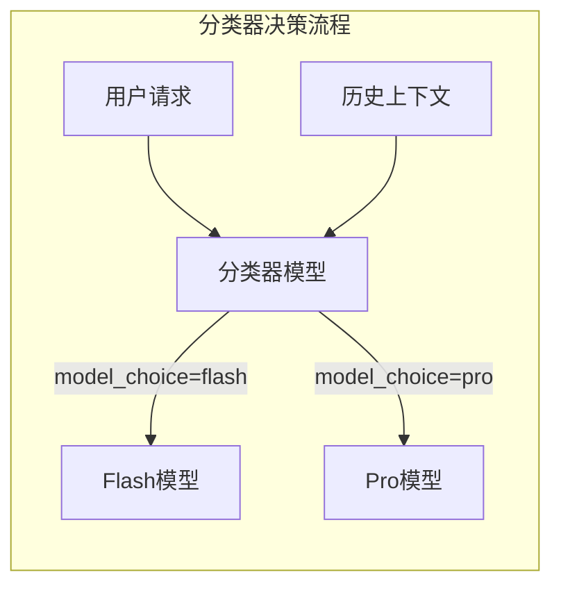

# classifierStrategy.ts

## 概述

`ClassifierStrategy` 是一个基于 **LLM 分类器** 的智能路由策略。它通过调用一个轻量级 LLM 模型来分析用户请求的复杂度，将任务分类为"简单"或"复杂"，从而决定使用 **Flash 模型**（处理简单任务）还是 **Pro 模型**（处理复杂任务）。

该策略的核心创新在于"用 AI 路由 AI"——利用一个小模型（分类器）来判断应该由哪个大模型来处理用户的实际请求，实现成本和质量的自动化平衡。

### 分类标准

**复杂任务（路由到 Pro）：**
- 高操作复杂度（预估 4+ 步骤/工具调用）
- 战略规划与概念设计（问"如何"或"为什么"）
- 高模糊性或大范围（需要大量调查）
- 深度调试与根因分析

**简单任务（路由到 Flash）：**
- 高度具体、有界的任务
- 低操作复杂度（预估 1-3 个工具调用）
- 操作简单性优先于战略性措辞

## 架构图（Mermaid）





## 核心组件

### 常量

| 常量名 | 值 | 描述 |
|--------|------|------|
| `HISTORY_TURNS_FOR_CONTEXT` | `4` | 提供给路由分类器的最近历史对话轮数 |
| `HISTORY_SEARCH_WINDOW` | `20` | 在历史记录中搜索的窗口大小（过滤前） |
| `FLASH_MODEL` | `'flash'` | Flash 模型标识符，代表简单任务 |
| `PRO_MODEL` | `'pro'` | Pro 模型标识符，代表复杂任务 |

### 分类器系统提示（CLASSIFIER_SYSTEM_PROMPT）

一个精心设计的系统提示，指导分类器 LLM 执行以下任务：
1. 分析用户请求的复杂度
2. 根据复杂度评估标准（Complexity Rubric）判定任务类型
3. 以严格的 JSON 格式输出推理过程（`reasoning`）和模型选择（`model_choice`）
4. 包含 6 个示例（few-shot），涵盖战略规划、简单工具使用、高操作复杂度、简单读取、深度调试、带误导性措辞的简单编辑等场景

### 响应 Schema（RESPONSE_SCHEMA）

使用 `@google/genai` 的 `Type` 枚举定义的 JSON Schema，用于约束 LLM 的输出格式：

```typescript
{
  type: Type.OBJECT,
  properties: {
    reasoning: { type: Type.STRING, description: '...' },
    model_choice: { type: Type.STRING, enum: ['flash', 'pro'] },
  },
  required: ['reasoning', 'model_choice'],
}
```

### Zod 验证 Schema（ClassifierResponseSchema）

使用 `zod` 库对 LLM 返回的 JSON 进行运行时类型验证：

```typescript
const ClassifierResponseSchema = z.object({
  reasoning: z.string(),
  model_choice: z.enum(['flash', 'pro']),
});
```

### 类：`ClassifierStrategy`

| 属性/方法 | 类型 | 描述 |
|-----------|------|------|
| `name` | `readonly string` | 策略名称，固定为 `'classifier'` |
| `route(context, config, baseLlmClient, _localLiteRtLmClient)` | `async method` | 核心路由方法，调用 LLM 分类器判定任务复杂度 |

### 方法签名

```typescript
async route(
  context: RoutingContext,
  config: Config,
  baseLlmClient: BaseLlmClient,
  _localLiteRtLmClient: LocalLiteRtLmClient,
): Promise<RoutingDecision | null>
```

**参数说明：**

| 参数 | 类型 | 说明 |
|------|------|------|
| `context` | `RoutingContext` | 路由上下文，包含用户请求、历史记录、请求模型、中止信号等 |
| `config` | `Config` | 全局配置，提供模型设置和功能开关 |
| `baseLlmClient` | `BaseLlmClient` | LLM 客户端，用于调用分类器模型生成 JSON |
| `_localLiteRtLmClient` | `LocalLiteRtLmClient` | 本地轻量级实时 LLM 客户端（本策略未使用） |

## 依赖关系

### 内部依赖

| 模块路径 | 导入内容 | 用途 |
|----------|----------|------|
| `../../core/baseLlmClient.js` | `BaseLlmClient`（类型） | LLM 客户端基类，用于调用 `generateJson` |
| `../../utils/promptIdContext.js` | `getPromptIdWithFallback` | 获取 prompt ID，用于追踪和分析 |
| `../routingStrategy.js` | `RoutingContext`, `RoutingDecision`, `RoutingStrategy`（类型） | 路由策略接口定义 |
| `../../config/models.js` | `resolveClassifierModel`, `isGemini3Model` | 模型解析和判断工具函数 |
| `../../config/config.js` | `Config`（类型） | 全局配置类型 |
| `../../utils/messageInspectors.js` | `isFunctionCall`, `isFunctionResponse` | 判断消息是否为工具调用/响应 |
| `../../utils/debugLogger.js` | `debugLogger` | 调试日志工具 |
| `../../core/localLiteRtLmClient.js` | `LocalLiteRtLmClient`（类型） | 本地轻量级 LLM 客户端类型 |
| `../../telemetry/types.js` | `LlmRole` | LLM 角色枚举，此处使用 `UTILITY_ROUTER` |

### 外部依赖

| 包名 | 导入内容 | 用途 |
|------|----------|------|
| `zod` | `z` | 运行时 JSON Schema 验证，确保 LLM 响应结构正确 |
| `@google/genai` | `createUserContent`, `Type` | Google GenAI SDK，用于创建用户内容和定义 Schema 类型 |

## 关键实现细节

### 1. 数值路由互斥检查

```typescript
if (
  (await config.getNumericalRoutingEnabled()) &&
  isGemini3Model(model, config)
) {
  return null;
}
```

当数值路由（Numerical Routing）已启用且当前模型为 Gemini 3 模型时，分类器策略主动退出。这是为了避免与数值路由策略冲突——两种路由机制不应同时生效。

### 2. 历史上下文处理管线

分三步处理历史对话记录，为分类器提供精简但有效的上下文：

1. **窗口截取**：从完整历史中取最近 20 轮（`HISTORY_SEARCH_WINDOW`）
2. **过滤工具消息**：移除 `FunctionCall` 和 `FunctionResponse` 类型的消息，只保留用户/模型的自然语言对话
3. **精选上下文**：从过滤后的历史中取最后 4 轮（`HISTORY_TURNS_FOR_CONTEXT`）

这种设计确保分类器能获得足够的对话上下文来理解任务背景，同时避免工具调用细节干扰分类判断。

### 3. LLM 分类器调用

```typescript
const jsonResponse = await baseLlmClient.generateJson({
  modelConfigKey: { model: 'classifier' },
  contents: [...finalHistory, createUserContent(context.request)],
  schema: RESPONSE_SCHEMA,
  systemInstruction: CLASSIFIER_SYSTEM_PROMPT,
  abortSignal: context.signal,
  promptId,
  role: LlmRole.UTILITY_ROUTER,
});
```

关键配置：
- `modelConfigKey: { model: 'classifier' }`：使用专门的分类器模型配置
- `schema: RESPONSE_SCHEMA`：通过结构化输出约束 LLM 的响应格式
- `role: LlmRole.UTILITY_ROUTER`：标记为工具路由角色，便于遥测分析
- `abortSignal`：支持请求取消

### 4. 双重 Schema 验证

LLM 的输出经过两层验证：
1. **LLM 层面**：通过 `RESPONSE_SCHEMA` 约束生成格式（在模型生成时生效）
2. **代码层面**：通过 `ClassifierResponseSchema.parse(jsonResponse)` 用 Zod 进行运行时验证

这种"Belt and Suspenders"（双保险）策略确保即使 LLM 生成了不符合预期的输出，也能在代码层面及时捕获错误。

### 5. 优雅降级（Graceful Degradation）

```typescript
catch (error) {
  debugLogger.warn(`[Routing] ClassifierStrategy failed:`, error);
  return null;
}
```

整个路由方法被 try-catch 包裹。当分类器调用失败（API 错误、解析错误、超时等），策略不会抛出异常，而是：
1. 记录警告日志
2. 返回 `null`，让上层的组合策略（CompositeStrategy）继续执行后续策略

这保证了分类器的故障不会阻断整个路由链路。

### 6. 并行配置获取与模型解析

```typescript
const [useGemini3_1, useGemini3_1FlashLite, useCustomToolModel] =
  await Promise.all([
    config.getGemini31Launched(),
    config.getGemini31FlashLiteLaunched(),
    config.getUseCustomToolModel(),
  ]);
```

使用 `Promise.all` 并行获取三个异步配置（比 `approvalModeStrategy` 多了一个 `getGemini31FlashLiteLaunched`），然后调用 `resolveClassifierModel` 将分类器的抽象选择（`'flash'` / `'pro'`）解析为实际的模型标识符。

解析时额外传入了 `config.getHasAccessToPreviewModel?.() ?? true` 和 `config` 本身，说明模型解析逻辑可能涉及预览模型访问权限的判断。
