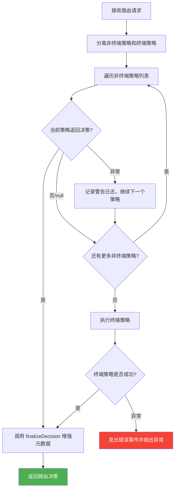
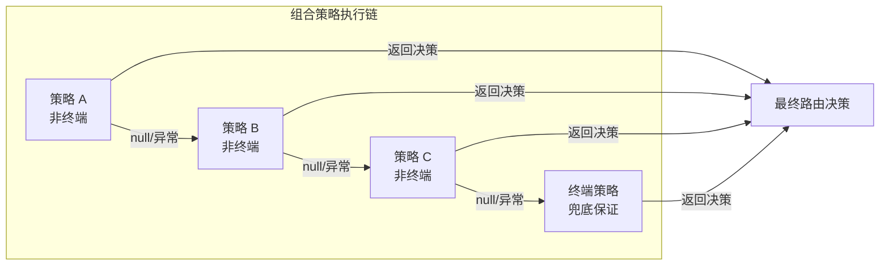

# compositeStrategy.ts

## 概述

`CompositeStrategy` 是路由系统的 **组合策略/编排器**，实现了经典的 **责任链模式（Chain of Responsibility）**。它将多个子策略按优先级顺序组合在一起，依次尝试每个策略，直到某个策略返回有效的路由决策。

### 核心设计理念

- **策略分为两类**：非终端策略（`RoutingStrategy`）和终端策略（`TerminalStrategy`）
- **非终端策略** 可以返回 `null`（表示不处理），失败时被优雅地跳过
- **终端策略** 是最后一个策略，必须返回有效决策（保证路由链一定能产出结果）
- 整个组合本身实现了 `TerminalStrategy` 接口，意味着它可以作为子策略嵌套在更高层的组合策略中

这种设计确保了路由系统的 **可靠性**（总能做出决策）、**可扩展性**（轻松添加新策略）和 **容错性**（单个策略失败不影响整体）。

## 架构图（Mermaid）





## 核心组件

### 类：`CompositeStrategy`

实现 `TerminalStrategy` 接口（即它的 `route` 方法保证返回 `RoutingDecision`，不会返回 `null`）。

| 属性/方法 | 类型 | 可见性 | 描述 |
|-----------|------|--------|------|
| `name` | `readonly string` | public | 组合策略名称，默认为 `'composite'` |
| `strategies` | `[...RoutingStrategy[], TerminalStrategy]` | private | 有序的子策略列表，最后一个必须是终端策略 |
| `route(context, config, baseLlmClient, localLiteRtLmClient)` | `async method` | public | 核心路由方法，按顺序执行子策略 |
| `finalizeDecision(decision, startTime)` | `method` | private | 增强决策元数据（来源路径和延迟） |

### 构造函数

```typescript
constructor(
  strategies: [...RoutingStrategy[], TerminalStrategy],
  name: string = 'composite',
)
```

**参数说明：**

| 参数 | 类型 | 默认值 | 说明 |
|------|------|--------|------|
| `strategies` | `[...RoutingStrategy[], TerminalStrategy]` | - | 按优先级排列的策略列表，最后一个必须是终端策略 |
| `name` | `string` | `'composite'` | 此组合配置的名称（如 `'router'`），用于元数据追踪 |

TypeScript 元组类型 `[...RoutingStrategy[], TerminalStrategy]` 在类型层面保证了最后一个元素必须是 `TerminalStrategy`。

### route 方法签名

```typescript
async route(
  context: RoutingContext,
  config: Config,
  baseLlmClient: BaseLlmClient,
  localLiteRtLmClient: LocalLiteRtLmClient,
): Promise<RoutingDecision>
```

注意返回类型是 `Promise<RoutingDecision>`（非 `null`），因为作为 `TerminalStrategy`，它保证总能产出决策。

### finalizeDecision 方法

```typescript
private finalizeDecision(
  decision: RoutingDecision,
  startTime: number,
): RoutingDecision
```

增强子策略返回的决策对象，添加组合层面的元数据：
- `source`：拼接为 `{compositeName}/{childSource}` 的层次化来源路径（如 `router/Classifier`）
- `latencyMs`：优先使用子策略自身的延迟值，若子策略未记录延迟（为 0 或 falsy），则使用从组合策略开始到结束的总时间

## 依赖关系

### 内部依赖

| 模块路径 | 导入内容 | 用途 |
|----------|----------|------|
| `../../config/config.js` | `Config`（类型） | 全局配置类型 |
| `../../core/baseLlmClient.js` | `BaseLlmClient`（类型） | LLM 客户端基类类型 |
| `../../utils/debugLogger.js` | `debugLogger` | 调试日志工具，用于记录非终端策略失败警告 |
| `../../utils/events.js` | `coreEvents` | 核心事件发射器，用于终端策略失败时发出错误事件 |
| `../routingStrategy.js` | `RoutingContext`, `RoutingDecision`, `RoutingStrategy`, `TerminalStrategy`（类型） | 路由策略相关接口和类型 |
| `../../core/localLiteRtLmClient.js` | `LocalLiteRtLmClient`（类型） | 本地轻量级 LLM 客户端类型 |

### 外部依赖

无直接外部第三方依赖。所有导入均为项目内部模块。

## 关键实现细节

### 1. 责任链模式（Chain of Responsibility）

```typescript
for (const strategy of nonTerminalStrategies) {
  try {
    const decision = await strategy.route(context, config, baseLlmClient, localLiteRtLmClient);
    if (decision) {
      return this.finalizeDecision(decision, startTime);
    }
  } catch (error) {
    debugLogger.warn(`[Routing] Strategy '${strategy.name}' failed. ...`);
  }
}
```

遍历所有非终端策略，每个策略有三种结果：
- **返回 `RoutingDecision`**：链路终止，使用该决策
- **返回 `null`**：策略不适用，继续下一个
- **抛出异常**：策略执行失败，记录警告后继续下一个

### 2. 终端策略与非终端策略的分离

```typescript
const nonTerminalStrategies = this.strategies.slice(0, -1) as RoutingStrategy[];
const terminalStrategy = this.strategies[this.strategies.length - 1] as TerminalStrategy;
```

在运行时将策略列表分为两部分：
- **前 N-1 个**：非终端策略，可以安全失败
- **最后 1 个**：终端策略，失败将导致整个路由失败

这种分离让 TypeScript 能更好地理解控制流保证——终端策略的 `route` 方法返回 `Promise<RoutingDecision>` 而非 `Promise<RoutingDecision | null>`。

### 3. 差异化的错误处理

**非终端策略失败：** 优雅降级
```typescript
debugLogger.warn(`[Routing] Strategy '${strategy.name}' failed. Continuing to next strategy.`);
```
仅记录警告日志，继续执行下一个策略。

**终端策略失败：** 致命错误
```typescript
coreEvents.emitFeedback('error', `[Routing] Critical Error: Terminal strategy...`);
throw error;
```
发出错误事件通知上层系统，然后重新抛出异常。因为终端策略是最后的保障，它的失败意味着路由系统无法做出任何决策。

### 4. 元数据增强与来源追踪

```typescript
const compositeSource = `${this.name}/${decision.metadata.source}`;
```

通过将组合策略的名称与子策略的来源拼接，形成层次化的来源路径。例如：
- `router/approval-mode` —— 由名为 `router` 的组合策略中的 `approval-mode` 策略做出决策
- `router/Classifier` —— 由分类器策略做出决策
- `router/default` —— 由默认策略做出决策

这种设计在嵌套组合策略的场景下特别有用，可以清晰追踪决策链路。

### 5. 延迟度量的智能选择

```typescript
const latency = decision.metadata.latencyMs || endTime - startTime;
```

采用"短路或"逻辑选择延迟值：
- 如果子策略自身记录了有意义的延迟值（非零），使用子策略的延迟
- 否则（值为 0 或未设置），使用从组合策略入口到当前时刻的总耗时

最终值通过 `Math.round()` 取整，确保遥测数据的整数要求。

### 6. 高精度计时

```typescript
const startTime = performance.now();
// ...
const endTime = performance.now();
```

使用 `performance.now()` 而非 `Date.now()` 进行计时，获得亚毫秒级精度，适合性能敏感的路由决策场景。

### 7. 可嵌套的组合设计

由于 `CompositeStrategy` 本身实现了 `TerminalStrategy` 接口，它可以作为另一个 `CompositeStrategy` 的子策略。这使得路由系统可以构建任意深度的策略树，例如：

```
CompositeStrategy("router")
  ├── ApprovalModeStrategy
  ├── ClassifierStrategy
  └── CompositeStrategy("fallback-group")  // 嵌套组合
        ├── SomeOtherStrategy
        └── DefaultStrategy (terminal)
```
