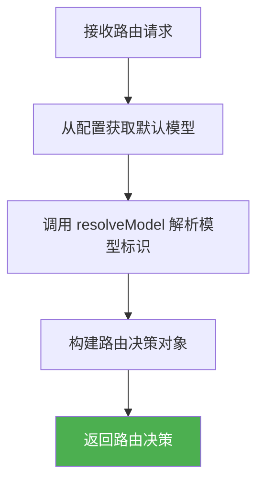
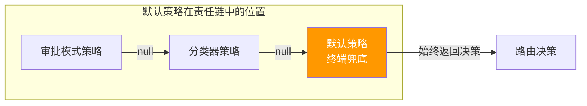

# defaultStrategy.ts

## 概述

`DefaultStrategy` 是路由系统的 **默认/兜底策略**，实现了 `TerminalStrategy` 接口。它是整个路由责任链中的最后一环，当所有优先级更高的策略（如 `ApprovalModeStrategy`、`ClassifierStrategy`）都未能做出决策时，由该策略提供最终的模型选择。

该策略的逻辑非常简单直接：读取配置中的默认模型，通过 `resolveModel` 函数解析为实际的模型标识符，然后返回路由决策。它不进行任何复杂度分析或 LLM 调用，因此延迟为零（`latencyMs: 0`）。

作为 `TerminalStrategy`，它 **保证** 总能返回有效的 `RoutingDecision`（不会返回 `null`），确保路由系统在任何情况下都能做出决策。

## 架构图（Mermaid）





## 核心组件

### 类：`DefaultStrategy`

实现 `TerminalStrategy` 接口，保证 `route` 方法始终返回 `RoutingDecision`。

| 属性/方法 | 类型 | 描述 |
|-----------|------|------|
| `name` | `readonly string` | 策略名称，固定为 `'default'` |
| `route(_context, config, _baseLlmClient, _localLiteRtLmClient)` | `async method` | 路由方法，直接返回配置中的默认模型 |

### 方法签名

```typescript
async route(
  _context: RoutingContext,
  config: Config,
  _baseLlmClient: BaseLlmClient,
  _localLiteRtLmClient: LocalLiteRtLmClient,
): Promise<RoutingDecision>
```

**参数说明：**

| 参数 | 类型 | 说明 |
|------|------|------|
| `_context` | `RoutingContext` | 路由上下文（未使用，以下划线前缀标记） |
| `config` | `Config` | 全局配置，用于获取默认模型和版本信息 |
| `_baseLlmClient` | `BaseLlmClient` | LLM 客户端（未使用） |
| `_localLiteRtLmClient` | `LocalLiteRtLmClient` | 本地轻量级 LLM 客户端（未使用） |

**返回值：**
始终返回 `RoutingDecision`，不会返回 `null` 或抛出异常（正常情况下）。

### resolveModel 调用

```typescript
const defaultModel = resolveModel(
  config.getModel(),                               // 配置中的模型标识
  config.getGemini31LaunchedSync?.() ?? false,     // Gemini 3.1 是否已发布
  config.getGemini31FlashLiteLaunchedSync?.() ?? false, // Gemini 3.1 Flash Lite 是否已发布
  false,                                            // useCustomToolModel = false
  config.getHasAccessToPreviewModel?.() ?? true,   // 是否有权访问预览模型
  config,                                           // 完整配置对象
);
```

## 依赖关系

### 内部依赖

| 模块路径 | 导入内容 | 用途 |
|----------|----------|------|
| `../../config/config.js` | `Config`（类型） | 全局配置类型，提供默认模型和功能开关信息 |
| `../../core/baseLlmClient.js` | `BaseLlmClient`（类型） | LLM 客户端基类类型（未实际使用） |
| `../routingStrategy.js` | `RoutingContext`, `RoutingDecision`, `TerminalStrategy`（类型） | 路由策略接口和类型 |
| `../../config/models.js` | `resolveModel` | 模型解析函数，将配置中的模型标识解析为实际可用的模型 |
| `../../core/localLiteRtLmClient.js` | `LocalLiteRtLmClient`（类型） | 本地轻量级 LLM 客户端类型（未实际使用） |

### 外部依赖

无直接外部第三方依赖。

## 关键实现细节

### 1. 终端策略保证

作为 `TerminalStrategy`，`DefaultStrategy` 的 `route` 方法返回类型是 `Promise<RoutingDecision>`（不包含 `| null`）。这在类型系统层面保证了该策略永远能做出决策，使其成为 `CompositeStrategy` 责任链的可靠终点。

### 2. 零延迟路由

```typescript
latencyMs: 0,
```

由于该策略仅做简单的配置读取和函数调用，不涉及网络请求或 LLM 调用，延迟记录为 0。这是与 `ClassifierStrategy`（需要调用 LLM）和 `ApprovalModeStrategy`（需要异步配置获取）的关键区别。

### 3. 同步配置获取

```typescript
config.getGemini31LaunchedSync?.() ?? false
config.getGemini31FlashLiteLaunchedSync?.() ?? false
```

与其他策略使用异步方法（`getGemini31Launched()`）不同，`DefaultStrategy` 使用 **同步** 版本（`getGemini31LaunchedSync`）。这有两层含义：
1. **性能优化**：同步调用避免了不必要的 Promise 开销
2. **安全降级**：使用可选链（`?.`）和空值合并（`?? false`）确保即使方法不存在也有安全默认值

### 4. 保守的配置默认值

```typescript
config.getGemini31LaunchedSync?.() ?? false       // 默认：Gemini 3.1 未发布
config.getGemini31FlashLiteLaunchedSync?.() ?? false // 默认：Flash Lite 未发布
false                                                // useCustomToolModel 固定为 false
config.getHasAccessToPreviewModel?.() ?? true        // 默认：有权访问预览模型
```

默认值的选择策略：
- 版本标记默认为 `false`（保守假设新版本未发布）
- 自定义工具模型固定为 `false`（默认策略不使用自定义工具模型）
- 预览模型访问权默认为 `true`（乐观假设有权限访问）

### 5. resolveModel 与 resolveClassifierModel 的区别

其他策略（如 `ApprovalModeStrategy`、`ClassifierStrategy`）使用 `resolveClassifierModel`（需要传入模型别名 `'flash'` / `'pro'`），而 `DefaultStrategy` 使用更基础的 `resolveModel`。这是因为默认策略不做 Flash/Pro 分类，直接将配置中的模型解析为最终模型。

### 6. 未使用的参数

四个参数中有三个以下划线前缀标记为未使用（`_context`、`_baseLlmClient`、`_localLiteRtLmClient`）。这些参数的存在是为了满足 `TerminalStrategy` 接口的方法签名要求，保持策略间的统一调用接口。
