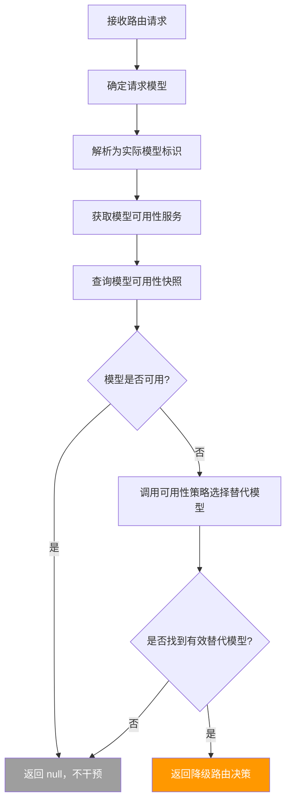
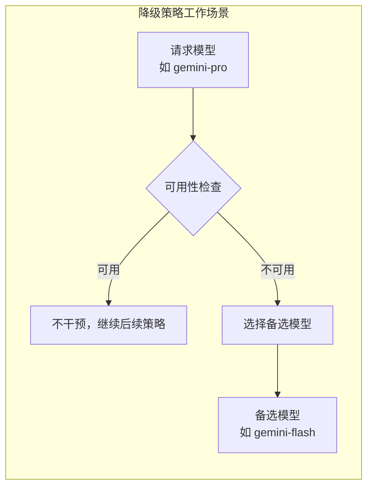

# fallbackStrategy.ts

## 概述

`FallbackStrategy` 是路由系统的 **可用性降级策略**，实现了 `RoutingStrategy` 接口。它的职责是在请求的模型 **不可用** 时，自动选择一个可用的备选模型，确保服务不中断。

### 核心逻辑

1. 解析当前请求的模型
2. 通过模型可用性服务（Model Availability Service）检查该模型是否可用
3. 如果模型 **可用**：返回 `null`，不干预路由（让后续策略处理）
4. 如果模型 **不可用**：根据可用性策略选择替代模型，返回降级路由决策

该策略是一个 **非终端策略**，只在检测到不可用情况时才介入，否则透明地让请求传递给下一个策略。

## 架构图（Mermaid）





## 核心组件

### 类：`FallbackStrategy`

实现 `RoutingStrategy` 接口（非终端策略，可返回 `null`）。

| 属性/方法 | 类型 | 描述 |
|-----------|------|------|
| `name` | `readonly string` | 策略名称，固定为 `'fallback'` |
| `route(context, config, _baseLlmClient, _localLiteRtLmClient)` | `async method` | 核心路由方法，检测模型可用性并在必要时执行降级 |

### 方法签名

```typescript
async route(
  context: RoutingContext,
  config: Config,
  _baseLlmClient: BaseLlmClient,
  _localLiteRtLmClient: LocalLiteRtLmClient,
): Promise<RoutingDecision | null>
```

**参数说明：**

| 参数 | 类型 | 说明 |
|------|------|------|
| `context` | `RoutingContext` | 路由上下文，包含 `requestedModel` 等信息 |
| `config` | `Config` | 全局配置，提供模型、可用性服务等 |
| `_baseLlmClient` | `BaseLlmClient` | LLM 客户端（未使用） |
| `_localLiteRtLmClient` | `LocalLiteRtLmClient` | 本地轻量级 LLM 客户端（未使用） |

**返回值：**
- `RoutingDecision`：当请求模型不可用且找到有效替代模型时
- `null`：当请求模型可用，或未找到有效替代模型时

## 依赖关系

### 内部依赖

| 模块路径 | 导入内容 | 用途 |
|----------|----------|------|
| `../../availability/policyHelpers.js` | `selectModelForAvailability` | 根据可用性策略选择替代模型的核心函数 |
| `../../config/config.js` | `Config`（类型） | 全局配置类型 |
| `../../config/models.js` | `resolveModel` | 将配置中的模型标识解析为实际模型 |
| `../../core/baseLlmClient.js` | `BaseLlmClient`（类型） | LLM 客户端基类类型（未实际使用） |
| `../routingStrategy.js` | `RoutingContext`, `RoutingDecision`, `RoutingStrategy`（类型） | 路由策略接口和类型 |
| `../../core/localLiteRtLmClient.js` | `LocalLiteRtLmClient`（类型） | 本地轻量级 LLM 客户端类型（未实际使用） |

### 外部依赖

无直接外部第三方依赖。

## 关键实现细节

### 1. 模型来源优先级

```typescript
const requestedModel = context.requestedModel ?? config.getModel();
```

与其他策略一致，模型来源优先级为：
1. `context.requestedModel`（请求级别指定的模型）
2. `config.getModel()`（全局配置的默认模型）

### 2. 模型解析

```typescript
const resolvedModel = resolveModel(
  requestedModel,
  config.getGemini31LaunchedSync?.() ?? false,
  config.getGemini31FlashLiteLaunchedSync?.() ?? false,
  false,                                         // useCustomToolModel = false
  config.getHasAccessToPreviewModel?.() ?? true,
  config,
);
```

使用与 `DefaultStrategy` 相同的 `resolveModel` 函数和参数模式（同步版本配置获取 + 安全默认值），将抽象的模型标识解析为具体的模型名称，以便进行可用性查询。

### 3. 可用性快照查询

```typescript
const service = config.getModelAvailabilityService();
const snapshot = service.snapshot(resolvedModel);
```

通过 `Config` 获取 **模型可用性服务（Model Availability Service）**，然后调用 `snapshot` 方法获取指定模型的可用性快照。快照对象包含：
- `available`：布尔值，表示模型是否当前可用
- `reason`：不可用时的原因说明（如过载、维护、配额耗尽等）

### 4. 快速退出条件

```typescript
if (snapshot.available) {
  return null;
}
```

如果模型可用，策略立即返回 `null`，不做任何干预。这是该策略的"正常路径"——大多数情况下模型是可用的，策略只是快速检查后放行。

### 5. 替代模型选择

```typescript
const selection = selectModelForAvailability(config, requestedModel);
```

调用 `selectModelForAvailability` 函数，传入配置和原始请求模型，获取替代模型建议。该函数封装了可用性降级的具体策略逻辑（如选择同系列的较低规格模型、跨系列切换等）。

### 6. 替代模型有效性验证

```typescript
if (
  selection?.selectedModel &&
  selection.selectedModel !== requestedModel
) {
```

返回路由决策前进行双重检查：
1. `selection?.selectedModel`：确保有选中的模型（非 `null`/`undefined`）
2. `selection.selectedModel !== requestedModel`：确保替代模型与原模型不同（否则降级无意义）

如果两个条件都不满足，策略返回 `null`，让后续策略处理。

### 7. 路由决策中的降级原因

```typescript
reasoning: `Model ${requestedModel} is unavailable (${snapshot.reason}). Using fallback: ${selection.selectedModel}`,
```

路由决策的 `reasoning` 字段包含完整的降级上下文：
- 哪个模型不可用
- 不可用的原因（来自可用性快照）
- 选择了哪个替代模型

这为日志分析和问题排查提供了清晰的审计线索。

### 8. 零延迟标记

```typescript
latencyMs: 0,
```

与 `DefaultStrategy` 类似，该策略不涉及网络请求或 LLM 调用。可用性快照是本地缓存的数据，`selectModelForAvailability` 也是纯内存计算，因此延迟为零。

### 9. 与 DefaultStrategy 的对比

| 特性 | FallbackStrategy | DefaultStrategy |
|------|------------------|-----------------|
| 接口类型 | `RoutingStrategy`（非终端） | `TerminalStrategy`（终端） |
| 可返回 null | 是 | 否 |
| 核心功能 | 模型不可用时降级 | 提供默认模型 |
| 触发条件 | 仅模型不可用时生效 | 始终生效（兜底） |
| 使用的模型函数 | `resolveModel` + `selectModelForAvailability` | 仅 `resolveModel` |
| 在责任链中的位置 | 通常在前部或中部 | 必须在最后 |
