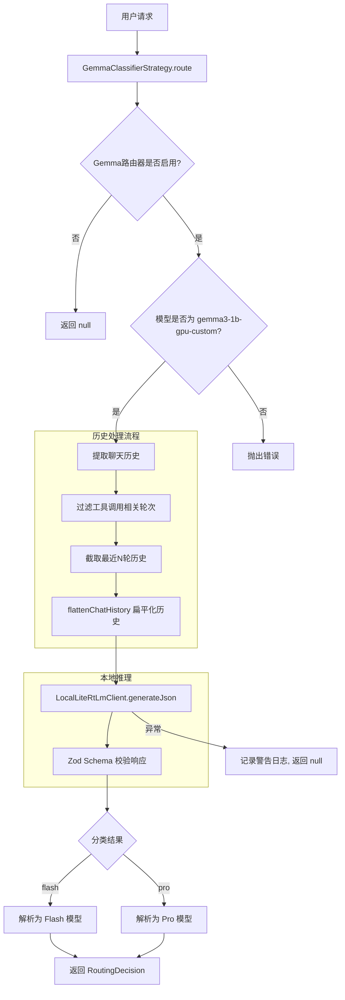

# gemmaClassifierStrategy.ts

## 概述

`GemmaClassifierStrategy` 是一个基于本地 Gemma 模型的任务路由分类策略。它实现了 `RoutingStrategy` 接口，利用本地部署的 LiteRT Gemma 模型（目前仅支持 `gemma3-1b-gpu-custom`）对用户请求的复杂度进行分类，从而决定将请求路由到 Flash（简单/快速）模型还是 Pro（强大/高级）模型。

该策略的核心思路是：通过一个轻量级的本地分类器快速判断任务复杂度，避免将简单任务发送到昂贵的 Pro 模型，从而优化响应速度和资源使用。

## 架构图（Mermaid）



## 核心组件

### 1. 常量定义

| 常量名 | 值 | 说明 |
|--------|-----|------|
| `HISTORY_TURNS_FOR_CONTEXT` | 4 | 提供给路由器的最近历史轮次数量 |
| `HISTORY_SEARCH_WINDOW` | 20 | 历史搜索窗口大小，用于初始截取 |
| `FLASH_MODEL` | `'flash'` | 简单任务模型别名 |
| `PRO_MODEL` | `'pro'` | 复杂任务模型别名 |

### 2. 复杂度评估准则 (`COMPLEXITY_RUBRIC`)

定义了判断任务复杂度的四个维度：

- **高操作复杂度**（预估 4+ 步骤/工具调用）：需要依赖操作、重要规划或多个协调变更
- **战略规划与概念设计**：询问"如何"或"为什么"，需要建议、架构或高层策略
- **高模糊度或大范围**（广泛调查）：广义定义的需求，需要大量调查
- **深度调试与根因分析**：根据症状诊断未知或复杂问题

**简单任务**标准：高度具体、有边界、低操作复杂度（预估 1-3 次工具调用）。操作简单性优先于战略性措辞。

### 3. 系统提示词 (`LITERT_GEMMA_CLASSIFIER_SYSTEM_PROMPT`)

一个精心设计的提示词模板，包含：
- **角色定义**：Lead Orchestrator，不直接与用户对话
- **模型选择说明**：flash（简单）和 pro（复杂）
- **复杂度评估准则**
- **输出格式要求**：JSON 格式，包含 `reasoning` 和 `model_choice`
- **6 个示例**：覆盖战略规划、简单工具使用、高操作复杂度、简单读取、深度调试、以及"尽管措辞战略性但本质简单"的场景

### 4. 提醒提示词 (`LITERT_GEMMA_CLASSIFIER_REMINDER`)

简化版的提示词，作为对话结尾的提醒，帮助模型聚焦于任务。

### 5. ClassifierResponseSchema

使用 Zod 定义的响应校验模式：

```typescript
const ClassifierResponseSchema = z.object({
  reasoning: z.string(),
  model_choice: z.enum([FLASH_MODEL, PRO_MODEL]),  // 'flash' | 'pro'
});
```

### 6. GemmaClassifierStrategy 类

#### `flattenChatHistory(turns: Content[]): Content[]`

**私有方法**，将多轮对话历史扁平化为单条用户消息：
1. 将除最后一条外的所有轮次合并为 "Chat History" 文本
2. 提取最后一条作为 "Current Request"
3. 将两部分组合为一条带有结构化格式的用户消息

这种扁平化对本地小模型（Gemma 1B）非常重要，因为小模型处理多轮对话能力有限。

#### `route(context, config, _baseLlmClient, client): Promise<RoutingDecision | null>`

**核心路由方法**，执行流程：

1. **检查启用状态**：从配置获取 Gemma 路由器设置，未启用则返回 `null`
2. **模型验证**：仅支持 `gemma3-1b-gpu-custom`，否则抛出错误
3. **历史处理**：
   - 取最近 20 轮（`HISTORY_SEARCH_WINDOW`）
   - 过滤掉函数调用和函数响应轮次
   - 从清理后的历史中取最近 4 轮（`HISTORY_TURNS_FOR_CONTEXT`）
4. **构建输入**：将历史和当前请求合并后扁平化
5. **本地推理**：调用 `LocalLiteRtLmClient.generateJson` 进行分类
6. **解析结果**：用 Zod Schema 验证 JSON 响应
7. **模型解析**：调用 `resolveClassifierModel` 将别名转换为实际模型标识符
8. **返回决策**：包含模型选择、来源标识、延迟时间和推理说明
9. **错误处理**：任何异常都被捕获，记录警告日志，返回 `null` 以允许组合策略继续

## 依赖关系

### 内部依赖

| 模块 | 导入项 | 用途 |
|------|--------|------|
| `../../core/baseLlmClient.js` | `BaseLlmClient` (类型) | LLM 客户端基类型（本策略未直接使用） |
| `../../core/localLiteRtLmClient.js` | `LocalLiteRtLmClient` (类型) | 本地 LiteRT 模型客户端，用于执行 Gemma 推理 |
| `../routingStrategy.js` | `RoutingContext`, `RoutingDecision`, `RoutingStrategy` | 路由策略接口和类型定义 |
| `../../config/models.js` | `resolveClassifierModel` | 将分类器别名（flash/pro）解析为实际模型 |
| `../../config/config.js` | `Config` (类型) | 配置接口 |
| `../../utils/messageInspectors.js` | `isFunctionCall`, `isFunctionResponse` | 判断消息是否为函数调用/响应 |
| `../../utils/debugLogger.js` | `debugLogger` | 调试日志工具 |

### 外部依赖

| 包名 | 导入项 | 用途 |
|------|--------|------|
| `zod` | `z` | 运行时 JSON 响应校验 |
| `@google/genai` | `createUserContent`, `Content`, `Part` | Google GenAI SDK，用于构建内容对象 |

## 关键实现细节

1. **本地推理优势**：与 `NumericalClassifierStrategy` 不同，该策略使用本地 Gemma 模型进行分类，无需网络请求到远程 API，理论上延迟更低。

2. **历史扁平化策略**：由于 Gemma 1B 是小型模型，多轮对话的理解能力有限。策略通过 `flattenChatHistory` 将多轮对话压缩为一条结构化消息（包含 "Chat History" 和 "Current Request" 段落），降低了模型理解的难度。

3. **二元分类**：与 `NumericalClassifierStrategy` 的 1-100 数值评分不同，Gemma 策略采用二元分类（flash/pro），简化了决策逻辑，更适合小型模型的能力范围。

4. **双层历史过滤**：先从最近 20 轮中过滤掉工具调用（`isFunctionCall` / `isFunctionResponse`），再取最近 4 轮。这确保了提供给分类器的上下文是纯用户/模型对话，不含工具交互噪声。

5. **容错设计**：整个 `route` 方法被 try-catch 包裹。任何失败（API 错误、JSON 解析错误等）都会被优雅处理——记录警告日志后返回 `null`，让组合策略（Composite Strategy）可以退回到其他路由策略。

6. **模型限制**：当前硬编码仅支持 `gemma3-1b-gpu-custom` 模型，其他模型会直接抛出错误。这是因为只有该模型经过了测试验证。

7. **提示词工程**：系统提示词包含 6 个精心设计的示例，覆盖了多种边界情况（如"措辞看似复杂但实际简单"的场景），帮助小模型做出更准确的分类。提示词还特别强调"用户请求的权重应远高于周围上下文"。
