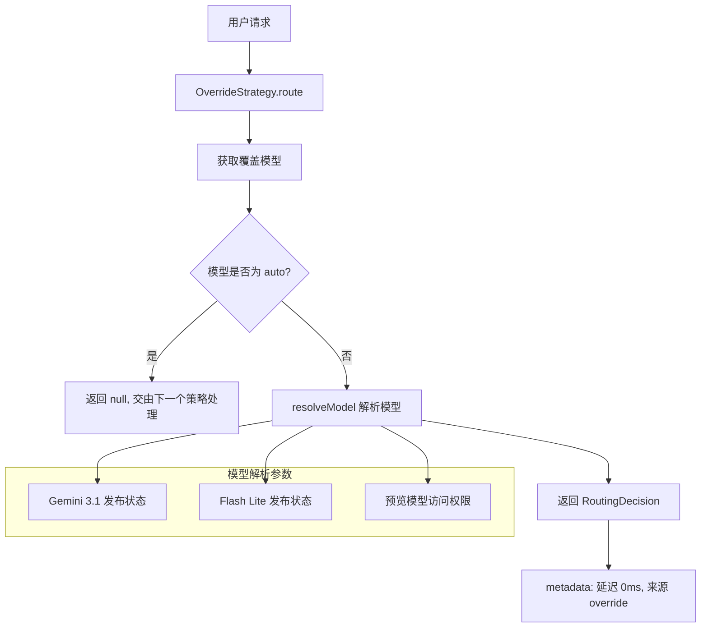

# overrideStrategy.ts

## 概述

`OverrideStrategy` 是路由策略体系中最简单的策略实现。它处理用户显式指定模型的情况——当用户或配置明确指定了某个具体模型（而非 `auto` 自动模式）时，直接使用该模型，跳过所有复杂度分类逻辑。

该策略通常在组合策略（Composite Strategy）中作为第一个执行的策略，起到"短路"作用：如果用户已经明确指定了模型，就没必要进行复杂度评估。

## 架构图（Mermaid）

## 核心组件

### OverrideStrategy 类

实现 `RoutingStrategy` 接口，策略名称为 `'override'`。

#### `route(context, config, _baseLlmClient, _localLiteRtLmClient): Promise<RoutingDecision | null>`

**核心路由方法**，逻辑非常简洁：

1. **获取目标模型**：优先使用 `context.requestedModel`（用户在当前请求中指定的模型），其次使用 `config.getModel()`（全局配置的默认模型）
2. **Auto 模式检测**：调用 `isAutoModel()` 检查模型是否为自动模式（`'auto'` 或类似标识）
   - 如果是 `auto` → 返回 `null`，将决策权交给下一个策略
3. **模型解析**：调用 `resolveModel()` 将模型别名解析为实际的 API 模型标识符，传入多个功能开关：
   - `getGemini31LaunchedSync()` — Gemini 3.1 是否已发布（同步版本）
   - `getGemini31FlashLiteLaunchedSync()` — Gemini 3.1 Flash Lite 是否已发布
   - 自定义工具模型：固定为 `false`
   - 预览模型访问权限：`getHasAccessToPreviewModel()`，默认为 `true`
4. **返回决策**：构建 `RoutingDecision`，延迟为 0ms（无需任何推理过程），并附带说明信息

## 依赖关系

### 内部依赖

| 模块 | 导入项 | 用途 |
|------|--------|------|
| `../../config/config.js` | `Config` (类型) | 配置接口 |
| `../../config/models.js` | `isAutoModel`, `resolveModel` | 判断是否为自动模型、解析模型标识 |
| `../../core/baseLlmClient.js` | `BaseLlmClient` (类型) | LLM 客户端基类型（本策略未使用） |
| `../routingStrategy.js` | `RoutingContext`, `RoutingDecision`, `RoutingStrategy` | 路由策略接口和类型定义 |
| `../../core/localLiteRtLmClient.js` | `LocalLiteRtLmClient` (类型) | 本地模型客户端（本策略未使用） |

### 外部依赖

无外部依赖。该策略完全依赖内部模块，不需要任何第三方库。

## 关键实现细节

1. **策略优先级**：`OverrideStrategy` 通常是组合策略链中第一个被调用的策略。它的作用是在用户明确指定模型时"短路"整个分类流程，避免不必要的远程/本地推理调用。

2. **零延迟**：元数据中 `latencyMs: 0`，因为该策略不执行任何推理操作，仅做简单的判断和映射。

3. **同步 vs 异步 API**：注意该策略使用的是 `getGemini31LaunchedSync` 和 `getGemini31FlashLiteLaunchedSync`（同步版本），而非 `NumericalClassifierStrategy` 中使用的异步版本。这是因为 Override 策略追求零延迟，使用同步 API 避免了不必要的异步等待。但代价是这些值可能在首次调用时尚未从远程获取到，此时会使用默认值 `false`。

4. **Auto 模式的语义**：当模型设置为 `auto` 时，意味着用户希望系统自动选择最合适的模型。此时 `OverrideStrategy` 返回 `null`，将决策权传递给后续的分类器策略（如 `GemmaClassifierStrategy` 或 `NumericalClassifierStrategy`）。

5. **请求级 vs 配置级覆盖**：`context.requestedModel` 代表请求级覆盖（如用户在某次对话中指定 `@model:pro`），而 `config.getModel()` 代表配置级默认值。请求级优先于配置级。

6. **安全默认值**：在调用 `resolveModel` 时，多个可选方法使用了空值合并（`??`）提供安全默认值，确保在配置对象不完整时也能正常工作。
