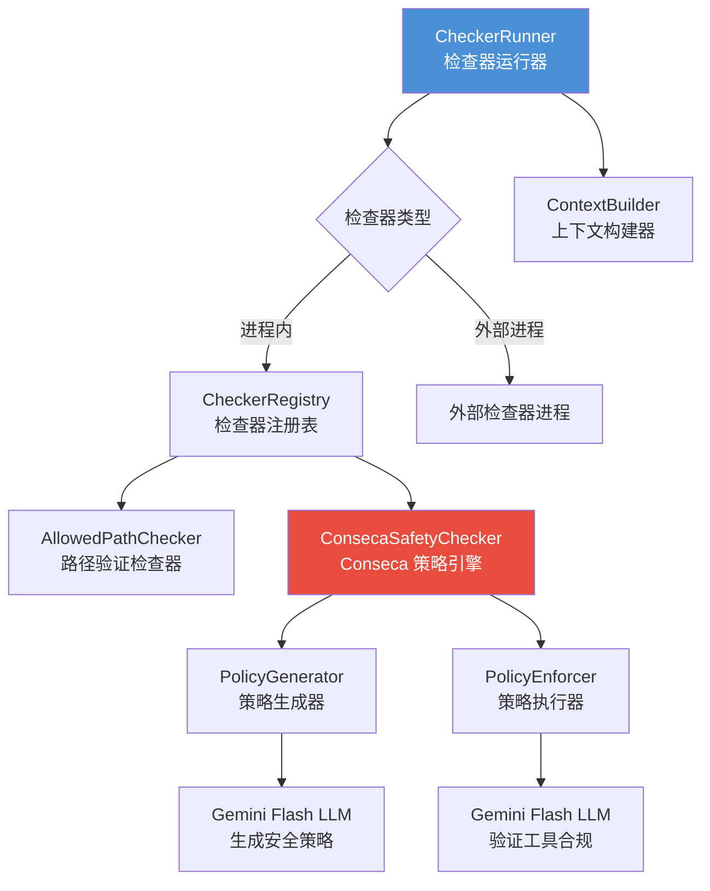
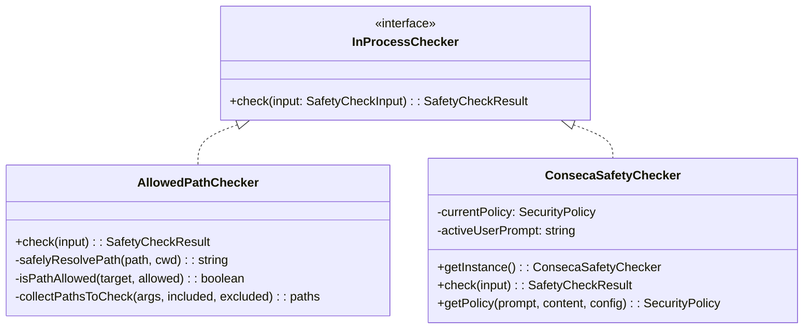
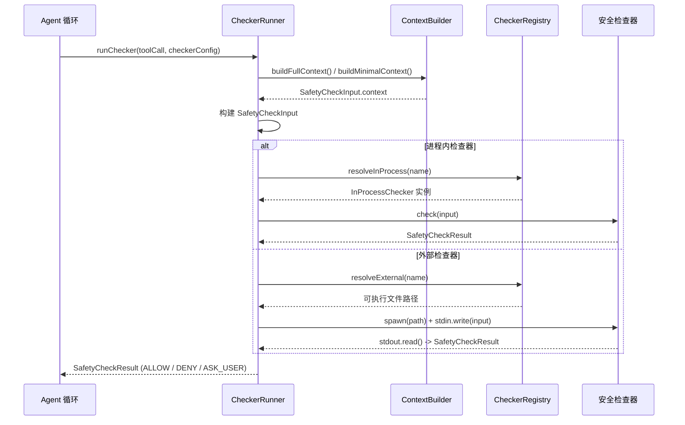
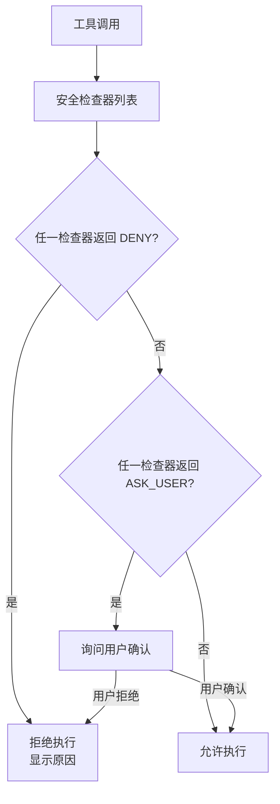

# safety

## 概述

`safety` 模块负责 Gemini CLI 的**工具调用安全检查**。它在 AI 执行工具（如文件操作、Shell 命令）之前，对工具调用进行安全验证，决定是允许 (ALLOW)、拒绝 (DENY) 还是询问用户 (ASK_USER)。该模块支持**进程内检查器**（如路径验证、Conseca 策略引擎）和**外部检查器**（独立进程），通过注册表和统一协议实现可扩展的安全检查架构。

## 目录结构

```
safety/
├── protocol.ts                   # 安全检查协议定义（输入/输出/决策枚举）
├── registry.ts                   # 检查器注册表（解析检查器名称到实例）
├── registry.test.ts
├── built-in.ts                   # 内建检查器（AllowedPathChecker）
├── built-in.test.ts
├── checker-runner.ts             # 检查器运行器（执行进程内和外部检查器）
├── checker-runner.test.ts
├── context-builder.ts            # 安全检查上下文构建器
├── context-builder.test.ts
└── conseca/                      # Conseca 安全策略引擎
    ├── types.ts                  # Conseca 类型定义
    ├── conseca.ts                # Conseca 主检查器（单例）
    ├── conseca.test.ts
    ├── integration.test.ts
    ├── policy-enforcer.ts        # 策略执行器（LLM 驱动的合规检查）
    ├── policy-enforcer.test.ts
    ├── policy-generator.ts       # 策略生成器（LLM 驱动的策略生成）
    └── policy-generator.test.ts
```

## 架构图





## 核心组件

### protocol.ts（安全检查协议）

定义安全检查的标准化数据结构：

| 类型 | 说明 |
|------|------|
| `SafetyCheckInput` | 检查器输入，包含协议版本、工具调用、环境上下文、对话历史 |
| `SafetyCheckResult` | 检查器输出，包含决策和原因 |
| `SafetyCheckDecision` | 决策枚举：`ALLOW`、`DENY`、`ASK_USER` |
| `ConversationTurn` | 对话轮次，包含用户文本和模型响应/工具调用 |

协议版本当前为 `1.0.0`，支持未来的向后兼容升级。

### registry.ts（检查器注册表）

`CheckerRegistry` 管理所有可用的安全检查器：
- **进程内检查器** - `AllowedPathChecker`（路径验证）和 `ConsecaSafetyChecker`（Conseca 策略）
- **外部检查器** - 预留扩展接口（当前无外部内建检查器）
- 检查器名称验证：仅允许小写字母、数字和连字符

### built-in.ts（内建检查器）

**`AllowedPathChecker`** - 路径验证检查器：
- 验证工具调用中的文件路径是否在允许的工作区目录内
- 自动检测路径参数：匹配包含 `path`、`directory`、`file`、`source`、`destination` 的参数名
- 支持 `included_args`/`excluded_args` 配置
- 安全路径解析：从不存在的路径向上查找可规范化的父目录
- 使用相对路径检查防止 `../` 逃逸

### checker-runner.ts（检查器运行器）

`CheckerRunner` 执行安全检查器并处理其生命周期：

| 功能 | 说明 |
|------|------|
| 进程内执行 | 直接调用检查器实例的 `check()` 方法 |
| 外部进程执行 | 通过 `spawn` 启动独立进程，通过 stdin/stdout 传递 JSON |
| 超时控制 | 默认 5 秒超时，超时后 SIGTERM，5 秒后 SIGKILL |
| 错误处理 | 任何错误都返回 `DENY`（安全优先） |
| 响应验证 | 使用 Zod schema 验证检查器输出 |

### context-builder.ts（上下文构建器）

`ContextBuilder` 构建安全检查器所需的上下文信息：
- `buildFullContext()` - 完整上下文（环境信息 + 对话历史）
- `buildMinimalContext(keys)` - 最小上下文（仅包含指定字段）
- 将 Google GenAI `Content[]` 转换为 `ConversationTurn[]` 格式
- 处理空历史时使用待处理的用户问题

### conseca/ 子目录

详见 [conseca/README.md](./conseca/README.md)。

## 依赖关系

### 内部依赖

| 模块 | 用途 |
|------|------|
| `config/config` | 获取配置（Conseca 开关等） |
| `config/agent-loop-context` | Agent 循环上下文（获取历史、工具注册表） |
| `policy/types` | 检查器配置类型（`SafetyCheckerConfig`、`InProcessCheckerConfig`） |
| `telemetry/index` | Conseca 遥测事件记录 |
| `utils/debugLogger` | 调试日志 |
| `utils/partUtils` | 响应文本提取 |
| `utils/textUtils` | 安全模板替换 |

### 外部依赖

| 包 | 用途 |
|---|------|
| `@google/genai` | Google GenAI SDK（`FunctionCall`、`Content` 类型） |
| `zod` | 输入输出 schema 验证 |
| `zod-to-json-schema` | Zod schema 转 JSON Schema（Conseca 使用） |
| `node:child_process` | 外部检查器进程管理 |
| `node:path`、`node:fs` | 文件系统操作 |

## 数据流

### 安全检查完整流程



### 安全决策优先级


