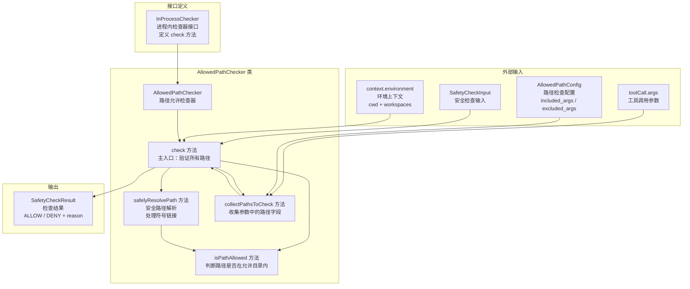
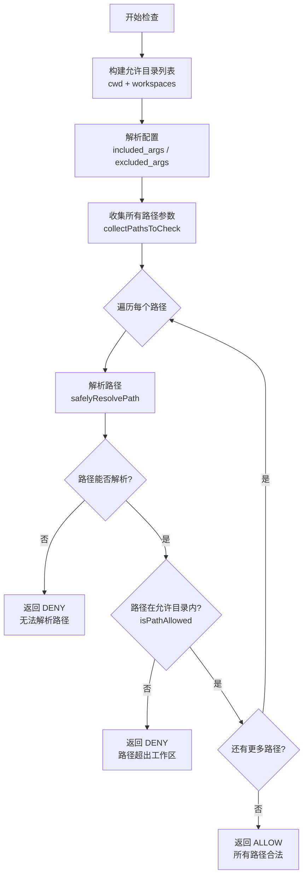
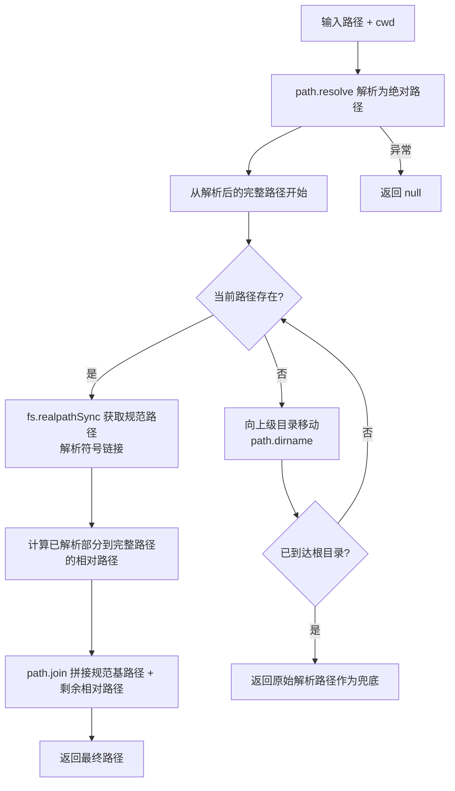
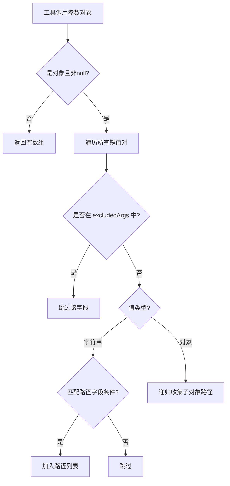

# built-in.ts

## 概述

`built-in.ts` 是 Gemini CLI 安全检查子系统的**内置安全检查器实现文件**，位于 `packages/core/src/safety/` 目录下。该文件定义了进程内安全检查器的接口 `InProcessChecker`，并实现了其核心实现 `AllowedPathChecker` -- 一个专门用于验证工具调用中文件路径是否在允许的工作区目录内的安全检查器。

`AllowedPathChecker` 是一道重要的安全防线：当 AI 模型请求执行涉及文件系统的工具调用时，该检查器会自动检测参数中的路径类字段，验证这些路径是否都位于允许的工作区目录之内，从而防止 AI 模型越权访问或修改工作区之外的文件。

## 架构图（Mermaid）



## 核心组件

### 1. InProcessChecker 接口

所有进程内安全检查器必须实现的接口，定义了统一的检查入口：

```typescript
export interface InProcessChecker {
  check(input: SafetyCheckInput): Promise<SafetyCheckResult>;
}
```

- **输入**：`SafetyCheckInput`，包含工具调用信息、上下文环境和配置
- **输出**：`Promise<SafetyCheckResult>`，异步返回检查决策（ALLOW 或 DENY）及原因

### 2. AllowedPathChecker 类

实现 `InProcessChecker` 接口的路径安全检查器。

#### 2.1 check(input: SafetyCheckInput) -- 主检查方法

这是检查器的入口方法，执行流程如下：



**允许目录列表**由两部分组成：
- `context.environment.cwd`：当前工作目录
- `context.environment.workspaces`：额外的工作区目录列表

#### 2.2 safelyResolvePath(inputPath, cwd) -- 安全路径解析

这是一个关键的私有方法，负责将输入路径安全地解析为规范化的绝对路径，特别处理了符号链接和不存在的路径：



**设计要点**：
- 从完整路径开始，逐级向上查找第一个存在的路径，对其调用 `realpathSync` 解析符号链接
- 将规范化的基路径与剩余的相对路径拼接，得到最终路径
- 出错时返回 `null`，调用方会将其判定为 DENY

#### 2.3 isPathAllowed(targetPath, allowedDir) -- 路径允许判定

判断目标路径是否在允许的目录内：

```typescript
private isPathAllowed(targetPath: string, allowedDir: string): boolean {
  const relative = path.relative(allowedDir, targetPath);
  return (
    relative === '' ||
    (!relative.startsWith('..') && !path.isAbsolute(relative))
  );
}
```

**判定逻辑**：
- 计算目标路径相对于允许目录的相对路径
- 如果相对路径为空字符串：路径就是允许目录本身 -- 允许
- 如果相对路径不以 `..` 开头且不是绝对路径：路径在允许目录内部 -- 允许
- 其他情况（以 `..` 开头表示在目录外，或绝对路径表示在不同驱动器/根目录下）-- 拒绝

#### 2.4 collectPathsToCheck(args, includedArgs, excludedArgs, prefix) -- 路径字段收集

递归遍历工具调用参数对象，收集所有可能是文件路径的字段：



**路径字段识别规则**（满足任一即可）：

| 规则 | 说明 | 示例 |
|---|---|---|
| 在 `includedArgs` 中 | 配置明确指定的参数名 | 自定义配置 |
| 键名包含 `'path'` | 路径相关字段 | `file_path`, `dir_path` |
| 键名包含 `'directory'` | 目录相关字段 | `target_directory` |
| 键名包含 `'file'` | 文件相关字段 | `output_file` |
| 键名等于 `'source'` | 源路径 | `source` |
| 键名等于 `'destination'` | 目标路径 | `destination` |

**递归支持**：使用 `prefix` 参数跟踪嵌套层级（如 `options.output.path`），支持在 `includedArgs` 和 `excludedArgs` 中使用点分隔的全限定键名。

## 依赖关系

### 内部依赖

| 依赖模块 | 导入内容 | 用途 |
|---|---|---|
| `./protocol.js` | `SafetyCheckDecision`, `SafetyCheckInput`, `SafetyCheckResult` | 安全检查的输入输出协议类型和决策枚举 |
| `../policy/types.js` | `AllowedPathConfig` | 允许路径检查器的配置接口 |

### 外部依赖

| 依赖模块 | 导入内容 | 用途 |
|---|---|---|
| `node:path` | `path` | 路径解析、拼接、相对路径计算 |
| `node:fs` | `fs` | 文件系统操作（`existsSync`、`realpathSync`） |

## 关键实现细节

1. **符号链接安全处理**：`safelyResolvePath` 使用 `fs.realpathSync` 解析符号链接，防止通过符号链接绕过路径限制。例如，如果 `/tmp/link` 是指向 `/etc/passwd` 的符号链接，即使 `/tmp/` 是允许的目录，实际解析后的路径 `/etc/passwd` 也会被正确拒绝。

2. **不存在路径的处理**：对于尚不存在的文件路径（例如将要创建的新文件），检查器从完整路径逐级向上查找，直到找到一个存在的目录，再用该目录的规范路径作为基准。这确保了即使文件不存在，也能正确判断其是否在允许的工作区内。

3. **启发式路径检测**：`collectPathsToCheck` 通过键名包含 `path`、`directory`、`file` 等关键词来识别路径字段，这是一种启发式方法。`AllowedPathConfig` 提供的 `included_args` 和 `excluded_args` 可以进行精确控制，覆盖启发式规则的不足。

4. **递归嵌套参数支持**：工具调用参数可能是嵌套的 JSON 对象，`collectPathsToCheck` 通过递归遍历确保嵌套在深层结构中的路径字段也不会被遗漏。

5. **防御性编程**：所有文件系统操作都在 try-catch 块中执行，出现异常时安全地返回 `null`，由上层逻辑统一处理为 DENY 决策。这保证了即使在文件系统异常（权限不足、路径过长等）情况下，检查器也不会崩溃，而是安全地拒绝操作。

6. **双向路径解析**：不仅对目标路径进行规范化解析，也对允许目录本身进行解析（在 `check` 方法中对 `allowedDirs` 也调用了 `safelyResolvePath`），确保两侧的路径在同一个规范化空间中进行比较。
