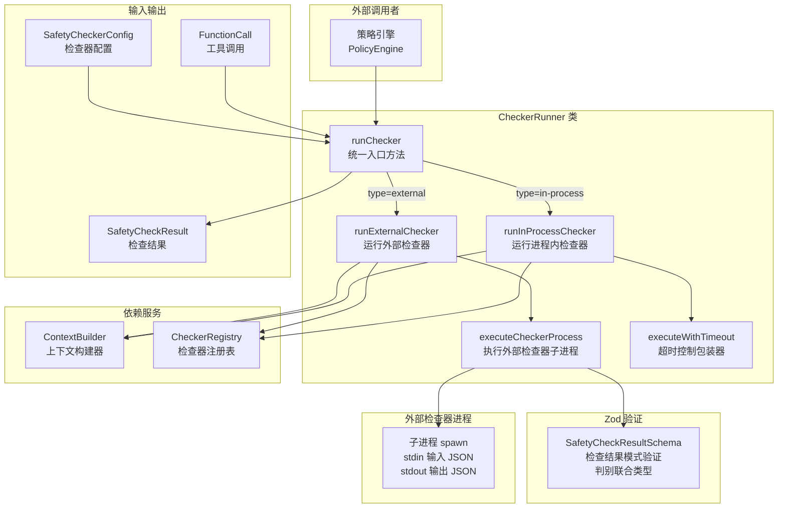
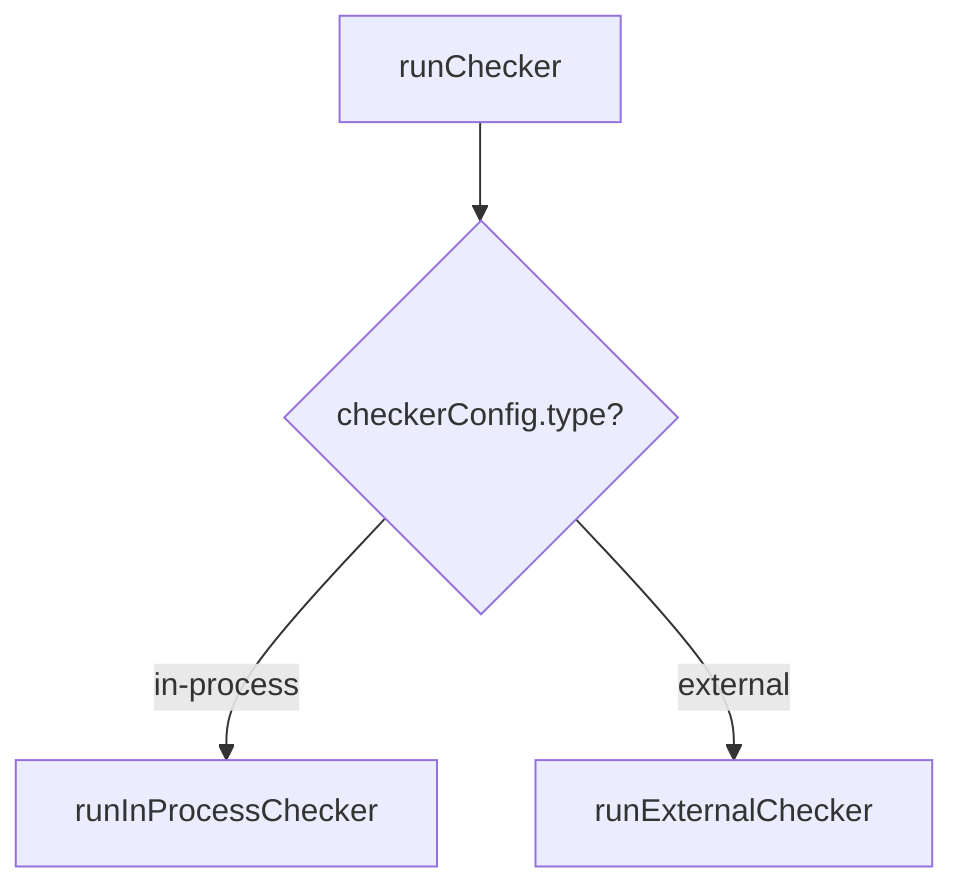
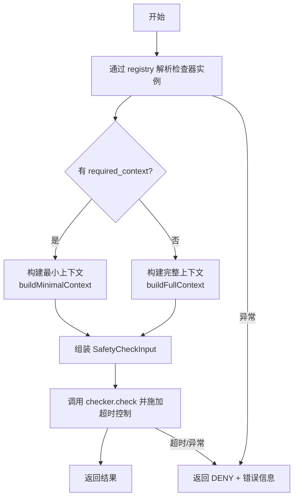
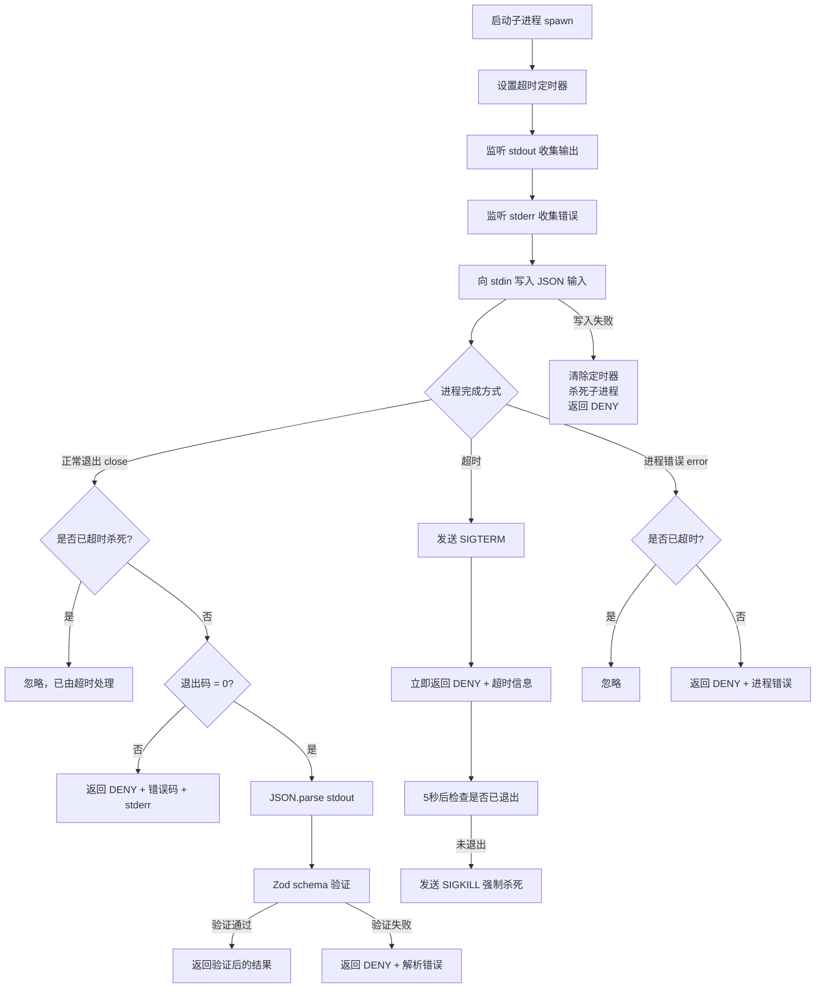

# checker-runner.ts

## 概述

`checker-runner.ts` 是 Gemini CLI 安全检查子系统的**检查器运行服务**，位于 `packages/core/src/safety/` 目录下。该文件实现了 `CheckerRunner` 类，负责统一调度和执行两种类型的安全检查器：**进程内检查器（in-process）**和**外部检查器（external）**。

`CheckerRunner` 是安全检查器的执行引擎，承担以下关键职责：
1. 根据检查器配置类型（进程内/外部）选择对应的执行路径
2. 通过 `ContextBuilder` 构建安全检查所需的上下文信息
3. 通过 `CheckerRegistry` 解析检查器的实例或可执行文件路径
4. 管理外部检查器子进程的完整生命周期（启动、输入传递、输出收集、超时控制、错误处理）
5. 使用 Zod schema 验证检查器输出的合法性
6. 在任何异常情况下安全地回退到 DENY 决策

## 架构图（Mermaid）



## 核心组件

### 1. SafetyCheckResultSchema -- Zod 验证模式

使用 Zod 库定义的安全检查结果验证模式，采用判别联合类型（discriminated union）确保外部检查器返回的 JSON 符合预期格式：

```typescript
const SafetyCheckResultSchema: z.ZodType<SafetyCheckResult> =
  z.discriminatedUnion('decision', [
    z.object({
      decision: z.literal(SafetyCheckDecision.ALLOW),
      reason: z.string().optional(),
    }),
    z.object({
      decision: z.literal(SafetyCheckDecision.DENY),
      reason: z.string().min(1),
    }),
    z.object({
      decision: z.literal(SafetyCheckDecision.ASK_USER),
      reason: z.string().min(1),
    }),
  ]);
```

**验证规则**：
| 决策 | reason 字段要求 |
|---|---|
| `ALLOW` | 可选（允许无原因） |
| `DENY` | 必填且非空（必须说明拒绝原因） |
| `ASK_USER` | 必填且非空（必须说明询问原因） |

### 2. CheckerRunnerConfig 接口

检查器运行器的配置：

| 字段 | 类型 | 必填 | 默认值 | 说明 |
|---|---|---|---|---|
| `timeout` | `number` | 否 | `5000`（5秒） | 检查器执行超时时间（毫秒） |
| `checkersPath` | `string` | 是 | - | 外部检查器可执行文件所在目录 |

### 3. CheckerRunner 类

#### 3.1 构造函数

```typescript
constructor(
  contextBuilder: ContextBuilder,
  registry: CheckerRegistry,
  config: CheckerRunnerConfig,
)
```

注入三个依赖：
- `contextBuilder`：负责构建安全检查上下文
- `registry`：负责解析检查器的实例或路径
- `config`：运行器配置（超时时间等）

#### 3.2 runChecker(toolCall, checkerConfig) -- 统一入口

根据 `checkerConfig.type` 判别符分发到对应的执行方法：



#### 3.3 runInProcessChecker(toolCall, checkerConfig) -- 进程内检查器执行

执行流程：



**关键细节**：
- 使用 `executeWithTimeout` 包装异步调用，防止进程内检查器死循环或长时间阻塞
- 上下文构建策略：如果检查器声明了 `required_context`，则仅构建最小上下文（性能优化）；否则构建完整上下文
- 协议版本固定为 `'1.0.0'`

#### 3.4 runExternalChecker(toolCall, checkerConfig) -- 外部检查器执行

执行流程与进程内检查器类似，但通过 `registry.resolveExternal()` 解析的是可执行文件路径，然后委托给 `executeCheckerProcess`。

#### 3.5 executeCheckerProcess(checkerPath, input, checkerName) -- 外部进程管理

这是最复杂的方法，管理外部检查器子进程的完整生命周期：



**子进程通信协议**：
- **输入**：通过 stdin 发送 JSON 格式的 `SafetyCheckInput`
- **输出**：从 stdout 读取 JSON 格式的 `SafetyCheckResult`
- **错误**：从 stderr 读取错误信息

**超时控制的双阶段机制**：
1. 第一阶段：超时后发送 `SIGTERM`（优雅终止），立即返回 DENY 结果
2. 第二阶段：如果 `SIGTERM` 后 5 秒进程仍未退出，发送 `SIGKILL`（强制杀死），且 `setTimeout` 使用 `.unref()` 避免阻止 Node.js 进程退出

**状态管理**：使用 `killed` 和 `exited` 两个布尔标志协调超时杀死和正常退出之间的竞态条件。

#### 3.6 executeWithTimeout(promise) -- 超时控制包装器

通用的 Promise 超时包装器：

```typescript
private executeWithTimeout<T>(promise: Promise<T>): Promise<T> {
  return new Promise((resolve, reject) => {
    const timeoutHandle = setTimeout(() => {
      reject(new Error(`Checker timed out after ${this.timeout}ms`));
    }, this.timeout);
    promise
      .then(resolve)
      .catch(reject)
      .finally(() => {
        clearTimeout(timeoutHandle);
      });
  });
}
```

- 如果原始 Promise 在超时内完成，正常传播结果
- 如果超时，抛出超时错误
- 使用 `finally` 确保定时器总是被清除，防止内存泄漏

## 依赖关系

### 内部依赖

| 依赖模块 | 导入内容 | 用途 |
|---|---|---|
| `../policy/types.js` | `SafetyCheckerConfig`, `InProcessCheckerConfig`, `ExternalCheckerConfig` | 检查器配置类型 |
| `./protocol.js` | `SafetyCheckDecision`, `SafetyCheckInput`, `SafetyCheckResult` | 安全检查协议定义 |
| `./registry.js` | `CheckerRegistry` 类型 | 检查器注册表，解析检查器实例/路径 |
| `./context-builder.js` | `ContextBuilder` 类型 | 安全检查上下文构建器 |

### 外部依赖

| 依赖模块 | 导入内容 | 用途 |
|---|---|---|
| `node:child_process` | `spawn` | 启动外部检查器子进程 |
| `@google/genai` | `FunctionCall` 类型 | Google GenAI SDK 中工具调用的类型定义 |
| `zod` | `z` | 运行时数据验证，确保外部检查器输出符合预期格式 |

## 关键实现细节

1. **安全优先原则（Deny by Default）**：所有异常情况（超时、进程错误、解析失败、写入失败等）一律返回 `DENY` 决策。这是安全系统的基本原则 -- 宁可误拒绝也不误放行。

2. **双超时机制**：对于外部检查器，先发送 `SIGTERM` 给进程一个优雅退出的机会（如清理临时文件），5 秒后如果仍未退出再发送 `SIGKILL` 强制终止。使用 `.unref()` 确保强制杀死的定时器不会阻止 Node.js 主进程退出。

3. **竞态条件处理**：`killed` 和 `exited` 标志变量解决了超时杀死与正常退出之间的竞态条件。当超时触发并杀死进程后，后续的 `close` 事件会检查 `killed` 标志并跳过结果处理，避免重复 resolve。

4. **Zod 运行时验证**：外部检查器的输出经过 Zod schema 严格验证，不信任外部进程的任何输出。这防止了恶意或有缺陷的外部检查器返回非法格式的结果。验证要求 `DENY` 和 `ASK_USER` 决策必须附带非空的 `reason` 字段。

5. **上下文按需构建**：检查器可以通过 `required_context` 声明仅需要的上下文字段。当声明了 `required_context` 时，使用 `buildMinimalContext` 仅构建必需的字段，减少传输给外部检查器的数据量，提升性能并减少信息暴露。

6. **进程间通信设计**：外部检查器通过 stdin/stdout 管道通信，使用 JSON 作为序列化格式。这是一种简单而通用的进程间通信方式，允许外部检查器用任何编程语言实现，只需遵循 JSON 输入/输出协议即可。

7. **Promise 包装模式**：`executeCheckerProcess` 将基于事件的 Node.js 子进程 API 封装为 Promise，使其可以在 async/await 流程中使用。注意该 Promise 永远 resolve（即使出错也 resolve 为 DENY 结果），而不是 reject，简化了上层调用者的错误处理。
