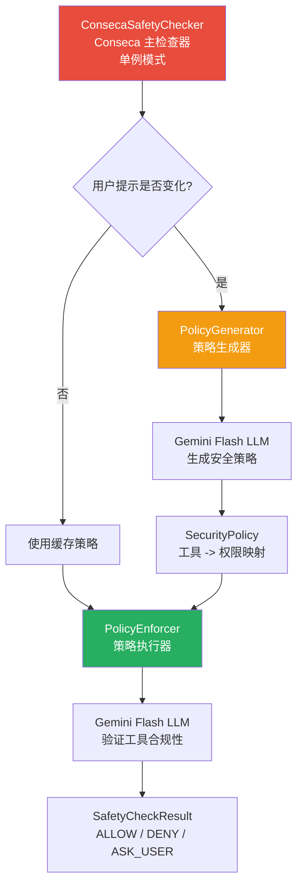
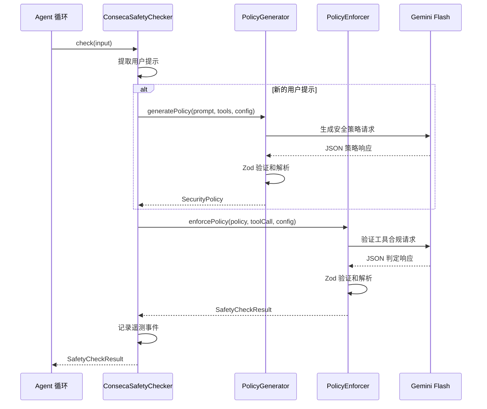
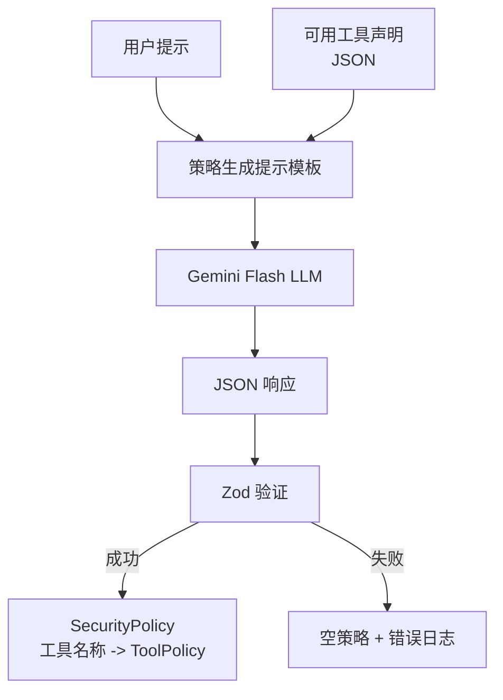
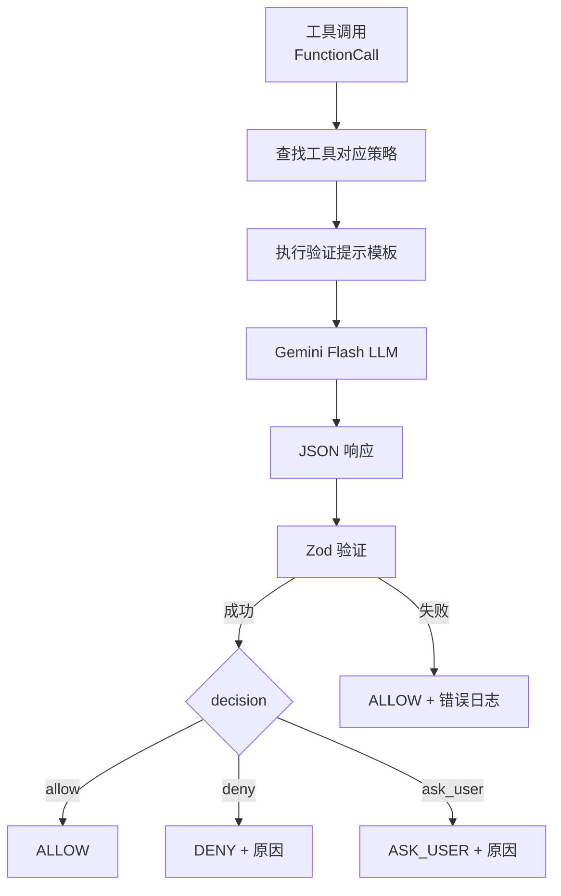

# conseca

## 概述

`conseca` (Context-aware Security Agent) 是一个**基于 LLM 的上下文感知安全策略引擎**。它通过两阶段流程实现动态安全控制：首先利用 LLM 根据用户的请求和可用工具生成细粒度的安全策略（最小权限原则），然后在每次工具调用时利用 LLM 验证该调用是否符合已生成的策略。这种方法使安全策略能够根据用户的实际意图动态调整，而非依赖静态规则。

## 目录结构

```
conseca/
├── types.ts                  # 类型定义（ToolPolicy、SecurityPolicy）
├── conseca.ts                # Conseca 主检查器（单例模式）
├── conseca.test.ts           # 主检查器单元测试
├── integration.test.ts       # 集成测试
├── policy-enforcer.ts        # 策略执行器（LLM 验证工具调用合规性）
├── policy-enforcer.test.ts   # 执行器单元测试
├── policy-generator.ts       # 策略生成器（LLM 生成安全策略）
└── policy-generator.test.ts  # 生成器单元测试
```

## 架构图





## 核心组件

### types.ts（类型定义）

| 类型 | 说明 |
|------|------|
| `ToolPolicy` | 单个工具的安全策略，包含 `permissions`（权限）、`constraints`（约束条件）、`rationale`（依据） |
| `SecurityPolicy` | 工具名称到 `ToolPolicy` 的映射 |

### ConsecaSafetyChecker（主检查器）

采用**单例模式**，维护以下状态：
- `currentPolicy` - 当前生效的安全策略
- `activeUserPrompt` - 触发当前策略的用户提示

**`check(input)` 执行流程：**
1. 检查 Conseca 是否启用（`config.enableConseca`）
2. 从输入的对话历史中提取最新的用户提示
3. 如果用户提示发生变化，触发策略重新生成
4. 获取工具注册表中所有可用工具的声明（作为可信内容）
5. 使用策略执行器验证当前工具调用
6. 记录遥测事件（策略内容、判定结果、错误信息）

**容错机制：**
- 配置未初始化时允许执行
- Conseca 禁用时允许执行
- 无策略时允许执行（fail-open）

### PolicyGenerator（策略生成器）

**`generatePolicy(userPrompt, trustedContent, config)`** - 使用 Gemini Flash 模型生成安全策略：

**系统提示核心原则：**
1. **最小权限原则** - 策略应尽可能严格
2. **权限分类**：`allow`（必需）、`deny`（超出范围）、`ask_user`（破坏性/模糊操作）
3. **约束具体化** - 限制文件路径、命令参数等
4. **依据引用** - 引用用户的原始请求

**输出格式：** JSON 对象，包含 `policies` 数组，每项包含 `tool_name` 和 `policy`（权限、约束、依据）。

**响应处理：**
- 使用 Zod schema 验证 LLM 响应
- 解析失败返回空策略并记录错误
- LLM 调用失败返回空策略（fail-open）

### PolicyEnforcer（策略执行器）

**`enforcePolicy(policy, toolCall, config)`** - 使用 Gemini Flash 模型验证工具调用是否合规：

**执行流程：**
1. 提取工具名称对应的策略
2. 构建包含策略和工具调用的验证提示
3. 调用 LLM 进行合规判定
4. 解析响应获取 `decision` 和 `reason`

**容错机制：**
- Content Generator 未初始化时允许执行
- 工具名称缺失时允许执行
- LLM 响应为空时允许执行
- JSON 解析失败时允许执行
- LLM 调用失败时允许执行

所有容错场景都会在结果中包含 `error` 字段以便追踪。

## 依赖关系

### 内部依赖

| 模块 | 用途 |
|------|------|
| `safety/protocol` | 安全检查协议类型 |
| `safety/built-in` | `InProcessChecker` 接口 |
| `config/config` | 配置访问（`enableConseca`、`getContentGenerator`） |
| `config/agent-loop-context` | Agent 上下文（工具注册表） |
| `config/models` | `DEFAULT_GEMINI_FLASH_MODEL` 常量 |
| `telemetry/index` | 遥测事件（策略生成、合规判定） |
| `utils/debugLogger` | 调试日志 |
| `utils/partUtils` | 响应文本提取 |
| `utils/textUtils` | 安全模板替换 |

### 外部依赖

| 包 | 用途 |
|---|------|
| `zod` | LLM 响应 schema 验证 |
| `zod-to-json-schema` | 将 Zod schema 转换为 OpenAPI 3 JSON Schema（用于 LLM 响应格式约束） |

## 数据流

### 策略生成流程



### 策略执行流程


