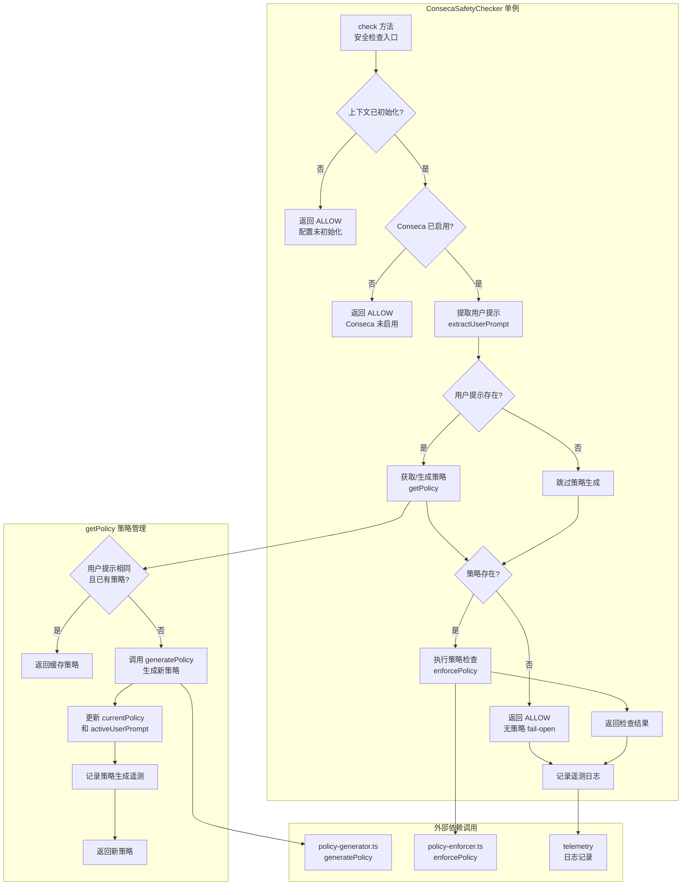

# conseca.ts

## 概述

`conseca.ts` 是 **Conseca 安全检查器**的核心实现文件，`ConsecaSafetyChecker` 类实现了 `InProcessChecker` 接口，作为进程内安全检查器运行在 CLI 主进程中。

Conseca（Context-Sensitive Safety Checker）是一种**上下文感知的安全检查机制**，其核心思路是：
1. 根据用户的提示（prompt）和可用的工具声明，**动态生成安全策略**（`SecurityPolicy`）。
2. 在每次工具调用时，使用当前策略**执行合规性检查**（policy enforcement）。
3. 当用户提示发生变化时，重新生成策略；相同提示下复用缓存的策略。

该类采用**单例模式**，确保全局只有一个 Conseca 检查器实例，维护统一的策略状态。

## 架构图（Mermaid）



## 核心组件

### 1. `ConsecaSafetyChecker` 类

#### 单例模式

```typescript
private static instance: ConsecaSafetyChecker | undefined;

private constructor() {}  // 私有构造函数

static getInstance(): ConsecaSafetyChecker {
  if (!ConsecaSafetyChecker.instance) {
    ConsecaSafetyChecker.instance = new ConsecaSafetyChecker();
  }
  return ConsecaSafetyChecker.instance;
}

static resetInstance(): void {  // 仅用于测试
  ConsecaSafetyChecker.instance = undefined;
}
```

使用经典的单例模式确保全局唯一实例。`resetInstance` 方法专为测试设计，允许在测试间重置状态。

#### 实例状态

```typescript
private currentPolicy: SecurityPolicy | null = null;   // 当前生效的安全策略
private activeUserPrompt: string | null = null;         // 当前策略对应的用户提示
private context: AgentLoopContext | null = null;         // Agent 循环上下文
```

| 状态字段 | 类型 | 初始值 | 说明 |
|----------|------|--------|------|
| `currentPolicy` | `SecurityPolicy \| null` | `null` | 当前生效的安全策略，由 `generatePolicy` 生成 |
| `activeUserPrompt` | `string \| null` | `null` | 当前策略对应的用户提示，用于策略缓存判断 |
| `context` | `AgentLoopContext \| null` | `null` | Agent 循环上下文，包含配置、工具注册表等 |

#### `setContext(context: AgentLoopContext): void`

注入 Agent 循环上下文，必须在 `check` 方法调用前设置。上下文包含了配置信息（`config`）和工具注册表（`toolRegistry`）。

#### `check(input: SafetyCheckInput): Promise<SafetyCheckResult>`

**主入口方法**，实现 `InProcessChecker` 接口。每次工具调用时被调用，返回安全检查决策。

**完整处理流程：**

1. **前置检查 — 上下文验证**：若 `context` 未初始化，返回 `ALLOW`（fail-open）。
2. **前置检查 — 功能开关**：若 `config.enableConseca` 为 `false`，返回 `ALLOW`。
3. **提取用户提示**：从输入的对话历史中获取最新一轮的用户文本。
4. **获取可信内容**：从工具注册表中提取所有工具的函数声明（JSON 格式），作为策略生成的可信上下文。
5. **获取/生成策略**：若有用户提示，则调用 `getPolicy`；若无提示，跳过策略生成。
6. **执行策略检查**：
   - 若无策略（`currentPolicy` 为 null），返回 `ALLOW` 并附带错误信息（fail-open）。
   - 若有策略，调用 `enforcePolicy` 进行合规性检查。
7. **遥测日志**：记录检查结果到遥测系统。

```typescript
async check(input: SafetyCheckInput): Promise<SafetyCheckResult> {
  // 1. 上下文验证
  if (!this.context) {
    return { decision: SafetyCheckDecision.ALLOW, reason: 'Config not initialized' };
  }
  // 2. 功能开关检查
  if (!this.context.config.enableConseca) {
    return { decision: SafetyCheckDecision.ALLOW, reason: 'Conseca is disabled' };
  }
  // 3. 提取用户提示
  const userPrompt = this.extractUserPrompt(input);
  // 4. 获取可信内容（工具声明）
  let trustedContent = '';
  const toolRegistry = this.context.toolRegistry;
  if (toolRegistry) {
    const tools = toolRegistry.getFunctionDeclarations();
    trustedContent = JSON.stringify(tools, null, 2);
  }
  // 5. 获取/生成策略
  if (userPrompt) {
    await this.getPolicy(userPrompt, trustedContent, this.context.config);
  }
  // 6. 执行策略检查
  let result: SafetyCheckResult;
  if (!this.currentPolicy) {
    result = {
      decision: SafetyCheckDecision.ALLOW,
      reason: 'No security policy generated.',
      error: 'No security policy generated.',
    };
  } else {
    result = await enforcePolicy(this.currentPolicy, input.toolCall, this.context.config);
  }
  // 7. 遥测日志
  logConsecaVerdict(this.context.config, new ConsecaVerdictEvent(...));
  return result;
}
```

#### `getPolicy(userPrompt, trustedContent, config): Promise<SecurityPolicy>`

**策略管理方法**，负责获取或生成安全策略。

```typescript
async getPolicy(
  userPrompt: string,
  trustedContent: string,
  config: Config,
): Promise<SecurityPolicy> {
  // 缓存命中：同一用户提示下复用现有策略
  if (this.activeUserPrompt === userPrompt && this.currentPolicy) {
    return this.currentPolicy;
  }
  // 缓存未命中：生成新策略
  const { policy, error } = await generatePolicy(userPrompt, trustedContent, config);
  this.currentPolicy = policy;
  this.activeUserPrompt = userPrompt;
  // 记录遥测
  logConsecaPolicyGeneration(config, new ConsecaPolicyGenerationEvent(...));
  return policy;
}
```

**缓存策略：**
- 以 `activeUserPrompt` 作为缓存键。
- 当用户提示未变化时，直接返回缓存的 `currentPolicy`，避免重复调用 LLM 生成策略。
- 当用户提示变化时，重新生成策略并替换缓存。

#### `extractUserPrompt(input: SafetyCheckInput): string | null`

从 `SafetyCheckInput` 的对话历史中提取最新一轮的用户文本。

```typescript
private extractUserPrompt(input: SafetyCheckInput): string | null {
  const prompt = input.context.history?.turns.at(-1)?.user.text;
  if (prompt) {
    return prompt;
  }
  debugLogger.debug(`[Conseca] extractUserPrompt failed.`);
  return null;
}
```

使用 `Array.prototype.at(-1)` 获取最后一个对话轮次的用户文本。

#### 测试辅助方法

```typescript
getCurrentPolicy(): SecurityPolicy | null    // 获取当前策略（测试用）
getActiveUserPrompt(): string | null          // 获取当前活跃提示（测试用）
```

## 依赖关系

### 内部依赖

| 模块路径 | 导入内容 | 用途 |
|----------|---------|------|
| `../built-in.js` | `InProcessChecker`（类型） | 进程内检查器接口，`ConsecaSafetyChecker` 实现此接口 |
| `../protocol.js` | `SafetyCheckDecision`, `SafetyCheckInput`, `SafetyCheckResult` | 安全检查协议中的枚举和类型定义 |
| `../../telemetry/index.js` | `logConsecaPolicyGeneration`, `ConsecaPolicyGenerationEvent`, `logConsecaVerdict`, `ConsecaVerdictEvent` | 遥测日志记录函数和事件类 |
| `../../utils/debugLogger.js` | `debugLogger` | 调试日志工具 |
| `../../config/config.js` | `Config`（类型） | 配置接口类型 |
| `./policy-generator.js` | `generatePolicy` | 安全策略生成函数 |
| `./policy-enforcer.js` | `enforcePolicy` | 安全策略执行/检查函数 |
| `./types.js` | `SecurityPolicy`（类型） | 安全策略数据结构定义 |
| `../../config/agent-loop-context.js` | `AgentLoopContext`（类型） | Agent 循环上下文类型 |

### 外部依赖

无直接外部依赖。所有依赖均为项目内部模块。

## 关键实现细节

1. **单例模式的必要性**：`ConsecaSafetyChecker` 维护了有状态的策略缓存（`currentPolicy` 和 `activeUserPrompt`），单例确保整个应用生命周期中策略状态的一致性。如果允许多实例，可能导致策略不一致或重复生成。

2. **策略缓存与失效**：采用简单的"提示文本相等比较"作为缓存策略。当用户输入新的提示时，旧策略自动失效并重新生成。这意味着：
   - 同一用户提示下的多次工具调用共享同一策略（高效）。
   - 用户提示变化后策略立即更新（安全）。
   - 缓存粒度为"最近一次用户提示"，不保留历史策略。

3. **Fail-open 设计贯穿始终**：在多个异常场景下都默认返回 `ALLOW`：
   - 上下文未初始化 → `ALLOW`
   - Conseca 未启用 → `ALLOW`
   - 无法生成策略 → `ALLOW`（并附带 `error` 字段）
   - 这保证了安全检查器的故障不会阻塞用户的正常工作流。

4. **可信内容（Trusted Content）**：从 `toolRegistry` 获取所有工具的函数声明，JSON 序列化后作为策略生成的可信上下文。这让策略生成器了解当前可用的工具集，从而生成更精确的安全策略。

5. **遥测覆盖**：两个关键操作都有遥测记录：
   - `logConsecaPolicyGeneration`：记录策略生成事件（包括输入提示、可信内容、生成的策略和错误信息）。
   - `logConsecaVerdict`：记录每次安全检查的裁决结果（包括提示、策略、工具调用、决策和原因）。

6. **上下文注入模式**：`context` 通过 `setContext` 方法注入而非构造函数传入，这是因为单例在注册中心初始化时就被创建，而 `AgentLoopContext` 在稍后的 Agent 循环启动时才可用。这种延迟注入是必要的生命周期管理方式。

7. **用户提示提取策略**：使用 `input.context.history?.turns.at(-1)?.user.text` 仅取最后一轮对话的用户文本，而非整个对话历史。这意味着策略仅基于最新的用户意图生成，不考虑历史上下文。
