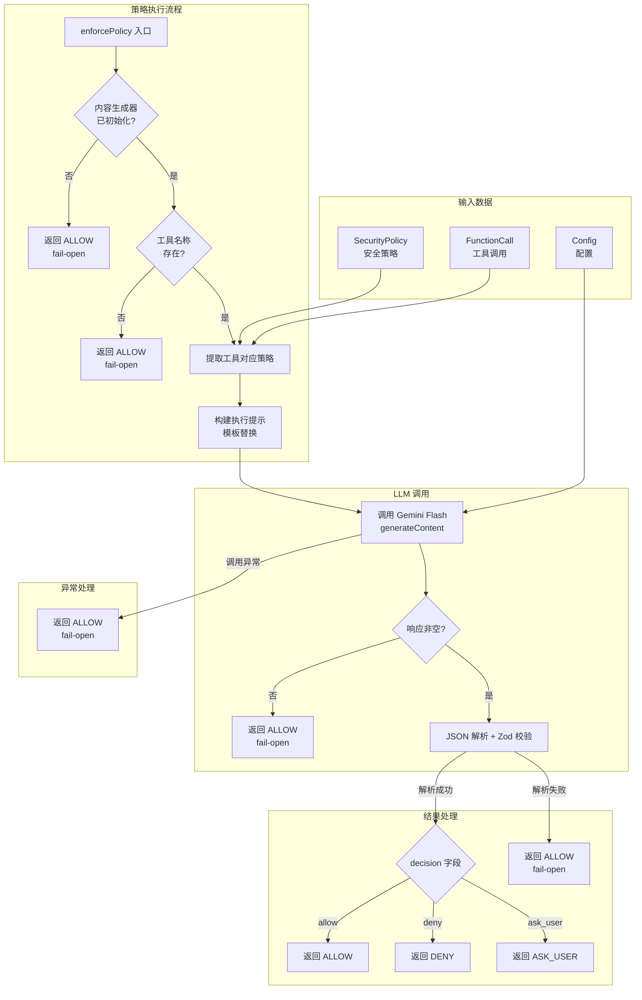

# policy-enforcer.ts

## 概述

`policy-enforcer.ts` 是 Conseca 安全检查系统的**策略执行器**，负责将已生成的安全策略（`SecurityPolicy`）与实际的工具调用（`FunctionCall`）进行比对，判断该工具调用是否符合策略要求。

策略执行的核心机制是**利用 LLM（Gemini Flash 模型）作为策略评估引擎**：将安全策略和工具调用以结构化提示的形式发送给 LLM，由 LLM 分析工具调用是否违反策略规则，并返回 `allow`、`deny` 或 `ask_user` 的裁决结果。

这种设计将复杂的策略匹配逻辑委托给 LLM，避免了手写规则引擎的复杂性，同时能处理模糊或语义化的策略规则。

## 架构图（Mermaid）



## 核心组件

### 1. `CONSECA_ENFORCEMENT_PROMPT` 常量

策略执行的 LLM 提示模板，指导 LLM 作为"安全执行引擎"进行策略合规性检查。

```typescript
const CONSECA_ENFORCEMENT_PROMPT = `
You are a security enforcement engine. Your goal is to check if a specific tool call complies with a given security policy.

Input:
1.  **Security Policy:** A set of rules defining allowed and denied actions for this specific tool.
2.  **Tool Call:** The actual function call the system intends to execute.

Security Policy:
{{policy}}

Tool Call:
{{tool_call}}

Evaluate the tool call against the policy.
1. Check if the tool is allowed.
2. Check if the arguments match the constraints.
3. Output a JSON object with:
   - "decision": "allow", "deny", or "ask_user".
   - "reason": A brief explanation.

Output strictly JSON.
`;
```

**模板变量：**
| 变量 | 替换内容 | 说明 |
|------|---------|------|
| `{{policy}}` | 工具对应的策略（JSON 字符串） | 从 `SecurityPolicy` 中按工具名查找的子策略 |
| `{{tool_call}}` | 当前工具调用（JSON 字符串） | 包含工具名和参数的完整调用信息 |

**提示设计要点：**
- 明确定义了 LLM 的角色（安全执行引擎）。
- 给出了清晰的评估步骤：检查工具是否允许 → 检查参数约束 → 输出 JSON 结果。
- 严格要求输出 JSON 格式（`Output strictly JSON`）。

### 2. `EnforcementResultSchema`（Zod Schema）

使用 Zod 定义 LLM 响应的结构化验证模式。

```typescript
const EnforcementResultSchema = z.object({
  decision: z.enum(['allow', 'deny', 'ask_user']),  // 决策：三选一
  reason: z.string(),                                 // 原因说明
});
```

该 Schema 有两个用途：
1. **运行时验证**：使用 `EnforcementResultSchema.parse()` 验证 LLM 返回的 JSON 是否符合预期结构。
2. **响应约束**：通过 `zodToJsonSchema` 转换为 OpenAPI 3 格式的 JSON Schema，作为 `responseSchema` 传递给 Gemini API，在 LLM 侧约束输出格式。

### 3. `enforcePolicy` 函数

核心导出函数，执行策略合规性检查。

```typescript
export async function enforcePolicy(
  policy: SecurityPolicy,   // 完整的安全策略对象
  toolCall: FunctionCall,    // 待检查的工具调用
  config: Config,            // 应用配置
): Promise<SafetyCheckResult>
```

#### 详细执行流程

**第一步：前置验证**

```typescript
const contentGenerator = config.getContentGenerator();
if (!contentGenerator) {
  return { decision: SafetyCheckDecision.ALLOW, reason: '...', error: '...' };
}
const toolName = toolCall.name;
if (!toolName) {
  return { decision: SafetyCheckDecision.ALLOW, reason: '...', error: '...' };
}
```

- 检查内容生成器（LLM 客户端）是否可用。
- 检查工具调用是否包含工具名称。
- 任一条件不满足，返回 `ALLOW`（fail-open）。

**第二步：策略提取与模板构建**

```typescript
const toolPolicyStr = JSON.stringify(policy[toolName] || {}, null, 2);
const toolCallStr = JSON.stringify(toolCall, null, 2);
```

- 从 `SecurityPolicy` 对象中按工具名索引提取对应工具的策略。
- 若该工具没有对应策略，使用空对象 `{}`。
- 将策略和工具调用都序列化为格式化 JSON 字符串。

**第三步：LLM 调用**

```typescript
const result = await contentGenerator.generateContent(
  {
    model,                                              // Gemini Flash 模型
    config: {
      responseMimeType: 'application/json',             // 要求 JSON 响应
      responseSchema: zodToJsonSchema(EnforcementResultSchema, {
        target: 'openApi3',
      }),                                               // 结构化输出约束
    },
    contents: [{
      role: 'user',
      parts: [{
        text: safeTemplateReplace(CONSECA_ENFORCEMENT_PROMPT, {
          policy: toolPolicyStr,
          tool_call: toolCallStr,
        }),
      }],
    }],
  },
  'conseca-policy-enforcement',                         // 操作标识
  LlmRole.SUBAGENT,                                    // LLM 角色标识
);
```

使用 `safeTemplateReplace` 进行模板变量替换（比简单的字符串替换更安全），然后调用 Gemini Flash 模型。

**第四步：响应解析与验证**

```typescript
const responseText = getResponseText(result);
if (!responseText) {
  return { decision: SafetyCheckDecision.ALLOW, ... };  // 空响应 → fail-open
}

const parsed = EnforcementResultSchema.parse(JSON.parse(responseText));
```

- 提取 LLM 响应文本。
- 先 `JSON.parse` 解析 JSON，再用 Zod Schema 进行结构化验证。
- 双层验证确保数据的完整性和正确性。

**第五步：决策映射**

```typescript
switch (parsed.decision) {
  case 'allow':
    decision = SafetyCheckDecision.ALLOW;
    break;
  case 'ask_user':
    decision = SafetyCheckDecision.ASK_USER;
    break;
  case 'deny':
  default:
    decision = SafetyCheckDecision.DENY;
    break;
}
```

将 LLM 返回的字符串决策映射为 `SafetyCheckDecision` 枚举值。注意 `default` 分支映射到 `DENY`，体现了"未知决策默认拒绝"的安全原则。

#### 错误处理策略（多层 try-catch）

| 错误场景 | 处理方式 | 决策 |
|----------|---------|------|
| 内容生成器未初始化 | 返回带 error 的 ALLOW | fail-open |
| 工具名称缺失 | 返回带 error 的 ALLOW | fail-open |
| LLM 响应为空 | 返回带 error 的 ALLOW | fail-open |
| JSON 解析/Zod 验证失败 | 返回带 error 的 ALLOW，包含原始响应 | fail-open |
| LLM 调用异常（网络错误等） | 返回带 error 的 ALLOW | fail-open |

所有错误场景均采用 **fail-open** 策略，确保安全检查器的异常不会阻塞用户工作流。

## 依赖关系

### 内部依赖

| 模块路径 | 导入内容 | 用途 |
|----------|---------|------|
| `../../config/config.js` | `Config`（类型） | 配置接口，提供 `getContentGenerator()` 方法 |
| `../protocol.js` | `SafetyCheckDecision`, `SafetyCheckResult` | 安全检查协议的枚举和类型 |
| `./types.js` | `SecurityPolicy`（类型） | 安全策略数据结构 |
| `../../utils/partUtils.js` | `getResponseText` | 从 LLM 响应中提取文本内容 |
| `../../utils/textUtils.js` | `safeTemplateReplace` | 安全的模板变量替换工具 |
| `../../config/models.js` | `DEFAULT_GEMINI_FLASH_MODEL` | 默认 Gemini Flash 模型标识 |
| `../../utils/debugLogger.js` | `debugLogger` | 调试日志工具 |
| `../../telemetry/index.js` | `LlmRole` | LLM 角色枚举，标识调用者身份 |

### 外部依赖

| 依赖包 | 导入内容 | 用途 |
|--------|---------|------|
| `@google/genai` | `FunctionCall`（类型） | Google GenAI SDK 的工具调用类型 |
| `zod` | `z` | 运行时 JSON Schema 验证库，用于验证 LLM 响应结构 |
| `zod-to-json-schema` | `zodToJsonSchema` | 将 Zod Schema 转换为 JSON Schema（OpenAPI 3 格式），用于 Gemini API 的响应约束 |

## 关键实现细节

1. **LLM 作为策略评估引擎**：这是一种创新的设计选择。传统的策略执行通常使用硬编码的规则引擎（如 OPA/Rego），而 Conseca 利用 LLM 进行语义化的策略评估。优势在于：
   - 能理解自然语言描述的策略规则。
   - 能处理模糊的约束条件。
   - 无需为每种工具编写专门的规则解析器。
   缺点是引入了 LLM 调用的延迟和不确定性。

2. **结构化输出的双重保障**：
   - **生成侧**：通过 `responseSchema`（OpenAPI 3 格式的 JSON Schema）约束 LLM 输出。
   - **消费侧**：通过 `EnforcementResultSchema.parse()` 进行运行时验证。
   - 两层保障确保即使 LLM 输出不完全符合预期，也能被正确检测和处理。

3. **按工具名索引策略**：`policy[toolName] || {}` 表明 `SecurityPolicy` 是一个以工具名为键的对象。当某工具没有对应的策略规则时，使用空对象，LLM 将基于空策略做出判断（通常会允许）。

4. **模型选择 — Gemini Flash**：使用 `DEFAULT_GEMINI_FLASH_MODEL`（Flash 模型），而非更强大但更慢的 Pro 模型。这是因为策略执行需要低延迟（每次工具调用都会触发），Flash 模型在速度和成本上更适合此场景。

5. **全面的 Fail-open 策略**：函数内部有 5 个不同的 fail-open 点，覆盖了从前置检查到 LLM 调用到响应解析的完整链路。每个 fail-open 返回都包含 `error` 字段，便于上层遥测系统捕获和追踪这些异常情况。

6. **`safeTemplateReplace` 的安全考量**：使用专门的安全模板替换函数而非简单的 `String.replace`，可能是为了防止模板注入攻击——如果策略或工具调用内容中包含 `{{...}}` 模式的文本，简单替换可能导致意外行为。

7. **决策映射中的安全默认值**：`switch` 语句的 `default` 分支映射到 `DENY`，这意味着如果 LLM 返回了 Schema 验证通过但值意外的决策（理论上不会发生，因为 Zod 已经限制了枚举值），系统会默认拒绝，体现了"安全优先"的原则。

8. **LLM 角色标识**：使用 `LlmRole.SUBAGENT` 标识此次 LLM 调用，表明策略执行是作为子代理（subagent）进行的，与主对话循环的 LLM 调用区分开来，便于遥测分析和成本追踪。
