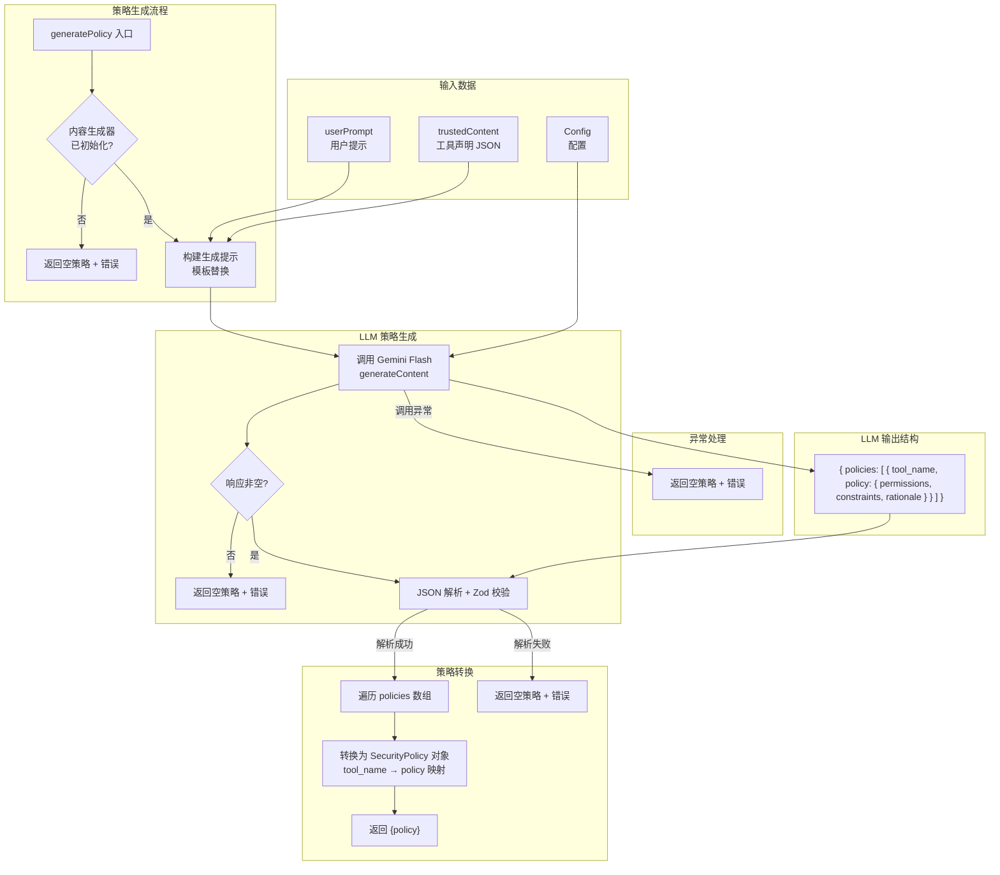

# policy-generator.ts

## 概述

`policy-generator.ts` 是 Conseca 安全检查系统的**策略生成器**，负责根据用户提示（User Prompt）和可用工具声明（Trusted Content），利用 LLM（Gemini Flash 模型）动态生成细粒度的安全策略。

生成的策略遵循**最小权限原则（Principle of Least Privilege）**：为每个与用户任务相关的工具生成尽可能严格的权限和约束，只允许完成任务所需的最低限度操作。例如，如果用户要求"读取 main.py"，策略生成器会允许 `read_file` 工具但限制只能读取 `main.py`，同时拒绝 `run_shell_command` 等不相关的工具。

该模块是 Conseca 系统的"大脑"，与 `policy-enforcer.ts`（策略执行器）形成互补关系：生成器制定规则，执行器验证合规。

## 架构图（Mermaid）



## 核心组件

### 1. `CONSECA_POLICY_GENERATION_PROMPT` 常量

策略生成的 LLM 提示模板，是整个 Conseca 系统最关键的提示工程之一。

```typescript
const CONSECA_POLICY_GENERATION_PROMPT = `
You are a security expert responsible for generating fine-grained security policies...

User Prompt: "{{user_prompt}}"

Trusted Tools (Context):
{{trusted_content}}
`;
```

**模板变量：**
| 变量 | 替换内容 | 说明 |
|------|---------|------|
| `{{user_prompt}}` | 用户输入的提示文本 | 策略生成的核心上下文 |
| `{{trusted_content}}` | 工具声明的 JSON 字符串 | 告知 LLM 当前可用的所有工具 |

**提示结构分析：**

1. **角色定义**：将 LLM 定位为"安全专家"和"策略生成器"，负责为集成在命令行工具中的 LLM 生成安全策略。

2. **核心目标**：明确要求执行最小权限原则——策略应尽可能严格，同时允许完成用户任务。

3. **输出格式规范**：
   - 要求返回 JSON 对象，包含 `policies` 数组。
   - 每个策略包含 `tool_name`、`permissions`（allow/deny/ask_user）、`constraints`（约束条件）和 `rationale`（理由）。
   - 提供了具体的 JSON 示例。

4. **指导原则**：
   - `allow`：任务所需的工具。
   - `deny`：明显超出范围的工具。
   - `ask_user`：破坏性操作或存在歧义时。
   - 约束应尽可能具体（限制文件路径、命令参数等）。
   - 理由应引用用户提示。

### 2. Zod Schema 定义

#### `ToolPolicySchema`

单个工具的策略结构验证：

```typescript
const ToolPolicySchema = z.object({
  permissions: z.nativeEnum(SafetyCheckDecision),  // 'allow' | 'deny' | 'ask_user'
  constraints: z.string(),                           // 约束条件描述
  rationale: z.string(),                             // 策略理由
});
```

注意 `permissions` 使用 `z.nativeEnum(SafetyCheckDecision)` 直接引用了协议中定义的枚举值，确保策略权限与安全检查决策类型一致。

#### `SecurityPolicyResponseSchema`

LLM 完整响应的验证结构：

```typescript
const SecurityPolicyResponseSchema = z.object({
  policies: z.array(
    z.object({
      tool_name: z.string(),          // 工具名称
      policy: ToolPolicySchema,        // 工具策略
    }),
  ),
});
```

### 3. `PolicyGenerationResult` 接口

策略生成函数的返回类型：

```typescript
export interface PolicyGenerationResult {
  policy: SecurityPolicy;  // 生成的安全策略（可能为空对象）
  error?: string;          // 可选的错误信息
}
```

**设计要点：**
- `policy` 始终存在（即使为空对象 `{}`），调用方无需进行 null 检查。
- `error` 可选，存在时表示策略生成过程中出现了问题，但仍返回了（空）策略。

### 4. `generatePolicy` 函数

核心导出函数，负责调用 LLM 生成安全策略。

```typescript
export async function generatePolicy(
  userPrompt: string,       // 用户提示文本
  trustedContent: string,   // 可信工具声明（JSON 字符串）
  config: Config,            // 应用配置
): Promise<PolicyGenerationResult>
```

#### 详细执行流程

**第一步：前置验证**

```typescript
const model = DEFAULT_GEMINI_FLASH_MODEL;
const contentGenerator = config.getContentGenerator();
if (!contentGenerator) {
  return { policy: {}, error: 'Content generator not initialized' };
}
```

获取 LLM 内容生成器，若不可用则返回空策略和错误信息。

**第二步：LLM 调用**

```typescript
const result = await contentGenerator.generateContent(
  {
    model,
    config: {
      responseMimeType: 'application/json',
      responseSchema: zodToJsonSchema(SecurityPolicyResponseSchema, {
        target: 'openApi3',
      }),
    },
    contents: [{
      role: 'user',
      parts: [{
        text: safeTemplateReplace(CONSECA_POLICY_GENERATION_PROMPT, {
          user_prompt: userPrompt,
          trusted_content: trustedContent,
        }),
      }],
    }],
  },
  'conseca-policy-generation',
  LlmRole.SUBAGENT,
);
```

- 使用 Gemini Flash 模型，要求 JSON 格式输出。
- 通过 `responseSchema` 在 API 侧约束输出结构。
- 操作标识为 `'conseca-policy-generation'`，角色为 `SUBAGENT`。

**第三步：响应解析与转换**

```typescript
const responseText = getResponseText(result);
if (!responseText) {
  return { policy: {}, error: 'Empty response from policy generator' };
}

const parsed = SecurityPolicyResponseSchema.parse(JSON.parse(responseText));
const policiesList = parsed.policies;
const policy: SecurityPolicy = {};
for (const item of policiesList) {
  policy[item.tool_name] = item.policy;
}
return { policy };
```

关键的**数据转换步骤**：将 LLM 返回的数组格式转换为以工具名为键的对象格式：

```
LLM 输出（数组）：
[
  { tool_name: "read_file", policy: { permissions: "allow", ... } },
  { tool_name: "run_shell_command", policy: { permissions: "deny", ... } }
]

转换后（SecurityPolicy 对象）：
{
  "read_file": { permissions: "allow", constraints: "...", rationale: "..." },
  "run_shell_command": { permissions: "deny", constraints: "...", rationale: "..." }
}
```

这种转换使得 `policy-enforcer.ts` 可以通过 `policy[toolName]` 直接按工具名索引获取对应策略。

#### 错误处理

| 错误场景 | 返回 | 说明 |
|----------|------|------|
| 内容生成器未初始化 | `{ policy: {}, error: '...' }` | 无法调用 LLM |
| LLM 响应为空 | `{ policy: {}, error: '...' }` | LLM 未返回内容 |
| JSON 解析/Zod 验证失败 | `{ policy: {}, error: '...Raw: ...' }` | LLM 输出格式不符，附带原始响应 |
| LLM 调用异常 | `{ policy: {}, error: '...' }` | 网络错误等 |

所有错误情况都返回**空策略**（`{}`），不抛出异常。空策略 + `conseca.ts` 中的 fail-open 逻辑 = 安全检查器故障不阻塞工作流。

## 依赖关系

### 内部依赖

| 模块路径 | 导入内容 | 用途 |
|----------|---------|------|
| `../../config/config.js` | `Config`（类型） | 配置接口，提供 `getContentGenerator()` 方法 |
| `./types.js` | `SecurityPolicy`（类型） | 安全策略数据结构，以工具名为键的对象 |
| `../../utils/partUtils.js` | `getResponseText` | 从 LLM 响应中提取文本内容 |
| `../../utils/textUtils.js` | `safeTemplateReplace` | 安全的模板变量替换工具 |
| `../../config/models.js` | `DEFAULT_GEMINI_FLASH_MODEL` | 默认 Gemini Flash 模型标识 |
| `../../utils/debugLogger.js` | `debugLogger` | 调试日志工具 |
| `../protocol.js` | `SafetyCheckDecision` | 安全检查决策枚举，用于 Zod Schema 中的 `nativeEnum` 验证 |
| `../../telemetry/index.js` | `LlmRole` | LLM 角色枚举 |

### 外部依赖

| 依赖包 | 导入内容 | 用途 |
|--------|---------|------|
| `zod` | `z` | 运行时 Schema 验证库，验证 LLM 生成的策略结构 |
| `zod-to-json-schema` | `zodToJsonSchema` | Zod → JSON Schema（OpenAPI 3）转换，用于 Gemini API 响应约束 |

## 关键实现细节

1. **最小权限原则的 LLM 实现**：通过精心设计的提示，指导 LLM 生成遵循最小权限原则的安全策略。这是一种将安全理念"编码"到提示中的方法，而非传统的硬编码规则。LLM 能够根据用户意图动态推断哪些工具和操作是"最低限度必需的"。

2. **数组到对象的策略转换**：LLM 被要求输出 `policies` 数组（因为 LLM 更擅长生成列表），但内部存储使用以 `tool_name` 为键的对象（因为策略执行器需要按名称快速查找）。这个转换在 `for (const item of policiesList)` 循环中完成，是连接生成器和执行器的桥梁。

3. **`z.nativeEnum(SafetyCheckDecision)` 的精妙之处**：`ToolPolicySchema` 中的 `permissions` 字段直接使用了 `SafetyCheckDecision` 枚举进行验证，确保策略中的权限值与安全检查协议中的决策值完全一致（`'allow'`、`'deny'`、`'ask_user'`）。这种类型级别的一致性避免了字符串值不匹配的潜在 bug。

4. **结构化输出的双重保障**（与 `policy-enforcer.ts` 相同的模式）：
   - **生成侧**：`responseSchema` 约束 LLM 输出格式。
   - **消费侧**：`SecurityPolicyResponseSchema.parse()` 运行时验证。

5. **空策略的语义**：当生成失败时返回空对象 `{}`。在策略执行器中，`policy[toolName] || {}` 会对未知工具返回空策略，LLM 执行器面对空策略通常会默认允许，形成完整的 fail-open 链路。

6. **可信内容的传递**：`trustedContent` 参数包含所有可用工具的函数声明（JSON 格式），它告诉策略生成 LLM "这些是当前可用的工具"。LLM 据此为每个相关工具生成策略，同时可以识别出不相关的工具并将其标记为 `deny`。

7. **策略的临时性和上下文特定性**：提示中明确指出策略是"temporary, context-specific rules"（临时的、上下文特定的规则）。每次用户提示变化时，旧策略被丢弃，新策略重新生成。这与 `conseca.ts` 中的缓存机制配合：同一提示复用策略，新提示重新生成。

8. **三级权限的使用指导**：
   - `allow`：任务明确需要的工具，附带具体约束。
   - `deny`：明显超出任务范围的工具。
   - `ask_user`：破坏性操作（如删除文件、执行危险命令）或存在歧义（无法确定是否安全）。
   `ask_user` 的存在使系统在"全允许"和"全拒绝"之间有了灵活的中间态。

9. **与策略执行器的协作关系**：
   - 生成器产出：`{ "read_file": { permissions: "allow", constraints: "Only allow reading 'main.py'", rationale: "..." } }`
   - 执行器消费：`policy["read_file"]` → 将此子策略和实际工具调用一起提交给 LLM 判断是否合规。
   - 两次 LLM 调用形成**生成-验证**的双重检查机制，提高了安全性。
